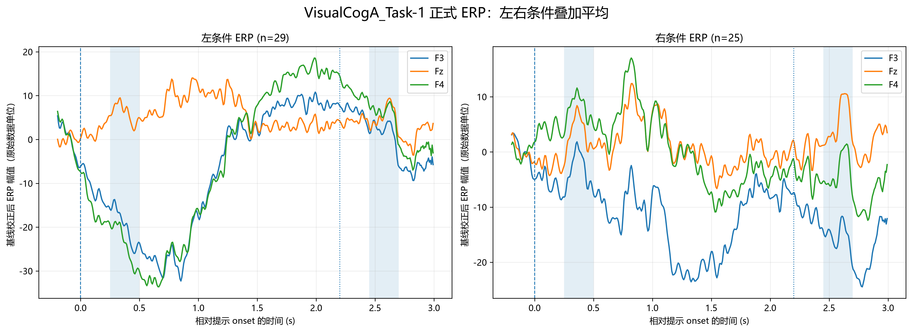
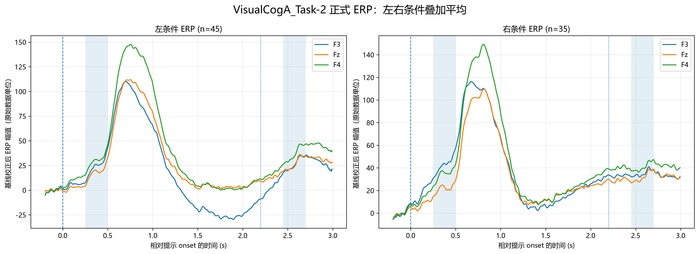
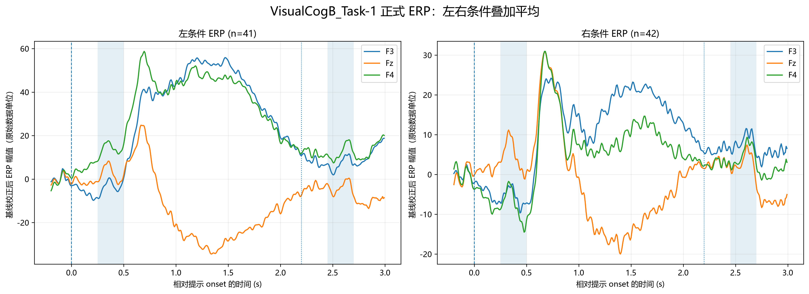
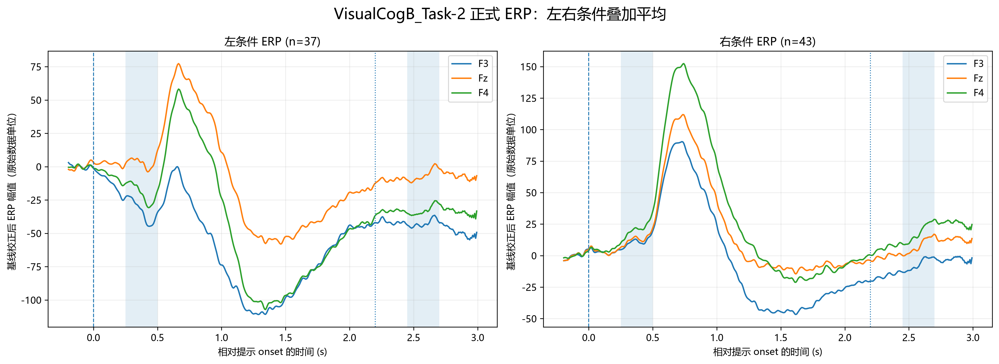

# `11erp_extract.py` 正式 ERP 汇总与候选峰分类说明

> 本文记录当前 `11erp_extract.py` 的实际处理口径。它读取第 8 阶段已经清洗好的 `clean.mat`，生成条件平均 ERP 和候选峰指标；不执行滤波、降采样、SQI 计算或 Trial 剔除。文中的候选峰状态仅用于后续筛选，不等同于确认真实 P300。

## 1. 脚本定位与数据流

脚本将第 8 阶段正式保留的 Trial 汇总为问题一的左右条件 ERP：

```text
output/8riemann_denoise/{dataset}_clean.mat
        │
        ├─ 检查 drop 标记及相对时间矩阵维度
        ├─ 对每个 Trial、每个绘图通道做基线校正
        ├─ 按 cue_type 分成左、右条件
        ├─ 条件内 Trial 逐采样点算术平均
        ├─ 输出每组一张左右双面板 ERP 图
        └─ 输出各条件 × 通道的候选峰值、潜伏期与状态 CSV
```

处理数据集为：

- `VisualCogA_Task-1`
- `VisualCogA_Task-2`
- `VisualCogB_Task-1`
- `VisualCogB_Task-2`

脚本在 `11erp_extract.py` 中使用相对脚本目录构造输入、输出路径，因此从项目根目录运行时也不依赖当前工作目录。

## 2. 输入文件与处理边界

每个数据集读取：

```text
output/8riemann_denoise/{dataset}_clean.mat
```

当前代码实际读取 MAT 字段：

| 字段 | 用途 |
|---|---|
| `trial_data` | Trial × 通道 × 采样点的 EEG 数据；只使用前三个通道 |
| `relative_time` | 每个 Trial 的相对提示时间；处理使用第 0 行时间轴 |
| `cue_type` | 条件标记；`−1` 为左条件，`+1` 为右条件 |
| `drop` | 校验正式 clean 文件中没有仍被标记为弃置的 Trial |

当前四组 MAT 的实际 `trial_data` 形状分别为 `54×10×512`、`80×10×512`、`83×10×512`、`80×10×512`；采样率为 128 Hz。前三个通道的项目顺序是 `Fz、F3、F4`，脚本绘图和指标输出按索引 `0、1、2` 对应 `Fz、F3、F4`。

脚本不回写或增补 MAT 字段，也不会再次剔除 Trial。`drop` 中只要有非零值就会报错停止；这里的含义是输入应当已经是第 8 阶段的正式清洗结果，而不是由 11 再做一次筛选。

当前 `validate_clean_data()` 只检查 `drop` 中是否存在非零值，以及 `relative_time` 与 `trial_data` 的时间维度是否匹配；没有检查 `drop` 数量是否等于 Trial 数。它也没有进一步检查 cue 长度/取值、所有 Trial 时间轴是否逐行完全一致、输入是否含 NaN，或指定窗口是否至少有一个采样点。因此运行依赖第 8 阶段输出维度和取值符合项目约定。

## 3. 基线校正与条件平均

### 3.1 逐 Trial 基线校正

对每个 Trial、每个用于绘图的通道，计算 `−0.2 ≤ t < 0 s` 区间的均值，并从该 Trial、该通道的整个时间序列中减去该均值：

\[
X^{\mathrm{bc}}_{i,c}(t)=X_{i,c}(t)-\frac{1}{|B|}\sum_{\tau\in B}X_{i,c}(\tau),
\qquad B=\{\tau:-0.2\leq\tau<0\}.
\]

左端点包含、右端点不包含；因此提示 onset `t=0` 不参与基线均值。振幅保留 MAT 中的原始单位，不做额外单位换算。

### 3.2 左右条件叠加平均

基线校正后，按 `cue_type` 选取同一条件内的 Trial，并沿 Trial 维度逐点取算术平均：

\[
ERP_{q,c}(t)=\frac{1}{N_q}\sum_{i:cue\_type_i=q}X^{\mathrm{bc}}_{i,c}(t),
\qquad q\in\{-1,+1\}.
\]

这一步得到的是该条件的平均 ERP，而不是单条 Trial。当前运行各数据集保留数量为：

| 数据集 | 左条件 Trial 数 | 右条件 Trial 数 |
|---|---:|---:|
| A_Task-1 | 29 | 25 |
| A_Task-2 | 45 | 35 |
| B_Task-1 | 41 | 42 |
| B_Task-2 | 37 | 43 |

## 4. ERP 图

每个数据集输出一张 `{dataset}_ERP.png`，包含左右两个面板；每个面板叠加 F3、Fz、F4 三条 ERP 曲线，并在标题中显示该条件的 Trial 数。图中参考线标出提示 onset `t=0` 和目标 onset `t=2.20 s`，色块标出提示后与目标后候选窗。

绘图前，脚本仅选择 `−0.2 ≤ relative_time ≤ 3.0 s` 的样本。当前代码未显式设置 `xlim`，所以 Matplotlib 会根据这些样本自动留出坐标边距；选取的信号区间是上述范围，但坐标框显示端点可能略宽于 `−0.2～3.0 s`。

### 4.1 当前四组正式 ERP 图

以下图片均为脚本输出的左右条件平均 ERP；每张图含左右两个面板，分别绘制 F3、Fz、F4。图中阴影和事件参考线应结合第 5 节的候选峰窗口与状态规则解读。

#### VisualCogA_Task-1



#### VisualCogA_Task-2



#### VisualCogB_Task-1



<h4 style="break-after: avoid-page; page-break-after: avoid;">VisualCogB_Task-2</h4>



## 5. 候选峰提取与状态

候选窗使用闭区间，分别为：

| 指标 | 相对提示 onset 的窗口 | 目标 onset |
|---|---:|---:|
| 提示后候选峰 | `0.25～0.50 s` | — |
| 目标后候选峰 | `2.45～2.70 s` | `2.20 s` |

对每个数据集 × 条件 × 通道，`extract_peak()` 在窗口内取最大样点值（`numpy.argmax`；并列时取第一个最大值）及其时间。目标后潜伏期同时输出相对提示 onset 与相对目标 onset 的数值：

```text
相对目标 onset 潜伏期 = 相对提示 onset 潜伏期 − 2.20 s
```

`CueHasPositivePeak` / `TargetHasPositivePeak` 是二值标记：窗口内最大值大于 0 时为 1，否则为 0。最大值即使为负仍会照常记录幅值和潜伏期，但状态为 `no_positive_peak`。

状态互斥规则按以下优先顺序执行：

| 条件 | 状态 | 含义 |
|---|---|---|
| 窗口最大值 `≤ 0` | `no_positive_peak` | 窗口内没有正向最大值 |
| 最大值为正且落在窗口第一个可用采样点 | `left_boundary` | 左边界受限，不能视为完整内部峰 |
| 最大值为正且落在窗口最后一个可用采样点 | `right_boundary` | 右边界受限，不能据此认定潜伏期已定位 |
| 最大值为正且位于窗口内部 | `valid` | 满足“正值且非边界”的候选指标条件 |

边界标记对应的是窗口内实际采样点的首/末点，不要求采样点刚好等于窗口的十进制端点。当前采样率 128 Hz 时，提示窗右边界采样点为 `0.500 s`；目标窗中最后一个不超过 `2.70 s` 的实际采样点为 `2.6953125 s`。

这里的 `valid` 仅表示该最大值为正、且位于预设窗口内部；不检查局部峰突出度、波形完整的上升—下降形态、统计显著性或模型拟合优度，也不自动确认它是真实 P300。

## 6. CSV 字段与当前运行结果

输出文件为：

```text
output/11erp_extract/ERP候选峰指标.csv
```

每组数据 × 左右条件 × F3/Fz/F4 各一行，总计 24 行。CSV 使用 UTF-8 BOM。字段如下：

| 字段 | 含义 |
|---|---|
| `Dataset`, `Condition`, `Channel` | 数据集、左右条件与电极 |
| `N_trials` | 用于该条件 ERP 的 Trial 数 |
| `CuePeakAmplitude`, `CuePeakLatencyFromCue` | 提示窗最大值与相对提示潜伏期 |
| `CuePeakAtLeftBoundary`, `CuePeakAtRightBoundary` | 提示窗峰是否位于首/末采样点 |
| `CueHasPositivePeak`, `CuePeakStatus` | 提示窗正峰标记与状态 |
| `TargetPeakAmplitude`, `TargetPeakLatencyFromCue` | 目标窗最大值与相对提示潜伏期 |
| `TargetPeakLatencyFromTarget` | 目标窗峰相对目标 onset 的潜伏期 |
| `TargetPeakAtLeftBoundary`, `TargetPeakAtRightBoundary` | 目标窗峰是否位于首/末采样点 |
| `TargetHasPositivePeak`, `TargetPeakStatus` | 目标窗正峰标记与状态 |

2026-09-24 当前输出快照的状态计数：

| 候选窗 | `valid` | `left_boundary` | `right_boundary` | `no_positive_peak` |
|---|---:|---:|---:|---:|
| 提示后（24 行） | 7 | 0 | 11 | 6 |
| 目标后（24 行） | 16 | 0 | 4 | 4 |

当前 Fz 提示窗的 `valid` 结果为：

| 数据集 | 条件 | 候选峰幅值 | 相对提示潜伏期 |
|---|---|---:|---:|
| A_Task-1 | 左 | 9.4996 | 0.3359 s |
| A_Task-1 | 右 | 8.4040 | 0.3594 s |
| B_Task-1 | 左 | 8.2668 | 0.3516 s |
| B_Task-1 | 右 | 11.1714 | 0.3281 s |

以上状态数量和峰值是当前输出快照，不是代码常数。若上游 `clean.mat` 改变，应重新运行并以新 CSV 为准。

## 7. 后续拟合的使用边界

后续 `12erp_fit.py` 可先用 `CuePeakStatus == "valid"` 或 `TargetPeakStatus == "valid"` 筛选相应候选，但不能只凭状态字段直接批量拟合。状态字段没有验证峰形是否完整，也没有评价高斯模型是否合适；仍需在指定拟合窗检查上升—峰顶—下降区间，并报告拟合优度（如 \(R^2\)、RMSE）。落在窗口边界的峰不应解释为可靠潜伏期；`no_positive_peak` 的最大值也不应作为正向 P300 候选峰进行拟合。

特别地，当前 `A_Task-2` 和 `B_Task-2` 在提示后 250–500 ms 窗口出现多个右边界结果。这只说明预设窗口内最大值仍在上升到窗口末端，不代表峰值真实潜伏期就是 `0.500 s`。若要描述其更晚的正向响应，应依据完整 ERP 另行定义并说明峰搜索/拟合窗口，不能事后把当前边界时刻解释为 P300 潜伏期。

## 8. 运行与测试

从项目根目录运行正式 ERP 汇总：

```powershell
.\.venv\Scripts\python.exe src/C/q1/11erp_extract.py
```

运行专项测试：

```powershell
.\.venv\Scripts\python.exe -m pytest -q src/C/q1/test_11erp_extract.py
```

当前 6 项专项测试覆盖非零 `drop` 拒绝、时间维度不匹配、左右窗口边界、非正最大值，以及合成 MAT 下的基线校正、条件平均、峰值/潜伏期和输出文件。当前运行结果为 6 项通过。
