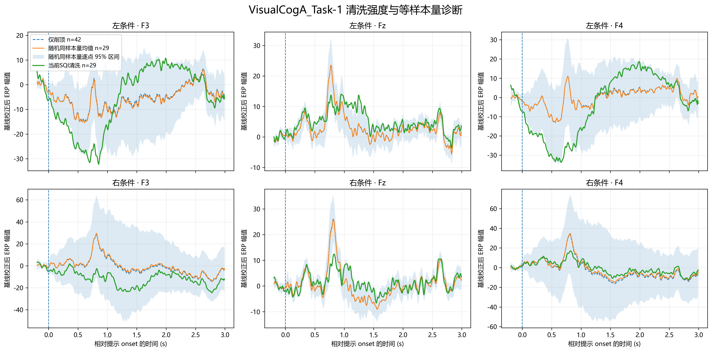

# `12check_a1_cleaning_sensitivity.py` 诊断说明与结果

## 1. 目的

本脚本只分析 `VisualCogA_Task-1`（A1），用于区分 A1 正式 ERP 的变化主要来自：

1. SQI 清洗后可用 Trial 数减少；
2. SQI 选择性保留/剔除某些波形特征，使保留 Trial 的组成发生变化。

它是诊断分析，不是新的降噪步骤；不修改 `clean.mat`、SQI、阈值、滤波或降采样结果，也不改变正式清洗集合。

## 2. 比较设计与计算口径

输入文件：

- `output/7filter_downsample/VisualCogA_Task-1_filtered_downsample.mat`：滤波降采样后的 Trial、相对时间、左右条件和削顶标记。
- `output/8riemann_denoise/VisualCogA_Task-1_SQI指标.csv`：每个 Trial 的 SQI 与 `FinalDrop` 正式剔除标记。

脚本先按 CSV 中的 `Trial` 编号与 MAT 对齐，并校验 `CueType`、`ClippedDrop` 与 MAT 字段一致；正式保留集合取 `FinalDrop=0`。当前输入为 100 个 Trial，其中“仅删除削顶”后左/右条件分别为 42/41 条，正式 SQI 保留集合分别为 29/25 条（共 54 条）。本次运行还核对了正式保留波形与 `8riemann_denoise/VisualCogA_Task-1_clean.mat` 完全一致。

每个 Trial、每个 EEG 通道先以 `−0.2 ≤ t < 0 s` 的均值做基线校正，再按 `cue_type=−1`（左）和 `cue_type=+1`（右）分别叠加平均。图中展示 F3、Fz、F4，时间范围为 `−0.2～3.0 s`。

对照关系如下：

| 曲线/区间 | 计算方式 |
|---|---|
| 仅删除削顶 ERP | 从 7 阶段数据中排除 `drop=1`，其余 Trial 全部平均 |
| 随机等样本量 ERP | 每次从仅删除削顶的 Trial 中无放回抽取与正式 SQI 结果相同的数量；重复 500 次，随机种子为 2026 |
| 随机等样本量均值 | 500 次随机 ERP 的逐采样点均值 |
| 随机等样本量 95% 区间 | 500 次随机 ERP 在每个采样点上的 2.5% 与 97.5% 分位数形成的逐点区间 |
| 当前 SQI ERP | `FinalDrop=0` 的正式 Trial 平均 |

## 3. 诊断图

图中每个面板对应一个条件和通道。蓝色虚线为仅删除削顶 ERP，橙线为随机等样本量 ERP 均值，浅蓝阴影为随机抽样的逐点 95% 区间，绿色实线为当前正式 SQI ERP。图中样本量分别标在图例中。



图 1　A1 左右条件 F3/Fz/F4 的仅削顶、随机等样本量与正式 SQI ERP 对照。随机基线为每个条件 500 次无放回抽样；阴影是逐采样点 95% 区间，不是同时置信带或显著性检验结果。

## 4. 数值结果

`CurrentOutsideRandom95Ratio` 表示正式 SQI ERP 落在随机等样本量**逐点** 95% 区间之外的时间采样点比例；`RMSE_Current_vs_ClippedOnly` 和 `RMSE_Current_vs_RandomSameN` 分别是正式 ERP 与仅削顶 ERP、随机 ERP 均值之间的 RMSE。数值按当前输出 CSV 汇总如下：

| 条件 | 通道 | 仅削顶→正式 Trial 数 | RMSE：正式 vs 仅削顶 | RMSE：正式 vs 随机均值 | 区间外时间点比例 |
|---|---|---:|---:|---:|---:|
| 左 | F3 | 42→29 | 10.492 | 10.532 | **23.0%** |
| 左 | Fz | 42→29 | 3.704 | 3.718 | **17.1%** |
| 左 | F4 | 42→29 | 13.021 | 13.099 | **24.2%** |
| 右 | F3 | 41→25 | 12.537 | 13.215 | 0.0% |
| 右 | Fz | 41→25 | 3.789 | 3.754 | 10.0% |
| 右 | F4 | 41→25 | 5.002 | 4.480 | 0.0% |

### 结果解读

- 左条件 F3、Fz、F4 有 17.1%～24.2% 的时间采样点落在随机等样本量的逐点区间之外，其中 F3/F4 最突出。这说明正式左条件 ERP 的差异不能简单归因于“从 42 条随机减少到 29 条”；SQI 选择后的 Trial 组成也可能影响了平均波形。
- 右条件 F3/F4 的区间外比例为 0%，Fz 为 10.0%。右条件与随机等样本量基线整体更相容，但这不表示右条件波形没有不确定性。
- RMSE 衡量与某条参考曲线的整体距离，不包含随机抽样波动范围。因此右条件 F3 的 RMSE 虽然不小，正式 ERP 仍可完全落在较宽的随机区间内；不能单独用 RMSE 断言存在选择效应。

## 5. 可用于论文的结果表述

为区分试次数减少与 SQI 筛选对 ERP 的影响，本文对 A_Task-1 进行了等样本量随机抽样诊断。以仅剔除削顶 Trial 后的左、右条件样本（分别为 42、41 条）为抽样总体，按正式 SQI 清洗后的条件样本量（左 29 条、右 25 条）无放回随机抽样 500 次，并将所得 ERP 分布与正式 SQI ERP 比较。左条件 F3、Fz、F4 的正式 ERP 分别有 23.0%、17.1%、24.2% 的时间采样点超出随机抽样形成的逐点 95% 区间；右条件相应比例为 0%、10.0%、0%。该结果提示，A_Task-1 左条件的 ERP 变化不能仅由样本量减少解释，SQI 筛选对保留 Trial 的组成具有影响。该诊断尚不能判定这种影响属于有效伪迹去除还是对真实脑电结构的选择性删除，因此不据此调整正式阈值；后续应结合被剔除 Trial 的慢漂移、眼动及各 SQI 特征进行人工诊断。

**解释限制：**逐点 95% 区间没有对整条时间序列提供同时覆盖保证；相邻 EEG 采样点也并非独立，因此区间外比例是描述性诊断量，不是 p 值或正式显著性结论。它只能说明正式 ERP 与随机等样本量结果的偏离模式，不能单独证明 SQI 过度清洗，也不能区分被剔除 Trial 中的低频结构究竟来自伪迹还是真实响应。

## 6. 输出与运行

脚本输出到 `output/12check_a1_cleaning_sensitivity/`：

- `VisualCogA_Task-1_清洗强度与等样本量诊断.png`
- `VisualCogA_Task-1_诊断指标.csv`

在项目根目录运行：

```powershell
python src/C/q1/12check_a1_cleaning_sensitivity.py
```

复跑时应以新生成的 CSV 与图为准；本说明中的数值对应当前数据、500 次抽样和随机种子 2026。
