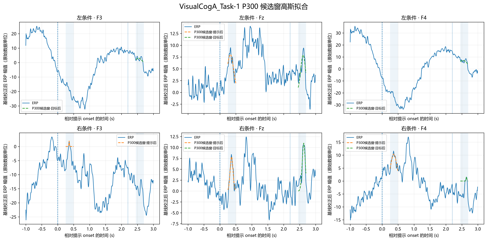
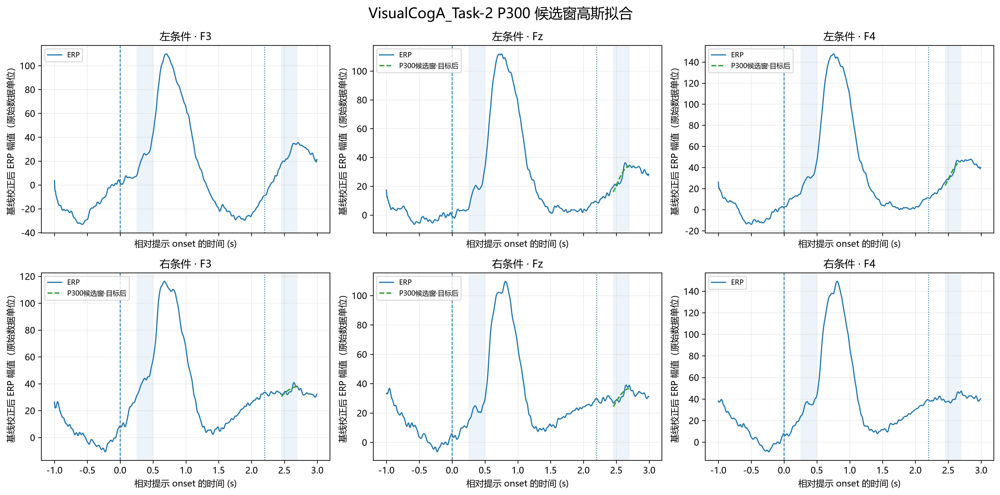
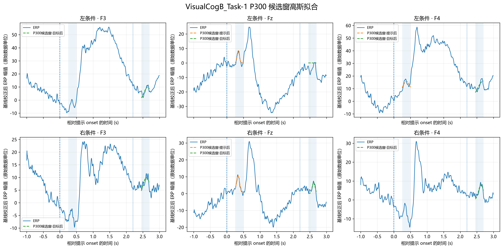
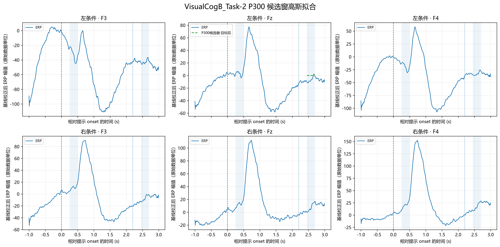

# `13erp_fit.py` 代码说明与结果总结

> 本文对应 `2026-09-24` 当前脚本与输出快照。当前版本只保留两个固定候选窗，移除了探索性晚期拟合窗口及其对应图例/拟合结果。拟合数值有效不等于模型适合生理解释；潜伏期解释还需排除窗口边界解并检查拟合优度。

## 1. 脚本定位与数据流

```text
output/8riemann_denoise/{dataset}_clean.mat
                 │
                 ├─ 逐 Trial、逐通道做基线校正
                 ├─ 按左右条件平均得到 ERP
                 ├─ 读取 11 阶段 ERP候选峰指标.csv
                 ├─ 仅保留 11 阶段峰状态为 valid 的固定候选
                 ├─ 对提示后、目标后两个候选窗分别做高斯拟合
                 └─ 保存全部成功、失败和跳过记录，以及四张拟合图
```

脚本路径为 `src/C/q1/13erp_fit.py`。输入和输出路径相对脚本所在目录构造，因此可从项目根目录运行：

```powershell
.\.venv\Scripts\python.exe src/C/q1/13erp_fit.py
```

处理四组数据：`VisualCogA_Task-1`、`VisualCogA_Task-2`、`VisualCogB_Task-1`、`VisualCogB_Task-2`。每组按左/右条件和 F3、Fz、F4 三个通道分析。

## 2. 输入、预处理与拟合模型

每组从以下文件读取第 8 阶段清洗后的 Trial：

```text
output/8riemann_denoise/{dataset}_clean.mat
```

脚本使用 `trial_data`、`relative_time` 和 `cue_type`。与第 11 阶段一致，基线区间为 `−0.2 ≤ t < 0 s`，先逐 Trial、逐通道减去基线均值，再按条件对 Trial 逐点平均。第 11 阶段的峰状态从这里读取：

```text
output/11erp_extract/ERP候选峰指标.csv
```

高斯模型与论文给定形式一致，没有常数项：

\[
g(t)=A\exp\left[-\frac{(t-\mu)^2}{2\sigma^2}\right],
\qquad A>0,\;\sigma>0.
\]

`A` 为拟合振幅，`μ` 为拟合峰时刻，`σ` 控制曲线宽度。`GaussianMuFromCue` 使用相对提示 onset 的时间；目标事件另将同一个拟合时刻减去目标 onset `2.20 s`，写入 `GaussianMuFromTarget`。拟合使用窗口内全部 ERP 样点。

## 3. 固定候选窗口与筛选规则

| 事件 | 相对提示 onset 窗口 | 拟合前筛选 | 用途 |
|---|---:|---|---|
| 提示后 | `0.25–0.50 s` | 仅当第 11 阶段 `CuePeakStatus == valid` 时拟合 | 固定候选 P300 参数化分析 |
| 目标后 | `2.45–2.70 s` | 仅当第 11 阶段 `TargetPeakStatus == valid` 时拟合 | 固定候选 P300 参数化分析 |

脚本也会在窗口内重新记录观测最大值及 `PeakShapeStatus`，但固定候选拟合的筛选依据是第 11 阶段对应的峰状态。第 11 阶段状态不是 `valid` 的记录仍写进 CSV，`Attempted=0`，并在 `SkipReason` 中保留原因。

## 4. 拟合状态与 CSV 字段

输出文件为 `output/13erp_fit/ERP高斯拟合参数.csv`。每组包含 `2 条件 × 3 通道 × 2 个窗口 = 12` 行，四组共 48 行。成功、失败和跳过记录都会保留。

| 字段 | 含义与解释 |
|---|---|
| `Dataset`、`Condition`、`Channel`、`N_trials` | 数据组、左右条件、通道与参与该条件 ERP 平均的 Trial 数 |
| `FitType`、`Event`、`WindowStart`、`WindowEnd` | 拟合轨道、事件和拟合窗口；当前 `FitType` 均为 `FixedCandidate` |
| `ObservedPeakAmplitude`、`ObservedPeakLatencyFromCue` | 窗口内观测 ERP 最大值及其相对提示时刻 |
| `ObservedPeakLatencyFromTarget` | 目标事件观测峰相对目标 onset 的时刻；提示事件留空 |
| `ObservedPeakStatus`、`PeakShapeStatus` | 窗口内观测峰状态及峰形状态 |
| `Attempted`、`SkipReason` | 是否实际调用拟合器，以及跳过或拟合失败原因 |
| `GaussianA`、`GaussianMuFromCue`、`GaussianMuFromTarget`、`GaussianSigma` | 高斯拟合参数；目标 onset 潜伏期只对目标事件给出 |
| `GaussianMuAtBoundary` | `1`：拟合 μ 卡在窗口左/右边界；`0`：μ 位于窗口内部；`NaN`：该行没有有效拟合 |
| `FitValid` | 参数有限且满足 `A>0`、`σ>0`、窗口内 `μ` 等数值约束；不代表拟合质量好 |
| `R2`、`RMSE` | 拟合优度描述量；需与曲线和研究问题共同判断，不能由 `FitValid` 替代 |

解释拟合潜伏期时，至少先筛选：

```text
FitValid == 1 and GaussianMuAtBoundary == 0
```

再检查 `R2`、`RMSE` 和 ERP 波形。边界标记使用 μ 与窗口起止点的 `1e-6 s` 容差比较。

## 5. 本次输出结果

| 事件 | 总记录数 | `Attempted=1` | `FitValid=1` | 跳过 |
|---|---:|---:|---:|---:|
| 提示后固定候选窗 | 24 | 7 | 7 | 17 |
| 目标后固定候选窗 | 24 | 16 | 16 | 8 |
| **合计** | **48** | **23** | **23** | **25** |

23 条实际尝试的拟合均满足参数约束，没有拟合器运行失败。25 条记录因第 11 阶段峰状态不是 `valid` 而跳过：15 条为 `right_boundary`，10 条为 `no_positive_peak`。有效拟合中，5 条 μ 卡在边界，18 条 μ 位于窗口内部。

5 条边界拟合全部卡在目标固定窗右端 `2.70 s`（相对提示 onset；相对目标 onset 为 `0.50 s`）：

| 数据集 | 条件 | 通道 |
|---|---|---|
| A_Task-2 | 左 | Fz |
| A_Task-2 | 左 | F4 |
| A_Task-2 | 右 | F3 |
| A_Task-2 | 右 | Fz |
| B_Task-1 | 左 | F4 |

这些行虽然 `FitValid=1`，但 μ 被拟合窗口边界限制，不适合解释为可靠定位的潜伏期。因此当前最多有 18 条可进入下一步拟合质量审查；这不代表它们都适合论文生理解释。

### 5.1 固定提示窗：Fz 代表结果

| 数据集 | 条件 | μ（相对提示，s） | R² | RMSE | 边界标记 |
|---|---|---:|---:|---:|---:|
| A_Task-1 | 左 | 0.3272 | 0.6658 | 1.2265 | 0 |
| A_Task-1 | 右 | 0.3659 | 0.9006 | 0.9219 | 0 |
| B_Task-1 | 左 | 0.3439 | 0.8944 | 1.1404 | 0 |
| B_Task-1 | 右 | 0.3350 | 0.9697 | 0.6477 | 0 |

B_Task-1 左右 Fz 的固定提示窗拟合较好，可作为候选 P300 参数化摘要的代表。A_Task-1 右 F3 的提示窗拟合虽然 `FitValid=1` 且 μ 在窗口内部，但 `R² = −1.2234`、`RMSE = 4.5346`，拟合解释能力很差，不应仅因程序成功给出参数就作生理解释。

当前版本已经移除晚期探索窗，因此本次输出不包含 A_Task-2、B_Task-2 的 `0.50–1.00 s` 晚期拟合结果；不能再用上一版 96 行 CSV 的晚期窗口结果描述当前版本。

## 6. 图形说明与图片引用
每张图包含左、右条件 × F3/Fz/F4 共六个面板。蓝色实线是实际条件平均 ERP。提示后固定候选窗拟合始终使用橙色虚线，目标后固定候选窗拟合始终使用绿色虚线；颜色由事件类型明确指定，不受某个面板中另一条拟合是否存在影响。虚线只在对应记录实际拟合且 `FitValid=1` 时绘出，没有虚线表示该窗口记录被跳过或拟合无效。图例中的局部虚线是 ERP 的高斯近似，不代表另一组实验数据。图中保留提示 onset `0 s` 的竖直虚线和目标 onset `2.20 s` 的竖直点线；浅色区域标记两个固定候选窗。横轴仍显示 MAT 中完整相对时间范围（当前约 `−1–3 s`），拟合只使用表中对应的局部窗口。

<details>
<summary>VisualCogA_Task-1</summary>



</details>

<details>
<summary>VisualCogA_Task-2</summary>



</details>

<details>
<summary>VisualCogB_Task-1</summary>



</details>

<details>
<summary>VisualCogB_Task-2</summary>



</details>

## 7. 论文表述建议与限制

> **固定候选窗分析：**A_Task-1、B_Task-1 的部分 Fz ERP 在提示后 250–500 ms 内呈现内部正峰，且部分单高斯拟合具有较高 R²，可作为候选 P300 的参数化摘要。报告潜伏期时应排除 μ 落在窗口边界的记录，并结合 R²、RMSE 和 ERP 波形筛选。

`FitValid` 只表示拟合参数数值可用，不是模型质量门槛。`R²`、`RMSE` 描述单高斯曲线在局部窗口内对平均 ERP 的贴合程度；它们本身不构成统计显著性检验，也不能单独证明成分的生理身份。上表和计数是当前数据快照，不是代码常数；若上游清洗数据或第 11 阶段候选峰表变化，应重新运行并更新本文。
