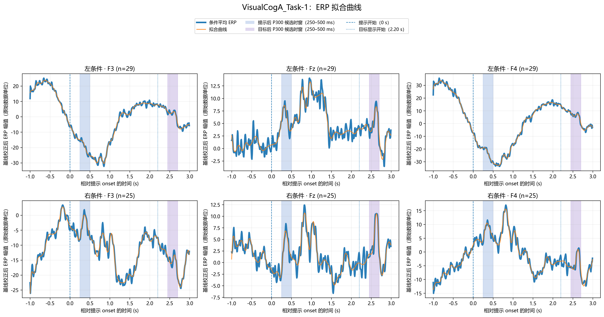
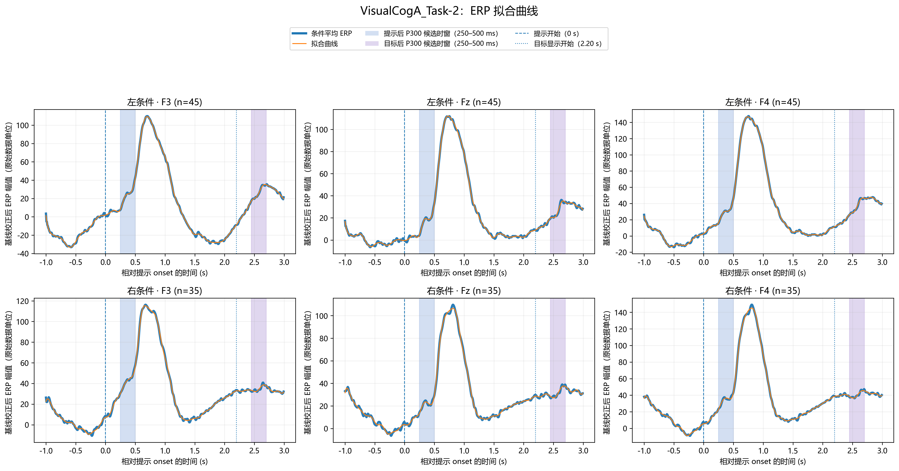
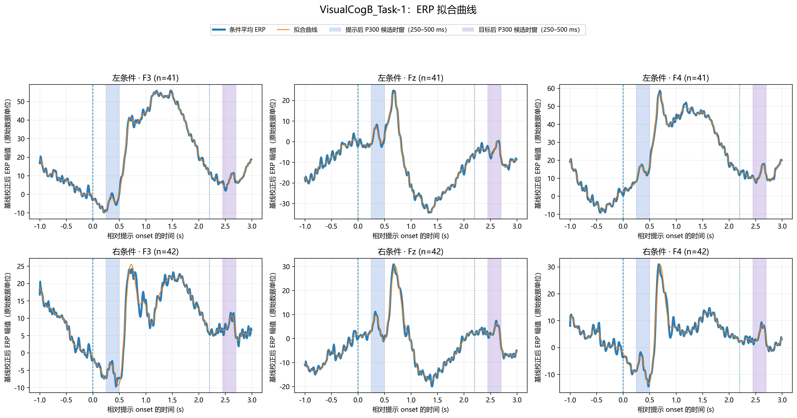
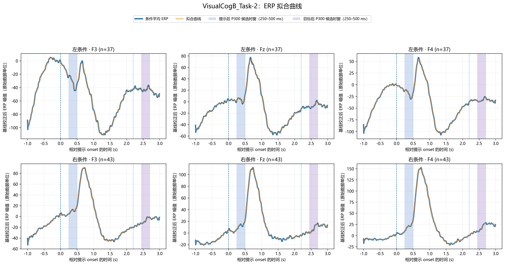

# `14erp_spline_fit.py` 整段 ERP 样条拟合说明

## 1. 分析目的

第 14 阶段对第 11 阶段使用的条件平均 ERP 做**整段曲线拟合**。蓝色粗实线是由清洗后 Trial 按条件叠加平均得到的 ERP；橙色细实线是覆盖整段时间的拟合曲线。该曲线用于描述 ERP 随时间的变化，不是单独的 P300 成分高斯拟合。

第 13 阶段的局部高斯分析仍用于候选正峰的参数化摘要。第 14 阶段不输出高斯参数，也不把晚期峰自动命名为 P300。

## 2. 输入与预处理

脚本读取：

```text
output/8riemann_denoise/{Dataset}_clean.mat
```

四组数据为 `VisualCogA_Task-1`、`VisualCogA_Task-2`、`VisualCogB_Task-1`、`VisualCogB_Task-2`。脚本沿用第 11 阶段的处理口径：先对每个 Trial 在提示前 `[-0.2, 0)` 秒进行基线校正，再按左、右条件分别计算 F3、Fz、F4 的平均 ERP。

## 3. 样条模型

对每条完整条件平均 ERP 使用 48 个三次 B 样条基函数：

\[
\hat y(t)=\sum_{j=1}^{K}c_jB_{j,3}(t),\qquad K=48.
\]

系数通过带二阶差分惩罚的 P-spline 求得：

\[
\min_{\mathbf c}\left\{\sum_i\left[y_i-\hat y(t_i)\right]^2+
\lambda\sum_j(\Delta^2c_j)^2\right\}.
\]

平滑惩罚参数 `λ` 由观测到的条件平均 ERP 的广义交叉验证（GCV）选择。此步骤只对观测曲线选一次 `λ`，不额外运行 Trial bootstrap。

## 4. 图形标记

每张图包含左、右条件 × F3/Fz/F4 共六个面板。

- 蓝色粗实线：条件平均 ERP。
- 橙色细实线：覆盖 MAT 完整时间范围的拟合曲线；图例使用较易理解的名称“拟合曲线”。
- 蓝色阴影：提示后 P300 候选窗，相对提示 onset 为 `0.25–0.50 s`。
- 粉色阴影：目标后 P300 候选窗，相对提示 onset 为 `2.45–2.70 s`，即目标 onset 后 `0.25–0.50 s`。
- 每张图只有一份全图图例，置于总标题下方；图例同时说明蓝色/橙色曲线含义，以及蓝、粉色阴影分别对应的两个阶段 P300 候选窗。
- `0 s` 竖直虚线：提示 onset。
- `2.20 s` 竖直点线：目标 onset。
- 所有面板均显示横轴刻度数值，包括上排面板。
- 图中不绘制逐点 95% bootstrap 区间。

阴影标出候选分析窗，不表示样条只在这些局部窗口内拟合。样条拟合覆盖整段波形；如需单独查看窗口内的拟合段，可以从 `ERP样条拟合波形.csv` 按时间截取，但这不会形成一条新的局部高斯拟合。

## 5. 输出文件

默认输出目录：

```text
output/14erp_spline_fit/
```

- `ERP样条拟合摘要.csv`：每个数据集、条件和通道一行，共 24 行。记录 Trial 数、样条基函数数、`λ`、有效自由度、GCV、R²、RMSE 和拟合状态。
- `ERP样条拟合波形.csv`：整段每个采样点的观测 ERP 与 P-spline 拟合值；当前四组数据共 12,288 行。
- 每组数据一张六面板图：
  - `VisualCogA_Task-1_ERP样条拟合.png`
  - `VisualCogA_Task-2_ERP样条拟合.png`
  - `VisualCogB_Task-1_ERP样条拟合.png`
  - `VisualCogB_Task-2_ERP样条拟合.png`

## 6. 当前运行结果

当前四组数据产生 24 条拟合曲线，`SplineFitValid=1` 共 24 条。R² 约为 `0.891–1.000`，RMSE 约为 `0.777–1.427`（原始 ERP 数据单位）。P-spline 用于整段波形的平滑描述；R² 较高不等同于生理成分识别成功，也不能单独证明曲线代表 P300。

### Task-1 与 Task-2 的曲线贴合程度

图中蓝线是条件内 Trial 叠加平均后的 ERP，橙线是对这条平均 ERP 的 P-spline 拟合。Task-2 的平均波形整体更平缓，因此橙色拟合线常与蓝线重合；这表示模型贴近观测到的平均波形，不是 Task-2 的蓝线被额外平滑或使用了不同的数据处理。

拟合对每条曲线分别用 GCV 选择平滑参数。当前使用 48 个样条基函数，有效自由度约为 `45.6–47.6`，接近基函数数，说明惩罚较弱、拟合有较高灵活度，容易跟随平均波形的局部变化。Task-1 局部起伏更明显时，橙线与蓝线的差异会更容易看见。

| 数据组 | Task-1 每条件 Trial 数 | Task-1 R² | Task-2 每条件 Trial 数 | Task-2 R² |
|---|---:|---:|---:|---:|
| A 组 | 25–29 | 0.891–0.997 | 35–45 | 0.9980–0.9997 |
| B 组 | 41–42 | 0.970–0.997 | 37–43 | 0.9976–0.9994 |

A 组 Task-1 的 Trial 数较少，平均后可能保留更多局部波动；但 B 组两项任务的 Trial 数相近，Task-2 仍较平滑，因此 Trial 数不是唯一原因。波形本身的变化尺度和 Trial 间一致性也可能影响平均结果，不能仅凭图确定其生理机制。由于样条拟合较灵活，R² 高只表示它贴合当前平均 ERP 的程度，不表示 P300 解释更可靠。

## 7. 当前拟合图

### VisualCogA_Task-1



### VisualCogA_Task-2



### VisualCogB_Task-1



### VisualCogB_Task-2



## 8. 使用与解释限制

从项目根目录运行：

```bash
python src/C/q1/14erp_spline_fit.py
```

P-spline 保留了 ERP 的整体正负变化和较晚响应，因此可作为第一题整段 ERP 轨迹的平滑拟合，也可从波形 CSV 中按时间提取窗口内曲线或特征。它不提供高斯 `A`、`μ`、`σ` 参数；需要解释候选 P300 潜伏期时仍应使用满足峰形完整、拟合参数不在窗口边界且拟合质量可接受的局部分析结果。整段样条的晚期正峰也不应仅因其为正峰而重新定义成 P300。
