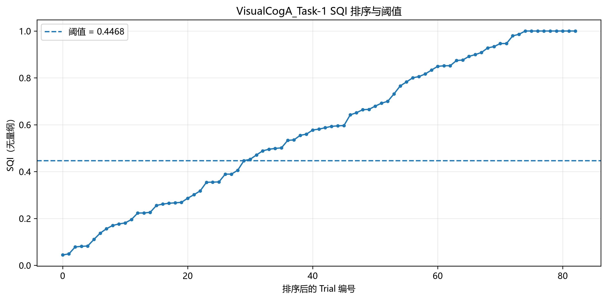
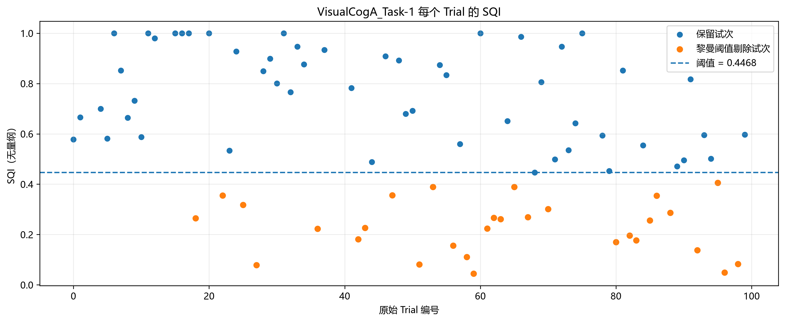
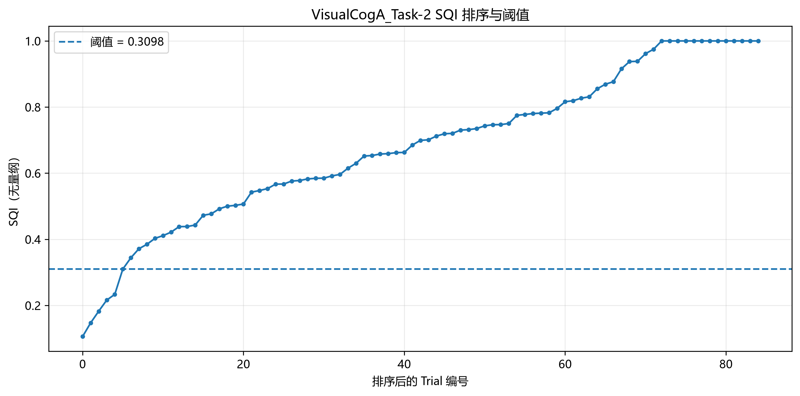
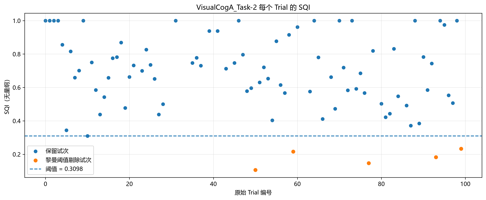
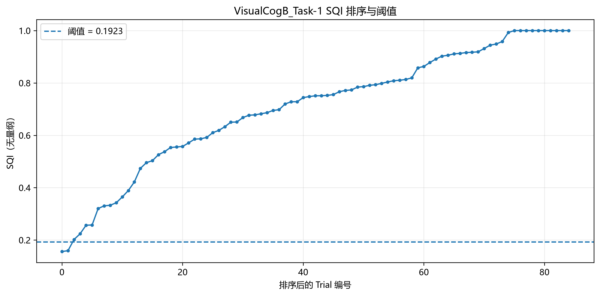
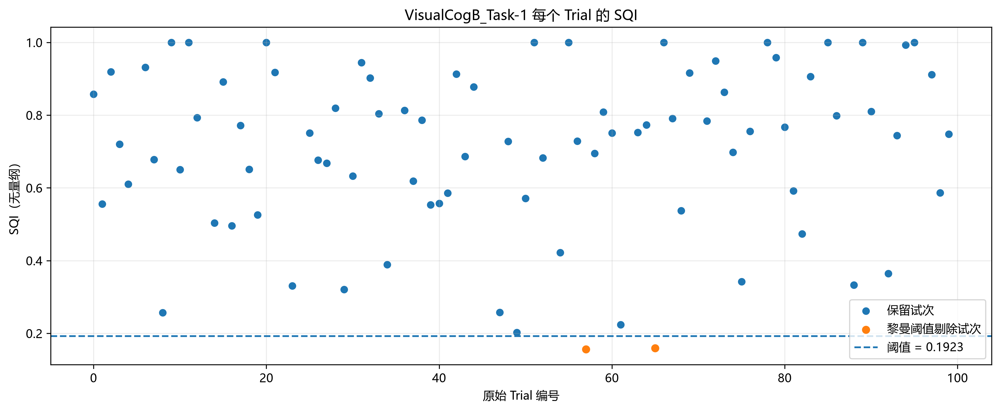
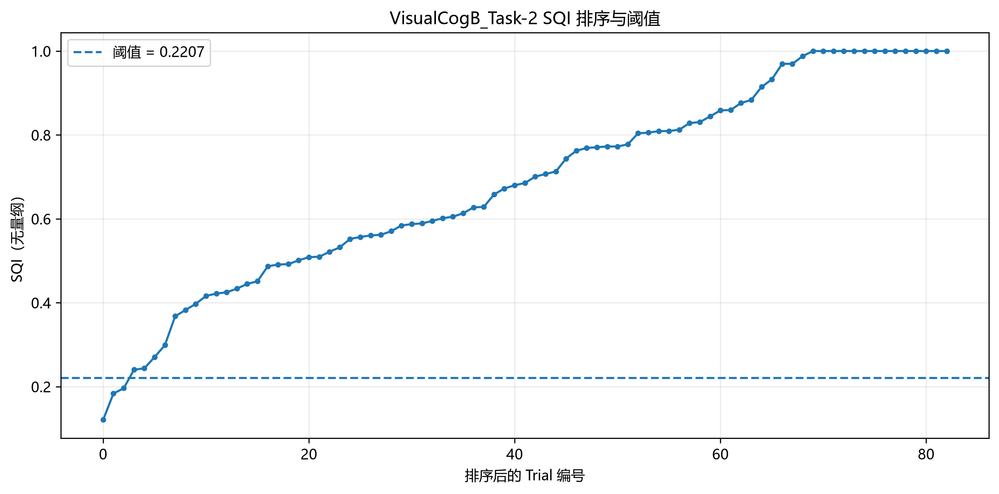
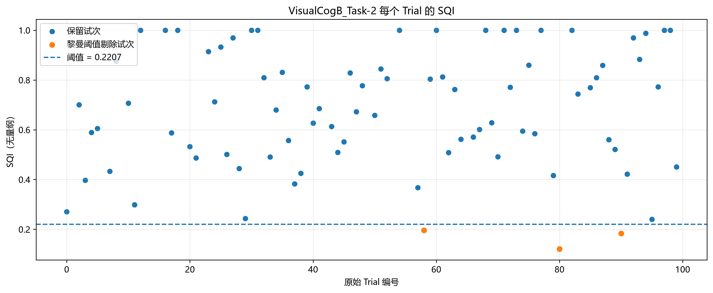

# `8riemann_denoise.py` 代码实现与论文差异说明

> 本文以当前 `8riemann_denoise.py`、其上游 `7filter_downsample.py` 和现有论文 PDF 为依据，记录正式降噪脚本的实际处理口径，并把与论文表述不一致或论文尚未交代的内容突出列出。这里记录的是代码现状，不代表论文表述已经正确，也不代表建议中的算法改动已经实施。

## 1. 重要结论：论文与代码需对齐后才能作为最终方法描述

当前实现的高层框架与论文一致：根据通道/频段构造多种特征，稳健标准化后合成为异常分数和 SQI，再按阈值剔除 Trial。但以下差别会影响算法可复现性或论文结论，应在定稿前逐项决定是改论文还是改代码：

1. **Riemann 重心迭代中的离群点规则不同**：论文式（12）描述基于距离曲线拐点剔除；代码使用固定的稳健 z 分数阈值 `z <= 3`。
2. **最终 SQI 阈值的拐点算法不同**：论文式（19）写“Kneedle 或最大曲率法”；代码实际取低 SQI 区域中最大的相邻间隔。
3. **重心迭代的保留集合不是单调缩小**：当前代码每轮用 `z_score <= 3` 重建整组掩码，之前被排除的协方差可能重新进入。不能把当前实现描述为“只迭代剔除、异常 Trial 不会恢复”。
4. **滤波频带及时间窗需区分上游预处理与 SQI 特征计算窗**：上游 EEG 输入是 `0.2–24 Hz`；8 号脚本只在 `−0.2～1.0 s` 时间窗上计算 SQI 特征协方差。

## 2. 脚本用途与数据流

`8riemann_denoise.py` 对四个数据集独立计算 Trial 级 SQI、生成最终剔除标记，并写出保留 Trial 组成的 `clean.mat`。其输入来自 7 号滤波与降采样脚本：

```text
output/7filter_downsample/{dataset}_filtered_downsample.mat
                         │
                         ├─> 排除输入 drop=1 的削顶 Trial
                         ├─> 计算多特征、SQI 与自适应阈值
                         ├─> 写出 SQI 指标 CSV
                         ├─> 写出保留 Trial 的 clean.mat
                         └─> 写出 SQI 阈值诊断图
```

处理对象为 `VisualCogA_Task-1`、`VisualCogA_Task-2`、`VisualCogB_Task-1`、`VisualCogB_Task-2`。输入 MAT 至少要求 `trial_data`、`relative_time`、`cue_type`、`drop`、`SampleRate`、`DataLabel`。实际项目数据的 `trial_data` 为 `Trial × 通道 × 采样点`，当前每组为 `100 × 10 × 512`，采样率为 128 Hz。

只将通道索引 `(0,1,2)`，即 `Fz/F3/F4`，用于 SQI 特征。事件与其他附属字段不进入特征计算，但写出 `clean.mat` 时保留源 MAT 中的其他字段。

## 3. 当前实现的计算步骤

### 3.1 削顶 Trial 先排除

第 7 阶段 MAT 中的 `drop=1` 表示削顶弃置。8 号脚本只对 `drop=0` 的 `valid_indices` 计算特征和 SQI。削顶 Trial 在 SQI CSV 中保留原始 Trial 行，但其 `SQI` 和特征值为 `NaN`；其 `RiemannDrop` 保持 0，`FinalDrop` 由削顶标记置为 1。

### 3.2 SQI 特征的时间窗和频带

协方差特征只使用提示 onset 相对时间满足下式的样本：

```text
−0.2 <= relative_time <= 1.0 s
```

此处代码两端均为包含（`>= EPOCH_START` 且 `<= EPOCH_END`）。注意这是 **SQI 特征分析窗**，不是输入 MAT 保存的完整 Trial 切片长度。

输入 EEG 已由 `7filter_downsample.py` 做四阶 Butterworth `0.2–24 Hz` 前后向带通，并降采样到 128 Hz。8 号脚本在此输入上另外生成：

| 代码频带 | 实现 |
|---|---|
| `low` | 四阶 Butterworth `1–7 Hz` 带通，`sosfiltfilt` 零相位前后向滤波 |
| `high` | 四阶 Butterworth `16–24 Hz` 带通，`sosfiltfilt` 零相位前后向滤波 |
| `full` | 直接使用第 7 阶段输入；即上游已滤波的 `0.2–24 Hz` EEG，不在此分支再次滤波 |

每个 Trial 的协方差先对各通道时间均值中心化，再以 `T−1` 作分母，并加 `1e−6 I` 正则项。黎曼距离按广义特征值的对数平方和开方计算；矩阵特征分解使用对称化矩阵并限制极小特征值以保证数值稳定。

### 3.3 A、B 组特征配置

| 组别 | 特征名 | 通道 | 频带 | 代码中计算的特征 |
|---|---|---|---|---|
| A | RP1 | F3、F4 | 1–7 Hz | 协方差矩阵 Frobenius 范数 |
| A | RP2 | Fz | 1–7 Hz | 单通道协方差（方差） |
| A | RP3 | Fz、F3、F4 | 16–24 Hz | 协方差矩阵迹 |
| A | RP4 | Fz、F3、F4 | 输入 full | 到稳健黎曼中心的黎曼距离 |
| B | RP1 | Fz、F3、F4 | 1–7 Hz | 到稳健黎曼中心的黎曼距离 |
| B | RP2 | F3、F4 | 16–24 Hz | 协方差矩阵迹 |
| B | RP3 | Fz、F3、F4 | 输入 full | 到稳健黎曼中心的黎曼距离 |

以上通道组合和主要特征类型与论文第 1.4、1.5 节的设计表相符。需要注意，“输入 full”在当前流水线中是 `0.2–24 Hz`，而论文表格将该分支概括为 `1–24 Hz`；见第 5 节差异表。

### 3.4 黎曼均值与稳健中心

`riemann_mean()` 先用协方差矩阵对数的算术平均构造 log-Euclidean 初值，再按仿射不变黎曼均值更新，最多迭代 30 次；当切空间更新量的 Frobenius 范数小于 `1e−8` 时提前停止。

`robust_riemann_center()` 外层最多迭代 4 次：

1. 使用当前 `keep` 内的协方差求黎曼中心；
2. 计算所有协方差到中心的黎曼距离；
3. 仅以当前 `keep` 内距离的中位数和 MAD 作为参照，计算全部 Trial 的稳健 z 分数；
4. 按 `z_score <= 3` 更新 `keep`；掩码不变时停止；
5. 返回最终保留集合的黎曼均值和掩码。

**实现注意：** 当前更新语句为 `updated = z_score <= 3`，不是 `updated = keep & (z_score <= 3)`。因此更新不是单调剔除，先前被排除的 Trial 若后续 z 分数回到 3 以下，可以重新进入保留集合。若论文方法要表达“迭代剔除异常 Trial，剔除后不再恢复”，需先改代码并重新生成正式结果；在代码未改前，论文不能作这种承诺。

### 3.5 稳健标准化、异常分数和 SQI

每种特征分别用对应稳健中心返回的 inlier 子集计算中位数和 MAD：

```text
z = (feature − median) / (1.4826 × MAD + 1e−12)
z_clip = clip(z, −3, 6)
u = max(0, z_clip)
```

不同特征等权平均得到异常分数 `D`，随后计算：

```text
SQI = exp(−D)
```

所以 SQI 越大表示相对越干净；仅保留正向异常部分用于 `D`。这部分与论文第 1.3.3–1.3.4 节的稳健标准化、截断、正异常分数、等权组合及 `exp(−D)` 的总体公式一致；`1e−12` 是代码中的数值稳定项。

### 3.6 最终阈值与剔除

SQI 从小到大排序。当前 `sqi_knee_threshold()` 并不调用 Kneedle 库，也没有拟合曲率；它在排序后 SQI 的低值段计算相邻差值，取最大间隔，并将间隔右侧的 SQI 作为阈值：

```text
ordered = sort(SQI)
search_end = min(n−1, max(3, int(0.4 × n)))
threshold = ordered[argmax(diff(ordered[0 : search_end+1])) + 1]
```

即在约最低 40% SQI 的范围中寻找最大相邻间隔（小样本时搜索范围受样本数限制），不属于严格的 Kneedle/最大曲率实现。最终剔除条件为严格小于阈值：

| 组别 | 正式阈值 |
|---|---|
| A 组 | `threshold = knee` |
| B 组 | `threshold = max(0.05, 0.6 × knee)` |

因此 `SQI == threshold` 的 Trial 不会被 Riemann 阈值剔除。`FinalDrop` 为削顶标记与 Riemann 剔除标记的逻辑或。

## 4. 论文与当前实现差异对照（重点）

以下“论文表述”针对当前论文 PDF 的对应章节/公式；修订建议是让论文准确描述当前实际运行的算法，除非后续明确决定修改代码并重跑。

| 位置 | 论文当前写法 | 当前代码实际实现 | 需要处理 |
|---|---|---|---|
| 第 1.3.2 节，式（12）及其后 | 对黎曼距离 z 分数排序，用 Kneedle 或最大曲率找拐点，剔除高距离 Epoch；最多 4 轮，直到无拐点 | 用当前保留集的中位数/MAD 标准化距离，以固定 `z <= 3` 更新掩码；最多 4 轮，掩码不变时停止 | **算法口径不一致。** 如果按现有代码报告，应把拐点剔除改写为固定稳健 z 阈值迭代。也应说明更新基于全体 Trial，当前允许重新进入；若论文定义为单调剔除则必须改代码、重跑结果 |
| 第 1.3.2 节，保留集 `S^(k)` | 数学记号表示每轮从原集合剔除高距离 Epoch | 实际 `updated = z_score <= 3` 会重建整个掩码，非 `keep & condition` | **不能写“已剔除的 Trial 永不恢复”。** 这是算法行为差异，不是措辞风格问题 |
| 第 1.3.5 节，式（19） | “Kneedle 或最大曲率法”寻找排序 SQI 曲线拐点 | 低 SQI 部分寻找最大相邻 SQI 间隔，并取间隔右侧点为阈值 | **阈值方法名称不符。** 建议论文改为“在排序后的低 SQI 区域寻找最大相邻间隔，并将其右侧 SQI 作为自适应阈值” |
| 第 1.2.2 节及 RP full 频带 | 预处理和 full 特征概述写为 `1–24 Hz` | 上游 7 号脚本实际为四阶 Butterworth `0.2–24 Hz`；8 号脚本 `full` 直接使用该输入。另有 1–7 与 16–24 Hz 特征带 | **频带参数不一致。** 若正式结果来自当前代码，论文应把预处理频带写为 `0.2–24 Hz`，并区分它与 SQI 特征带 |
| 第 1.2.3 节，式（1） | 将每个 Trial 的切片写作 `t0−0.2～t0+1.0 s` | 输入 MAT 保留的是完整 `−1～3 s` Trial；8 号脚本仅取 `−0.2～1.0 s` 样本计算 SQI 特征协方差 | **需区分“存储的 Trial 范围”和“SQI 特征分析窗”。** 建议写明完整 Trial 切片范围，并另写 SQI 计算窗 `−0.2～1.0 s`。否则第 1.6 节的目标后窗口 `2.45～2.70 s` 与前文短 Epoch 范围矛盾 |
| 第 1.3.5 节，B 组 α | `α∈[0.5,0.8]`，正式取 `α=0.6` | 正式 8 号结果使用 `α=0.6`，与公式一致；10 号敏感性诊断还计算 `α=1.0` | 正文主方法保留 `α=0.6`。若报告 `α=1.0`，标为敏感性分析中的未缩放 knee 参照，不要误写成原预设范围内的正式取值 |
| 第 1.4、1.5 节特征表；第 1.3.3–1.3.4 节 | A/B 特征组合、稳健标准化、等权异常分数和 SQI 指数 | 通道/特征结构及高层合成方式基本一致 | 这部分可继续沿用，但频带、中心估计和阈值细节仍应按上表精确说明 |

### 建议用于论文的阈值表述

若保持当前代码不变，可将第 1.3.5 节的 SQI 阈值方法改写为：

> 将未削顶 Trial 的 SQI 升序排列，在低 SQI 区域（约前 40%）计算相邻值间隔，取最大间隔右侧的 SQI 作为自适应阈值。A 组采用 knee 阈值；B 组采用 `max(0.05, 0.6 × knee)`。当 `SQI < threshold` 时剔除 Trial。

对于第 1.3.2 节的稳健中心，论文需按最终算法选择一种诚实表述：

- **保持当前代码：** 描述“最多 4 轮的稳健 z 阈值筛选，`z<=3` 的 Trial 进入本轮参考集；保留集合按当前实现可能改变方向”，不要称为严格的单向迭代剔除。
- **若论文要求单向迭代剔除：** 将更新规则改为 `updated = keep & (z_score <= 3)`，再对四组数据重新运行 8 号脚本、重做 alpha=.6 一致性基准及后续分析。仅改论文措辞而保留另一种实现，无法消除算法差异。

## 5. 结果文件与字段

输出目录为 `output/8riemann_denoise/`。每个数据集生成：

1. `{dataset}_SQI指标.csv`：包含 `Trial`、`CueType`、`ClippedDrop`、`SQI`、`RiemannDrop`、`FinalDrop`，以及该组使用的逐特征值列。削顶 Trial 的 SQI 与特征列为缺失值。
2. `{dataset}_clean.mat`：复制输入 MAT 的其他字段，并仅对 `trial_data`、`relative_time`、`cue_type`、`drop` 保留 `FinalDrop=0` 的 Trial 行。该文件中的 Trial 数少于输入数，不等同于保持 100 行并仅标记 drop。
3. `{dataset}_01_SQI排序与阈值.png`：排序 SQI 与正式阈值线。
4. `{dataset}_02_各Trial_SQI.png`：按原始 Trial 编号显示保留与 Riemann 剔除的 SQI。

脚本写入的是 `output/8riemann_denoise` 下的结果，不覆盖 `output/7filter_downsample` 的输入。重新运行会重写 8 号脚本自身同名输出，因此若要保留不同算法版本的结果，应先另存或另建结果目录。

### 5.1 当前 SQI 诊断图

以下图片直接引用 `output/8riemann_denoise/` 中的脚本输出，并按数据集静态排版。每个数据集同时展示排序后的 SQI 与阈值，以及按原始 Trial 编号排列的 SQI/剔除状态；两类图分别便于检查阈值间隔和单个 Trial 的分类。PDF 中每个数据集从新页开始，避免标题与首张图分离。

<div class="page"></div>

#### VisualCogA_Task-1





<div class="page"></div>

#### VisualCogA_Task-2





<div class="page"></div>

#### VisualCogB_Task-1





<div class="page"></div>

#### VisualCogB_Task-2





## 6. 运行与复现

在项目根目录运行：

```powershell
.\.venv\Scripts\python.exe src/C/q1/8riemann_denoise.py
```

脚本会依次处理四个数据集，并在控制台打印输入 Trial 数、削顶数、Riemann 剔除数、保留数和阈值。运行依赖 NumPy、Pandas、SciPy 和 Matplotlib。当前目录中未见专门覆盖 8 号脚本完整数值流水线的单元测试；后续若修改稳健中心更新规则或 knee 计算方法，应补充掩码级测试并核验正式 `clean.mat` 与 CSV。

## 7. 写作与结果解释边界

- 8 号脚本完成的是 Trial 级质量评估、阈值剔除和 clean MAT 输出；它本身不做左右条件 ERP 平均、Fz P300 峰值提取或高斯拟合。
- 第 1.6 节的 ERP/拟合描述必须由对应后续代码和实际结果支持，不能把 8 号脚本的 SQI 指标当作 ERP 拟合结果。
- `z<=3` 与 `max adjacent gap` 都是代码当前可精确描述的规则；在论文中不要将其包装为代码未实现的 Kneedle、最大曲率或严格单调剔除算法。
- 本文记录算法差异，不替代论文修改，也不代表已选择修改实现还是修改论文。正式定稿前应先固定唯一口径，再统一重跑和更新结果。
