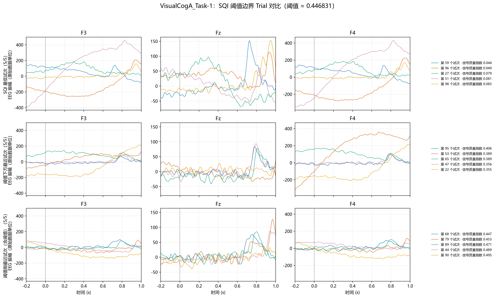

# `9check_riemann_drop.py` 代码实现说明

## 1. 用途与处理边界

`9check_riemann_drop.py` 用于检查 SQI 阈值附近的 Trial 波形，帮助判断 SQI 剔除边界是否对应明显异常。它是一个只读诊断脚本：读取第 7 阶段滤波、降采样后的 Trial 数据和第 8 阶段的 SQI 表，输出边界波形图；不会重新计算或修改 EEG，也不会更改正式清洗结果。

```text
output/7filter_downsample/*_filtered_downsample.mat ─┐
                                                    ├─> 边界 Trial 图
output/8riemann_denoise/*_SQI指标.csv ──────────────┘
```

## 2. 输入与数据校验

脚本处理以下四个数据集：

- `VisualCogA_Task-1`
- `VisualCogA_Task-2`
- `VisualCogB_Task-1`
- `VisualCogB_Task-2`

每组输入包括：

1. `output/7filter_downsample/{dataset}_filtered_downsample.mat`：读取 `trial_data`、`relative_time` 和 `drop`。
2. `output/8riemann_denoise/{dataset}_SQI指标.csv`：读取 `Trial`、`ClippedDrop`、`SQI` 和 `RiemannDrop`。

加载时会检查 MAT 与 CSV 的 Trial 数和编号是否对应、削顶标记是否一致，以及 CSV 的 SQI 剔除标记是否符合阈值规则。削顶 Trial 不参与 SQI 边界分组。

## 3. 阈值计算

阈值算法不在本脚本中复制实现，而是动态加载 `8riemann_denoise.py` 的 `sqi_knee_threshold()`，使用未削顶 Trial 的 SQI 重新计算 knee 阈值 `knee`。最终阈值为：

| 数据组 | 阈值 |
|---|---|
| A 组 | `knee` |
| B 组 | `max(0.05, 0.6 × knee)` |

剔除条件采用严格小于：`SQI < threshold`；等于阈值的 Trial 归入保留侧。脚本会核对计算出的剔除标记与 SQI CSV 中的 `RiemannDrop` 是否一致，不一致时停止并报错。

## 4. 三类诊断 Trial 的选择

对未削顶且具有有效 SQI 的 Trial，分别建立以下三组。每组最多 5 个；不足 5 个时保留实际可用的全部 Trial。

| 内部组名 | 选择规则 | 诊断目的 |
|---|---|---|
| `lowest_sqi` | 按 SQI 从低到高排序取前 5 个 | 查看 SQI 最低的一侧是否有明显异常 |
| `closest_below` | 先选 `SQI < threshold`，再按 SQI 从高到低取前 5 个 | 查看被剔除侧最接近阈值的 Trial |
| `closest_above` | 选 `SQI >= threshold` 后按 SQI 从低到高取前 5 个 | 查看保留侧最接近阈值的 Trial |

这三组是用于观察的集合，不保证互斥。例如最低 SQI 组中的 Trial 也可能出现在阈值下方最近组中。

## 5. 图形与输出

每个数据集输出一张 3×3 子图：

- 行：最低 SQI、阈值下方最近、阈值侧最近三类 Trial；
- 列：F3、Fz、F4；通道索引分别为 1、0、2；
- 横轴：相对提示 onset 的时间，显示 `−0.2～1.0 s`；在 `t=0` 画提示起点参考线；
- 曲线：使用第 7 阶段已滤波、已降采样的波形原值，不做本脚本内的基线校正或 ERP 平均；
- 图例：给出 Trial 编号和 SQI；标题及各行标注阈值与实际绘出的 Trial 数。

输出位置：

```text
output/9check_riemann_drop/{dataset}_SQI边界Trial对比.png
```

同时，控制台打印每个数据集的阈值、三组所选 Trial 编号及 SQI 值。脚本不生成或覆盖新的 `.mat`、SQI CSV，也不执行 Trial 删除。

### 5.1 代表性边界 Trial 图：VisualCogA_Task-1

下图只展示 `VisualCogA_Task-1`，作为四组边界诊断的代表。按当前 SQI 指标表统计，A1 在 83 个未削顶且 SQI 有效的 Trial 中剔除 29 个（约 34.9%）；其剔除数和比例都高于 A2（5/85，约 5.9%）、B1（2/85，约 2.4%）和 B2（3/83，约 3.6%）。因此 A1 的阈值下边界与保留侧边界样本对比最能展示该诊断图要检查的问题。只在本文插入这一张是为了避免重复呈现相同布局，并不表示其余三组没有运行或检查；四组输出图仍保存在 `output/9check_riemann_drop/`。



## 6. 运行与测试

在项目根目录运行：

```powershell
.\.venv\Scripts\python.exe src/C/q1/9check_riemann_drop.py
```

单元测试：

```powershell
.\.venv\Scripts\python.exe -m unittest src.C.q1.test_9check_riemann_drop -v
```

测试覆盖最低 SQI 与两侧边界组的排序、可用 Trial 少于 5 个时的选择、削顶 Trial 排除，以及 A/B 两组阈值规则。

## 7. 解读限制

图中的波形用于核查阈值附近信号形态，不构成单条 Trial 的自动异常判决。是否剔除仍由正式 SQI 流程决定；不能仅因某条波形影响平均结果或视觉上不理想，就在此脚本中追加剔除。
