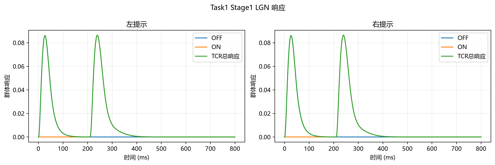
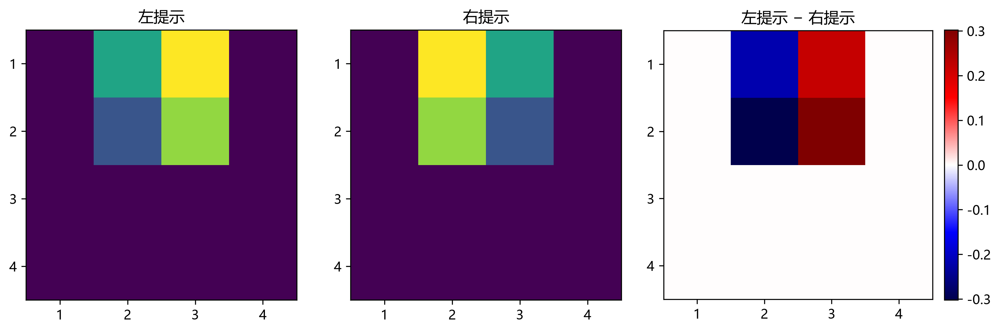
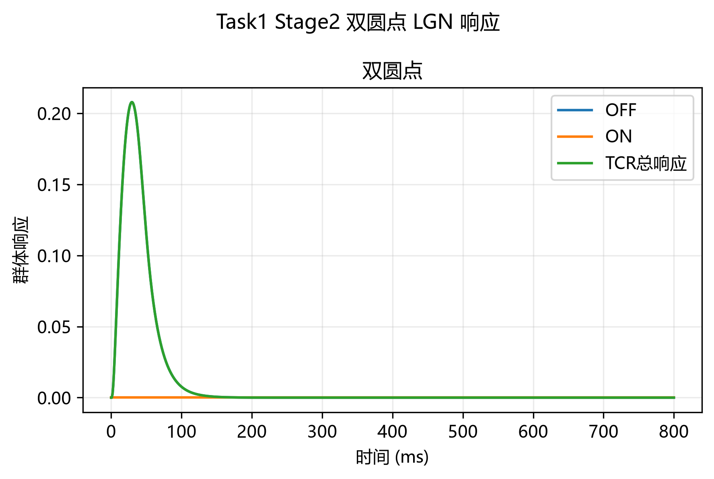
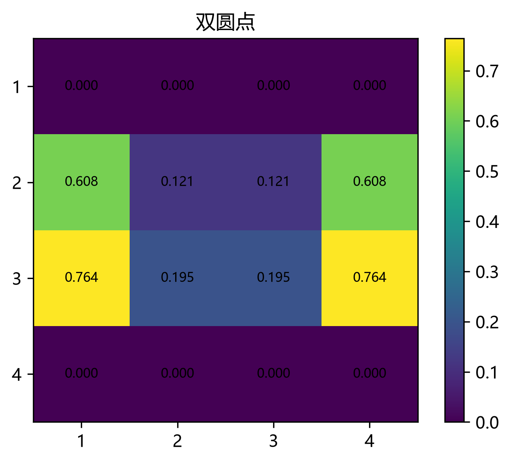
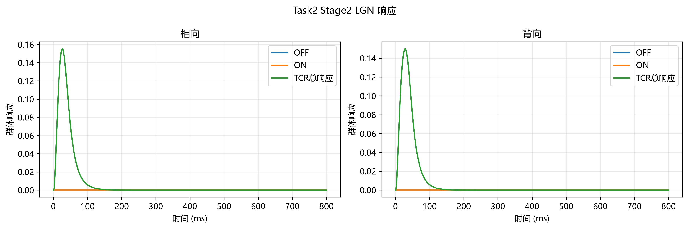
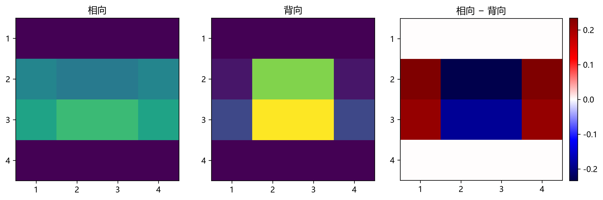

# 02 LGN 简化神经群模型：原理、结果与论文写作要点

本文档记录当前 `02_lgn.py` 的建模含义和已生成结果，供问题二论文撰写使用。这里的数值来自当前人工刺激与模型参数，不是生理参数拟合或真实 EEG 验证。

## 1. 对当前建模判断的核对

整体判断成立：LGN 输出保留了视觉通道的时间响应，且不能在进入 V1 前把全部通道平均成一个标量。当前 `*_lgn_total.npy` 的维度为“特征通道 × 时间”；Stage1 和 Task2 Stage2 各有 `4 个方向 × 16 个空间区域 = 64` 个通道，Task1 Stage2 双圆点有 `16` 个空间通道。`801` 个时间点对应 `0,1,…,800 ms`。

这一点也得到本次输出的直接数值支持。Stage1 将 64 个通道全局平均后，左右提示平均时间曲线的最大绝对差仅约 `2.24×10⁻⁸`；保留通道时，左右响应的逐元素最大绝对差约 `0.667`。因此，全局池化会几乎完全抹去本模型中保留的空间—方向差异。V1 接口应保留通道索引，并在后续用有结构的连接权重组合，而不是直接 `mean(axis=0)`。

原方案稿第 3.2 节式（5）—（9）描述了神经递质释放、突触开放比例、突触后电流及膜电位/漏电流。当前程序没有实现这些状态量，而是采用 TCR、IN、TRN 三个群体的低维速率动力学。因此，把当前实现写成“简化 TCR–IN–TRN 神经群速率模型”是准确的；若论文仍保留式（5）—（9），就会造成方程与计算结果不一致，需改写为下面的简化模型，或另行实现详细突触模型。

时延解释需要更谨慎。当前模拟中 OFF 群体峰值为刺激出现后约 `27 ms`；ON 群体峰值为提示消失后约 `40 ms`，峰值延迟之差为 `13 ms`。程序把 ON 输入安排在提示消失后 `10 ms` 开始，同时 ON/OFF 脉冲宽度和群体动力学时间常数不同，所以 `13 ms` 是当前参数化模型的峰值结果，不能单独作为生理验证。原方案所引 Chariker 等（2022）的 `9–11 ms` 是其方向选择性模型中设置的 ON 时间核延迟，针对运动光栅条件；另有猫 LGN 研究报告的平均响应潜伏期差约 `3.84 ms`、峰值时刻差约 `2.6 ms`。这些结果的刺激、物种、模型和潜伏期定义不同，论文宜把 `9–11 ms` 写作所采用的机制/参数依据，而不是普适常数。[Chariker 等（2022）](https://doi.org/10.1523/JNEUROSCI.2145-21.2022)；[Jin 等（2011）](https://doi.org/10.1523/JNEUROSCI.2456-11.2011)。

## 2. 输入、通道与输出含义

每个通道先承载一个空间特征幅值 (f_i)：Stage1 与 Task2 Stage2 使用四个 Gabor 方向在 4×4 网格上的响应；Task1 Stage2 使用双圆点 signed delta 的暗刺激对比幅值在 4×4 网格上的平均值。ON/OFF 的时间波形由实验阶段时序确定，再分别作用于这些空间特征。

| 阶段 | 空间通道 | 时间事件 | 输出解释 |
|---|---:|---|---|
| Task1 / Task2 Stage1 | 64 | 三角出现时 OFF；200 ms 后消失，ON 延迟 10 ms 开始 | 左右提示的 TCR 时序响应与空间分布 |
| Task1 Stage2 | 16 | 双圆点出现时 OFF；800 ms 窗口内不设消失事件 | 双圆点空间亮度通道的 TCR 响应 |
| Task2 Stage2 | 64 | 双三角出现时 OFF；800 ms 窗口内不设消失事件 | 相向/背向排列的 TCR 响应 |

Stage1 的 `*_lgn_on.npy` 与 `*_lgn_off.npy` 分别保存 TCR 的两类通路响应，`*_lgn_total.npy` 保存两者之和，作为下一层输入。Stage2 没有刺激消失事件，ON 响应为零且 OFF 响应等于总响应，因此只保存 `*_lgn_total.npy`，避免冗余或全零数组。特征向量由前端数组重算，不另存。IN 和 TRN 在程序中作为调节 TCR 的内部状态参与计算；当前文件输出与响应图聚焦 TCR，没有单独导出 IN/TRN 时序数组。`LGN空间峰值热图.png` 对 64 通道按方向取平均后显示空间峰值，仅用于展示位置分布；方向细节仍保留在 `*_lgn_total.npy` 中。

## 3. 简化模型原理

每个视觉通道的事件输入采用归一化 alpha 瞬态：

\[
a(t;t_0,\tau)=\begin{cases}
0, & t<t_0,\\
\dfrac{t-t_0}{\tau}\exp\!\left(1-\dfrac{t-t_0}{\tau}\right), & t\ge t_0.
\end{cases}
\]

其峰值为 1，出现在事件起点之后 \(\tau\) 毫秒。Stage1 设 OFF onset 为 \(a(t;0,20)\)，提示消失发生在 200 ms，ON 输入延迟 10 ms，因此设为 \(a(t;210,25)\)。Stage2 假设目标在 800 ms 窗口内持续显示，只使用 \(a(t;0,20)\) 作为 OFF onset，不添加目标消失或 ON 输入。

给定通道特征 \(f_i\) 和某一条通路的时间输入 \(u(t)\)，TCR、IN、TRN 的群体状态按下式相互调节：

\[
\begin{aligned}
\tau_T\dot T_i &=-T_i+\phi(2.2f_i u-0.9I_i-0.8R_i),\\
\tau_I\dot I_i &=-I_i+\phi(1.2f_i u+0.7T_i),\\
\tau_R\dot R_i &=-R_i+\phi(0.9T_i),
\end{aligned}
\qquad
(\tau_T,\tau_I,\tau_R)=(18,12,25)\;\mathrm{ms}.
\]

其中 \(T_i,I_i,R_i\) 分别表示 TCR、IN、TRN 的归一化群体活动；\(f_i u(t)\) 是当前视觉通道的瞬态驱动。\(\phi\) 为零输入时输出为零、正输入后渐进饱和的归一化 sigmoid。方程体现了直接视觉驱动、IN/TRN 对 TCR 的抑制调节，以及 TCR 对 IN/TRN 的反馈。程序以 \(\Delta t=1\) ms 的显式 Euler 步进计算，并对 ON、OFF 通路分别运行后相加得到 TCR 总响应：

\[
R_{\mathrm{LGN},i}(t)=T_{i,\mathrm{ON}}(t)+T_{i,\mathrm{OFF}}(t).
\]

这里的模型是对突触与膜电位细节的速率级近似，参数目前是用于形成可运行的时序机制，尚未由 LGN 单细胞或 EEG 数据估计。成文时应明确这一适用边界。

## 4. 当前结果与解释

| 条件 | 通道数 | OFF TCR 峰时刻 | ON TCR 峰时刻 | 相对事件的解释 |
|---|---:|---:|---:|---|
| Task1 / Stage1 左、右提示 | 64 | 27 ms | 240 ms | OFF 距出现事件 27 ms；ON 距 200 ms 消失事件 40 ms |
| Task2 / Stage1 左、右提示 | 64 | 27 ms | 240 ms | 与 Task1 Stage1 共用同一提示刺激 |
| Task1 Stage2 双圆点 | 16 | 29 ms | 0（无 ON 输入） | 只有出现时的 OFF 瞬态 |
| Task2 Stage2 相向双三角 | 64 | 26 ms | 0（无 ON 输入） | 只有出现时的 OFF 瞬态 |
| Task2 Stage2 背向双三角 | 64 | 28 ms | 0（无 ON 输入） | 只有出现时的 OFF 瞬态 |

Stage1 的全局平均曲线包含两个分离的峰，分别对应提示出现和提示消失；左右条件的全局曲线几乎重合，但空间峰值图保留明显的位置重排。Task1 Stage2 与 Task2 Stage2 在当前设定下只有出现后的 OFF 峰。当前不同阶段采用各自的特征归一化，因此峰值幅度不应用来直接比较跨任务刺激强弱；更适合解释的是事件时序、通道分布和同一配对条件之间的差异。

### Task1 Stage1：提示出现与消失的双时相响应

图 1. 左、右提示的 TCR 群体平均响应。出现事件引发早期 OFF 峰，消失事件后出现延迟 ON 峰；曲线显示的是模型设定下的响应时序。

图 2. TCR 总响应峰值的空间分布及左右差值。全局幅值相近与空间模式不同可以同时成立。

### Task1 Stage2：双圆点目标

图 3. 双圆点持续显示假设下的 TCR 响应；目标 onset 后有 OFF 峰，窗口内没有目标 offset 事件。

图 4. 双圆点目标的 4×4 TCR 空间峰值分布。

### Task2 Stage2：相向与背向双三角

图 5. 相向和背向双三角在仅包含 onset 的 800 ms 模拟窗内的 TCR 响应。

图 6. 相向/背向条件的 TCR 峰值空间分布及差值。

## 5. 可用于论文初稿的表述

为保留视觉刺激的局部结构，本文将 Gabor 方向与 4×4 空间区域的组合特征分别作为 LGN 通道输入；对缺少明显方向性的双圆点刺激，则使用 4×4 空间亮度特征。随后以事件相关的 ON/OFF 瞬态驱动简化 TCR–IN–TRN 速率模型，并将两条通路的 TCR 响应相加作为 LGN 输出。模拟结果显示，提示出现后的 OFF 群体峰约在 27 ms，提示消失后的 ON 群体峰约在 240 ms；双圆点和双三角目标在当前 800 ms 持续显示假设下只出现 OFF onset 响应。左右提示的 64 通道全局平均曲线几乎相同，而逐通道时空响应和空间峰值分布仍存在差异。因此，后续 V1 建模需保留 LGN 的空间—方向通道结构，不能在进入皮层前将所有通道压缩为一个总体均值。上述时序与空间差异是当前模型假设下的模拟结果，不构成对真实生理机制或 EEG 差异的验证。

## 6. 论文中需要保留的限制

- 当前模型是简化群体速率模型；若论文采用原方案式（5）—（9），必须补写通道开放、突触电流和膜电位动力学，不能把现有输出描述成这些方程的求解结果。
- `10 ms` 是程序中设置的 ON 输入延迟。输出峰时刻的 `13 ms` 相对差还受到 ON/OFF alpha 时间常数及群体响应动力学影响；需要写作“本模型的峰值差”，不要称作模型验证出的生理常数。
- TCR 输出数组保留通道，但当前 V1 连接矩阵尚未建立。下一步应明确每个空间/方向通道如何投射到 V1，而不是对 64 个通道直接求平均。
- IN/TRN 当前参与调节 TCR，但未单独保存为输出结果；论文若讨论其独立响应，应先扩展输出并重新运行。
- 这些输出是无量纲、按特征最大值归一化的模型响应。它们尚未与被试级 LGN 记录或实测 EEG 对齐，也没有据此进行参数估计。
