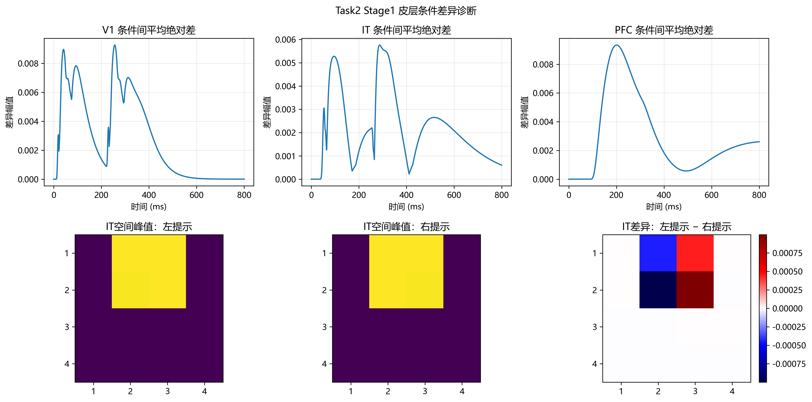
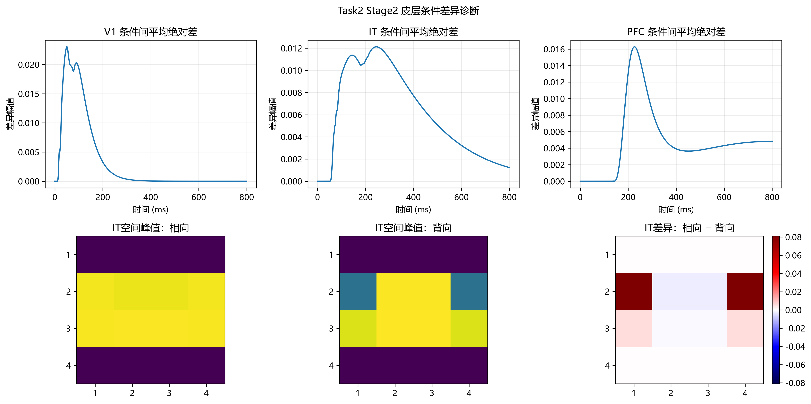

# 03_2 Cortex 诊断总结

本文记录 `03_2_cortex_diagnosis.py` 对已保存皮层源信号的诊断结果。脚本直接读取 `output/03_cortex` 中的 `*_source.npy`，不重新模拟 LGN 或皮层，也不修改 `03_cortex.py`。本次修正仅完善 Stage1 的 V1 镜像检查，并重新生成诊断 CSV 与图像。

## 结论摘要

- Stage1 左、右提示在 V1、IT、PFC 的模式近似互为水平镜像。修正 V1 的镜像映射后，三层镜像交换残差均低于 `3×10⁻⁷`，处于数值误差量级。
- 左右提示并未因此变成相同信号：相对 L2 条件差异从 V1 的 `0.4360` 降到 IT 的 `0.1342`，再到 PFC 的 `0.0282`。
- Task2 Stage2 相向/背向双三角在 IT 仍有 `0.2954` 的相对 L2 差异，PFC 保留 `0.0335`。该条件对不按水平镜像计算残差。
- 结果支持冻结当前 `01_gabor_frontend`、`02_lgn`、`03_cortex` 和 `03_2_cortex_diagnosis` 版本，并进入 `04_simulated_eeg.py` 检查导联映射后条件差异是否仍保留。

## Stage1 镜像检查修正

上游 Gabor 方向通道的顺序是 `[0°, 45°, 90°, 135°]`。水平镜像除翻转 4×4 空间网格的列方向外，还需交换 45° 与 135° 通道；对应通道索引置换为 `[0, 3, 2, 1]`。旧诊断只翻转空间列，因此 V1 残差 `0.3497` 反映的是镜像操作不完整。

| Stage1 层级 | 修正后的镜像交换残差 |
|---|---:|
| V1 | `2.85×10⁻⁷` |
| IT | `2.03×10⁻⁷` |
| PFC | `1.05×10⁻⁷` |

修正后左右条件可解释为近似镜像，而非完全相同。镜像残差比较的是一个条件与另一个条件经过镜像变换后的距离；相对 L2 条件差异比较的是未经镜像的两个条件。因此，两项指标可以同时表现为“镜像残差接近零”和“条件差异非零”。

图 1. Task1 Stage1 左右提示：上排显示 V1、IT、PFC 的条件差异随时间变化；下排显示 IT 两个条件的空间峰值图及其差值。对应数据见[诊断 CSV](../output/03_2_cortex_diagnosis/Task1/Stage1/皮层条件差异诊断.csv)。

图 2. Task2 Stage1 左右提示诊断图。当前保存的 Task1/Stage1 与 Task2/Stage1 数值相同；完整数据见[诊断 CSV](../output/03_2_cortex_diagnosis/Task2/Stage1/皮层条件差异诊断.csv)。

## 条件差异沿皮层层级的变化

相对 L2 条件差异按 `||A-B||₂ / (0.5×(||A||₂+||B||₂))` 计算。它是每层内部归一化后的无量纲指标，不表示跨层之间的绝对电流或电位比例。平均绝对差峰值则是该层各通道 `|A-B|` 的通道均值随时间达到的最大值。

| 条件 | 层级 | 相对 L2 条件差异 | 平均绝对差峰值 | 差异峰值时间 | 镜像交换残差 |
|---|---|---:|---:|---:|---:|
| Task1/Stage1 左右提示 | V1 | 0.4360 | 0.009268 | 257 ms | `2.85×10⁻⁷` |
| Task1/Stage1 左右提示 | IT | 0.1342 | 0.005760 | 287 ms | `2.03×10⁻⁷` |
| Task1/Stage1 左右提示 | PFC | 0.0282 | 0.009339 | 201 ms | `1.05×10⁻⁷` |
| Task2/Stage1 左右提示 | V1 | 0.4360 | 0.009268 | 257 ms | `2.85×10⁻⁷` |
| Task2/Stage1 左右提示 | IT | 0.1342 | 0.005760 | 287 ms | `2.03×10⁻⁷` |
| Task2/Stage1 左右提示 | PFC | 0.0282 | 0.009339 | 201 ms | `1.05×10⁻⁷` |
| Task2/Stage2 相向/背向 | V1 | 0.5686 | 0.023038 | 50 ms | 不适用 |
| Task2/Stage2 相向/背向 | IT | 0.2954 | 0.010937 | 119 ms | 不适用 |
| Task2/Stage2 相向/背向 | PFC | 0.0335 | 0.016549 | 157 ms | 不适用 |

Stage1 中，方向通道汇聚和空间汇总伴随条件差异减弱，但 PFC 条件差异仍非零。Task2 Stage2 的相向/背向差异在 IT 较明显，到 PFC 后减弱但仍非零。该结果说明当前皮层源适合继续进入 EEG 映射诊断；是否能在电极信号中稳定保留，仍需由 `04` 的导联矩阵映射结果确认。

图 3. Task2 Stage2 相向/背向双三角诊断图。该条件对不是简单水平镜像，因此镜像交换残差留空；对应数值见[诊断 CSV](../output/03_2_cortex_diagnosis/Task2/Stage2/皮层条件差异诊断.csv)。

## 时间指标的解释

CSV 中的“差异峰值时间”指 `mean(|A-B|)` 最大的时刻，即两个条件之间差异最大的时刻。它不同于某个条件下 PFC 平均响应达到峰值的时刻，也不能直接称为 P300 潜伏期。当前诊断的 Stage1 PFC 条件差异峰在 `201 ms`，Task2 Stage2 在 `157 ms`；`03_cortex` 中报告的 PFC 响应峰时（Stage1 约 `463 ms`、Stage2 约 `300 ms`）是另一种量。

## 下一步：04 模拟 EEG

当前结果支持继续运行 `04_simulated_eeg.py`。下一步需检查皮层源差异经过导联矩阵 `G` 后，在 F3、Fz、F4 是否仍能观察到：

1. 左提示与右提示的模拟 EEG 差异；
2. 相向与背向双三角的模拟 EEG 差异；
3. 合理的 F3/F4 空间不对称，而非两侧完全重合。

若源级 PFC 的约 `0.03` 相对条件差异在电极映射后仍保留，则说明当前正向模拟链在条件差异传递方面得到支持。该模拟诊断本身不构成真实 EEG 的统计显著性或分类性能验证。
