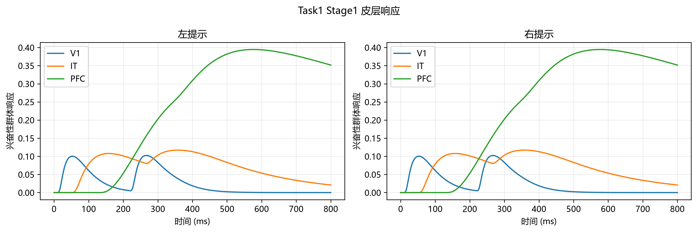
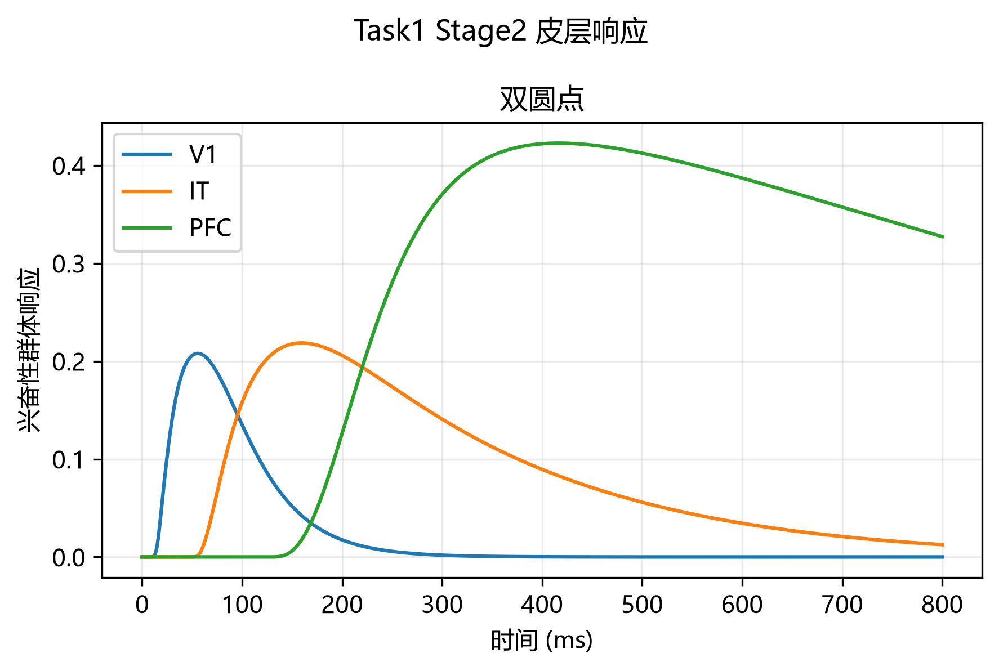

# 03 Cortex：皮层级联模型原理与结果

本文说明 `03_cortex.py` 如何把 LGN 的空间—方向通道传入 V1、IT、PFC 群体模型，并汇总当前与 Stage2 EEG 峰时校准后的结果。模型输出是无量纲群体活动，不是直接测得的皮层电位，也不等同于真实 P300。

## 建模逻辑

V1 保留 LGN 输入通道及其空间、方向索引；IT 将同一空间位置的四个方向响应汇聚为 16 个空间通道；PFC 再汇聚成视觉空间左、右两个通道，并保留部分全局活动。每层以 Wilson–Cowan 兴奋—抑制群体方程描述活动随时间的变化：

\[
\tau_E \dot E_i=-E_i+(1-E_i)\phi(w_{EE}E_i-w_{EI}I_i+g_Eu_i),
\]
\[
\tau_I \dot I_i=-I_i+(1-I_i)\phi(w_{IE}E_i-w_{II}I_i+g_Iu_i).
\]

其中 $u_i$ 为上一层输入，$E_i,I_i$ 是归一化群体活动。层间汇聚和延迟代表信息整合的简化过程，不表示真实解剖连接或单神经元动力学。

| 层级 | 通道处理 | 延迟 | 兴奋/抑制时间常数 |
|---|---|---:|---:|
| V1 | Stage1/Task2 Stage2：64→64；双圆点：16→16 | 8 ms | 18/10 ms |
| IT | 四方向汇聚为16个空间通道 | 37.5 ms | 60/33 ms |
| PFC | 空间网格汇聚为左、右视觉空间通道 | 75 ms | 105/60 ms |

IT 与 PFC 的延迟及时间常数统一乘以 1.5；V1、耦合权重和输入增益保持不变。这里的 1.5 来自当前四份清洗记录的 Stage2 晚期峰时校准：在 1.00–3.00、步长 0.25 的候选网格上，以 250–500 ms 内 Fz 正峰时间误差为目标，按记录进行留一记录验证。每折都选中 1.5；校准时排除条件数少于 10 的组，以及真实峰落在搜索窗边界的组，并让每份记录等权。基线时间尺度 1.0 的记录平均峰时 MAE 为 128.9 ms，尺度 1.5 的留出记录误差依次为 7.8、7.8、23.4、31.2 ms，平均 17.6 ms。当前资料没有被试 ID，因此这是记录级内部校准，不是被试独立验证；调参所用记录也不能再作为完全独立的验证集。该步骤校准的是时间尺度，不是振幅或导联权重；峰时误差降低也不代表整段波形已拟合。

## 主要结果

| 条件 | V1 峰时 | IT 峰时 | PFC 峰时 |
|---|---:|---:|---:|
| Stage1 左/右提示 | 267 ms | 357 ms | 576 ms |
| Task1 Stage2 双圆点 | 56 ms | 159 ms | 417 ms |
| Task2 Stage2 相向双三角 | 54 ms | 157 ms | 416 ms |
| Task2 Stage2 背向双三角 | 55 ms | 162 ms | 438 ms |

Stage2 呈现逐层延迟，与模型设计一致。峰时靠近真实记录的晚期响应窗，是经 Fz 峰时校准后的拟合表现，不能单独证明模型恢复了真实神经生理时间常数或生成了 P300。

图 1. Stage1 提示条件的 V1、IT、PFC 群体响应。提示在 0 ms 出现、200 ms 消失，曲线包含两个视觉事件引起的重叠响应。

图 2. Task1 Stage2 双圆点目标出现后的皮层响应。

## Stage1 的多事件解释

Stage1 包含提示出现（0 ms，主要产生 OFF 输入）和提示消失（200 ms，主要产生 ON 输入）。当前合成条件的全局峰时为 V1 267 ms、IT 357 ms、PFC 576 ms；因此 576 ms 不应直接标记为提示 onset 引起的 P300。04 的 Stage1 晚期统计窗设为 450–700 ms，即以提示消失为事件零点后的 250–500 ms；Stage2 目标只有 onset，统计窗为 250–500 ms。当前 Fz Stage1 峰约 568 ms，位于 offset 后约 368 ms。单独保留事件输入进行的模型消融得到：

| 输入条件 | V1 峰时 | IT 峰时 | PFC 峰时 |
|---|---:|---:|---:|
| 仅 OFF（提示出现） | 53 ms | 158 ms | 522 ms |
| 仅 ON（提示消失） | 267 ms | 379 ms | 727 ms |
| OFF + ON（实际组合） | 267 ms | 357 ms | 576 ms |

由于层内动力学含非线性，上表的合成响应不是两个单事件响应的简单相加。稳妥表述是：Stage1 的晚期响应受提示 onset 与 offset 共同影响，且 offset 所致 ON 输入对峰时有明显影响；不能只凭全局峰值作事件归因。

## 空间通道与解释边界

IT 对四个方向取平均，减少通道数的同时也丢失了显式方向标签。因此 IT 应解释为空间汇聚响应，而非已学得的方向选择性或形状类别。当前条件差异仍保留：左右提示从 V1 到 IT、PFC 的相对 L2 差异依次为 0.436、0.122、0.038；相向/背向在 V1、IT、PFC 分别为 0.569、0.348、0.045。它们是当前确定性模型输出的描述性差异，不是统计检验。

PFC 左、右通道指视觉空间网格的左右半区，不代表左右脑 PFC，也不应直接等同于 F3/F4。`E-I` 源信号是无量纲模型量；映射到 EEG 观测通道需经过单独的简化导联模型。

## 论文表述建议

可将本层描述为“经 Stage2 晚期峰时校准的简化 Wilson–Cowan 皮层级联模型”。报告 V1、IT、PFC 的相对时序和条件差异，并注明模型参数来自记录级内部校准、Stage1 含 onset/offset 两个事件、PFC 左右通道为空间汇聚通道。不要据此声称已复现真实 P300、真实解剖投射或个体化神经参数。
