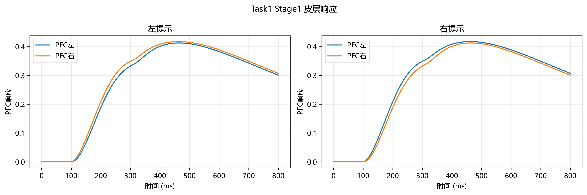
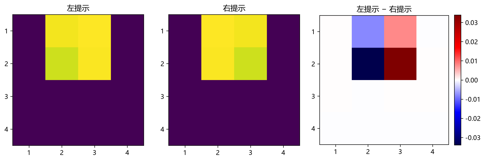
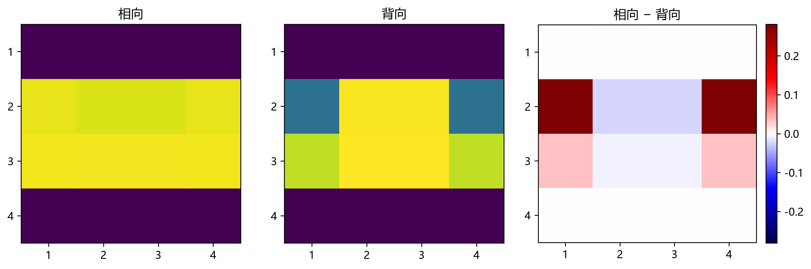

# 03 Cortex：皮层级联模型原理与结果

本文档总结当前 `03_cortex.py` 的建模含义和 `output/03_cortex` 中的模拟结果，供问题二论文撰写使用。模型将 LGN 特征响应传入 V1、IT、PFC 三个逐级整合的群体层，考察空间视觉信息在较慢时间尺度上的演变。文中结果均为当前人工刺激、输入归一化方式和模型参数下的模拟值，不是对真实皮层活动或 P300 的拟合验证。

## 1. 对当前分析的核对

总体判断成立：Stage2 的峰值顺序呈现 V1、IT、PFC 逐级后移；V1 保留输入通道；IT 的空间汇聚没有把相向和背向刺激完全压成相同响应；PFC 峰值落在 P300 常见的晚期时间范围附近。因此，这一层可以作为后续模拟 EEG 的皮层活动源模型。

但 Stage1 需要特别谨慎解释。提示在 0 ms 出现、200 ms 消失，分别产生 OFF 和 ON 两类 LGN 输入。皮层平均响应的全局峰值为 V1 `267 ms`、IT `333 ms`、PFC `463 ms`。其中 V1 峰值与提示消失后 ON-LGN 峰值 `240 ms` 相差 `27 ms`，说明消失事件对该峰贡献显著。进一步将 OFF 与 ON 输入分别单独传入同一皮层模型，得到：

| Stage1 输入条件 | V1 平均兴奋响应峰 | IT 平均兴奋响应峰 | PFC 平均兴奋响应峰 |
|---|---:|---:|---:|
| 仅 OFF（提示出现） | 53 ms | 128 ms | 357 ms |
| 仅 ON（提示消失） | 267 ms | 346 ms | 572 ms |
| OFF + ON（实际组合） | 267 ms | 333 ms | 463 ms |

这说明 `463 ms` 不能简单称为提示出现后自然产生的单一晚期峰，也不能断言它完全由 offset 单独造成：它出现在 ON-only 与 OFF-only 峰之间，并受到两路响应重叠及 Wilson–Cowan 非线性共同影响。较稳妥的表述是：**Stage1 的晚期皮层响应包含提示消失所引起的 ON 通路贡献，是 onset 与 offset 共同作用下的合成响应。**表中的单事件结果是模型消融分析，用于解释峰来源；非线性模型中组合响应不等于两种单事件响应的简单相加。

## 2. 层级结构与建模含义

模型保留由 LGN 提供的局部空间特征，并通过逐层汇聚与较慢时间常数形成更晚的群体活动：

| 层级 | 输入与输出通道 | 当前处理含义 | 额外传导延迟 | 兴奋/抑制时间常数 |
|---|---:|---|---:|---:|
| V1 | 64→64（方向×空间）；双圆点为 16→16 | 保留 LGN 通道，进行局部 E–I 动力学 | 8 ms | 18/10 ms |
| IT | 64→16；双圆点为 16→16 | 同一空间位置的四方向响应取平均，形成 16 个空间汇聚通道 | 25 ms | 40/22 ms |
| PFC | 16→2 | 汇总视觉场左、右半区，并混入全局空间均值 | 50 ms | 70/40 ms |

每个层级采用 Wilson–Cowan 型兴奋/抑制群体动力学。对通道 $i$，其核心形式可写为：

\[
\begin{aligned}
\tau_E\dot E_i &= -E_i +(1-E_i)\,\phi(w_{EE}E_i-w_{EI}I_i+g_Eu_i),\\
\tau_I\dot I_i &= -I_i +(1-I_i)\,\phi(w_{IE}E_i-w_{II}I_i+g_Iu_i),
\end{aligned}
\]

其中 $E_i$、$I_i$ 是归一化兴奋与抑制群体活动，$u_i$ 是上一层传来的输入，$w$ 和 $g$ 分别表示群体耦合与输入增益，$\phi$ 为有界非线性激活函数。通道间的汇聚和层间延迟代表信息整合与传递；更大的时间常数则使群体活动变化更慢。该实现是低维神经群模型，不包含真实神经元膜电位、突触电流或解剖连接的完整机制。

Stage1 和 Task2 Stage2 的通道数变化为 `64 → 64 → 16 → 2`；Task1 Stage2 双圆点为 `16 → 16 → 16 → 2`。这些维数对应模型特征通道，不能解读为神经元数或脑区实际细胞数。

## 3. 峰值时序结果

下表使用各层兴奋群体 $E$ 的通道平均曲线全局最大值；峰值时刻以模拟开始为 0 ms。Stage1 有提示出现和消失两个事件，其全局最大值不代表单一事件沿各层传播的唯一轨迹。

| 条件 | V1 峰时刻 | IT 峰时刻 | PFC 峰时刻 |
|---|---:|---:|---:|
| Task1 / Task2 Stage1 左提示 | 267 ms | 333 ms | 463 ms |
| Task1 / Task2 Stage1 右提示 | 267 ms | 333 ms | 463 ms |
| Task1 Stage2 双圆点 | 56 ms | 130 ms | 298 ms |
| Task2 Stage2 相向双三角 | 54 ms | 127 ms | 298 ms |
| Task2 Stage2 背向双三角 | 55 ms | 136 ms | 310 ms |

Stage2 在当前 800 ms 模拟窗内仅设置目标出现事件，没有人为加入目标消失事件。因此，Stage2 中约 `54–56 ms`、`127–136 ms` 和 `298–310 ms` 的峰值依次对应模型中的 V1、IT、PFC 群体响应。Task2 Stage2 相向与背向条件的峰时相近，但振幅和空间响应图存在差异；仅比较峰时不足以判断条件是否被区分。

图 1. Stage1 左右提示的 V1、IT、PFC 平均兴奋响应。曲线含提示出现和消失所引起的重叠响应。

图 2. PFC 的视觉场左、右通道。这里的“左/右”指输入空间网格的左右半区，不代表左、右脑 PFC。

图 3. 双圆点 onset 条件下的皮层平均响应，峰时依次为 V1 56 ms、IT 130 ms、PFC 298 ms。

## 4. 空间汇聚与条件差异

IT 将同一空间区域的四个 Gabor 方向响应取均值，得到 16 个空间通道。此操作降低了通道数，也**丢弃了明确的方向通道身份**。因此，当前 IT 更准确地说是“空间汇聚响应”，不能称为已学习到的方向选择性或形状类别编码。

不过，方向通道平均并未使相向和背向双三角的空间响应完全相同。按两条件 IT 兴奋响应的逐通道时间最大值构成 4×4 热图，所得图的相关系数约为 `0.913`，最大格点差约为 `0.281`，RMSE 约为 `0.101`。这表明两种空间图总体相似但存在局部差异。全时程逐点最大绝对差在 V1、IT、PFC 分别约为 `0.434`、`0.327`、`0.050`。这些数值是确定性模拟输出的描述性差异，不是统计显著性检验。

图 4. 左右提示的 IT 空间峰值分布及差异。该图显示空间汇聚后仍保留位置模式差异。

图 5. 相向与背向双三角的 IT 空间峰值图及逐格点差值。结果支持“当前模型仍保留部分空间差异”，不等同于证明 IT 已形成生理意义上的形状选择性。

下一步若论文需要强调相向/背向的方向关系，可将 IT 输入改为保留方向维度的特征张量，或设计具有明确方向组合偏好的连接权重，再比较其对空间图和晚期响应的影响。当前版本适合作为降维的基线模型，不应把简单方向平均描述成完整的形状识别机制。

## 5. PFC 通道解释及与 EEG 的接口

PFC 两个输出通道由 IT 4×4 网格的左右半区构成，同时各混入 30% 全局均值。它们表示模型中的视觉场左右汇总通道，不等于左、右脑半球，也不等于 EEG 电极 F3、F4。Stage1 左右提示的 PFC 通道差异方向相反；双圆点以及对称双三角条件中的通道响应接近，符合当前空间汇总定义。

当前 `皮层响应汇总.csv` 的“PFC 最大左右差”计算的是**同一条件内右侧视觉场通道减左侧视觉场通道**的极值，并非相向对背向或左提示对右提示的条件差。比较实验条件时应直接对齐相同时间点的条件波形或空间通道，不能把该列当作条件分类指标。

模型输出的 `*_v1_source.npy`、`*_it_source.npy`、`*_pfc_source.npy` 定义为各层 $E-I$，可作为 `04_simulated_eeg.py` 的相对皮层源信号。它们是无量纲活动代理量，尚未标定为物理电流或电位。后续 EEG 模型应通过显式的源到电极混合矩阵映射至 F3、Fz、F4；不应直接令 PFC 左通道等于 F3、右通道等于 F4。

## 6. 论文表述建议与适用边界

可在论文中表述为：

> 我们以 Wilson–Cowan 型兴奋—抑制群体动力学描述 LGN 输入在 V1、IT 与 PFC 的逐级整合。V1 保留 LGN 的空间—方向通道，IT 对同一空间位置的多方向响应进行汇聚，PFC 再汇总视觉场左右半区与全局信息。模拟中，目标 onset 条件的平均兴奋响应峰依次出现在 V1、IT 与 PFC，Task1 双圆点条件约为 56、130 与 298 ms；Task2 双三角条件约为 54–55、127–136 与 298–310 ms。PFC 的晚期峰位于 P300 相关的时间尺度，但该结果仅表示模型产生了晚期皮层活动，尚不能据此宣称模型生成或验证了真实 P300。Stage1 同时包含提示出现与消失事件，其 463 ms PFC 全局峰是两类事件输入在非线性层级中的合成结果，应与单一 onset 锁定的晚期响应区分。

论文中建议保留以下边界：

- 层间延迟、时间常数、耦合权重及输入增益是当前简化模型参数，尚未由被试级脑电或皮层记录拟合。
- 各层峰时是通道平均兴奋响应的全局峰；Stage1 多事件条件下，峰值时间不能单独识别响应的事件来源。
- IT 的四方向均值会丢失显式方向标签；当前空间差异不足以证明具备生理意义上的形状选择性。
- PFC 左右通道是视觉空间汇总，不对应脑半球或 EEG 电极位置。
- E−I 源信号未经过个体头模型、导联场或真实 EEG 标定。约 300 ms 的模型峰只能称为“P300 时间尺度附近的晚期皮层响应”或“P300 相关模拟响应”。
