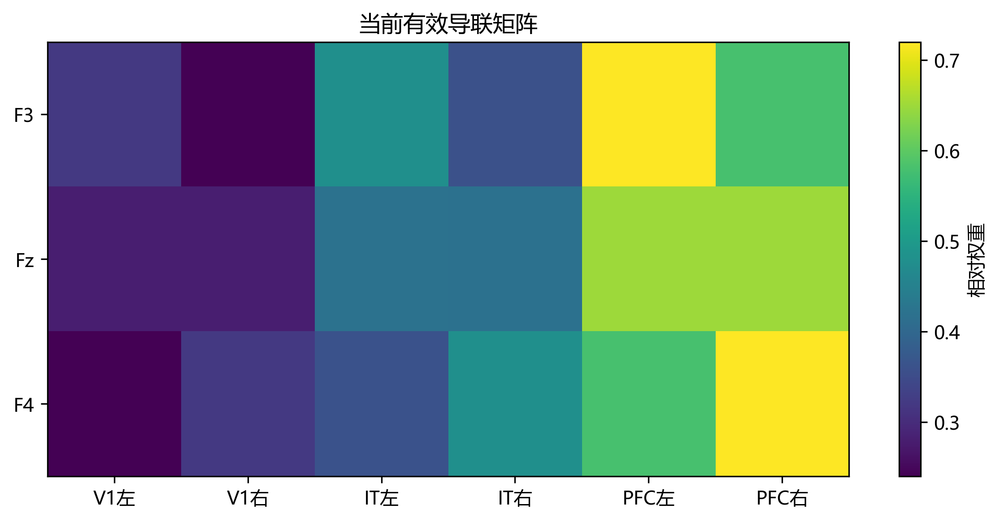

# 04_2 源到电极映射诊断：原理与结果

本文档总结 `04_2_mapping_diagnosis.py` 对 `03_cortex` 源信号到 `04_simulated_eeg` 三通道模拟电位映射的诊断。该步骤不修改 04 的模型与输出，只检查当前简化映射的空间区分度、左右差异和条件差异变化。所有结论均针对当前模型和归一化信号，不代表真实头部导联场或实测 EEG。

## 1. 诊断问题与源定义

04 将皮层输出压缩为六条源时间序列：

\[
q(t)=
[V1_{L},V1_{R},IT_{L},IT_{R},PFC_{L},PFC_{R}]^T,
\qquad V(t)=Gq(t).
\]

其中 V1 与 IT 的 L/R 表示 4×4 特征网格左右两半的空间汇聚，PFC 的 L/R 是 03 中按同一空间网格形成的两个汇总通道。它们都不是经解剖定位得到的左右脑区源，也不等同于左右视野的真实皮层投射。

当前 3×6 矩阵为：

\[
G=
\begin{bmatrix}
0.32&0.24&0.48&0.36&0.72&0.58\\
0.28&0.28&0.42&0.42&0.65&0.65\\
0.24&0.32&0.36&0.48&0.58&0.72
\end{bmatrix},
\]

行依次对应 F3、Fz、F4，列依次对应六个源。该矩阵是用于相对线性混合的简化权重，没有 MRI 头模型、源坐标/方向、组织电导率、参考电极或真实导联场约束。

## 2. 诊断方法

程序从七个已有条件中读取六源时间序列 (Q) 和模拟电位 (V)，拼接后用伪逆计算：

\[
\widehat G=VQ^+.
\]

再比较三行导联权重的余弦相似度，并统计每个条件内 F4−F3 的全时段与 250–500 ms 晚期窗最大绝对差。条件间变化采用归一化相对 L2 差异：

\[
d_{rel}(A,B)=\frac{\|A-B\|_2}{(\|A\|_2+\|B\|_2)/2},
\qquad
R=\frac{d_{rel}(V_A,V_B)}{d_{rel}(Q_A,Q_B)}.
\]

这里的 (R) 是映射前后**归一化相对条件差异的比值**，用于描述相对对比变化。源和电极信号维数、尺度不同，因此 (R) 不能解释为绝对差值能量或真实信息的保留百分比。

图 1. 从现有源信号与模拟电位反推的有效矩阵。由于 04 本身以固定 (G) 生成电位，该图主要用于核对计算管线是否一致。

## 3. 当前结果

### 3.1 三个电极的混合权重相似

| 导联行比较 | 余弦相似度 |
|---|---:|
| F3–Fz | 0.9926 |
| Fz–F4 | 0.9926 |
| F3–F4 | 0.9706 |

三行权重方向相近，说明当前矩阵对共同源活动赋予了相似的总体现测方式；结合已有 EEG 图中三条曲线近乎重合，可判断当前设置下电极间的空间对比较弱。余弦相似度本身不是通用的空间分辨率指标，判断仍应结合源分布和实际输出。

反推矩阵与 04 中设定的矩阵数值基本一致；六源设计矩阵满秩，最大重构残差约为 \(1.3\times10^{-6}\)。这是对当前模拟实现的一致性核验，而不是独立估计出的生理导联场。源设计矩阵条件数约为 240；在当前确定性模拟中反推稳定，但若以后从含噪真实 EEG 拟合权重，需重新评估可辨识性与噪声敏感性。

### 3.2 左右提示的镜像差异受到压缩

Task1 Stage1 左、右提示的六源信号在左右配对交换后，归一化相对残差约为 \(1.1\times10^{-7}\)，因此当前汇聚后的源模式几乎严格镜像。条件间的归一化相对差异由源空间约 `0.0391` 降至三电极空间约 `0.00253`，两者比值为 `0.0648`。换言之，按照本节定义，左右提示的归一化相对对比经过当前映射后明显减弱。

这一压缩与源信号中的共同活动占比较高、矩阵行共享较强共同权重有关。F3 与 F4 的左右配对权重绝对差分别为 V1 `0.08`、IT `0.12`、PFC `0.14`；这些差值相对于各自权重均值并非可以一概称为“很小”。因此，更稳妥的解释是**实际源差异结构与 G 的共同模式共同决定了投影后的差异**，而非单由某个权重差值导致。

全时段 F4−F3 最大差约为 \(\pm0.001664\)，出现在 `229 ms`，左右提示符号相反。250–500 ms 窗内最大差约为 \(\pm0.000970\)，出现在 `250 ms` 的窗边界；它不是晚期窗内部的峰值时刻，不宜直接作为 P300 侧化指标。

### 3.3 相向/背向差异主要表现为共同波形变化

Task2 Stage2 相向与背向的源空间归一化相对差异约为 `0.0517`，三电极空间约为 `0.0491`，差异比为 `0.948`。按该指标，映射后两条件的相对差异仍然明显。与此同时，同一条件内 F4−F3 只有约 \(3\times10^{-8}\)，处于浮点误差量级。

这两项结果并不矛盾：相向/背向条件可以有不同的整体时间波形，同时由于刺激和映射的左右对称性，单个条件内部仍呈现 F3≈F4。差异比 `0.948` 不代表“保留了 94.8% 的物理信息”，而是当前归一化 L2 定义下映射前后条件对比的相对比例。

## 4. 结论与论文使用边界

诊断支持保留 `04_simulated_eeg` 作为**简化线性映射基线**，没有证据支持为了让 F3/Fz/F4 曲线分开而任意调大左右权重。当前模型能够显示某些条件间的时间波形差异，但三电极的相对空间分布较弱；这种限制应作为模型边界报告，而不应通过无数据依据的权重调整掩盖。

论文可表述为：

> 为检查皮层源到观测通道的映射，我们将 V1、IT 与 PFC 的左右空间汇聚信号组成六维源向量，并通过一个左右对称的简化线性矩阵得到 F3、Fz、F4 三个归一化模拟电位通道。矩阵行余弦相似度较高，表明当前设置下电极间空间对比有限。映射显著压低了左右提示的归一化相对差异，而相向/背向条件的整体波形差异仍较明显；后者与同一条件内接近对称的 F3/F4 响应可以同时成立。由于矩阵未经真实头模型或 EEG 数据标定，结果仅用于比较当前模型中的相对时序与条件变化，不作真实导联场或绝对电位解释。

## 5. 输出文件

本步骤只生成以下诊断结果，不修改 04 的输入或输出：

- `导联矩阵诊断.csv`：反推矩阵的六个源权重。
- `映射诊断.csv`：行相似度、空间分离度、F4−F3 全时段/晚期窗差异及条件间归一化相对差异。
- `导联矩阵热图.png`：反推矩阵的可视化。

用于真实 EEG 比较前，还需明确电极参考、事件对齐和基线窗，并区分时间波形比较与空间分布比较。由于当前源和导联矩阵没有物理标定，不能直接比较绝对 μV，也不能把源左右通道解释为真实左右脑半球活动。

