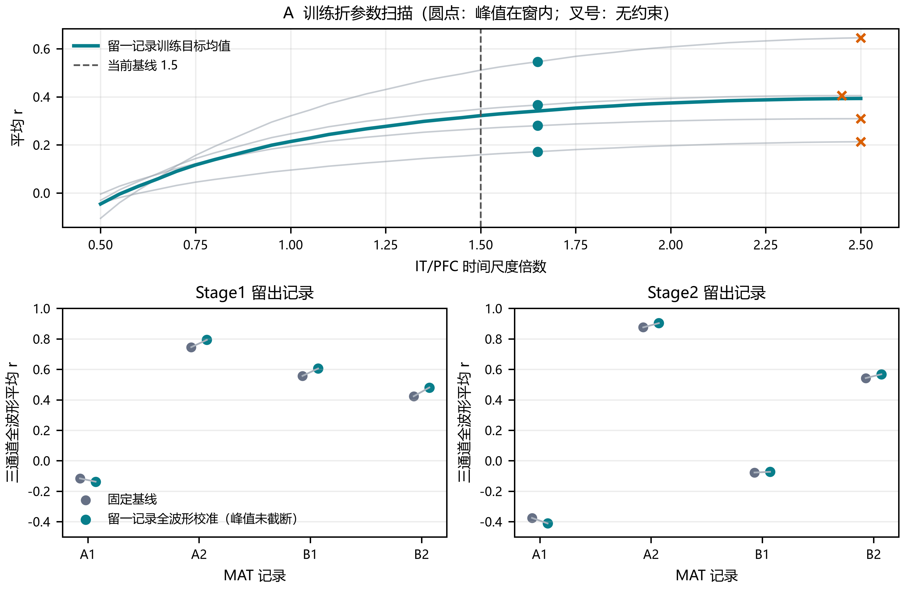

# 全波形校准与留一记录验证

## 目的

本分析检验：在现有 `03_cortex → 04_simulated_eeg` 完整时序输出上，用真实 ERP 的**整段波形**校准皮层时间尺度，能否比当前固定参数更好地预测未参与校准的记录。

它不是把模拟时长从 800 ms 延长。原模型已经生成 0–800 ms 曲线；本分析改变的是一个待估参数，并检查这种改变能否跨记录复现。原 `03`、`04` 模型与输出均保留不动。

## 方法

时间尺度参数 (s) 同时乘在 IT 与 PFC 的传导延迟和时间常数上；V1、层间连接权重和 `04` 导联矩阵固定。当前基线为 (s=1.50)，扫描范围为 0.50–2.50，步长 0.05。

模型和真实 ERP 均按 `05_simulated_real_eeg_compare.py` 的 MAT 分组与基线校正处理。模拟曲线重采样到真实 EEG 的 128 Hz 时间网格，再在 0–800 ms 全窗计算各电极 Pearson 相关。相关度用于比较波形形状，不表示绝对电位幅值拟合。

每折留出一个 MAT 文件，用其余三个文件选择共享时间尺度。训练目标对记录、阶段、条件和 F3/Fz/F4 通道等权平均：

\[
J(s)=\frac{1}{N}\sum_{d=1}^{N}\frac{1}{2}\sum_{g\in\{\mathrm{Stage1,Stage2}\}}
\frac{1}{|C_{dg}|}\sum_{c\in C_{dg}}\frac{1}{3}\sum_{e\in\{F3,Fz,F4\}}
r\!\left(\hat y_{dgce}(s),y_{dgce}\right).
\]

Task2 Stage2 中仅有 2 个试次的 inward 条件不参与校准；总计纳入 13 个条件。交叉验证单位是 MAT 记录。现有文件没有可靠被试 ID，因此这里称为**留一记录验证**，不称留一被试验证。

无约束的最大相关参数会把模拟 Fz 晚期峰推到所定义峰值窗的右边界。为避免将窗外响应误判为改善，另报告一组受限结果：只允许训练折中所有模拟 Fz 晚期峰都落在相应阶段峰值窗内部的参数，再从中选择全波形训练相关度最高者。峰值窗为 Stage1 450–700 ms、Stage2 250–500 ms。

## 结果

图中上方面板显示训练折的参数扫描；下方面板比较每个留出记录的固定基线与受限全波形校准结果。训练图的橙色叉号是无峰值窗约束的最优点。

基线复现检查中，按 (s=1.50) 重新生成的 EEG 与现有 `04` 保存结果最大绝对差为 0，确认比较使用了同一基线实现。

受限校准在四个留一记录折中都选择 (s=1.65)。按“记录与阶段等权”的留出平均全波形相关度：

| 留出阶段 | 固定基线 (s=1.50) | 受限全波形校准 (s=1.65) | 变化 |
|---|---:|---:|---:|
| Stage1 | 0.402 | 0.435 | +0.033 |
| Stage2 | 0.241 | 0.246 | +0.005 |
| 两阶段等权 | 0.322 | 0.341 | +0.019 |

四个记录中有三个的两阶段平均相关度上升，VisualCogA_Task-1 下降。受限校准的 Fz 晚期峰误差，在模拟峰与真实峰都未落在峰值窗边界的 10 个条件中，从 56.25 ms 降至 40.62 ms；另有 3 个真实 ERP 峰位于窗边界，不能把它们的峰值误差当作未截断估计。

无约束结果揭示了重要风险：四折都把 (s) 选在搜索上边界附近（2.45–2.50），留出全波形相关度的数值均值虽然升至 0.393，但 13 个留出条件的模拟 Fz 晚期峰全部落在分析窗右边界。Stage2 的留出相关度均值也由 0.241 降至 0.220。这个高分主要伴随响应被推到评分窗外，不能作为模型变好的证据。

## 结论与使用建议

**对整条波形拟合可以带来小幅相关度提升，但当前证据不足以据此替换基线参数。** 受约束后，整体相关度只提高约 0.019，Stage2 几乎不变；且每折都选在峰值边界约束所允许的最大值，说明 (s=1.65) 不是由数据内部稳定识别出的最优点。无约束的大幅提升则由峰值跑到窗边界造成。

因此当前建议保留 `03_cortex.py` 的 (s=1.50) 与现有 `04` 输出作为基线；将本分析视为全波形校准诊断，不把 (s=1.65) 宣称为最终生理参数。四份 MAT 没有明确被试身份，记录数也不足以支撑可靠推断；后续应先取得更多带被试标识的记录，再检验跨被试稳定性。模型幅值仍是相对单位，本分析只验证波形形状与晚峰时序，不等价于对真实微伏值或头皮导联场的拟合。

## 可复现文件

- 分析脚本：[05_2_fullcurve_calibration.py](../05_2_fullcurve_calibration.py)
- 留一记录汇总：[留一记录验证汇总.csv](../output/05_2_fullcurve_calibration/留一记录验证汇总.csv)
- 逐条件结果：[逐条件全波形指标.csv](../output/05_2_fullcurve_calibration/逐条件全波形指标.csv)
- 参数扫描：[训练参数扫描.csv](../output/05_2_fullcurve_calibration/训练参数扫描.csv)
- 图形：[PNG](../output/05_2_fullcurve_calibration/全波形留一记录比较.png)、[PDF](../output/05_2_fullcurve_calibration/全波形留一记录比较.pdf)
