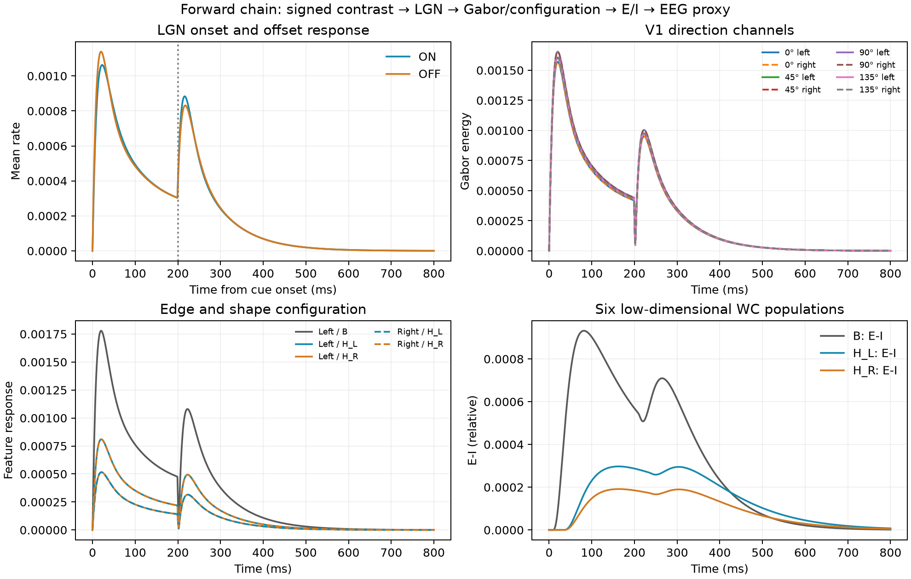
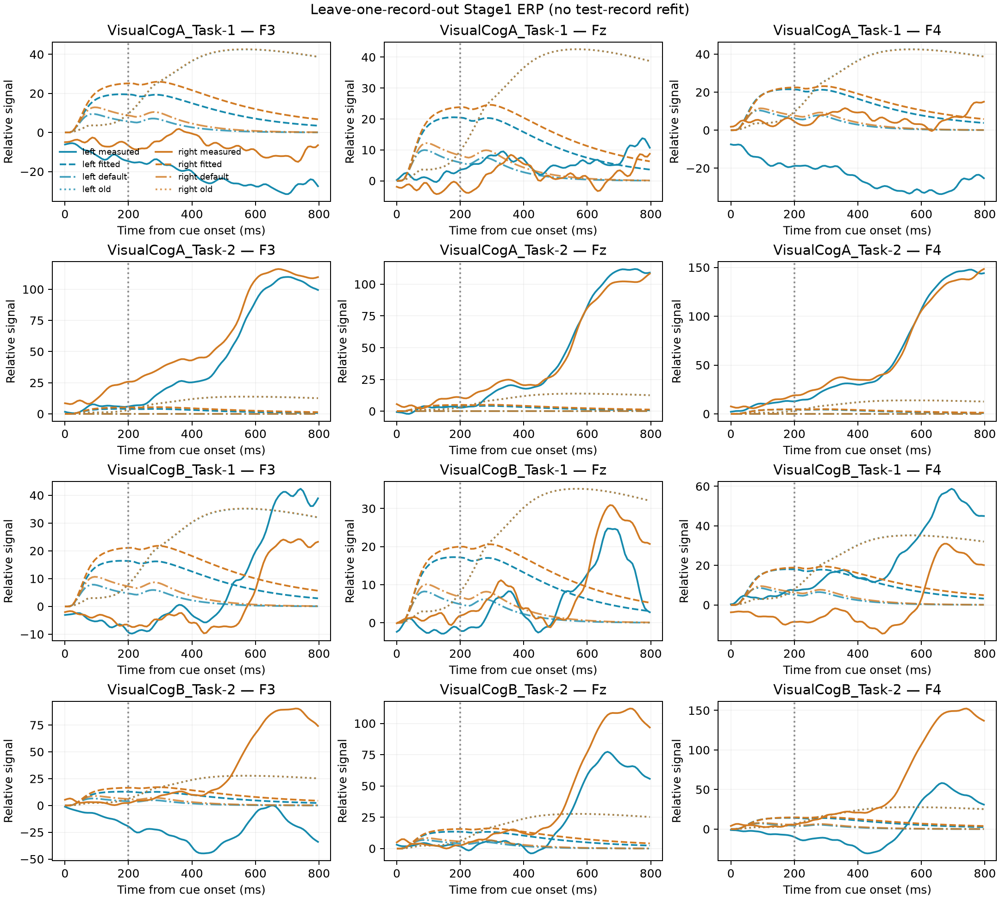
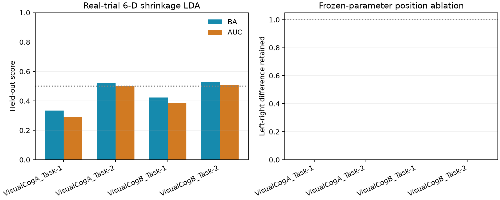

# revision_v1 运行与验收报告

## 验收范围

本次按代码 TODO 完成测试修复、左右标签核对、前端性能优化、模型表述边界检查和完整四折复测。所有修改均位于 `src/C/q2/revision/`；原 `01–05` 脚本及旧输出的哈希核对无变化。

## 修复与验证

- 将 `test_model.py`、`test_validation.py` 更新为当前接口的行为测试，并补上空间采样、镜像等价和完整入口检查。最终 `pytest` 为 **18 passed**。
- 核实标签来源：`cue_type=-1` 为左提示，`+1` 为右提示。四份 MAT 的左右试次数分别为 29/25、45/35、41/42、37/43，共 297 次可用 Stage1 试次；这些是记录文件，不等同于 4 名独立被试。
- 把三角支持点的双线性采样改为规则网格切片计算，并缓存固定模板坐标。相同 128 网格、101 ms 输入上，耗时从 SciPy 批量插值的 **2.59 s** 降至 **1.08 s**，约 **2.4 倍**；Gabor 与 B 图逐元素相同，H 图相对 RMS 差小于 `2.2×10⁻⁷`。
- 左提示与右提示的刺激矩阵经镜像检查后，右侧前端由严格空间反射和方向通道置换得到。独立计算完整右刺激（801 ms）与镜像输出复核后，Gabor、LGN 和 EEG 相对 RMS 差均低于 `1.3×10⁻⁶`，形状图最高约 `2.8×10⁻⁶`；完整前端单条件耗时 **8.57 s**。左刺激最终 EEG 与已有基线的相对 RMS 差约 `2.5×10⁻⁶`。
- 尺度审计选择 **128×128**；步长收敛检查中，`dt=1 ms` 与 `0.5 ms` 的相对 EEG RMS 差分别为左提示 `0.00540`、右提示 `0.00479`。
- 完整验证曾发现主入口漏导入 `run_forward_condition`，已补导入并加入回归测试。修复后四折 `validate` 完成，状态为 `validate_complete`。

## 复测结果

四个留一 MAT 拟合均正常结束，但全部落在相同参数组合：`tau_s=75 ms`、`g_i=0.5`、`tau_a=135 ms`；其中 `g_i` 在预设下界。该结果显示拟合偏向边界，不能据此把参数解释为生理真值。

真实试次 6 维特征的留一记录收缩 LDA 结果如下：

| 留出记录 | 平衡准确率 | ROC-AUC |
|---|---:|---:|
| VisualCogA_Task-1 | 0.335 | 0.291 |
| VisualCogA_Task-2 | 0.522 | 0.500 |
| VisualCogB_Task-1 | 0.423 | 0.385 |
| VisualCogB_Task-2 | 0.531 | 0.506 |
| 平均 | **0.453** | **0.421** |

该表现没有显示稳定的跨记录左右区分能力，不能宣称分类验证成功。

每份 MAT 的 `right − left` 6 维特征差方向也不一致。维度顺序为三个时间窗（80–200、250–450、450–700 ms）内的共同模式 `u0` 与侧化模式 `u1` 交替排列：

| 记录 | 左/右试次数 | 六维差值符号（right − left） |
|---|---:|---|
| VisualCogA_Task-1 | 29/25 | `++++++` |
| VisualCogA_Task-2 | 45/35 | `+-+-+-` |
| VisualCogB_Task-1 | 41/42 | `------` |
| VisualCogB_Task-2 | 37/43 | `+-+-+-` |

符号模式跨记录变化，进一步说明总体效应方向未稳定复现；这比只看整体平均特征更能解释留一记录分类接近机会水平的原因。

在 8 条留出 Stage1 条件曲线上，模型与实测 ERP 的平均指标为：

| 方法 | NRMSE（按实测 RMS） | 平均通道相关 |
|---|---:|---:|
| revision_v1 拟合 | 1.355 | -0.412 |
| revision_v1 默认参数 | 1.080 | -0.330 |
| 原 04 基线 | 1.729 | 0.402 |

拟合版优于旧 04 的平均 NRMSE，但仍较差，而且其平均相关为负；相对默认参数的 NRMSE 反而更高。应将这组结果视为“流水线可运行，但当前正向模型对留出 ERP 的波形预测不足”，不可表述为已解释真实脑电响应。

## 建议的后续优化

1. 先核对真实 EEG 的事件对齐、基线和电位符号约定，并按记录查看左右条件的 ERP 与 6 维特征差异方向。标签映射虽与提取/绘图代码一致，但四个记录中的效应方向并不稳定。
2. 对 `g_i` 下界结果检查训练损失剖面和参数敏感度；只有数据与机制依据支持时才调整边界。当前相同边界解不应作为生理参数估计。
3. 检查固定源到电极映射的整体极性和幅度尺度。任何符号或映射改动都应由事先说明的源方向假设决定，并在训练记录内确定，再用留出记录评估；不要按图形观感调权重。
4. 分类结果单独作为实测特征可分性结论；先建立稳健的 EEG 特征和跨记录基线，再判断是否需要改进低维正向模型。不要仅凭分类分数反推神经机制正确。
5. 保留当前方案为可复现基线。维持 `target_unknown` 未知布局、固定观测矩阵和低维功能性 Wilson–Cowan 表述，不据此宣称显式 V1→IT→PFC 级联或解剖源定位。

## 结果图

### 前向机制链

### 留一记录 ERP 对比

### 特征分类与机制对照

