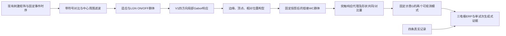

# 问题二项目实施方案：构型驱动的低维视觉—EEG模型

版本：2026-09-24（实施细节补充版）；依据当天19:50更新的任务书。**本文是待实施方案，不是已通过实测验证的结果报告。** 本文取代《修正版实施计划.md》。原有01—05脚本和结果保留为基线；此前新增的`revision/`仅为未完成工程草稿。本次补齐了空间尺度换算、圆点控制条件边界、生成式判别的可观测子空间，以及四记录验证的解释范围。

## 一、第二问适配判断

### 1.1 直接结论

**当前架构可以作为第二问的机制演示起点，但还不足以完整回答第二问。** 问题不只是ERP相关系数偏低，而是“方向与位置如何组合成形状、形状差异如何保留到观测、实测是否支持这种差异”尚未闭合。

保留LGN ON/OFF、兴奋—抑制群体动力学和正向观测的思路；重排视觉层级、替换过早池化、收紧事件和观测解释。主方案选用**Gabor构型编码驱动的低维Wilson–Cowan模型**。低参数空间神经场作为同一主线的受控扩展，只有训练记录内部验证支持时才升级；当前不直接采用高级版。

| 第二问要求 | 现有实现覆盖 | 关键缺口 | 本方案交付 |
|---|---|---|---|
| LGN→皮层→头皮EEG机制 | ON/OFF、TCR-IN-TRN、WC、线性混合均有实现 | Gabor在LGN之前；率差和物理电流混用；G无头模型依据 | 生理顺序清楚的前向链，显式源代理和观测假设 |
| 左右三角差异的形成机制 | 空间特征和模拟条件差异存在 | IT只平均方向，没有明确构型选择；缺少读出消融 | 顶点/边缘相对位置组合、形状对比读出及反事实检验 |
| 可区分响应的特征表示 | 有条件平均ERP对比 | 尚非单试次留出判别；图像可分不等于EEG可分 | 固定ERP特征、生成式证据差和收缩LDA对照 |
| 与数据相符的论证 | 有四记录比较及时间尺度扫描 | 事件布局可能误标；留出相关受边界峰影响 | 保守标签、外层留一记录、边界峰与模型失败显式报告 |

波形拟合差和不能回答第二问并非同一件事：机制示意模型可以不精确复现每个峰，但必须给出可检验的机制预测。反过来，较高相关也不能证明LGN/IT机制正确，更不能补足错误的条件标签。

### 1.2 已核实的代码与数据证据

1. `03_cortex.py`的`pool_v1_to_it`把64通道压成16通道，任何同位置的方向置换都不可见；`pool_it_to_pfc`再压成左右两个空间均值，同侧内部排列也被丢掉。各WC通道独立演化，命名为IT并不自动具有配置选择性。
2. 已保存Stage1左右刺激的全局四方向Gabor相对差约`8.26×10⁻⁸`，而位置—方向张量差约`0.945`；Task2相向/背向分别约`6.75×10⁻⁸`和`0.932`。主要区分线索确实在空间排列中。方向均值投影保留的条件差平方范数约42.5%/36.1%；这只是投影几何量，不是信息保留率。
3. 原导联矩阵不仅行相似，而且**严格秩为2**：

   \[
   G_{Fz}=(G_{F3}+G_{F4})/2,
   \quad y_{F3}-2y_{Fz}+y_{F4}=0.
   \]

   奇异值约`[2.01589, 0.20100, 0]`，六源至少有四维零空间。不能靠调整时间常数解释真实EEG任意三通道拓扑。
4. 原Stage2仅有alpha瞬态驱动，未显式表示目标持续显示及适应。Stage1晚峰既受onset级联影响，也受200ms offset影响；去offset后仍有晚响应，不能把晚峰全归因于某一次事件，更不能直接称已拟合P300。
5. 原始A2/B2记录目标后约15–19ms的首事件是`±1`平台；附录所述`±2`点击在约1–2s后才出现。clean片段目标后仅覆盖约792ms，不含这些点击。即使知道点击方向，错误反应也使布局不可唯一反推。
6. 四份MAT是四条记录，无可确认被试ID。当前可确认的Stage1左右共有297试次；不能将其作为297个独立被试，也不能称四折为跨被试验证。

### 1.3 对新增候选路线的取舍

采用：带符号亮度变化、LGN后置Gabor、构型编码、低维WC、归一化固定投影、受约束观测、生成式证据与消融。

暂不采用：直接建立完整空间神经场、三层球头模型、自由导联估计、额外PFC/海马/LIF/Kuramoto。原因是当前缺少源坐标、头部几何、可靠被试信息和足够观测维数；增加这些自由度不能补足证据。空间场只通过同一模型的一个局部耦合扩展接受验证，三层球模型不进入本轮主方案。

## 二、唯一推荐架构

### 2.1 主链与输出边界



整个模型的坐标首先是**图像归一化坐标**，不是皮层毫米坐标。左右三角指形状方向；空间左右指图像区域；两者均不自动等于左右脑半球。只有观测向量中的F3/Fz/F4是实际电极名称。

交付三类结果并分开保存：内部构型表征、固定观测模型的EEG预测、实测EEG留出判别。任何一类成功都不能替代另外两类。

### 2.2 输入和时序

直接读取`input/*.npy`，不从示意图截图再次提取。现有矩阵作为标准化算法输入；其是否逐像素等于实验屏幕呈现未经核实，不能称已恢复物理刺激。全流程统一除以255，不再逐条件或逐条件对取最大值归一化。

对每一阶段，以相应baseline为参考：

\[
\Delta I_s(x)=\{I_s(x)-I_{0,s}(x)\}/255,
\quad C_s(x,t)=\Delta I_s(x)g_s(t).
\]

\[
g_1(t)=\mathbf1_{0\le t<200\mathrm{ms}},
\qquad g_2(t)=\mathbf1_{0\le t\le800\mathrm{ms}}.
\]

Stage1 offset通过亮度恢复自然进入动态系统，不能事后随意加一个“P300脉冲”。Stage2窗内无目标消失事件。Stage2 baseline按现有纯白矩阵，显示器gamma、亮度、视角均作为限制。

采用256×256原矩阵；前端首版面积平均至64×64。Gabor和构型在64×64上计算后才压至8×8空间网格，不能先平均到8×8再检测顶点。后续以128×128前端、4×4/8×8/16×16空间网格做有限敏感性试验，尺度参数均换算回原图像像素，不能在换分辨率时偷偷改变感受野大小。

**实现尺度约定（必须按此实现，不允许把原图像素参数原样传给降采样网格）：**256→64采用不重叠4×4像素块面积均值；图像像素中心从原网格映射到64网格的公式为`x64=(x256+0.5)/4-0.5`、`y64=(y256+0.5)/4-0.5`。以`r=256/N`表示原图与运算网格的线性比例，则所有空间长度参数在N网格上使用`pN=p256/r`，模板点坐标也按同一像素中心公式映射；时间常数不随空间分辨率换算。

| 空间算子 | 原图定义 | 64×64实际参数 | 128×128敏感性参数 |
|---|---:|---:|---:|
| DoG中心σc | 3 px | 0.75 px | 1.5 px |
| DoG周围σs | 8 px | 2 px | 4 px |
| Gabor包络σ | 4 px | 1 px | 2 px |
| Gabor波长λ | 10 px | 2.5 px | 5 px |
| 构型模糊ρ | 2 px | 0.5 px | 1 px |

64网格的Gabor波长只有2.5像素，接近离散采样的高频边界。因此正式拟合前必须运行尺度审计：记录每个离散Gabor核的频谱峰所对应的原图波长，并计算DoG/Gabor离散核的实际二阶矩；相对预设波长或空间宽度偏差超过10%，即不通过。再将128网格的V1与构型图按面积均值映射回64网格；任一非零有效特征图与64网格对应图的归一化余弦相似度低于0.95，也不通过，零图单独计数且不计算余弦。任一检查不通过时，不得用64网格作为主结果，改用128网格并在任何EEG参数拟合前冻结该选择。这些是预先设定的数值分辨率门槛，不是统计显著性标准；不得根据留出EEG表现选择滤波尺度。三角模板轮廓和支持点先在256网格确定，再用像素中心公式变换到运算网格；落在非整数坐标的Gabor响应统一采用双线性插值。64与128两种运算均须从同一256×256输入生成，禁止先把64结果插值成128冒充高分辨率结果。

### 2.3 视网膜/LGN：中心周围、极性和适应

以归一化高斯核构造DoG：

\[
z(x,t)=(K_{\sigma_c}-K_{\sigma_s})*C(x,t),\quad\sigma_s>\sigma_c,
\qquad \tau_a\dot a=z-a.
\]

\[
u_+=0.8[z-a]_++0.2[z]_+,
\quad u_-=0.8[a-z]_++0.2[-z]_+.
\]

初值为0，参数首版固定`σc=3、σs=8`原图像像素、`τa=80ms`。0.2持续项保证持续显示不被当成只有onset的瞬时输入；DoG的空间正负结构意味着暗刺激也可能同时激活不同位置的ON/OFF，不能把整幅暗图简单归为纯OFF。

每个极性分别保留TCR、IN、TRN：

\[
\tau_R\dot R_\pm=-R_\pm+F(2.2u_\pm-0.9N_\pm-0.8T_\pm),
\]
\[
\tau_N\dot N_\pm=-N_\pm+F(1.2u_\pm+0.7R_\pm),\quad
\tau_T\dot T_\pm=-T_\pm+F(0.9R_\pm).
\]

沿用原LGN的`τR=18、τN=12、τT=25ms`作为现象学默认值；不把它们写成已测得的人类生理参数。`F`沿用零输入输出为0的截断sigmoid，并将斜率、阈值放入唯一配置文件。分别保存ON/OFF，不只保存和；V1输入取`R=R+−R−`，另存总活动用于诊断。

明确实现为`Fβ,h(v)=clip((sigmoid(β(v−h))−sigmoid(−βh))/(1−sigmoid(−βh)),0,1)`；LGN使用`β=4,h=0.5`，皮层使用`β=5,h=0.35`，均固定。积分首版用1ms显式Euler，记录未经裁剪的状态；出现超出[0,1]超过数值容差的状态应报错，不能用逐步裁剪掩盖不稳定。

### 2.4 V1：完整保留方向与位置

\[
V_\theta(x,t)=\sqrt{(g_{\theta,e}*R)^2+(g_{\theta,o}*R)^2},
\quad\theta\in\{0°,45°,90°,135°\}.
\]

Gabor参数沿用原图尺度`σ=4、λ=10、γ=0.5`，偶/奇正交相位；核去直流并用同一种固定范数归一化。每个条件使用同一核和幅值标度。保存`V[orientation,y,x,time]`，四方向轴不在进入形状层前平均。

这里Gabor是V1风格的计算近似，不是真实皮层神经元的完整模型。中心周围→皮层方向整合的层级有实验依据，但这些具体通道数和参数是工程假设。[Hubel与Wiesel，1962](https://physoc.onlinelibrary.wiley.com/doi/10.1113/jphysiol.1962.sp006837)

### 2.5 Gabor构型编码：明确包含顶点及相对位置

首版只建**两套镜像配对的三角构型模板**`S_L、S_R`，不训练大字典，不为每条EEG记录定制模板。它们来自已知刺激的几何，不来自留出EEG或标签统计。

确定性构建步骤：

1. 从Stage1刺激相对baseline的变化像素得到三角掩膜，移除未变化的圆环；以掩膜质心为构型中心。
2. 对边界取凸包，从凸包顶点中选择面积最大的三点作为三角顶点；记录该三角与掩膜的交并比。若低于0.9，停止该模板的自动构建并输出几何检查错误，不能静默换成任意模板。当前标准矩阵应由单元测试确认满足该条件。
3. 每条边在25%、50%、75%处取样，形成9个轮廓支持点；每个顶点沿相邻两条边各向内取一个支持点，形成6个角点支持点。偏移全部相对质心保存。
4. 每个支持点使用边法线附近的Gabor方向。相邻方向按角距离线性插值，而不是为获得更好EEG结果手选方向。角点响应由其两条边支持点的几何均值形成；整体轮廓再组合三个角点与9个边支持点。
5. 左模板由左刺激确定，右模板由水平镜像确定；核方向同步作`45°↔135°`置换。独立右刺激只用于检查镜像一致性，不重新调参。

模糊—位移响应与构型响应为：

\[
\widetilde V_j(x,t)=(K_{\rho}*V_{\theta_j})(x+\delta_j,t),
\]
\[
H_k(x,t)=\left[\exp\!\left(\frac{\sum_jw_j\log(\varepsilon+\widetilde V_j)}{\sum_jw_j}\right)-\varepsilon\right]_+,
\quad k\in\{L,R\}.
\]

首版`ρ=2`原图像像素、`ε=10⁻⁸`、同层支持点等权；边界外填0，不周期回绕。三级组合分别归一化权重，避免模板支持点更多就自动获得更大幅值。模板偏移、方向和权重写入JSON并固定hash。

三角模板对所有刺激都按同一公式计算，不按Task名称、真实cue标签或答案条件手动开关。双圆点刺激作为形状特异性控制：保存其`H_L/H_R`能量及相对Stage1三角刺激的能量比；若圆点出现明显三角模板响应，应如实报告为模板交叉激活，不以真实标签调低响应或重画模板。主参数拟合和主分类只使用Stage1左/右三角提示；Task1双圆点使用冻结参数作外部控制性前向检查，不参与`τS`、`gI`、`τa`或观测幅值`a`的拟合。若需要解释双圆点本身，另行预注册圆形构型模块，不把三角模板泛化为圆点识别器。

这称为**简化Gabor构型编码**，借鉴COSFIRE的模糊、位移和几何均值，不声称完整复现COSFIRE或真实IT神经元。[Azzopardi与Petkov，2013](https://pubmed.ncbi.nlm.nih.gov/22585100/)

同时保存通用早期边缘图`B=(Σθ Vθ²)^(1/2)/2`，使dots仍有视觉驱动；dots不建立任意“左/右三角标签”。`H_L/H_R`的差异是模型图像层预测，不能单独当作EEG分类证据。

### 2.6 普通版：六个共享参数WC群体

采用图像左右半域的固定基函数`b1=√2·1[x<0]、b2=√2·1[x≥0]`，定义面积平均内积`〈f,g〉=N⁻¹Σxf(x)g(x)`，故`〈bi,bj〉=δij`。坐标和网格事先固定，所有条件共同使用；不按各刺激质心移动投影区，也不按数据重新归一化。

对三个输入场`B、H_L、H_R`分别投影：

\[
P_{k,m}(t)=\langle X_k(\cdot,t),b_m\rangle,
\quad k\in\{B,L,R\},\ m\in\{1,2\}.
\]

共六个E/I群体。先完成构型运算再投影，不能把方向平均后的图拿去假装构型输入。

\[
\tau_{E,k}\dot E_{k,m}=-E_{k,m}+(1-E_{k,m})F(w_{EE}E_{k,m}-g_Iw_{EI}I_{k,m}+g_PP_{k,m}(t-d_k)),
\]
\[
\tau_{I,k}\dot I_{k,m}=-I_{k,m}+(1-I_{k,m})F(w_{IE}E_{k,m}-w_{II}I_{k,m}+g_QP_{k,m}(t-d_k)).
\]

首版固定`wEE=1.4、wEI=1.1、wIE=1.0、wII=0.8、gP=2.2、gQ=1.2`；早期`τE=18、τI=10、dB=8ms`；形状层`τE=τS、τI=0.55τS、dL=dR=33ms`。形状层的总延迟包括8ms早期与25ms整合近似，不再与时间常数绑定缩放。左右模板、两个空间基函数和全部刺激共享这些参数。

上述六群体是低维功能模型，不宣称对应六个可定位脑源。第二问不加入PFC认知层；后续第三问如需认知状态，必须另立数据和假设。

### 2.7 源代理与观测：既不丢构型，也不伪造解剖学

率变量不直接标作电流。对E/I作单位面积突触响应卷积：

\[
h_\tau(t)=\mathbf1_{t\ge0}\,t\exp(-t/\tau)/\tau^2,
\quad p_{k,m}=h_{10\mathrm{ms}}*E_{k,m}-h_{20\mathrm{ms}}*I_{k,m}.
\]

它是**相对单位的等效源活动代理**，没有树突方向、膜面积和电导标定，不能称物理电流或μV。神经群的突触后响应代理可用于观测近似，但并不因此完成真实头皮正向模型。[David与Friston，2003](https://www.fil.ion.ucl.ac.uk/spm/doc/papers/od_neural_mass.pdf)

不能把两套形状响应又全部平均。固定保留共同与对比量：

\[
p_{\Sigma,m}=(p_{R,m}+p_{L,m})/\sqrt2,
\qquad p_{\Delta,m}=(p_{R,m}-p_{L,m})/\sqrt2.
\]

这是正交坐标变换，不增加整体范数。六维中间代理固定排列为
`s=[pB1,pB2,pΣ1,pΣ2,pΔ1,pΔ2]`。`pΔ`正负是功能对比，不是把右刺激直接赋一个电极符号；必须由两套模板和相同动力学生成，禁止以真实cue标签给源加正负号。

继承原数值矩阵，所有拟合中冻结：

\[
G=\begin{bmatrix}
.32&.24&.48&.36&.72&.58\\
.28&.28&.42&.42&.65&.65\\
.24&.32&.36&.48&.58&.72
\end{bmatrix},\quad \hat y(t)=aG s(t),\ a\ge0.
\]

**需要明确承认的假设**：旧G本来就不是实测导联场；这里将其保留为固定观测基准，并重新定义中间代理的功能含义，不能继续沿用原“V1/IT/PFC解剖贡献”的解释。尤其形状对比源向头皮电位的固定投影是待检验的观测假设，不是由Gabor自动推导出的生理事实。它只通过留出预测和对比源消融获得支持；失败时不改变G来补救。

实际用于分析的源模式仅为两个：令`G=U2Σ2V2ᵀ`，保存`z=Σ2V2ᵀs`和`ŷ=aU2z`。六维`s`是固定前向计算的中间量，不从EEG估计；G的四维零空间不作解释。固定SVD的符号约定，避免不同运行模式翻转。

实测观测空间另用三个正交基：

\[
u_0=(1,1,1)/\sqrt3,\quad u_1=(-1,0,1)/\sqrt2,\quad u_2=(1,-2,1)/\sqrt6.
\]

模型只能解释`u0/u1`中的预测，`u2ᵀŷ=0`；真实`u2ᵀy`的能量和条件差异必须报告，不能丢弃后宣称全拓扑拟合良好。不写`y_R=flip(y_L)`，而是两个刺激独立前向计算；刺激镜像只约束编码，不作为实测F3/F4镜像约束。功能对比源允许模型共同模式也随形状改变，但其真实性必须由数据检验。

### 2.8 高级空间版的唯一升级方式

普通版通过后，才考虑把六个投影群体扩展成三个8×8 E/I场，替换局部驱动为`wEE E + κ Kσ*E − gI wEI I + input`，`Kσ`为单位面积、固定宽度1个网格的高斯核，零通量边界；仅新增`κ∈[0,0.3]`。其余前端、构型模板、源代理、基函数与G不变，动态结束后再投影。

普通版相当于先投影输入、再演化；空间版先局部演化、再投影，因非线性二者通常不同。不能简单宣称低分辨率版是精确Galerkin解。若实现真正Galerkin系统，必须计算`〈bi,F(ΣjEj bj)〉`，不能用`F(Ei)`替代积分却称严格投影。

升级选择在外层训练记录内部完成；外层留出结果只作最终评估。若空间版未稳定改善，就交付普通版，空间结果放敏感性附录。

## 三、事件和条件编码的保守规则

### 3.1 唯一事件表

| 阶段 | 模型参考点 | 实测baseline | 主比较窗 | 晚期诊断窗 | 额外要求 |
|---|---|---|---|---|---|
| Stage1 | cue onset=0ms，offset=200ms | [-0.2,0)s | [0,800]ms | [450,700]ms | 同时报offset后[250,500]ms；onset后[250,500]只作次要混合事件诊断 |
| Stage2 | target onset=2.20s | [2.0,2.2)s | [0,800]ms | [250,500]ms | 主窗只取真实存在的采样点，约到792.19ms；不外推实测尾端 |

保留Stage2 [0,500]ms作为与旧05结果的附加对照，但不能用它与新全窗结果混算提升。模拟以1ms步长产生完整0–800ms，在真实128Hz时间点插值采样；不把真实EEG插值上采样后当成更多独立样本。

当前统一使用固定时序假设。有明确语义且独立记录的刺激触发后，才可按每试次触发对齐，并重新生成全部比较；`Action/TgtAct`首沿不满足该条件。缺baseline、标签重复、时间轴不一致、非有限EEG直接报错，不悄悄补0。

### 3.2 条件规则和有效样本

| 记录 | Stage1左/右 | Stage2最终标签 | 可用于拟合 |
|---|---:|---|---|
| VisualCogA_Task-1 | 29/25 | dots，54 | 两阶段 |
| VisualCogA_Task-2 | 45/35 | dots，80 | 两阶段 |
| VisualCogB_Task-1 | 41/42 | target_unknown，83 | 仅Stage1 |
| VisualCogB_Task-2 | 37/43 | target_unknown，80 | 仅Stage1 |

Task1/Task2指实验项目A/B，不要把MAT文件名后缀`Task-1/Task-2`误当不同项目。原B1的2/81与B2的40/40布局计数保留在历史审计中，**不作为可靠标签继续使用**。

- Stage1只认`cue_type=-1/+1`；其余值隔离并计数。
- Task2 Stage2模拟仍可生成inward/outward作机制反事实，但不能与伪标签真实ERP配对；真实只保存unknown总体ERP。
- 不用50/50假定比例混合两个模拟去拟合unknown，也不估计未知比例来偷偷恢复标签。
- 每条记录每条件`n<10`仅描述，不进入参数拟合、条件效应推断或分类评价。
- 单试次先按预设baseline减均值再计算ERP/特征；这个固定的试次内操作不使用测试标签。其他数据驱动标准化、平滑、降维均训练折内拟合。
- 原题的点击可能错误或缺失；即使日后读到±2，也须有独立正确性和目标布局日志才可恢复布局。

真实单位沿MAT元数据核实；无法核实时标“数据原始单位”，模拟始终为相对单位。不得将无校准的真实/模拟幅值都写成μV。

## 四、逐文件实施与执行顺序

### 4.1 保留基线，建立独立修正版

原01—05及两个诊断脚本均保留，不通过修改全局变量或覆盖输出制造“新旧对比”。新入口放在`q2/revision/`，正式运行输出放在`q2/output/revision_v1/`；此前`output/revision/`是工程草稿输出，不混入验收。

| 原文件 | 处置 | 修正版对应内容 |
|---|---|---|
| `01_gabor_frontend.py` | 原文件不动；复用核生成数学定义 | `stimulus.py`读取原矩阵和baseline；`vision.py`在LGN之后执行Gabor，不再作为LGN前端 |
| `02_lgn.py` | 原文件不动；保留三群体结构作为参考 | `lgn.py`加入持续包络、适应、中心周围和独立ON/OFF输出，统一图像幅值 |
| `03_cortex.py` | 原文件不动 | `configuration.py`构型编码；`cortex.py`六群体WC，替换四方向均值与PFC命名，延迟/时间常数分开 |
| `04_simulated_eeg.py` | 原文件不动，原G数值冻结 | `observation.py`固定基函数、突触响应代理、共同/对比量、G及两模式SVD；不拟合G |
| `05_simulated_real_eeg_compare.py` | 原文件不动，仅旧结果作对照 | `real_data.py`保守标签；`validation.py`同口径ERP指标；`evidence.py`单试次证据与LDA |
| `03_2_cortex_diagnosis.py` | 历史诊断保留 | `diagnostics.py`增加顶点、空间打乱、方向置换、构型读出及offset消融 |
| `04_2_mapping_diagnosis.py` | 历史诊断保留 | 直接对固定G分析秩/零空间，报告真实第三拓扑分量；不由模拟源反推G充当独立验证 |
| `05_2_fullcurve_calibration.py` | 不把1.65/2.50写回基线 | `fit.py`有界多初值估计与严格按记录切分，不再绑定IT/PFC延迟和时间常数 |
| 各阶段说明文档 | 历史结果不覆盖 | 新建`revision_v1_运行与验收报告.md`，逐项区分已实现、通过、失败和不可评估 |

现有`revision/model.py`需要按上述职责拆分和替换，不能因为已能产生曲线就视为最终实现。尤其当前草稿的配置等权读出会抹掉某些方向身份，必须由第2.7节的显式对比读出及其反例测试替换。

### 4.2 接口与数据契约

统一轴约定为`time`最后一维；所有结果携带真实`time_ms`，禁止以数组长度重新猜时间轴。`config.py`只保存一份时序、路径、默认参数和随机种子`20260924`。

```python
# stimulus.py
load_stimulus(stage, condition) -> Stimulus
# fields: image, baseline, signed_contrast, provenance, pixel_scale

# lgn.py / vision.py / configuration.py
simulate_lgn(stimulus, events, params, time_ms) -> LGNResult
# on/off: [height, width, time]; 保存适应与输入包络摘要
encode_v1(lgn_result, kernels) -> V1Result
# response: [4, height, width, time]
build_templates(stimulus_pair) -> TemplateBank
encode_configuration(v1, templates) -> ConfigResult
# edge, left_shape, right_shape: [height, width, time]

# cortex.py / observation.py
project_inputs(config_result, basis) -> array  # [3, 2, time]
simulate_cortex(inputs, params, time_ms) -> CortexResult
# E/I: [3, 2, time]；不读取真实条件标签
observe(cortex, fixed_observation) -> ObservationResult
# source_proxy [6,time], observable_modes [2,time], eeg [3,time]

# real_data.py
load_cases_with_audit() -> (list[Case], list[AuditRow])
# Case: record/task/stage/condition/n_trials/time_ms/trials/erp/eligible/reason
# trials: [trial, 3, time]，电极顺序固定F3/Fz/F4

# fit.py / evidence.py
fit_model(train_cases, model_spec, seed) -> FitResult
fit_evidence(train_trials, fitted_predictions, feature_spec) -> EvidenceModel  # 仅拟合u0/u1六维主特征；u2不进入标准化或协方差
score_evidence(model, heldout_trials) -> array  # 每试次一个Lambda；只接收u0/u1的6维特征，u2单独诊断
evaluate_fold(frozen_fit, heldout_cases, baseline) -> FoldResult
```

`FitResult`保存训练记录名、参数、幅值系数、边界标记、每个初值损失、收敛状态及输入hash。`FoldResult`保存测试记录名、逐条件指标、试次预测和排除原因。评估接口不接收优化器，也不允许改写`FitResult`。

### 4.3 按以下顺序实施，不先做大扫描

| 顺序 | 完成内容 | 必须留下的检查证据 |
|---|---|---|
| 1 | 统一配置、输入和真实条件清单 | 四条记录计数、10个有效ERP条件、2个unknown汇总；电极重排和未知码隔离测试 |
| 2 | LGN→V1与固定模板 | 零输入为零、尺度单位/Fourier峰审计、镜像编码、Stage1 offset、Stage2持续项、模板几何覆盖、圆点交叉激活及输入幅值统一 |
| 3 | 普通WC与固定观测 | 有界状态、基函数正交、G秩2、形状对比不被读出抵消；步长减半检查 |
| 4 | 默认参数跑五个唯一刺激条件 | left/right/dots/inward/outward完整数组；仅内部机制诊断，不先声称拟合提升 |
| 5 | 旧1.50、新固定参数、新拟合参数三组比较 | 主比较限Stage1八个左右提示条件；Task1双圆点仅作冻结参数的外部控制检查；严格训练/测试隔离、参数边界和失败折全保留 |
| 6 | 单试次生成式证据和匹配LDA | 四次留一MAT记录的试次级预测；主分析使用6维u0/u1特征，u2单独诊断；固定阈值、平衡准确率/AUC、逐记录结果及消融 |
| 7 | 有条件评估空间扩展 | 只在训练折内选择普通/空间版；完整报告复杂度和增益，失败保留普通版 |
| 8 | 输出报告与论文图 | 输入/代码/参数hash、CSV、可重绘图、验收表、明确结论边界 |

每一步先写针对真实风险的测试：例如更换留出标签或把留出波形乘100后，训练参数、归一化器和阈值应完全不变；不能只测函数是否返回正确形状。先完成一个折的烟雾测试，再运行四折；缓存与参数无关的Gabor/构型输入，避免重复卷积。

未来实现后的入口约定如下，**这些是待实现命令，不表示当前草稿已经支持**：

```powershell
.\.venv\Scripts\python.exe -m pytest src/C/q2/revision/tests -q
.\.venv\Scripts\python.exe src/C/q2/revision/run_revision.py --mode audit
.\.venv\Scripts\python.exe src/C/q2/revision/run_revision.py --mode simulate
.\.venv\Scripts\python.exe src/C/q2/revision/run_revision.py --mode validate --model ordinary
```

正式结果目录至少包含`manifest.json、event_audit.csv、condition_inventory.csv、templates.json、folds.json、parameters.csv、erp_metrics.csv、trial_predictions.csv、ablation_metrics.csv、acceptance.json`以及图源数组。旧基线运行前后校验hash；不将不含MAT名的历史聚合目录纳入比较。

## 五、参数估计、单试次证据与验收标准

### 5.1 估计范围与可识别性

只拟合三个共享动力学参数，其他核、模板、耦合常数、延迟、基函数与G固定：

| 参数 | 默认 | 预先界限 | 解释 |
|---|---:|---:|---|
| 形状群体时间常数τS | 40ms | [20,100]ms | 功能整合时间尺度，不能直接等同真实IT生理常数 |
| 反馈抑制倍率gI | 1.0 | [0.5,1.5] | 全条件共享，禁止左右各拟合一个倍率 |
| 前端适应时间τa | 80ms | [40,160]ms | 显示状态与瞬态响应的近似关系 |

唯一观测幅值系数`a≥0`在每个训练折内解析估计，同一系数用于所有电极、条件与阶段。首版不加入记录专属增益、偏移或时间平移；留出记录绝不重新拟合幅值。真实数据是否存在单位差异先由元数据核查，不用任意逐记录增益掩盖。

默认参数、核尺度和上述界限均是预先指定的建模设置，不是文献精确标定。若最佳参数落在界限的前后2%范围，标记`at_bound`，不自动扩大范围重搜。

### 5.2 外层留一记录与训练目标

采用四次留一MAT记录的外层评估：每次完整留出一份MAT，其余三份训练。**这表示跨记录迁移检查，不是四折被试交叉验证。**目前没有可靠被试ID，不能把四份MAT或同一MAT内的试次解释为独立被试。模型主参数和全局幅值仅用符合样本数门槛的Stage1左/右三角提示条件拟合；Task1双圆点在参数冻结后作外部控制性前向检查，不参与主拟合、调参或主分类；B记录Stage2 unknown只作描述。记录内部先左右条件等权，再记录等权，避免n较多的记录占据目标。逐记录报告结果，不以试次bootstrap区间代替被试层级不确定性。

令训练案例i的无尺度预测为`m_i(θ)`、真实ERP为`e_i`，两者均在真实采样点。令`〈A,B〉_i`为该案例全部通道/时间元素的平均内积，`w_i`为上述分层权重，则：

\[
a(\theta)=\max\left(0,\frac{\sum_iw_i\langle m_i,e_i\rangle_i}
{\sum_iw_i\langle m_i,m_i\rangle_i}\right),
\quad J(\theta)=\sum_iw_i\langle e_i-a(\theta)m_i,e_i-a(\theta)m_i\rangle_i.
\]

分母为0的候选无效。训练目标选加权平方误差；相关、拓扑和峰时间作为独立验收指标，避免给多种指标任意加权后难以解释提升来源。旧1.50基线也只在相同训练记录估计一个全局幅值系数，以保证幅值误差公平。

用默认值加7个固定种子Latin-hypercube初值，参数先线性归一化至[0,1]；有界优化每个初值最多100次目标评估。保存所有收敛结果，不只保存最优值。每个目标评估检查非有限数和状态越界；不稳定候选直接无效。

先排序训练损失，再排除Fz晚期正最大值位于诊断窗首/尾两个实际采样点的候选，选择剩余候选中损失最低者。所有候选均被排除时，退回默认参数并标明`no_valid_late_peak_fit`；不能因此宣称默认值通过晚峰验收。内部没有正局部峰的曲线标记`no_positive_local_peak`，与有峰但被截断分开。

如果需要选择空间版、分辨率或数据驱动平滑，外层三份训练记录内部再做留一记录验证；外层测试完全不参与选择。普通版是首版固定选择，不因某一外层测试折表现差而改模型。上游q1去噪若曾使用全数据估计可学习统计量，应按训练折重新拟合；不能做到时，结论限定为“在既有离线预处理数据上的留一记录评价”，不能称严格前瞻泛化。

### 5.3 单试次生成式证据：具体计算方式

主判别只做Stage1左/右。每试次取三个预设窗`[80,200)、[250,450)、[450,700]ms`，计算模型可观测的`u0/u1`两个模式的窗均值，得到6维向量`f01(y)`。模型不能解释的第三拓扑模式`u2`不进入生成式证据、其标准化、协方差估计或阈值；它单独作为模型充分性诊断报告。这样主证据只使用固定G确实能预测的共同活动和F4−F3侧化，不会通过协方差交叉项间接借用模型未预测的`u2`。

窗与维数事先固定；不在全体数据上挑峰、选窗或做PCA。训练折估计特征均值与标准差，标准差为0的维度按1处理；同一变换用于训练数据、模型模板和测试数据。固定baseline减均值属于试次内预处理，不用测试标签。

由冻结的动力学拟合得到两个观测均值模板，仅投影到`u0/u1`：

\[
\mu_{c,01}=f_{01}(a\hat y_c)+b_{01},\quad c\in\{L,R\}.
\]

其中`a`只在Stage1 ERP训练时估计一次，`b`为训练特征相对模拟模板的**类别共享**平均残差。类别和记录等权估计b；禁止分别为左右加残差模板，否则会把生成模型替换成经验分类器。这个6维共享校正只用于证据模型，不回写ERP预测，也不能称机制预测的共同波形。

对训练试次残差估计共享协方差S，固定收缩系数λ=0.1：

\[
\Sigma_{01}=(1-\lambda)S_{01}+\lambda\,\mathrm{tr}(S_{01})I/6+10^{-6}I,
\quad f_{01}(y)|c\sim\mathcal N(\mu_{c,01},\Sigma_{01}).
\]

协方差在训练标准化坐标估计。将试次在记录和类别内归一权重，避免大记录主导；上述高斯仅是6维特征的工作似然，不假定各窗相互独立。单元测试必须验证：只改变留出试次的`u2`而保持`u0/u1`不变时，生成式`Λ`逐值不变。`u2`的均值、能量和左右差另表报告，不把它并入主分类分数。

\[
\Lambda(y)=-\tfrac12(f_{01}(y)-\mu_{R,01})^T\Sigma_{01}^{-1}(f_{01}(y)-\mu_{R,01})
+\tfrac12(f_{01}(y)-\mu_{L,01})^T\Sigma_{01}^{-1}(f_{01}(y)-\mu_{L,01}).
\]

采用相等类别先验，`Λ>0`判右，`Λ<0`判左；全相等时报告无区分信息，平局按固定左类处理并保留平局数。不能在留出记录上调阈值、翻转分数符号或重新选择电极。输出每试次Λ及真实标签，测试标签仅在打分后用于评价。

主判别对照为**相同6维`u0/u1`特征、相同切分和固定收缩系数的LDA**，其类别均值由训练真实数据估计；另增加训练类均值ERP模板距离作为简单预测对照。可附加报告包含`u2`的9维实测LDA，但必须标为纯经验参考，不能称为模型生成证据，也不能用它证明前向模型解释了`u2`。若匹配6维LDA可分而生成式证据不可分，说明当前生成/观测链不足，不能说“EEG本身无信息”。若二者均不可分，只能说当前记录和特征未提供稳定区分证据。

### 5.4 指标定义和旧基线比较口径

| 维度 | 必须报告 | 限制 |
|---|---|---|
| 波形形状 | 每电极带符号Pearson r；按条件→阶段→记录等权平均 | 主结果无时移、无逐条件正负翻转；零方差记不可评估，不能取绝对r |
| 幅值 | 全局训练幅值系数下RMSE、NRMSE | NRMSE分母使用训练折真实ERP的加权RMS，所有模型共用；不以测试峰值缩放 |
| 拓扑 | 各预设窗三电极均值向量的余弦、侧化幅值误差、第三模式能量比例 | 近零向量余弦记不可评估；不可只画单独归一后的曲线 |
| 潜伏期 | Fz晚期正峰时间、误差、onset/offset双参考 | 边界峰、无正峰分别计数；潜伏期误差只在双方峰均未截断时计算，并同时报告有效数 |
| 左右效应 | 实测与预测的右减左波形、共同/侧化模式效应 | 不能把同条件F3−F4与左右条件差混为一谈 |
| 判别 | 每折平衡准确率、ROC-AUC、两类召回率、混淆矩阵及合并预测 | 不以总体准确率掩盖类不平衡；四记录不支持跨被试显著性声明 |
| 数值与稳健性 | dt减半误差、几何/参数扰动、拟合边界与多初值分散 | 区分求解收敛、参数可识别、预测可重复三件事 |

第三模式能量比例定义为`Σt(u2ᵀe(t))² / Σt||e(t)||²`；若其左右条件差异显著大于噪声描述范围，固定G的不足应在结论中突出，不能通过忽略该模式解决。

旧任务书的平均r=0.322等结果包含旧条件口径，**不能直接拿来与当前主分析比较**。旧1.50、新固定参数和训练拟合普通版的主比较，必须统一在同样的Stage1左右提示记录、同样全窗、同样记录权重及同样外层留出规则下重新评分；Task1双圆点的冻结参数控制结果单列，不混入主拟合或主判别分数。必要时空间版也遵循同一口径。

### 5.5 必做消融与敏感性

消融均从完整训练流程重新拟合允许的三个参数和全局幅值，以避免仅因幅值减小判定模块有效；G、模板几何和测试规则仍固定。另给冻结参数下的消融作为因果路径诊断，二者不混算。

| 检验 | 具体操作 | 应回答的问题 |
|---|---|---|
| 无位置 | 对每方向V先在空间平均再广播，保持各方向总量 | 全局方向能量是否足够；构型增益是否来自排列 |
| 无构型 | 用同一B替代H_L与H_R，故形状对比源为0 | 顶点/轮廓组合是否带来留出增益 |
| 无反馈抑制 | 令E方程中的gI=0，该消融不再估计gI | 抑制对时间形状/判别是否必要，不称它删除了整个生物抑制系统 |
| 无对比读出 | 保留H_L/H_R和动力学，仅置pΔ=0 | 内部可分信息是否确实通过预声明读出影响EEG |
| 空间打乱 | 固定种子同时重排方向图的空间位置，保留全局方向量 | 模型是否利用位置关系；不是只检测总能量 |
| 无offset | Stage1持续到窗末，其余不变 | 晚响应中offset贡献，不能把差值称完整P300 |

另检验图像平移±2原像素、尺寸±5%、固定亮度对比±10%，以及主要参数±10%；报告方向效应是否翻转，不从这些扰动中挑最佳图像。前端64/128、空间网格4/8/16只作事先列定的有限对照，不能无限加密直到测试提升。

参数恢复：在默认及两组内部参数点分别生成合成均值，叠加训练记录残差的试次重采样噪声，每点10个固定种子，用同一估计器恢复。报告参数相对误差、预测误差和边界次数。参数误差大而预测稳定时，只报告可预测时间尺度/观测特征，不解释单参数生理意义。多初值近等损失解（距最优损失1%内）若参数跨度超过其允许范围30%，标记不可稳定识别，冻结到默认值后重新训练剩余参数，不扩大模型。

### 5.6 预先声明的验收与失败降级

以下是工程接受门槛，不是统计显著性标准。不得看到测试结果后移动门槛。

**A. 实现正确性门：全部满足。** 零输入、时间轴、持续显示、事件隔离、镜像编码、基函数归一化、G秩、训练/测试隔离测试通过；dt从1ms减到0.5ms后EEG相对L2误差<5%；真实左右模板差异能到达观测，而不是只在内部张量中不同；构型对照的差异若落在G零空间，必须明确报告观测不可见，不能改G强行修复。

**B. 普通修正版替代旧基线的预测门：全部满足。**

1. 同口径四记录平均r相对旧1.50至少提高0.02，至少3/4条MAT记录提高。该门槛只评价Stage1左/右提示主任务；Task1双圆点控制条件另行报告，不参与此门槛。
2. 平均NRMSE不增加；晚期拓扑平均余弦不下降超过0.02；侧化效应不能靠更坏的共同波形换取。
3. 模拟晚峰边界案例不增加；对宣称已解释的晚峰要求有内部正峰。未截断配对的潜伏期MAE不变差，且有效配对数不减少；不能删除难拟合案例来降低误差。
4. 基于6维`u0/u1`的生成式单试次平衡准确率记录均值至少0.55，至少3/4条MAT记录高于0.50，且不低于相同6维特征的收缩LDA均值超过0.02。9维经验LDA（如报告）不进入该验收比较。若未达到，只能报告内部特征可分，不能声称实测响应可可靠区分。
5. 构型/位置至少一个核心消融在3/4记录造成判别或波形指标同向下降，并且平均BA下降≥0.02或平均r下降≥0.02；否则“配置机制必要”没有获得当前数据支持。

**C. 空间版升级门。** 在各外层训练集的内层记录验证中，至少2/3验证记录改善；相对普通版平均r提高≥0.02或BA提高≥0.03，同时另一指标不下降超过0.01、NRMSE不增加、边界峰不增加。只有通过内层门的折采用空间版，其余用普通版。外层评估这个预先定义的选择程序；不能看四折测试后重新挑各折模型。未获得稳定增益时最终使用普通版。

**失败时直接按下表降级，不继续盲调。**

| 失败位置 | 交付定位 | 仍可使用的结果 |
|---|---|---|
| 实现正确性未通过 | 实现未完成 | 修复与测试记录，不能进入论文主结果 |
| 正确性通过，ERP预测门失败 | 机制示意模型 | 事件机制、空间构型表征、消融与失败分析；旧基线继续保留 |
| 匹配6维LDA可分，生成模型不可分 | 数据有可分线索，生成/观测假设不足 | 实测特征与判别结果；不归因于已证明的LGN/IT通路 |
| 两类分类器均无稳定增益 | 当前三通道证据不足 | 不确定结果及限制，不将模拟可分充当实测证明 |
| 参数不稳定，预测稳定 | 只报告稳定预测量 | 波形/模式/证据分数；不报告精确生理参数解释 |
| 空间版无增益 | 采用普通WC主方案 | 空间版仅在附录作复杂度和敏感性对照 |

## 六、论文结论边界与交付状态

### 6.1 可以直接使用的模型说明

> 本文建立从带符号视觉对比、LGN ON/OFF响应、局部方向编码到形状构型整合的现象学前向模型。构型编码保留边缘方向与相对位置，并通过共享参数的兴奋—抑制群体生成时间响应。头皮观测采用固定示意性混合，仅支持两个独立观测模式，因此模型用于提出和检验视觉条件差异的形成假设，不用于六源反演或解剖定位。

> Stage1包含提示出现与200ms后的提示消失两个事件，晚期模拟响应是两次输入及网络动力学共同作用的结果。本文分别报告相对onset和offset的潜伏期，不将模拟晚峰直接鉴定为P300。模拟幅值为相对单位。

> 实测验证采用四条MAT记录的留一记录迁移检查，被试身份未知，因此结果不构成跨被试泛化证据或总体显著性推断。主参数拟合和主判别限于Stage1左右三角提示；Task1双圆点作为参数冻结后的外部控制条件单列。Task2目标布局不能由现有事件码可靠恢复，相关数据仅用于不分布局的目标出现后ERP描述，不进入相向/背向条件拟合或判别。

### 6.2 必须等结果出来再写的结论

- “构型模块提高留出预测”必须有同口径完整模型/消融指标，不能只展示两张特征图。
- “模型能区分左右刺激的实测响应”必须由留出单试次6维生成式Λ支持；实测数据本身是否有可分线索可由匹配6维LDA及单列的9维经验LDA报告，但经验分类结果不能代替前向模型证据，也不能由条件平均ERP或图像模板匹配代替。
- “晚期峰得到解释”必须有事件消融和未截断峰指标，不能仅凭峰出现在300–600ms。
- “某皮层区域或半球是差异来源”当前不能得出；固定G与图像坐标不提供解剖证据。
- “某参数是生理真值”当前不能得出；必须先通过可识别性与恢复检验，即使通过也只是当前模型条件下的估计。
- “高级模型更好”必须依据预先规定的训练内选择与外层结果，不能以通道更多或曲线更平滑作为理由。

### 6.3 本轮完成与未完成

本轮完成：架构判断、唯一主方案、方程、事件规则、逐文件改造接口、实施顺序、训练/留出规则、证据分数、验收与失败降级方案。

尚未完成：按本方案实现完整修正版、四折真实数据拟合、生成式单试次验证及正式验收报告。此前`revision/`只有部分工程草稿，缺完整验证模块，且读出存在已知风险；`output/revision/`不得作为本方案已成功的证据。用户要求本轮优先完成方案，因此不继续扩展代码或参数扫描。

后续执行从第4.3节第1步开始，以本文件为唯一正式实施依据；原基线和用户任务书不覆盖。
