# 问题二第一小问：从三角提示到头皮 EEG 的计算模型

> 本文按当前 revision_v3 代码和 2026-09-26 的运行产物整理。它说明模型的输入、模块连接、参数、公式和实测验证。图像只使用 PNG。模型给出的是可检查的机制化计算结果，不是个体化神经源定位或已经验证成功的生理真值。

## 1. 问题目标与当前结论

题目要求建立从 LGN、皮层到头皮脑电观测的计算模型，并解释左右三角提示可能怎样形成不同的观测信号。当前模型把标准化视觉刺激作为输入，依次经过 LGN ON/OFF 中继、Gabor 与三角形构型编码、低维兴奋—抑制群体动力学、源代理、简化头皮导联映射和 EEG 观测处理，形成 F3、Fz、F4 三条相对单位曲线。

当前证据分三层报告：

1. **模型内部预测：**左右提示的空间排列经前端、群体活动、五个源代理后形成模型内的左右差异；源贡献与三电极预测的线性求和误差低于数值容差。
2. **留出 ERP 对照：**四份 MAT 记录逐份留出，模型平均 NRMSE 为 1.810，右减左差异波相关均值为 −0.147。当前参数化和导联假设没有良好复现实测波形。
3. **实测特征判别：**固定九维 ERP 特征的留一 MAT 记录平衡准确率为 46.6%，AUC 为 0.451。当前数据没有支持该固定特征具有稳定的跨记录左右区分能力。

因此，严谨结论是：**已建立并运行一条可审计的低维正向模型链，模型内部的空间差异来源可以追踪；目前留出 EEG 结果尚未验证该模型能稳定复现实测左右差异或提供跨记录判别。**

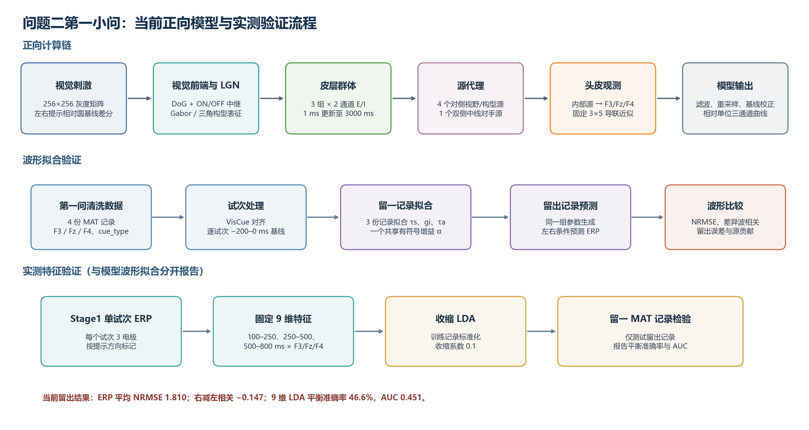

上图中的 ERP 拟合和九维特征分类是两条不同分析线：前者评价模型曲线对留出记录 ERP 的复现，后者只用实测单试次 EEG 检验固定特征的跨记录可分性。分类成绩不能替代正向模型的机制验证。

## 2. 数据、事件与刺激输入

### 2.1 实测 EEG 数据

输入为第一问清洗后的四份 MAT 记录：VisualCogA_Task-1、VisualCogA_Task-2、VisualCogB_Task-1、VisualCogB_Task-2。采样率为 128 Hz，记录包括 F3、Fz、F4、cue_type 和相对时间轴。程序依据 DataLabel 按名称提取通道，并统一排列为 F3、Fz、F4；不依赖 MAT 中原始通道的列顺序。四个文件是四份记录，不能在没有受试者元数据的情况下称作四名独立被试。

提示方向由 cue_type 标记，−1 表示左提示，+1 表示右提示。VisCue 通道的事件核对显示四份记录的提示起点中位数均为 0 ms，提示末次活动样本约为 195.313 ms，按下一采样点定义的偏移中位数为 203.125 ms，与名义持续时间 200 ms 接近。cue_type 与 VisCue 符号在有效记录中一致。Action/TgtAct 是动作或应答诊断通道，没有用来替代 cue 标签或确认目标出现时刻。

每个试次先独立减去提示前 \([-200,0)\) ms 基线，再按 cue_type 形成左右 ERP。实际记录的 Stage1 可用采样点为 0 至 796.875 ms，共 103 点；128 Hz 时间网格没有恰好落在 800 ms 的样本。

| 记录 | 左提示试次数 | 右提示试次数 | 用途 |
|---|---:|---:|---|
| VisualCogA_Task-1 | 29 | 25 | Stage1 拟合/留出及九维特征 |
| VisualCogA_Task-2 | 45 | 35 | Stage1 拟合/留出及九维特征 |
| VisualCogB_Task-1 | 41 | 42 | Stage1 拟合/留出及九维特征 |
| VisualCogB_Task-2 | 37 | 43 | Stage1 拟合/留出及九维特征 |
| 合计 | 152 | 145 | 297 个试次 |

真实 EEG 来自第一问的清洗数据；revision_v3 再按试次执行提示前基线校正。模拟信号则经与第一问相同类型的滤波、重采样和基线算子，之后再与真实记录比较。

### 2.2 刺激矩阵与事件时间

每个刺激矩阵为 256×256 灰度值。左右提示均相对同一张圆形基线逐像素相减：

$$
X_L(x,y)=\frac{I_L(x,y)-B(x,y)}{255},\qquad
X_R(x,y)=\frac{I_R(x,y)-B(x,y)}{255}.
$$

由于圆环是公共像素，它在相减后抵消。背景差为 0，三角形像素从 255 变为 140，带符号对比约为 −0.451。左右输入是严格水平镜像。Stage1 模型门控使用名义区间 \([0,200)\) ms，之后输入撤除，内部状态自然演化。

实验流程假设目标约在 2.2 s 出现，但现有事件信息不能充分确认目标布局和真实触发时刻。当前主要模型只模拟 cue，不把 2.2 s 目标强行添加为输入；该缺失上下文是模拟—实测比较的局限。Task1 双圆点只作固定参数控制，Task2 目标布局标签没有确认为相向/背向，故不纳入左右三角主拟合。

## 3. 模型模块、公式与参数

### 3.1 输入和模块接口总览

| 模块 | 输入 | 输出 | 作用 |
|---|---|---|---|
| 刺激读取与差分 | 256×256 灰度 cue、公共基线 | 256×256 带符号对比矩阵 \(X\) | 去除共同圆环，只保留提示造成的亮度变化 |
| DoG 与 LGN | \(X\)、事件门控 | 内部 128×128 ON/OFF 中继；导出的池化 ON/OFF 图为 8×8×3001 | 表示局部对比和亮暗变化极性 |
| Gabor 与构型模板 | LGN 有符号中继 | Gabor 为 4×8×8×3001；能量/构型图为 8×8×3001；左右模板响应为 3001 点 | 保留局部边缘方向和三角形空间排列 |
| 三组 E/I 群体 | 归一化的早期、构型、模板偏好输入 | 兴奋、抑制状态各为 3×2×3001 | 把静态空间线索变成有时间结构的群体活动 |
| 源代理 | E/I 状态、突触响应核 | 五个源，5×3001 | 把群体状态转成五个可映射的等效活动源 |
| 头皮观测 | 五源、固定导联矩阵 | F3/Fz/F4 相对电位，3×3001 | 计算内部源在头皮电极上的相对投影 |
| 观测处理 | 完整自然模拟曲线 | 完整 epoch 重采样为 3×512，分析窗裁剪为 3×103 | 对齐滤波、重采样和逐通道基线口径 |
| 拟合与验证 | 训练记录 ERP、留出记录 ERP | 拟合参数、ERP 误差、固定特征分类结果 | 分别检查曲线复现与实测特征可分性 |

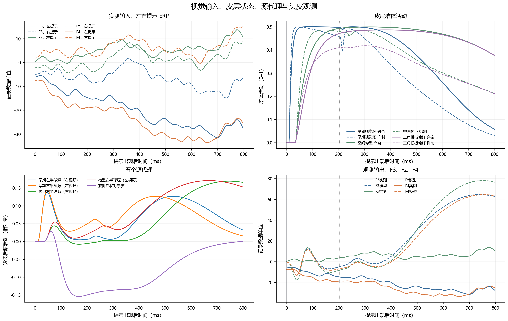

这张模块追踪图以 VisualCogA_Task-1 留出折展示同一数据链：实测左右 ERP、皮层状态、五源代理和三个电极输出都来自当前五源版本。它用于解释接口和数据流，不是把该单一记录当成总体平均。

### 3.2 DoG 与 LGN ON/OFF 中继

原始矩阵先面积缩放至 128×128。DoG 在该网格上的中心和周围高斯标准差分别为 1.5 与 4 像素，对应原始 256 网格的 3 与 8 像素。定义带符号中心—周围响应：

$$
D_t=G_{\sigma_c}*X_t-G_{\sigma_s}*X_t,\qquad
\sigma_c=1.5,\quad \sigma_s=4.
$$

当前 Stage1 输入是单一 cue 增量，故 \(X_t=X\)（提示显示期间），提示撤除后 \(X_t=0\)。LGN 另有一阶适应状态 \(A_t\)，适应时间常数 \(\tau_a\) 在拟合中从 40、60、80、100、120、140、160 ms 的离散网格选择：

$$
A_{t+\Delta t}=A_t+\frac{\Delta t}{\tau_a}(D_t-A_t),\qquad
T_t=D_t-A_t.
$$

LGN 与皮层共用的非线性响应写为

$$
\Phi_{\beta,\theta}(z)=
\operatorname{clip}_{[0,1]}
\left(
\frac{s(\beta(z-\theta))-s(-\beta\theta)}
{1-s(-\beta\theta)}
\right),\qquad
s(z)=\frac{1}{1+e^{-z}},
$$

因而 \(\Phi_{\beta,\theta}(0)=0\)，输出范围为 \([0,1]\)。

ON 与 OFF 瞬态驱动分别为

$$
U_{\mathrm{ON}}=0.8[T_t]_++0.2[D_t]_+,\qquad
U_{\mathrm{OFF}}=0.8[-T_t]_++0.2[-D_t]_+,
$$

其中 \([z]_+=\max(z,0)\)。每类通路包含 TCR、中间神经元 IN 和 TRN 状态，所有状态从 0 初始化，时间步长为 1 ms，状态被有界于 \([0,1]\)。令 \(\Phi_{\beta,\theta}\) 为零点归零、上界为 1 的截断 logistic 激活函数，则

$$
\begin{aligned}
R^*&=\Phi_{4,0.5}(2.2U-0.9N-0.8Q),\\
N^*&=\Phi_{4,0.5}(1.2U+0.7R),\\
Q^*&=\Phi_{4,0.5}(0.9R),\\
R_{t+\Delta t}&=R_t+\frac{\Delta t}{18}(R^*-R_t),\\
N_{t+\Delta t}&=N_t+\frac{\Delta t}{12}(N^*-N_t),\\
Q_{t+\Delta t}&=Q_t+\frac{\Delta t}{25}(Q^*-Q_t).
\end{aligned}
$$

式中 \(R,N,Q\) 分别是 TCR、IN、TRN 的活动状态，三个时间常数单位为 ms；ON/OFF 两支分别计算。后续方向与构型编码使用有符号中继 \(R_{\mathrm{ON}}-R_{\mathrm{OFF}}\)，而 ON/OFF 均值和空间分布用于核查事件响应。

参数选择的目的，是用少量状态表达适应、兴奋中继和局部抑制反馈；这些系数是简化模型的固定假设，不是当前 EEG 数据独立估计出的细胞生理参数。

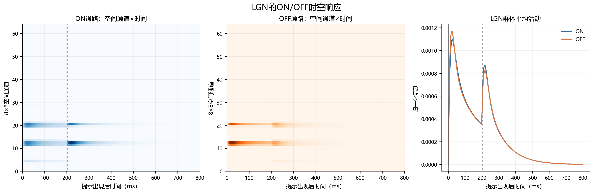

### 3.3 Gabor 方向与三角构型编码

有符号 LGN 中继图记为 \(S(x,y,t)\)。在 128×128 网格上用 0°、45°、90°、135°四个方向的偶、奇 Gabor 核卷积，复合能量为

$$
V_\theta(x,y,t)=
\sqrt{(K_\theta^{e}*S)^2+(K_\theta^{o}*S)^2}.
$$

Gabor 包络标准差 \(\sigma=2\) 像素、波长 \(\lambda=5\) 像素、纵横比 \(\gamma=0.5\)；这些是原 256 网格 \(\sigma=4,\lambda=10\) 的一致尺度换算。四方向能量合成为早期能量图

$$
B(x,y,t)=\frac{1}{2}\sqrt{\sum_{\theta}V_\theta(x,y,t)^2}.
$$

三角构型模板从标准左右 cue 的轮廓几何确定，不从 EEG 学习：每条边取三个支持点，每个顶点沿相邻边取两个角点支持；方向响应在四个方向通道间插值，边与角的对数响应作等权几何汇总，配置平滑尺度为 1 像素。左右模板图记为 \(H_L,H_R\)，其共同构型图为 \(H=H_L+H_R\)。三角中心 3×3 邻域的模板响应为 \(r_L,r_R\)，左右偏好驱动定义为

$$
d_L(t)=[r_L(t)-r_R(t)]_+,\qquad
d_R(t)=[r_R(t)-r_L(t)]_+.
$$

更具体地，若 \(v_{ij}\) 是第 \(i\) 条边第 \(j\) 个支持点的插值方向能量，\(c_{ij}\) 是第 \(i\) 个角附近第 \(j\) 个支持点的能量，则每个左右构型响应近似写成

$$
H_{\ell}(x,y,t)=
\max\!\left\{
\exp\!\left[
\frac{1}{6}\left(
\sum_{i=1}^{3}\frac{1}{3}\sum_{j=1}^{3}\log(v_{ij}+\varepsilon)
+\sum_{i=1}^{3}\frac{1}{2}\sum_{j=1}^{2}\log(c_{ij}+\varepsilon)
\right)\right]-\varepsilon,\;0\right\},
\quad \ell\in\{L,R\}.
$$

这里支持点从相应模板顶点、边缘几何偏移采样；响应核先以 1 像素标准差平滑。该构造以多处边缘和顶点同时得到响应为条件，因此比单一方向能量更能表达指定三角排列。

所以 \(L/R\) 模板通道表示偏好左/右三角模板，不代表左/右视野，更不代表左/右半球。视觉特征图以 4 ms 间隔计算并插值到 1 ms 动力学网格；方向、能量和构型空间图汇总为 8×8 网格。算法使用固定模板与共享参数，目的是保留形状边缘、方向及相对位置，避免先把镜像刺激压成一个全场总量。

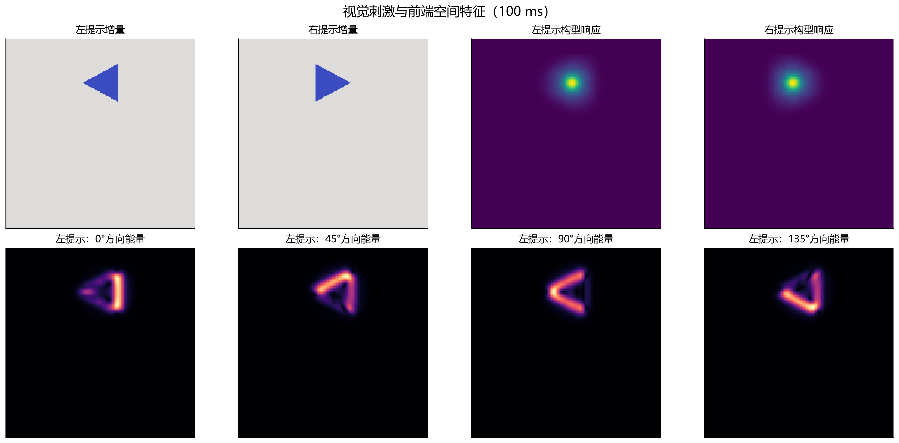

### 3.4 三组低维 Wilson–Cowan 风格 E/I 群体

前端特征投影为三组、每组两个通道的输入：

1. **早期视觉组：**\(B\) 图左、右视野半区的均值；
2. **空间构型组：**\(H\) 图左、右视野半区的均值；
3. **三角模板偏好组：**\(d_L,d_R\)，表示偏好左/右三角模板。

空间半区均值除以 \(\sqrt{2}\)，各输入通道再除以冻结的标准刺激 RMS 尺度。六个 RMS 尺度取自左右镜像标准 cue、0–200 ms、左右条件等权的视觉输入校准，不由 EEG 标签或留出记录估计。数值依次为早期左右 0.000724241/0.000724241、构型左右 0.000571402/0.000571401、模板偏好左右各 0.023274902。

令群体 \(p\in\{\mathrm{早期},\mathrm{构型},\mathrm{模板偏好}\}\)，通道 \(c\in\{L,R\}\)，兴奋与抑制活动分别为 \(E_{p,c}\)、\(I_{p,c}\)。输入电流和状态方程为

$$
\begin{aligned}
J^E_{p,c}&=w_{EE}E_{p,c}-g_iw_{EI}I_{p,c}+g_Pu_{p,c}+F^E_{p,c},\\
J^I_{p,c}&=w_{IE}E_{p,c}-w_{II}I_{p,c}+g_Qu_{p,c}+F^I_{p,c},\\
\tau^E_p\dot E_{p,c}&=-E_{p,c}+(1-E_{p,c})\Phi_{5,0.35}(J^E_{p,c}),\\
\tau^I_p\dot I_{p,c}&=-I_{p,c}+(1-I_{p,c})\Phi_{5,0.35}(J^I_{p,c}).
\end{aligned}
$$

其中 \(\Phi\) 是同类有界激活函数，所有 E/I 状态从零开始，以 1 ms 显式 Euler 更新并保持在 \([0,1]\)。固定连接参数为 \(w_{EE}=1.4,w_{EI}=1.1,w_{IE}=1.0,w_{II}=0.8,g_P=2.2,g_Q=1.2\)。早期组 \(\tau_E=18\) ms、\(\tau_I=10\) ms、视觉驱动延迟 8 ms。构型和模板偏好组 \(\tau_E=\tau_s\)、\(\tau_I=0.55\tau_s\)，前馈延迟 33 ms；\(\tau_s\) 在 20–100 ms 拟合，\(g_i\) 在 0.5–1.5 拟合。两类前馈权重固定为兴奋 0.9、抑制 0.45。

构型组按视野位置接收相应的早期视觉通道。模板偏好组的两个通道都接收同一固定双视野汇总：左、右早期活动权重各 0.5；偏好差由各自 \(d_L,d_R\) 输入编码。这样避免把“左模板偏好”错误接到“左视野活动”。早期、构型和模板偏好是模型的功能计算层级，不宣称分别对应单一解剖脑区。

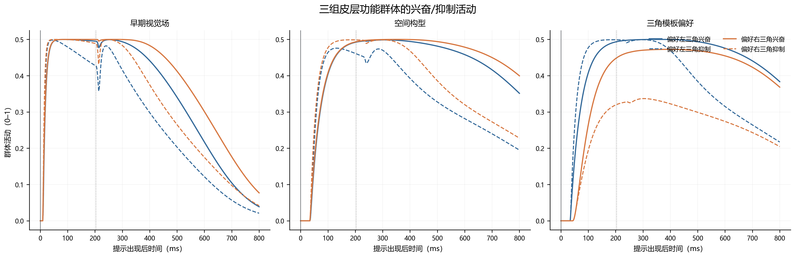

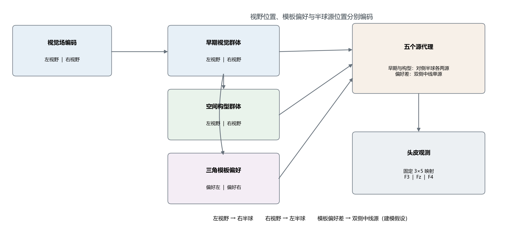

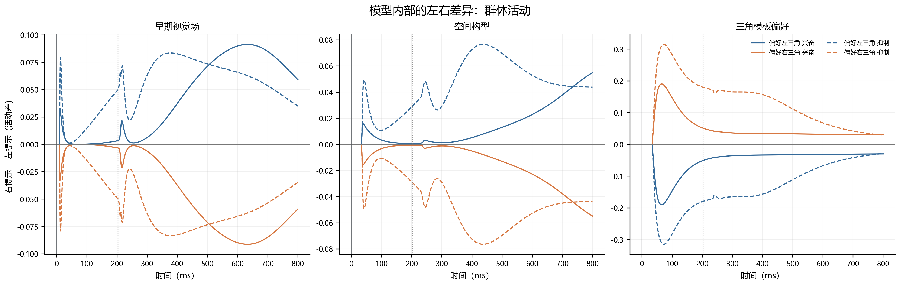

### 3.5 突触滤波与五个源代理

对每一群体通道的兴奋和抑制状态分别施加因果突触核：

$$
h_\tau(t)=\frac{t e^{-t/\tau}}{\tau^2},\quad t\ge0,
\qquad
P_{p,c}(t)=(h_{10}*E_{p,c})(t)-(h_{20}*I_{p,c})(t).
$$

离散核按采样步长归一化。\(P\) 是兴奋减抑制的相对活动代理，不是具有 A·m 单位的实测偶极矩。五个源按下列语义路由：

$$
\mathbf q(t)=
\left[
P_{\mathrm{早期},R\mathrm{视野}},
P_{\mathrm{早期},L\mathrm{视野}},
P_{\mathrm{构型},R\mathrm{视野}},
P_{\mathrm{构型},L\mathrm{视野}},
P_{\mathrm{模板偏好},L}-P_{\mathrm{模板偏好},R}
\right]^\mathsf T.
$$

前四项把视野半区按对侧关系分配给左右半球源；第五项是双侧模板偏好差的中线对手源，是明确的建模假设，不是解剖定位。左右差异图把同一折、同一参数下的右提示减左提示逐层分解；每个源的带符号电极贡献应相加回总差波。源贡献 RMS 比可能超过 1，是因为不同源会相消，不能当作可加的百分比占比。

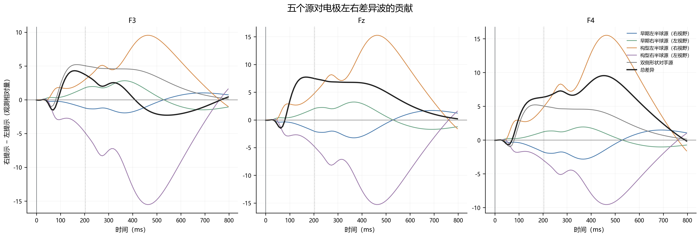

### 3.6 固定几何导联与头皮观测

源坐标是规范化坐标，单位 mm，头中心坐标系中 \(x<0\) 为左、\(x>0\) 为右。F3/Fz/F4 与双乳突参考点投影到半径 90 mm 的外表面；五个源留在内部，深度约 15.9–24.5 mm，源方向固定为头中心向外的径向方向。导体电导率取 \(\sigma=0.33\) S/m。对电极 \(e\) 和源 \(j\)，先用均匀无限导体点偶极近似计算：

| 源代理 | 规范坐标 \((x,y,z)\) mm | 半径 mm | 外表面内深度 mm |
|---|---:|---:|---:|
| 早期视觉：右视野→左半球 | \((-10,-58,45)\) | 74.09 | 15.91 |
| 早期视觉：左视野→右半球 | \((10,-58,45)\) | 74.09 | 15.91 |
| 空间构型：右视野→左半球 | \((-36,-25,50)\) | 66.49 | 23.51 |
| 空间构型：左视野→右半球 | \((36,-25,50)\) | 66.49 | 23.51 |
| 双侧模板偏好对手中线源 | \((0,-34,56)\) | 65.51 | 24.49 |

$$
L_{ej}=
\frac{\mathbf n_j^\mathsf T(\mathbf r_e-\mathbf r_j)}
{4\pi\sigma\lVert\mathbf r_e-\mathbf r_j\rVert^3}.
$$

再减去左右乳突参考场的平均值，得到 \(G_{ej}=L_{ej}-(L_{M_1j}+L_{M_2j})/2\)，最后

$$
\mathbf V(t)=\mathbf G\mathbf q(t),\qquad \mathbf G\in\mathbb R^{3\times5}.
$$

当前矩阵为

$$
\mathbf G\approx
\begin{bmatrix}
0.661&0.961&-2.688&-4.365&-0.330\\
1.101&1.101&-4.299&-4.299&-0.489\\
0.961&0.661&-4.365&-2.688&-0.330
\end{bmatrix},
$$

行依次为 F3、Fz、F4；列依次为左右早期源、左右构型源和双侧中线源。该矩阵可复算、左右对称，但不是有限球体解析解、MRI/BEM/FEM 个体导联场；真实 EEG 参考也未从采集元数据中完全核实。因为 \(\mathbf q\) 未标定为偶极矩，\(\mathbf V\) 只能称为相对模拟电位，不能标成 \(\mu V\)。

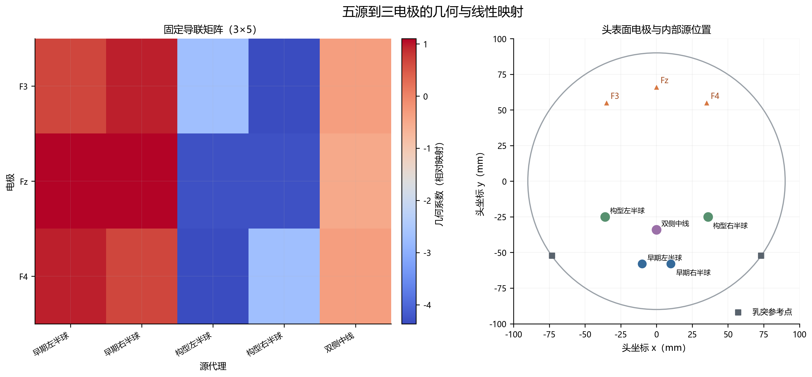

### 3.7 完整时间轴与观测算子

模型内部活动从 0 ms 连续模拟至 3000 ms。只在完整 Q1 epoch 的提示前部分补零，用于形成 \([-1,3)\) s 观测时间轴；不会在 800 ms 处截断后补零。之后对完整模拟 epoch 施加四阶 0.2–24 Hz Butterworth 零相位滤波，按 256→128 Hz 重采样，再逐通道减去 \([-200,0)\) ms 基线，最后截取 \([0,800]\) ms 的评价窗：

$$
\mathbf Y_{\mathrm{model}}=
\operatorname{crop}_{[0,800]}
\left[
\mathcal B_{[-200,0)}
\mathcal R_{128}
\mathcal F^{\mathrm{filtfilt}}_{0.2-24\,\mathrm{Hz},4}
\operatorname{embed}_{[-1,3)}(\mathbf V)
\right].
$$

800 ms 尾部审计对八个记录×提示条件比较“自然尾部保留”与“800 ms 后强制补零”两种处理。分析窗内相对 RMSE 中位数为 11.43%，均值 16.04%，范围 10.26%–31.50%。这说明零相位滤波会把 800 ms 边界处理差异带回评价窗，因此延长自然响应是必要的实现修正；它本身不表示 ERP 拟合因此变好，也没有解决 2.2 s 真实目标场景未知的问题。

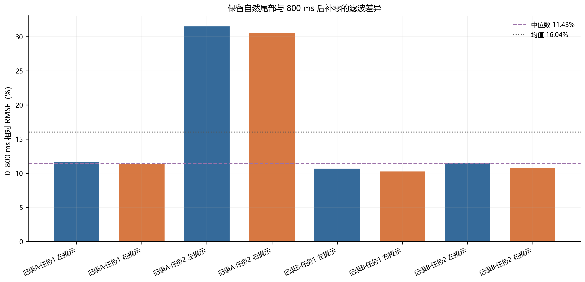

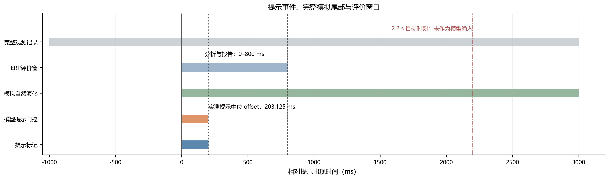

## 4. 参数拟合与验证设计

### 4.1 留一 MAT 记录拟合

波形拟合仅使用 Stage1 左右 cue 平均 ERP。每一折留出一份 MAT 记录，其余三份记录用于拟合；该折的左、右条件共用同一组 \((\tau_s,g_i,\tau_a)\)、同一个有符号增益 \(\alpha\)、同一输入尺度和同一观测算子。增益对所有训练记录、左右条件、电极和时间点共享：

$$
\alpha^*=
\frac{\sum_{r,c}\omega_r\langle \widehat Y_{r,c},Y_{r,c}\rangle}
{\sum_{r,c}\omega_r\lVert\widehat Y_{r,c}\rVert_F^2},\qquad
\mathcal L=
\sum_{r,c}\omega_r\,\operatorname{mean}
\left(Y_{r,c}-\alpha^*\widehat Y_{r,c}\right)^2.
$$

这里 \(r\) 为训练记录，\(c\) 为左/右 cue 条件；记录等权，条件等权。参数边界为 \(\tau_s\in[20,100]\) ms、\(g_i\in[0.5,1.5]\)、\(\tau_a\in[40,160]\) ms。当前运行以 \(\tau_a\) 七点网格剖面搜索，对 \(\tau_s,g_i\) 做有界 L-BFGS-B；每次局部启动最多 12 次目标评估。计算预算内保留每个剖面最好的有限候选，不把优化器失败状态改写成收敛。

| 留出记录 | \(\tau_s\) ms | \(g_i\) | \(\tau_a\) ms | 共享增益 \(\alpha\) | 优化状态 |
|---|---:|---:|---:|---:|---|
| VisualCogA_Task-1 | 78.87 | 0.786 | 100 | −63.82 | 未收敛 |
| VisualCogA_Task-2 | 76.30 | 0.629 | 120 | −34.67 | 未收敛 |
| VisualCogB_Task-1 | 76.67 | 0.909 | 120 | −60.36 | 未收敛 |
| VisualCogB_Task-2 | 75.14 | 1.096 | 160 | −56.79 | 未收敛；\(\tau_a\) 到上界 |

所有折的优化器都未报告收敛。拟合出的时间常数只能称为当前受限搜索中的候选值，不能解释为可靠识别的生理常数。负的共享增益反映源代理符号和观测尺度尚未物理校准，不解释为神经组织真实的极性反转。

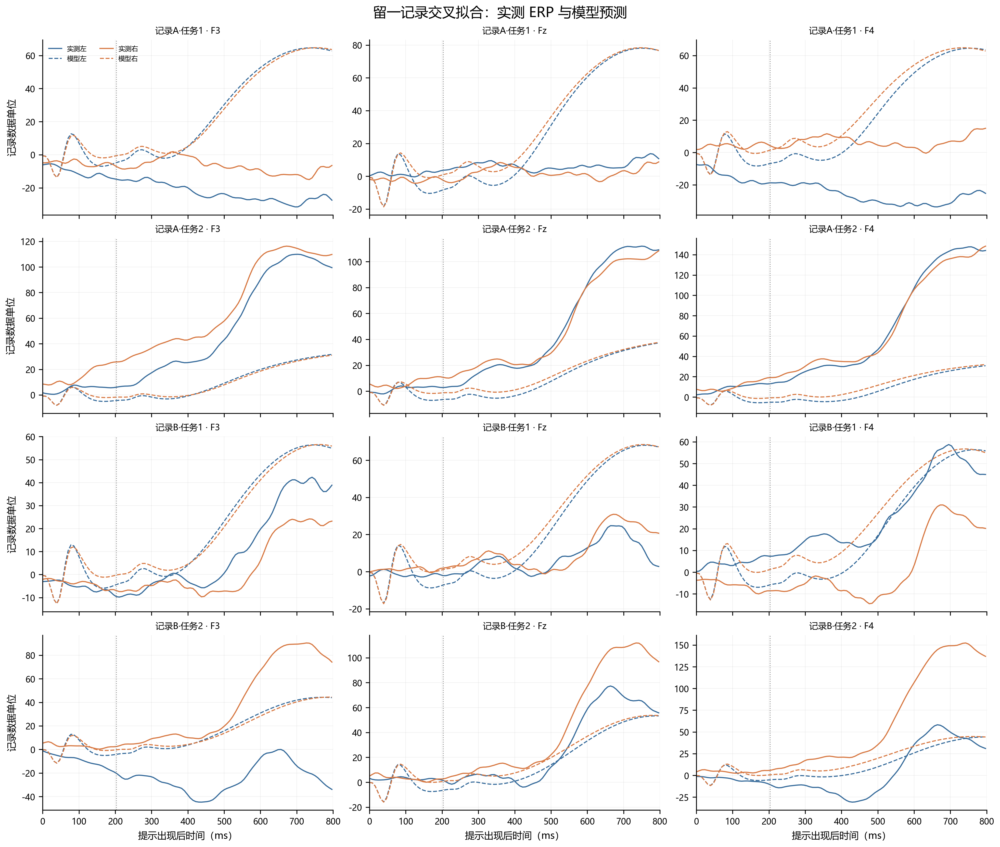

### 4.2 九维实测 ERP 特征

为了单独检查左右信息是否能从真实单试次 EEG 解码，预先固定三个半开时间窗 \([100,250)\)、\([250,500)\)、\([500,800)\) ms，分别计算 F3、Fz、F4 的窗内均值，组成九维向量

$$
\mathbf z=
[\bar y_{F3,W_1},\bar y_{Fz,W_1},\bar y_{F4,W_1},
\bar y_{F3,W_2},\bar y_{Fz,W_2},\bar y_{F4,W_2},
\bar y_{F3,W_3},\bar y_{Fz,W_3},\bar y_{F4,W_3}]^\mathsf T.
$$

使用固定收缩系数 0.1 的 LDA；特征标准化只在训练记录估计，采用留一 MAT 记录检验。该分类只输入真实 EEG，回答固定 ERP 特征能否跨记录区分提示方向；它不使用模型生成曲线，也不证明模型机制正确。

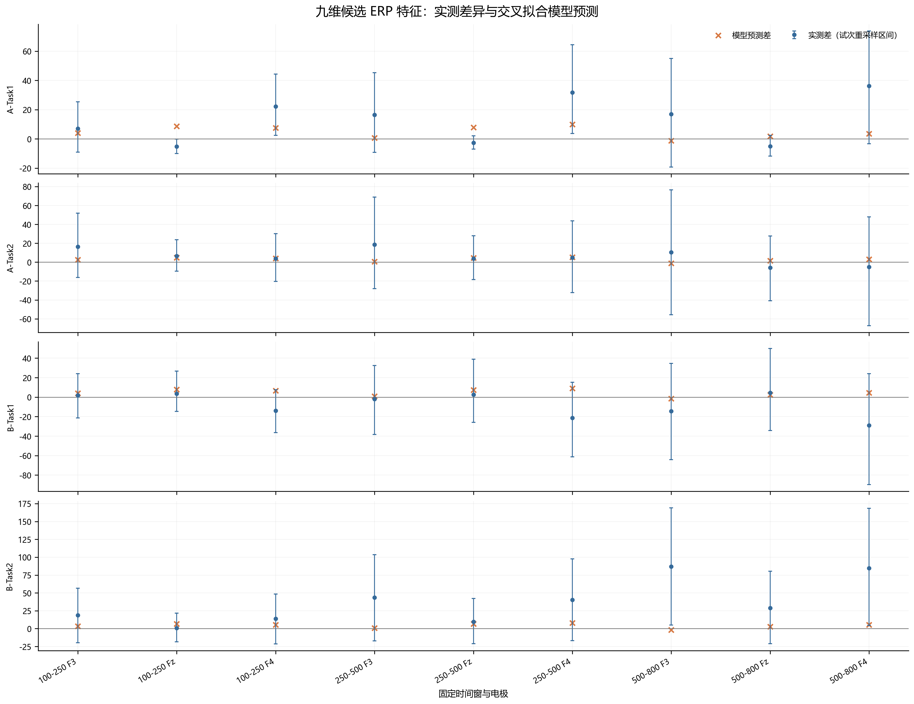

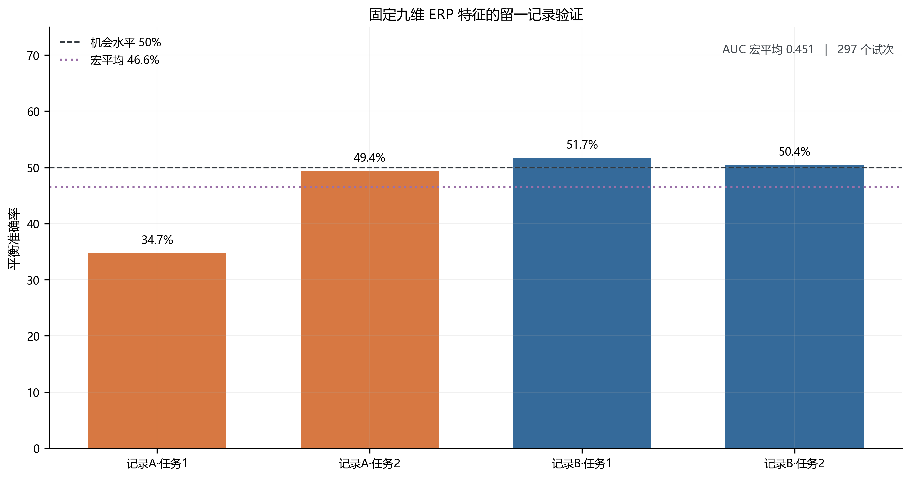

## 5. 当前结果与解释

### 5.1 模型内差异与源贡献

左右 cue 在模型中使用同一参数；右减左差异从视觉场特征开始，经过三组 E/I 群体，再经五个源代理投影到 F3/Fz/F4。去除前端空间位置后，模型左右差异 RMS 只剩完整模型的 \(1.0\times10^{-5}\) 至 \(2.7\times10^{-5}\)，说明空间位置是当前模型内部差异的主要来源。只保留 cue onset、移除约 200 ms cue offset 后，差异 RMS 是完整模型的 1.22–1.40 倍，提示在当前模型中 offset 活动部分抵消了 onset 产生的净差异。两项均是模型内部对照，不是对真实神经组织的因果证明。

源加和审计在观测滤波、重采样和基线处理后仍满足线性求和；最大相对 RMS 残差约 \(2.57\times10^{-6}\)，低于 \(10^{-5}\) 容差。源贡献图中的源 RMS 比可能超过 1，因为源间有符号相消；应结合源曲线和最终总差波阅读，不要解释成各源能量百分比。

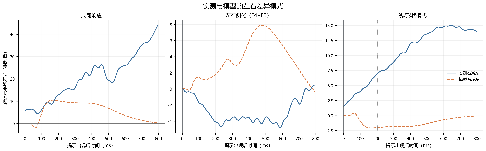

### 5.2 留出 ERP 与特征分类结果

| 留出记录 | 左/右试次数 | 左右条件平均 NRMSE | 实测与模型右减左相关 |
|---|---:|---:|---:|
| VisualCogA_Task-1 | 29/25 | 4.313 | 0.098 |
| VisualCogA_Task-2 | 45/35 | 0.788 | −0.210 |
| VisualCogB_Task-1 | 41/42 | 1.383 | −0.200 |
| VisualCogB_Task-2 | 37/43 | 0.758 | −0.276 |
| 四记录/八个条件总体 | 152/145 | **1.810** | **−0.147** |

NRMSE 按八个记录×提示条件平均，分母为该实测 ERP 的 RMS；1.810 表示整体误差规模大于实测波形 RMS。差异波相关均值为负，说明当前预测的左右差波形状没有跟上实测差波形状。尽管个别条件曲线的相关较高，跨记录结果不一致，不能只挑选某条曲线报告为普遍拟合成功。

固定九维特征的结果如下：

| 留出记录 | 留出试次数 | 平衡准确率 | AUC |
|---|---:|---:|---:|
| VisualCogA_Task-1 | 54 | 34.7% | 0.309 |
| VisualCogA_Task-2 | 80 | 49.4% | 0.488 |
| VisualCogB_Task-1 | 83 | 51.7% | 0.517 |
| VisualCogB_Task-2 | 80 | 50.4% | 0.490 |
| 记录宏平均 | 297 | **46.6%** | **0.451** |

平均平衡准确率和 AUC 均未超过 0.5，现有九维特征没有得到跨记录验证支持。模型曲线拟合差和实测特征分类弱是两项独立结果：前者检验正向预测，后者检验实测特征。两者不能相互替代。

### 5.3 应如何写结论

可写：

> 本文构建了由带符号视觉对比、LGN ON/OFF 中继、方向与构型编码、三组 E/I 群体、五个源代理及固定三通道观测映射组成的低维正向模型。模型内部消融显示，移除空间位置编码后左右预测差异接近消失，且五路源贡献经固定映射可重构三电极预测差波。留一 MAT 记录 ERP 对照的平均 NRMSE 为 1.810，右减左差异波相关均值为 −0.147；固定九维 ERP 特征的留出平衡准确率为 46.6%、AUC 为 0.451。因而本模型给出了可计算、可审计的候选形成机制，但当前结果尚未支持良好的实测波形复现或稳定跨记录左右判别。

避免写“模型准确拟合真实 ERP”“已找到稳定的左右脑电特征”“五个源定位到真实脑区”“模拟电位为微伏”或“分类接近机会水平证明左右没有脑电差异”。当前结果只能支持当前特征、数据质量、参考和模型结构下的有限判断。

## 6. 结果文件与复现入口

- 当前运行总报告：[修改3.md](../output/修改3.md)
- 参数与优化状态：[heldout_fit_summary.csv](../output/revision_v3/heldout_fit_summary.csv)
- ERP 逐条件误差：[heldout_metrics.csv](../output/revision_v3/heldout_metrics.csv)
- 左右差异波指标：[left_right_difference.csv](../output/revision_v3/left_right_difference.csv)
- 九维分类逐折结果：[heldout_9d_electrode_lda_folds.csv](../output/revision_v3/heldout_9d_electrode_lda_folds.csv)
- 特征分类汇总：[heldout_9d_electrode_lda_summary.csv](../output/revision_v3/heldout_9d_electrode_lda_summary.csv)
- 五源映射与求和核查：[source_additivity_audit.csv](../output/revision_v3/source_additivity_audit.csv)
- 当前架构代码入口：[run_v3.py](../revision_v3/run_v3.py)、[config.py](../revision_v3/config.py)、[frontend.py](../revision_v3/frontend.py)、[model.py](../revision_v3/model.py)、[head_model.py](../revision_v3/head_model.py)、[observation.py](../revision_v3/observation.py)、[fit.py](../revision_v3/fit.py)、[evidence_chain.py](../revision_v3/evidence_chain.py)

图件均为 PNG；本文没有重新生成 PDF，也没有将旧的六源或旧分类结果混入当前结论。
