# 问题二第一小问论文书写指导（revision_v3）

> 本文供论文撰写使用，依据 revision_v3 已运行模型、留出结果和本目录图件整理。图已嵌入文档，点击可查看原图文件。重点记录为 VisualCogA_Task-2、VisualCogB_Task-1、VisualCogB_Task-2；VisualCogA_Task-1 按第一问质量结论保留为低质量参考。

## 一、第一小问可以怎样作答

原题第二问第一小问要求“建立脑电图计算模型，说明从 LGN 到皮层，再到头皮观测脑电图的机理”。这首先是一个**建立并求解正向计算模型**的任务，不以真实 EEG 分类准确率超过 0.5 作为完成条件。

revision_v3 已经给出一条可运行、可计算、可逐层检查的正向链：

```text
标准化视觉刺激与事件时序
→ 中心—周围滤波及 LGN ON/OFF 中继
→ Gabor 方向与三角构型表征
→ 早期、形状、方向三组 E/I 群体动力学
→ 六个突触滤波源电流代理
→ 固定几何导联矩阵
→ F3/Fz/F4 相对脑电曲线
```

**因此，第一小问可以按“已建立并数值求解一个解释机制的脑电正向模型”来完成。** 论文需要把“模型内部存在可计算的左右差异”与“该差异已在真实头皮 EEG 中被稳定验证”分开。当前留出波形拟合和跨记录判别表现有限，影响的是模型的实测验证强度，不会抹去这条显式模型链本身；也不能把模型写成已经确认的人体生理真值。

建议把核心结论写成：

> 本文建立了从 LGN ON/OFF 视觉中继、皮层功能群体动力学、源电流代理到 F3/Fz/F4 头皮观测的低维正向计算模型。模型揭示，左右三角刺激的主要可计算差异来自位置与方向的空间组合：全场汇总响应可以近似相同，但空间化 Gabor/构型图在镜像位置上重新排列；在模型内部去除空间位置后，左右输出差异几乎消失。留出 EEG 对照则表明，当前参数化和几何导联假设尚不能稳定复现实测差异。因此，本模型完成了第一小问所要求的机制化计算表示，同时将其经验适用范围限定在现有证据之内。

## 二、需要写清的规律

### 2.1 原始刺激图像与圆形基线的像素级处理

Stage1 的原始输入不是孤立的三角形：左右 cue 都是在共同的圆形基线上叠加三角提示。令原始左、右 cue 灰度矩阵为 \(I_L,I_R\)，共同圆形基线为 \(B\)，每张图像大小为 \(256\times256\)。V3 前端先按像素计算带符号对比度：

\[
X_L=\frac{I_L-B}{255},\qquad X_R=\frac{I_R-B}{255}.
\]

这是图像矩阵逐像素相减，不是把圆形变成某个特征向量后再从特征中扣除。圆形边缘在 cue 图和基线图中完全相同，所以相减后为零；三角区域由基线灰度 255 变为 cue 灰度 140，留下 \((140-255)/255\approx-0.451\) 的负向亮度变化。因此图1上排显示的“单三角”是实际送入视觉前端的基线差分图；图2左列显示含圆的原始 cue，右侧方向图显示由差分输入继续计算出的 Gabor 响应。

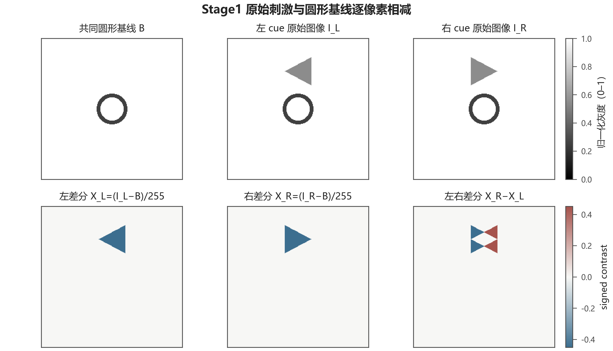

图中上排依次是共同圆形基线、左 cue 原图和右 cue 原图，采用灰度表示归一化图像亮度；下排是左/右 signed contrast 与左右差分，采用蓝—白—红发散色表示符号和方向：蓝色为负值（相对基线变暗），红色为正值（相对基线变亮）。可见共同圆形部分被抵消，而左右差异保留为镜像位置上的三角变化。这个步骤让模型不把共同背景圆当作左右判别线索。

### 2.2 左右差异是空间重排，不必是全场总量差

标准左右 cue 在输入矩阵中互为水平镜像。若以 (X_L(x,y)) 表示左 cue，则右 cue 满足：

\[
X_R(x,y)=X_L(W-1-x,y),
\]

其中 (W) 是图像宽度。对称视觉算子作用后，左右响应的总体能量可以接近一致，而局部位置/方向响应按镜像关系重排。水平镜像下 0°、90°通道保持，45°与135°通道交换；因此只比较全局均值会压掉最有解释力的空间排列信息。

图1上排显示的是 V3 的实际视觉计算输入：原始 cue 图像逐像素减去共同的圆形基线后得到的 signed contrast，不是原始展示帧。原始 cue 确实含有圆形基线和三角提示；由于两者中的圆完全相同，逐像素相减后圆形部分抵消，只留下三角形区域的亮度变化。图2第一列改为显示含圆形基线的原始 cue，后四列 Gabor 响应仍由 `cue − 圆形基线` 产生。三角形位于图像上方；左、右刺激分别朝左、朝右。

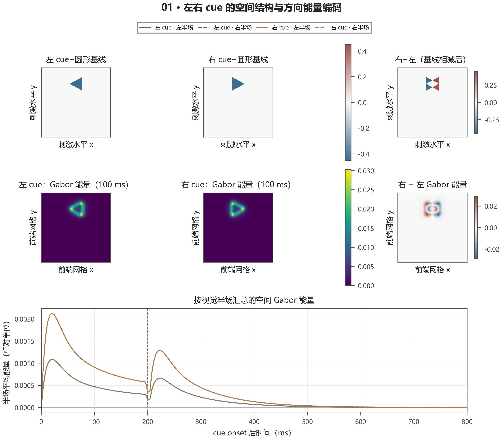

再用方向响应总览、左右差异图和4×4空间汇总图说明该规律。三张图的数值来自 V3 前端，不是旧版直接对刺激图像计算的原始 Gabor 数值。

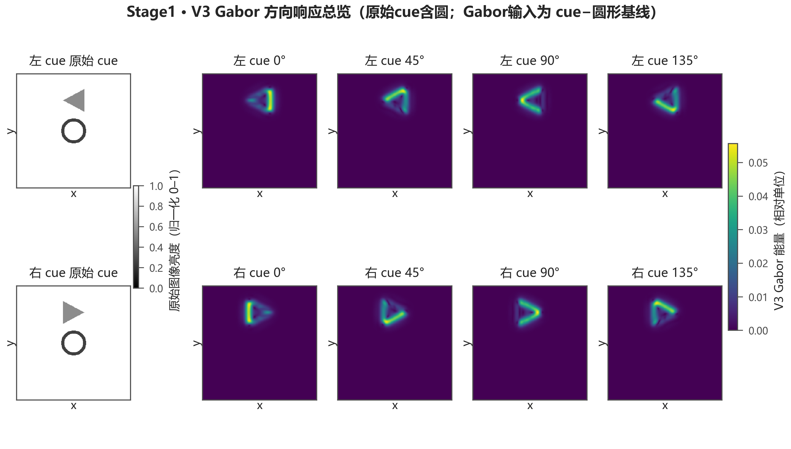

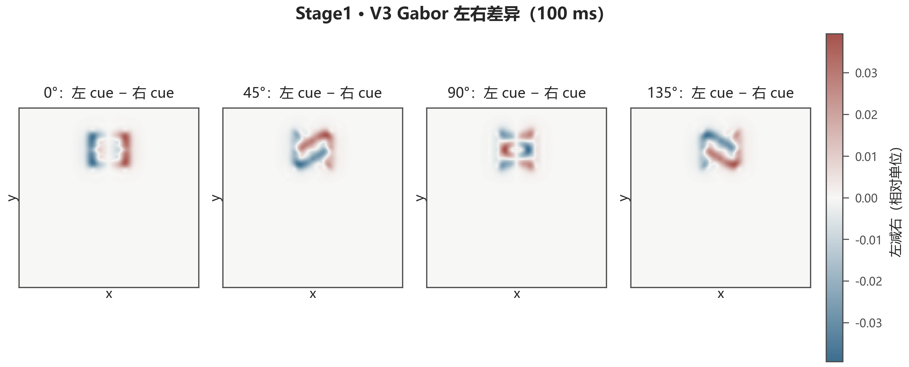


**空间热图的数值不要与最初的同名热图直接比较。** 最初的 `01_gabor_frontend.py` 对正的刺激对比度直接做 Gabor；V3 则先经过 DoG、具有非线性激活和适应的 LGN ON/OFF 中继，再在128×128网格计算 Gabor 并汇总为4×4。因此响应单位和动态范围不同。同一位置的例子中，最初左 cue 0° R1C3 为0.1784，V3 为0.00484；R2C3 分别为0.1271和0.00354。差距约为36倍，其他格约为21倍。它不是统一少乘一个固定比例，不能把 V3 数值乘10或36来“对齐”。论文应写“V3 经 LGN 中继后的 Gabor 相对响应”，并只在同一计算口径内解释其空间分布。原始直接 Gabor 图可作为历史基线：[旧版空间响应热图](../output/01_gabor_frontend/Task1/Stage1/stage1_Gabor空间响应热图.png)。

### 2.3 LGN整体 ON/OFF 响应近似相同，空间分布保留镜像

DoG 与 LGN ON/OFF 动态先提取局部亮度变化及其极性，再将中继活动传入后续视觉表征。左右刺激互为镜像时，LGN总体均值曲线基本重合；空间位置图仍呈镜像排列。这说明“汇总响应接近”不等同于“局部空间表征相同”。

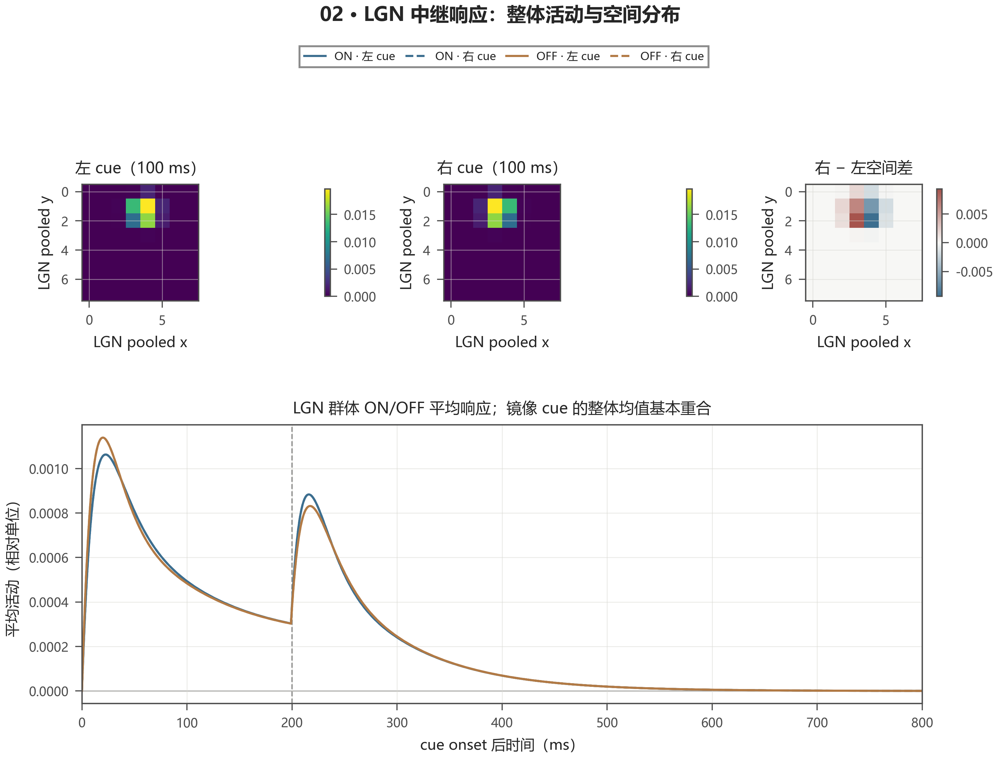

### 2.4 皮层功能群体把空间线索转为随时间变化的群体活动

V3 将早期视觉驱动、形状构型和方向对向表征送入三组低维 E/I 群体。其动力学可概括为：

\[
\tau_E\dot E=-E+(1-E)\,\Phi(I_E),\qquad
\tau_I\dot I=-I+(1-I)\,\Phi(I_I),
\]

其中 (E,I\in[0,1]) 分别表示兴奋与抑制群体活动；(I_E,I_I) 包含组内耦合、视觉驱动及固定延迟的前馈输入；\(\Phi\) 为有界非线性激活函数。模型中早期组与后续形状/方向组采用不同时间尺度，前馈延迟使同一空间差异可发展为有时间结构的群体响应。

下图中功能群体名称用于表达模型计算角色，不能直接等同于真实 V1、IT 或 PFC 的实测神经活动。

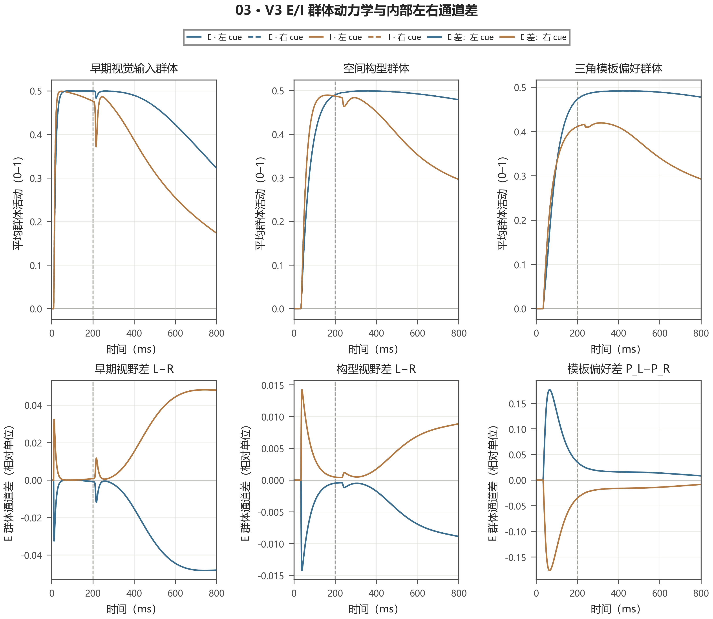

### 2.5 源代理经观测矩阵得到头皮通道预测

E/I 活动经固定的兴奋、抑制突触核滤波后，形成六个源电流代理 (q(t))。头皮观测写成：

\[
\hat y(t)=Gq(t),\qquad
\hat y(t)=[\hat y_{F3}(t),\hat y_{Fz}(t),\hat y_{F4}(t)]^T,
\]

其中 (G\) 是3×6的固定几何近似导联矩阵。该矩阵使用规范电极/源位置、均匀导体和假定双乳突平均参考；它是可复现的观测示意，不是个体 MRI 头模型，也未校准为微伏。之后模型曲线再经过与第一问一致的滤波、重采样和刺激前基线处理。

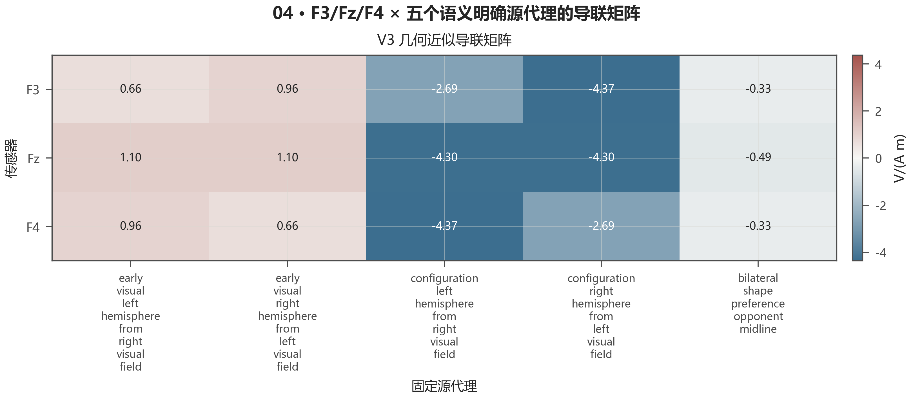

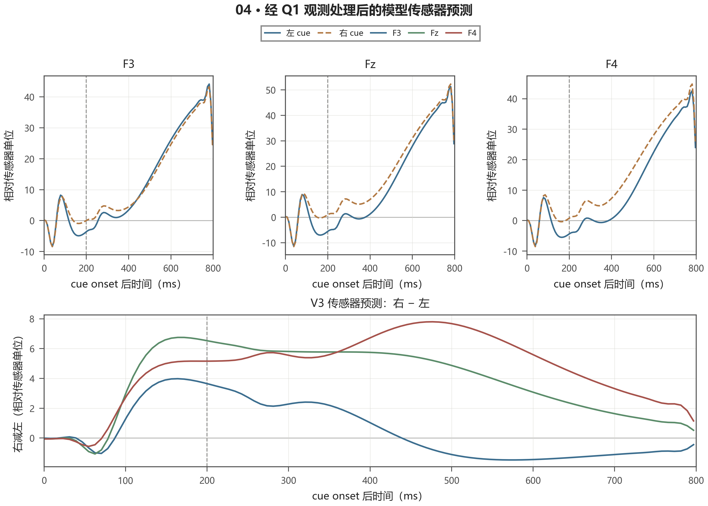

## 三、模型内部规律与真实 EEG 验证要分层报告

### 3.1 模型内部的机制对照支持“空间排列驱动”

固定每折参数和增益，仅移除视觉前端的位置编码后，模型左右差异只保留完整模型的 **0.000003–0.000008**；也就是模型生成的差异几乎全部依赖其位置化输入。作为另一个控制，删除200 ms cue offset 后，左右差异变为完整模型的 **1.24–1.29倍**，说明在当前模型中 offset 对净差异有部分抵消作用。这些是**模型内部消融结果**，支持“该模型为何区分左右”，不能写成真实脑组织中已完成因果验证。

### 3.2 留出真实 EEG 显示当前观测模型仍有限

revision_v3 按 MAT 记录留出，真实 EEG 的左右条件均值与各折预测比较如下。三个重点记录优先讨论，VisualCogA_Task-1 保留为低质量参考。

| 记录 | 左/右试次数 | 左右差异波相关 | 左右差异波NRMSE | 实测差异的侧化能量比例 |
|---|---:|---:|---:|---:|
| VisualCogA_Task-2 | 45/35 | 0.530 | 0.895 | 0.345 |
| VisualCogB_Task-1 | 41/42 | 0.439 | 1.031 | 0.208 |
| VisualCogB_Task-2 | 37/43 | 0.038 | 1.013 | 0.0008 |
| VisualCogA_Task-1（低质量参考） | 29/25 | −0.314 | 1.382 | 0.117 |

四条记录的左右条件留出 ERP 平均 NRMSE 为 **1.802**，右减左波形相关平均为 **0.173**。模型差异的侧化模态能量比例接近 **1.000**，但实测记录均值约 **0.168**，且各记录差异较大。由此可见，V3 给出了明确的机制预测，但当前对称源/导联假设把差异过度压到侧化模式，不能充分复现实测空间结构。


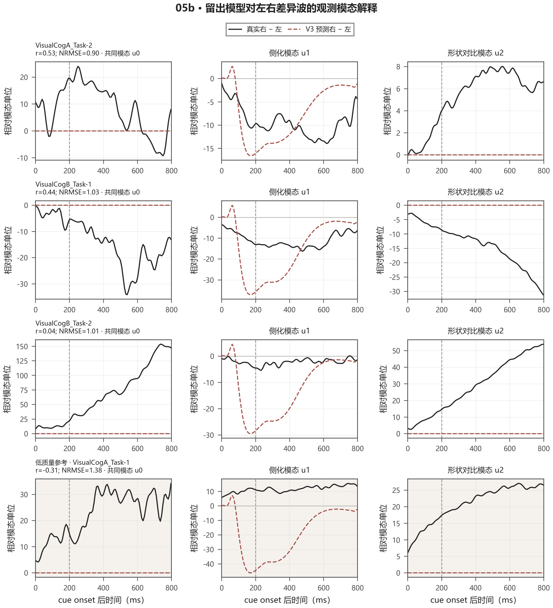

仅用真实 EEG 特征的留一 MAT shrinkage-LDA 平衡准确率为 **0.453**、AUC 为 **0.421**。这项分析回答的是当前观测特征能否跨记录分类，不是第一小问“能否建立计算模型”的判定门槛。论文可以据实报告分类证据较弱，不能将模拟内部可分性写成真实 EEG 已经可解码。

### 3.3 参数和模型范围

四折拟合的 \(\tau_s\) 候选都达到100 ms搜索上界，且优化器均未收敛。因此它们只能称为**当前搜索范围内的边界候选值**，不能称作数据识别出的生理时间常数。V3 使用单一共享有符号增益；其符号也不能直接解释为真实偶极的生理反相。

V3 当前拟合对象是 Stage1 左右 cue 条件 ERP；它不是直接以每个单试次的波形拟合模型参数。真实单试次特征分类另行报告。当前 cue-only 模型没有生成2.2 s目标事件，而第一问对完整试次做零相位滤波；所以模型和实测虽使用同类滤波与基线算子，事件上下文仍不完全一致。四个 MAT 是记录，独立被试数量未确认。以上限制应放入讨论，不妨碍在第一小问中展示正向建模链，但限制了对拟合优劣和生理参数的解释。

## 四、可直接改写进论文的正文草稿

### 4.1 模型建立

为建立视觉刺激至头皮脑电的可计算联系，本文采用低维前向建模框架。首先以刺激相对基线的带符号亮度变化作为输入，经过中心—周围空间滤波、适应状态和 LGN ON/OFF 中继，保留刺激出现位置与亮暗极性。随后在中继活动上计算四个方向的 Gabor 能量，并通过边缘、顶点及相对位置模板形成形状和方向对向特征。该表示避免将三角形过早压缩为单一全场能量。

左右提示图为水平镜像。模型前端因此生成镜像排列的空间响应：整体汇总能量可近似相等，但局部 Gabor 和构型响应落在相对侧的网格位置，且45°与135°方向通道按镜像关系交换。左右信息在模型中表现为**空间编码的重排**，而不是预先假设某一侧具有更大的总响应。

### 4.2 群体动力学及头皮映射

空间化早期视觉、形状和方向对向驱动分别进入低维兴奋—抑制群体。群体状态由有界非线性动力学演化，并通过固定延迟的前馈输入和突触响应核形成时间变化的源电流代理。六个源代理再由固定3×6几何近似矩阵映射至 F3、Fz、F4；预测曲线统一经滤波、重采样和刺激前基线处理，以便与第一问的观测数据比较。至此，刺激空间结构、群体响应与三通道头皮观测之间建立了明确的计算映射。

### 4.3 机制结果与适用范围

位置消融使模型左右差异仅保留约 \(3\times10^{-6}\) 至 \(8\times10^{-6}\)，表明**在该模型内部**，左右输出由空间排列编码产生。留出记录对照则显示，差异波相关和幅度并未稳定复现：三条重点记录的右减左相关分别为0.530、0.439和0.038，四记录平均 ERP NRMSE 为1.802；真实特征的跨记录 LDA 平衡准确率和 AUC 分别为0.453和0.421。故本文将第一小问的结论限定为“已建立并数值求解一个可检验的 LGN—皮层群体—头皮观测机制模型”，不进一步声称当前参数或导联结构已被真实 EEG 唯一识别。

## 五、结果图的论文放置建议

| 图 | 放置位置 | 正文要点 |
|---|---|---|
| 图1–4 | 模型建立：视觉前端 | 镜像刺激的空间—方向响应关系；图3展示左右差异，图4展示空间网格数值 |
| 图5 | 模型建立：LGN | 总体 ON/OFF 活动与空间分布分别讨论 |
| 图6 | 模型建立：皮层功能群体 | 说明 E/I 时间动力学与内部通道差，不将模型群体等同解剖实测脑区 |
| 图7–8 | 模型建立：源到传感器映射 | 交代固定矩阵的结构、单位和假设，再展示相对传感器曲线 |
| 图9–10 | 求解结果与验证讨论 | 重点比较三个高质量记录，同时保留A_Task-1低质量参考；如实讨论跨记录不一致 |

图件原始版本（PDF/SVG/PNG）和逐图说明见 `../output/revision_v3_paper_figures/FIGURE_GUIDE.md`。论文中的简洁主图可选择图1、图5、图6、图7/8、图9/10，其余视觉前端细节放附录；本指导报告为核对起见已嵌入全部10张图。

## 六、表述边界

**建议写：**

- “建立了从 LGN ON/OFF 中继到皮层功能群体、源代理及 F3/Fz/F4 的显式正向模型。”
- “模型内部的左右条件差异依赖位置化的空间—方向表征。”
- “留出实测比较揭示了当前观测映射与真实 EEG 模式之间的差距。”
- “第一小问的模型构建与数值求解已完成；经验验证仍受当前观测假设、事件上下文及拟合边界限制。”

**不要写：**

- “真实 EEG 已稳定区分左右 cue”或“跨记录分类有效”。
- “模型准确拟合了生理 ERP”或“\(\tau_s=100\) ms 是真实神经时间常数”。
- “六个源代理定位到六个真实脑区”或“导联矩阵输出具有微伏物理标定”。
- “V3 Gabor 数值与最初直接 Gabor 热图可按比例直接比较”。
- 将四个 MAT 记录称作四名独立被试，或声称当前 V3 已建模2.2 s目标事件。

## 七、结果追溯

- 图件与逐图口径：`../output/revision_v3_paper_figures/FIGURE_GUIDE.md`、`figure_registry.json`、`figure_audit_report.json`。
- 留出 ERP 指标：`../output/revision_v3/heldout_metrics.csv`、`left_right_difference.csv`。
- 真实特征分类：`../output/revision_v3/fixed_feature_lda.csv`。
- 模型内部位置/offset 对照：`../output/revision_v3/mechanism_controls.csv`。
- 参数边界与折信息：`../output/revision_v3/heldout_fit_summary.csv`、`manifest.json`。
- 可复现模型入口：`../revision_v3/run_v3.py`；图件生成入口：`../revision_v3/make_step_figures.py`。

## 八、前期局部特征探索：候选电极与时间窗

前五步完成了视觉输入标准化、LGN/皮层正向计算、源到电极观测映射以及真实 EEG 对照。随后对真实 Stage1 EEG 搜索单电极局部振幅特征，得到四份记录各自的候选电极与时间窗。本节保留这组**全试次探索结果**，用于说明后续候选窗口从何而来；由于电极、窗口、方向和阈值均在同一批试次上搜索并评分，表中准确率是样本内探索值，**不是本文最终采用的预测准确率**。最终判别方案及其结果见第九节。

每个试次先减去提示前 \([-200,0)\) ms 基线；随后只在提示出现后的 \([0,800)\) ms 内搜索。对 F3、Fz、F4 分别计算 25–200 ms 滑动窗中的单试次平均振幅 \(z_{e,w}\)，并为每份记录选择一个电极 \(e\)、窗口 \(w\) 和阈值 \(\theta\)。判别形式为：

\[
\hat c =
\begin{cases}
\text{右提示}, & s(z_{e,w}-\theta)>0,\\
\text{左提示}, & \text{otherwise},
\end{cases}
\]

其中方向 \(s\in\{-1,+1\}\) 和阈值由该记录的全部试次选择，以最大化训练内平衡准确率。该读出只有一个 EEG 特征和一个阈值，适合解释“哪条观测通道、哪个时间片的振幅对左右标签最有区分力”。

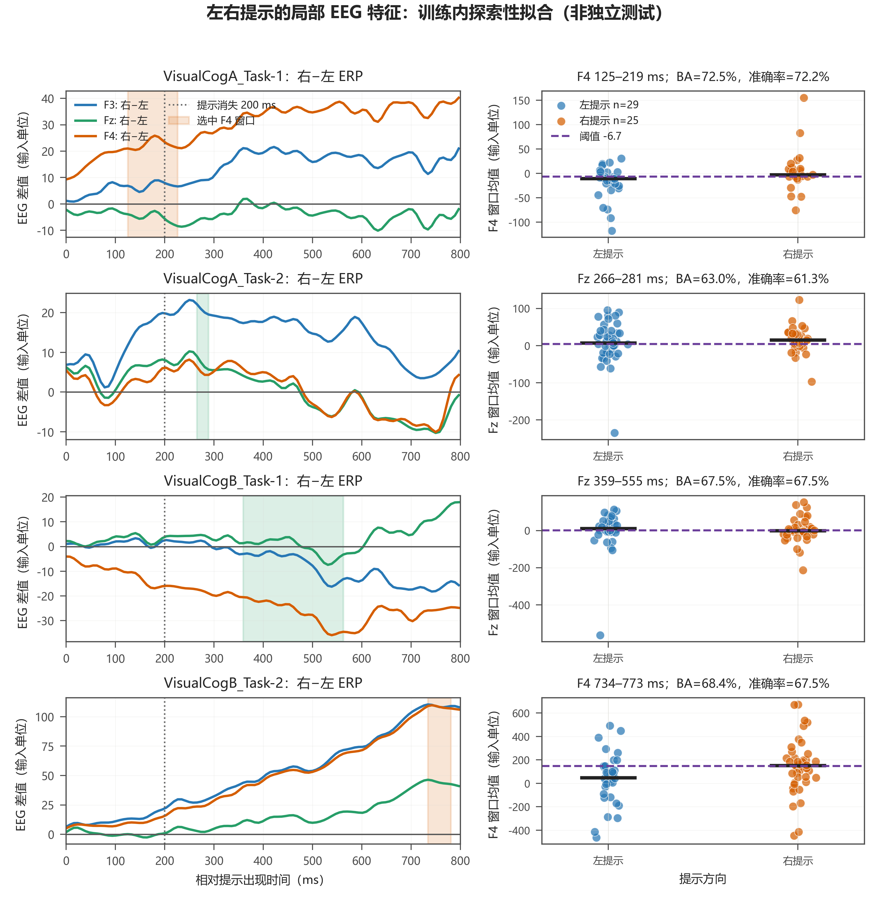

**图11说明。** 左列为四份记录中 0–800 ms 的右减左 ERP 差波形，阴影标出该记录选出的电极与时间窗；右列为该窗口的单试次特征分布，虚线为训练内选出的阈值。各面板标题报告训练内平衡准确率与普通准确率。图中的 EEG 数值沿用第一问数据单位，未标定为 \(\mu V\)。

| 记录 | 最佳电极与窗口 | 试次数（左/右） | 正确数 | 训练内准确率 | 训练内平衡准确率 |
|---|---|---:|---:|---:|---:|
| VisualCogA_Task-1 | F4，125.0–218.8 ms | 29/25 | 39/54 | 72.2% | 72.5% |
| VisualCogA_Task-2 | Fz，265.6–281.3 ms | 45/35 | 49/80 | 61.3% | 63.0% |
| VisualCogB_Task-1 | Fz，359.4–554.7 ms | 41/42 | 56/83 | 67.5% | 67.5% |
| VisualCogB_Task-2 | F4，734.4–773.4 ms | 37/43 | 54/80 | 67.5% | 68.4% |
| 四记录宏平均 | 每份记录分别选取 | — | — | **67.1%** | **67.9%** |

这组结果表明，候选左右信息可能集中在局部时间段，且最佳电极和时间位置因记录而异。它用于确定后续记录特异的候选窗口，不单独作为分类性能结论，也不据此宣称已发现跨记录统一的电极—时间机制。

本节的准确率是在同一批试次上搜索电极、窗口、方向、阈值并评分所得，只用于探索候选特征；不能写成留出测试准确率或跨记录泛化性能。最终判别采用训练折 ERP 模板并在留出时间块上分类，但仍沿用本节从全试次探索得到的候选窗口，具体口径见第九节。

本结果的复现文件为 [局部特征分析脚本](../14_exploratory_local_window_decoder.py)、[逐记录结果表](../output/14_exploratory_local_window_decoder/局部时间窗最佳训练内结果.csv) 和 [图11生成元数据](../output/revision_v3_paper_figures/左右提示局部特征_探索性拟合.figure.json)。正式插图可使用 [PNG](../output/revision_v3_paper_figures/左右提示局部特征_探索性拟合.png)、[PDF](../output/revision_v3_paper_figures/左右提示局部特征_探索性拟合.pdf) 或 [SVG](../output/revision_v3_paper_figures/左右提示局部特征_探索性拟合.svg)。

## 九、最终左右判别结果：记录特异局部 ERP 残差模板

在不要求四份记录共享同一电极或同一时间窗的设定下，对每份记录分别使用其候选电极与窗口。每折只用训练时间块计算左右两类 ERP 模板；对留出试次计算左右模板的平均绝对误差，误差较小的一类作为预测标签。形式上，令 \(Y_i\) 为留出试次在该局部区域的曲线，\(\bar Y_{c}^{(train)}\) 为训练折中类别 \(c\) 的 ERP 模板，则

\[
\hat c_i=\arg\min_{c\in\{L,R\}}\frac{1}{|W|}\sum_{t\in W}\left|Y_i(t)-\bar Y_{c}^{(train)}(t)\right|.
\]

实现时也计算了相对于 revision_v3 模型曲线的残差距离。由于同一候选类别模型曲线同时从留出试次和该类别训练模板中扣除，两者在差值中代数抵消；因此实际判别等价于上述训练 ERP 模板匹配。论文应把正向模型作为机制模型单独说明，把此处结果称为模型分析之后的**记录内 EEG 特征读出**，不写成模型曲线单独完成了单试次预测。

| 记录 | 候选电极与窗口（ms） | 区域采样点 | 留出试次正确数 | 准确率 | 平衡准确率 |
|---|---|---:|---:|---:|---:|
| VisualCogA_Task-1 | F4，125.0–226.6 | 13 | 33/54 | 61.1% | 61.3% |
| VisualCogA_Task-2 | Fz，265.6–289.1 | 3 | 45/80 | 56.3% | 56.7% |
| VisualCogB_Task-1 | Fz，359.4–562.5 | 26 | 31/83 | 37.3% | 37.3% |
| VisualCogB_Task-2 | F4，734.4–781.3 | 6 | 52/80 | 65.0% | 65.0% |
| 合并试次 | 各记录使用各自候选区域 | — | **161/297** | **54.2%** | — |
| 四记录平衡准确率宏平均 | 各记录等权 | — | — | — | **55.1%** |

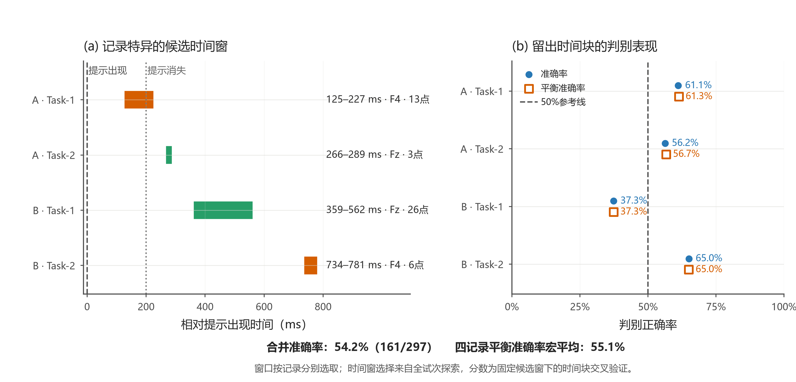

**图12说明。** (a) 横条表示每份记录所用的候选电极与时间窗，虚线标出提示出现和提示消失；横条旁标出该局部窗包含的时间采样点数。(b) 实心圆为准确率，空心方块为平衡准确率，竖虚线为 50% 参考线。图下方分别列出按试次数合并的准确率和四记录等权的平衡准确率宏平均。

合并准确率按 (161/297) 计算；平衡准确率宏平均为四份记录平衡准确率的算术平均。记录间表现不一致，因此54.2%表示在当前四份记录与当前记录特异读出方案下获得的合并判别结果，不代表一个可直接迁移到新记录的统一分类器。候选电极与窗口来自第八节的全试次探索，五折时间块只将左右 ERP 模板的估计限制在训练折；因此这里的准确率应按“固定探索窗口下的时间块交叉验证结果”报告，不称为完全独立的端到端测试结果。

需要区分另一种读出：若每个试次都在四份记录的四个区域模板之间竞争，并按区域长度加权选择最高相似度，输出是 **50.2%**，不是本节的54.2%。54.2%的口径是先根据已知记录选用该记录对应的电极与窗口，再在该记录内判别左右。

**可直接作为本小问的综合结论：**本文建立了从视觉输入、LGN ON/OFF 中继、皮层群体动力学到 F3/Fz/F4 观测的低维正向模型，并以空间位置—方向构型编码解释模型内部左右差异的来源。在真实 EEG 读出中，进一步采用记录特异的局部电极—时间窗与左右 ERP 模板，以留出时间块的平均绝对误差判别左右提示；四份记录合并正确率为 **54.2%（161/297）**，四记录平衡准确率宏平均为 **55.1%**。这给出了可计算的左右特征和明确的预测规则；分类表现按记录报告，正向机制解释与实测读出结果分别陈述。

复现文件：[残差模板匹配脚本](../17_residual_template_match.py)、[逐记录及合并汇总](../output/revision_v3/17_residual_template_match/summary.csv)、[逐试次预测明细](../output/revision_v3/17_residual_template_match/trial_scores.csv)、[图12绘图脚本](../18_plot_residual_template_summary.py)。图12文件：[PNG](../output/revision_v3/17_residual_template_match/record_specific_decoding.png)、[PDF](../output/revision_v3/17_residual_template_match/record_specific_decoding.pdf)、[SVG](../output/revision_v3/17_residual_template_match/record_specific_decoding.svg)。
