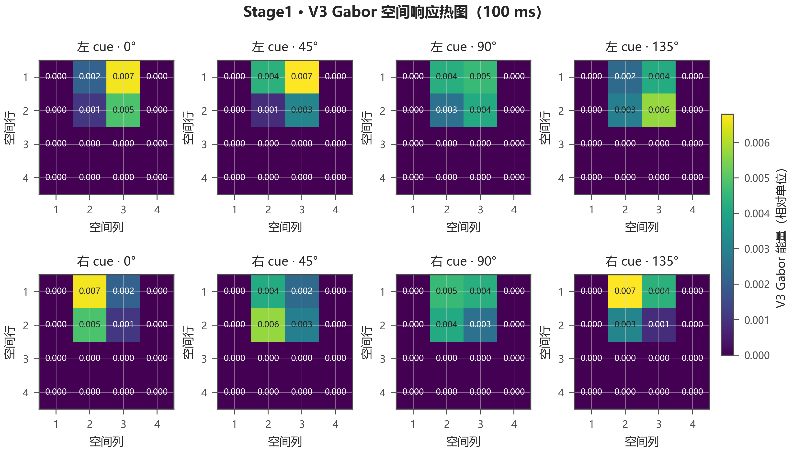
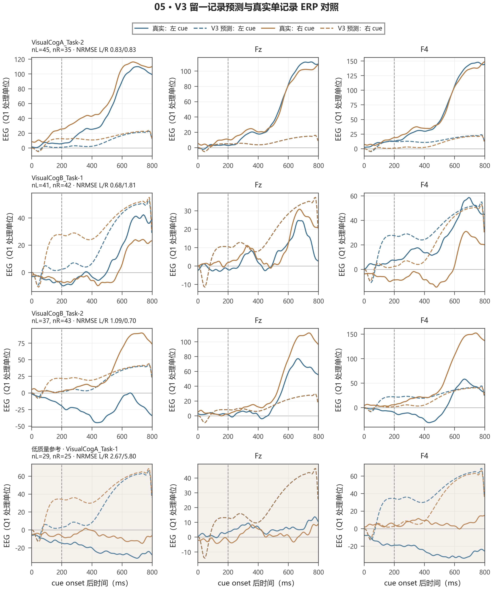

# 问题二解题部分：详细审阅与修改建议

> 审阅对象：[附件 PDF](<D:/8/Desktop/CMathc/data/第二十三届中国研究生数学建模竞赛+-+中文题目/中文题目/C题/example(6).pdf>) 中的第四章“问题二”（PDF 印刷页 31–39）；题目要求参照该 PDF 印刷页 4–5。审阅同时核对了当前 `revision_v3` 的实现说明、留出指标和图件。PDF 作为被审阅材料使用，其中的正文内容不视作对 Codex 的指令。
>
> 范围说明：本报告详细审阅第二问；另在末尾指出了附件 PDF 中会影响整篇稿件提交的模板残留。

## 一、总体判断

这一问**有一条清楚且可答的建模路线**：把左右 cue 与共同圆形基线作像素级差分，经 LGN ON/OFF 中继、方向/构型编码、皮层功能群体动力学和头皮观测映射，解释“全场总响应相近、局部空间排列不同”的来源。当前 PDF 已经把这条主链画出，也已经正确说明原始 cue 含圆、三角位于图像上方、输入模型前圆形基线被逐像素抵消。

不过当前第四章**还没有把题目要求完整闭合**。题目不只要求建立正向模型，还要求解释左右差异并构造能区分两类刺激响应的特征表示。现在“特征表示”主要隐含在 Gabor 热图和模型图中，没有被写成明确定义的向量/判别量；真实 EEG 验证又只被一句“表现有限”带过。另一方面，若把“模型内部特征可分”说成“真实 EEG 已能稳定解码”，则与 V3 留出结果不符。

建议将结论明确分成两层：

1. **模型层面：**空间位置与方向联合编码保留了左右镜像差异，可构造模型内部的可区分特征表示。这回答机制与特征构造要求。
2. **观测层面：**当前 F3/Fz/F4 清洗 EEG 尚未显示稳健的跨记录左右解码能力。这是对模型经验适用范围的限制，不推翻模型层面的特征构造，也不应被包装成已验证的 EEG 分类成功。

## 二、按题目要求逐项核对

| 题目要求 | 当前稿件位置与证据 | 判断 | 需要补什么 |
|---|---|---|---|
| 建立 LGN→皮层→头皮 EEG 正向模型 | 第 31、35–38 页列出中继、功能群体、六个源代理、3×6 导联矩阵和 F3/Fz/F4 曲线 | 主链已经建立；关键计算定义与参数还不够完整 | 补足各层计算公式、关键参数表、数值求解口径及单位边界 |
| 解释左右三角刺激的差异机制 | 第 32–35 页的镜像关系和 Gabor/LGN 空间图；第 38 页的位置消融 | 模型内部机制解释清楚，且有可视化支持 | 将“模型内部推论”与“真实生理结论”分开，并量化空间重排和全局汇总相近程度 |
| 构造区分两类刺激响应的特征表示 | 第 33–35 页展示方向和空间热图，第 38 页说明去位置后模型差异接近零 | **目前隐含展示，未正式定义** | 新增特征表示小节：说明向量维度、时间汇总、左右映射关系及模型层判别量 |
| 用真实数据说明模型适用范围 | 第 31 页称拟合/跨记录表现有限；第 38–39 页没有报告具体实测验证表 | 信息不足，读者无法核对“有限”有多有限 | 插入留出真实 ERP 图和指标表，报告不收敛/边界解，并解释数据结论 |

## 三、必须修改的内容

### 1. 把“特征表示”从图中隐含内容变成正式答案

**位置：**第 31 页 4.1、第 33–35 页 4.2.2、第 39 页 4.4。

当前 4.1 明确把任务表述成“第一小问”，并强调不以 EEG 分类准确率超过 0.5 为完成条件；4.4 也只说完成“第一小问”。但题目原文还要求“构造可以区分两类视觉刺激响应的特征表示”。虽然 Gabor 空间图和三角构型模板已经包含这项工作的实质，正文没有回答“究竟用什么特征区分、如何保留左右信息”。

建议在 4.2 后增加“特征表示与左右可分性”，并按照实际绘图/代码口径写清特征。例如，若采用图中 4×4 空间汇总：

\[
\mathbf f_c(t)=\operatorname{vec}\{G_{\theta,k}^{(c)}(t):
\theta\in\{0^\circ,45^\circ,90^\circ,135^\circ\},\ k=1,\ldots,16\}\in\mathbb R^{64},
\]

其中 \(c\in\{L,R\}\)，\(G_{\theta,k}^{(c)}(t)\) 是条件 \(c\) 在时刻 \(t\)、方向 \(\theta\)、空间网格 \(k\) 上的 V3 Gabor 相对响应。再说明采用哪个预先固定的时刻或时间窗形成条件特征（例如图中 100 ms 的响应图只作为可视化；若分类特征用一个时间窗平均，需把窗口和公式写出来）。如果模型实际输入使用的是更细的 8×8 图，必须分别说明“计算网格”和“展示/特征池化网格”，不要让 4×4 与 8×8 混用。

左右镜像关系可写为：

\[
\mathbf f_R(t)\approx \mathbf P\mathbf f_L(t),
\]

其中 \(\mathbf P\) 同时完成空间格点左右翻转与方向通道置换（按本文约定，0°/90°保留、45°/135°交换）。解释为什么仅对空间位置求和会抹去这类排列信息，而保留“方向×位置”的联合索引可区分左右。随后报告位置消融结果：移除前端空间位置后，V3 左右差异 RMS 仅保留完整模型的约 \(2.9\times10^{-6}\) 至 \(7.5\times10^{-6}\)。这能作为**模型内部特征依赖位置编码**的定量证据。

注意：这项建模特征可用于回答“模型构造了什么可区分表示”，不能冒充真实 EEG 分类结果。若后文再评估实测 EEG 分类器，分类器输入仍应限于 F3/Fz/F4 可观测特征，LGN/Gabor/功能群体内部变量只用于解释机制。

### 2. 补上可复现的模型方程和参数表

**位置：**第 35–37 页 4.2.3–4.2.5。

目前 LGN 部分主要是文字概述；Gabor/构型编码没有给出计算式；式 (4.44) 只给出一般形式的 E/I 方程。读者看完仍无法从论文正文判断非线性函数 \(\Phi\)、输入项、前馈项、时间延迟、突触滤波和主要参数的实际取值。代码虽可复现，但正文还需要把模型结构讲完整。

建议在正文给每一层至少列出“输入—运算—输出”，并将完整参数放一张紧凑表格或附录：

| 模块 | 当前实现中应交代的量（示例） | 正文应补充的说明 |
|---|---|---|
| 输入和时间 | Stage1 cue 相对圆形基线；256×256 输入缩放至 128×128；cue offset=200 ms；1 ms 状态步长、4 ms 前端特征步长 | 真实图像尺寸、像素值范围、事件时序、边界补零方式 |
| 中心—周围/LGN | DoG 中心/周围尺度 3/8 px；TCR/IN/TRN 时间常数 18/12/25 ms；适应时间常数搜索范围 40–160 ms | 写出 DoG、ON/OFF 分路、状态更新和适应项的代码等价公式；说明 ON/OFF 读出量 |
| Gabor/形状 | 方向 0°、45°、90°、135°；Gabor 尺度 4 px、波长 10 px；响应网格/池化 | 给出偶/奇滤波器合成能量、三角边/角构型模板以及输出特征的定义 |
| E/I 群体 | 早期 \(\tau_E=18\) ms、\(\tau_I=10\) ms；后续群体 \(\tau_s\) 搜索 20–100 ms；\(g_i\) 搜索 0.5–1.5；前馈延迟 33 ms | 明确定义 \(\Phi\)、\(I_E/I_I\)、耦合矩阵、驱动尺度、积分方法及初始状态；标出拟合边界 |
| 源与头皮映射 | 六个 E−I 突触滤波源代理；10/20 ms 双突触核；3×6 固定几何矩阵；导电率 0.33 S/m | 给出核函数、源/电极坐标、径向方向、参考方式及输出单位；说明源代理没有个体解剖标定 |

正文不必把所有代码常数逐项铺开，但必须能让读者知道哪些是生理启发的固定假设、哪些是拟合参数、哪些只是数值尺度。若参数过多，把完整表放附录，正文保留主导参数和一张流程图。

### 3. 真实 EEG 验证要从“表现有限”改为“给出证据和边界”

**位置：**第 31 页 4.1 与第 38–39 页 4.3–4.4。

PDF 当前没有给出实际留出 ERP 与预测波形的并列图，也没有报告具体拟合/分类数字。建议把 [V3 留出 ERP 图](../output/revision_v3_paper_figures/05_v3_heldout_erp.png) 和 [左右差异模态图](../output/revision_v3_paper_figures/05b_v3_heldout_lr_modes.png) 纳入 4.3；至少用一张三线表报告下面指标，并注明四个 MAT 是**记录**，不能直接当成四名独立受试者：

| 现有 V3 诊断量 | 当前结果 | 推荐解释 |
|---|---:|---|
| 八个留出左右条件 ERP 的平均 NRMSE | 1.802 | 绝对波形拟合较弱，约一半条件没有优于零预测基线 |
| 实测与模型右减左差波的平均相关 | 0.173 | 左右差波的波形形状未稳定复现 |
| 真实 EEG 固定六维特征留一 MAT shrinkage-LDA | BA=0.453，AUC=0.421 | 当前 F3/Fz/F4 特征没有显示稳定跨记录解码能力 |
| 四折拟合的 \(\tau_s\) 与优化状态 | 四折均为 100 ms 上界；优化器均未收敛 | 这些是边界候选值，不能解释成数据识别出的生理时间常数 |

图 4.25 是模型传感器预测曲线，不是“模型与实测 EEG 的拟合图”。请把图题和图注明确写成“模型预测”，并另放上述留出图作实测比较。若图 4.25 采用相对单位，就不要把它称为绝对头皮电位；把 \(q(t)\) 的单位与导联矩阵 \(G\) 的单位相乘后的单位写清楚。

图件索引还说明，前端至传感器的确定性示意图使用三个重点记录已保存留出参数的中位数。因此图注应注明这是“代表性参数下的 cue-only 模型示意”，不能让读者误以为它对应某一条留出记录的最佳拟合；尤其四折拟合都未收敛且时间常数触及上界时，图中参数不能作为生理估计值。

推荐采用这样的结论口径：

> V3 在模型内部形成了依赖空间位置与方向联合编码的左右特征表示；位置消融使模型左右差异几乎归零。留出真实 EEG 的波形拟合和固定特征跨记录分类尚未呈现稳定表现，因此这组内部特征目前是机制模型的可检验表示，不能据此宣称 F3/Fz/F4 已能可靠地跨记录解码左右 cue。

### 4. 说明拟合对象、留出方案和事件上下文

V3 的拟合对象是**条件平均 ERP**，不是逐条原始单试次 EEG；单试次数据用于独立的特征分类诊断。请在 4.3 明说这一点，并用一句话交代训练/测试：每次留出一个 MAT 记录，其余记录用于拟合，报告的是留出记录预测。

此外，当前 cue-only 模型只模拟 cue 后 0–800 ms；真实完整试次约 2.2 s 还有下一目标，而第一问对完整试次执行零相位滤波。前后向滤波会使后续事件影响其前方时间窗，因此“采用相同滤波与基线算子”不等于“模拟和实测具有相同事件上下文”。正文应选择其一：

- 将模型扩展到完整试次和目标事件，再做完整滤波和比较；或
- 将当前比较限定为 cue 局部、明确承认事件上下文不匹配，并避免用当前 NRMSE 评价完整 ERP 生成能力。

### 5. 把题目给出的颞下皮层证据接入模型，但避免过度类比

**位置：**题目重述 PDF 第 5 页；模型构型编码在第 33–36 页。

题目特别提示颞下皮层对特定面部构型的选择性响应。当前正文使用三角形边/角模板建立 shape/opponent 编码，却没有说明这条提示如何影响模型。建议加一段谨慎的动机说明：题目证据提示高阶视觉响应可能对“局部元素的空间关系/整体构型”敏感，因此模型加入三角边—角空间模板作为**抽象构型选择单元**；这只是把“关系结构可被选择性编码”迁移为建模假设，三角刺激不是人脸，模型功能群体也不能直接认定为真实 IT 面孔神经元。

同时把现有参考文献在 LGN、方向选择性、神经群体动力学、头皮正向场假设对应位置加文内引用。引用应分别支持所采用的建模结构，不要让参考文献表只列出文献而正文没有调用。

## 四、值得保留的部分与图件修改

### 值得保留

- 图 4.17 把原始圆形基线、含圆 cue、基线差分和左右差分分开画，处理逻辑清楚。上排灰度图表示原始亮度；下排蓝—白—红图表示有符号相对亮度变化，色彩不同是有意的，不是绘图错误。
- 原始图中的三角位于上方，图 4.18–4.21 的图例也放在图框内，和此前提出的方向一致。
- 第 32 页的镜像公式与第 38 页的位置消融组合得好：前者说明刺激的几何关系，后者说明空间位置对**当前模型输出**的重要性。
- 第 35 页已经提醒 V3 空间热图不能与旧版 Gabor 数值直接比较。应保留这条说明，并进一步标注该图是“V3 经 LGN 后的相对响应”，不是有物理单位的 EEG。

### 图件和行文建议

1. **图 4.18–4.21 适当合并或压缩。**PDF 印刷页 34 主要只有图 4.19 和图 4.20，页面下半部留白较多；图 4.21 到下一页。可排成一张多面板“原始 cue—方向响应—左右差异—空间热图”，让视觉证据连续呈现。
2. **图 4.21 标清展示网格和色标范围。**4×4 单元格的文字在整页缩放后偏小；确认左右面板采用同一色标，标明响应为相对值/无量纲，避免读者把约 0.001–0.005 的显示数值解读为电位。
3. **4.2.1 与 4.2.2 删除重复的图像处理解释。**第 31–33 页多次解释共同圆被抵消、图中单三角是差分输入。4.2.1 完整解释一次即可；4.2.2 转入“镜像如何重排空间特征”。
4. **分开标出模型预测与实测观测。**图 4.22–4.25 是模型中间量/模拟传感器输出；新增实测对照图时，在标题、图例和图注中使用不同命名，不能让读者误以为它们是观测 EEG。
5. **消除“V3”缩写歧义。**本项目里的 `revision_v3` 是代码修订版编号，而视觉神经科学中的 V3 也指一个皮层视觉区。第一次出现时写“修订版 V3（revision_v3）模型”，并检查“V3 Gabor”“V3 早期群体”等图题不会被误读成真实 V3 脑区测量。

以下图件可帮助补上“空间特征为何可分”与“观测证据到什么程度”：

## 五、建议的第四章结构

1. **4.1 问题分析：**把任务拆成正向生成链、左右差异机制、特征表示三项；不要仅称“第一小问”。分类准确率不是模型构建的唯一验收条件，但“特征表示”必须明确回答。
2. **4.2 输入和视觉前端：**原始 cue 与圆形基线 → signed contrast → LGN ON/OFF → 方向与构型空间特征。
3. **4.3 皮层群体动力学和源到头皮映射：**给出完整方程、参数表、源代理定义、导联矩阵假设和单位。
4. **4.4 左右特征表示及模型内机制验证：**定义特征向量，说明镜像置换关系、全局汇总为何损失位置信息、位置消融结果。
5. **4.5 实测验证与适用范围：**留一记录预测图/表、参数边界与未收敛、真实 EEG 分类结果、事件上下文限制。结尾区分模型层面的可区分表示与观测层面的跨记录解码。

## 六、附件 PDF 的整稿级阻断问题

这项不属于第四章本身，但会直接影响整份 PDF 能否作为论文稿提交：第四章之后仍含有通用模板的表格/绘图演示和与本题无关的“折叠桌”问题三；封面摘要页也保留模板说明和折叠桌关键词。请在最终交稿前清除模板占位内容、重新生成目录和页码，并检查问题三及结论是否已替换成真实内容。**目前附件 PDF 不能作为完整终稿提交。**

## 七、按优先级执行的修改清单

- [ ] **必须：**在正文正式定义左右刺激的方向—空间特征向量，并报告模型内部的可分性/位置消融结果。
- [ ] **必须：**补上 LGN、Gabor/构型、E/I 群体和突触滤波的代码等价公式与关键参数；导联矩阵单位口径一致。
- [ ] **必须：**把留出实测验证图、NRMSE/差波相关/BA/AUC、参数边界和未收敛状态加入正文，不再只用“表现有限”概括。
- [ ] **必须：**说明条件平均 ERP 拟合与单试次特征分析的区别；交代 cue-only 与完整试次目标事件的滤波上下文差别。
- [ ] **重要：**把题目提供的高阶构型选择性证据与三角构型模板联系起来，并明确这是抽象建模动机，不是解剖等同。
- [ ] **重要：**精简重复的图像差分文字，压缩图 4.19–4.21 的分页，统一色标与相对单位说明。
- [ ] **整稿提交前阻断：**删除 PDF 后续的通用模板表格、折叠桌问题三和模板摘要内容，重编整篇论文。

## 八、审阅依据与可追溯文件

- 附件 PDF：问题重述第 4–5 页；问题二第 31–39 页；模板残留见第 1 页和第 40 页以后。
- [V3 实施结果与问题诊断](revision_v3_实施结果与问题诊断.md)：模型假设、留出指标、边界参数和限制。
- [V3 留出指标](../output/revision_v3/heldout_metrics.csv)、[拟合汇总](../output/revision_v3/heldout_fit_summary.csv)、[固定特征 LDA](../output/revision_v3/fixed_feature_lda.csv)、[机制消融](../output/revision_v3/mechanism_controls.csv)。
- [图件索引与口径](../output/revision_v3_paper_figures/FIGURE_GUIDE.md)：图 01–05 的生成用途、输入口径和解释边界。
