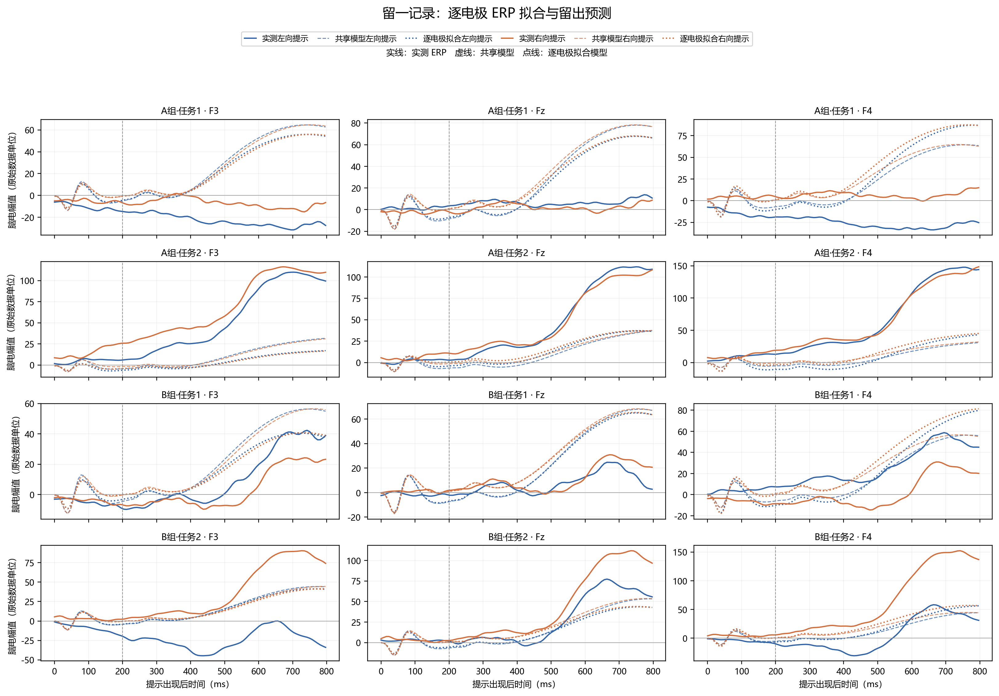

# 逐电极拟合的留一记录验证

## 拟合与验证口径

- 共 4 折，每折留出 1 份记录，其余 3 份用于拟合。训练目标为记录内左右条件 ERP 叠加平均，各记录与方向等权。
- 每个电极单独拟合 `tau_s`、`g_i` 和增益；同一电极的左右条件共享参数。`tau_a` 固定为该折共享模型仅使用训练记录选出的值。
- 留出 ERP 只用于评分。模拟响应延长到 3 s，再按原流程滤波、重采样、基线校正并截取 0–800 ms。没有事后反号。

## 留出预测结果

主指标为每个留出记录×提示方向先合并三电极波形计算 NRMSE，再对 8 个条件等权平均；这一口径可与之前的共享模型 NRMSE=1.810 比较。
| 模型 | 记录×方向宏平均 NRMSE | 电极×方向曲线 NRMSE 均值 | 全部样本合并 NRMSE | 单曲线相关均值 |
|---|---:|---:|---:|---:|
| 共享模型 | 1.810 | 2.100 | 0.932 | 0.601 |
| 逐电极增益 | 1.832 | 2.046 | 0.936 | 0.601 |
| 逐电极曲线拟合 | 1.835 | 2.049 | 0.937 | 0.601 |

## 分电极结果

| 电极 | 共享模型 NRMSE / 相关 | 逐电极增益 NRMSE / 相关 | 逐电极拟合 NRMSE / 相关 |
|---|---:|---:|---:|
| F3 | 1.792 / 0.400 | 1.605 / 0.400 | 1.611 / 0.396 |
| Fz | 3.008 / 0.786 | 2.701 / 0.786 | 2.696 / 0.787 |
| F4 | 1.499 / 0.617 | 1.832 / 0.617 | 1.839 / 0.621 |

## 左右差异与通道相似度

| 模型 | 留出右减左 NRMSE 均值 | 留出右减左相关均值 | 预测跨电极时序相关均值 |
|---|---:|---:|---:|
| 共享模型 | 1.089 | 0.018 | 0.9976 |
| 逐电极增益 | 1.096 | 0.018 | 0.9976 |
| 逐电极曲线拟合 | 1.108 | 0.013 | 0.9953 |

逐电极拟合的 12 组优化中收敛状态为真者 1/12，最多实际评估 102 次目标函数。

## 结论

逐电极拟合的记录×方向宏平均 NRMSE 为 1.835，共享模型为 1.810。左右差异相关也没有改善。本轮结果不支持“每个电极独立拟合动力学参数能提高跨记录预测”的判断；同时只有少数组合报告收敛，因此逐电极拟合的参数还不能作稳定估计。

图中每行是留出记录，每列是电极；实线为实测 ERP，虚线为共享模型，点线为逐电极拟合模型。

