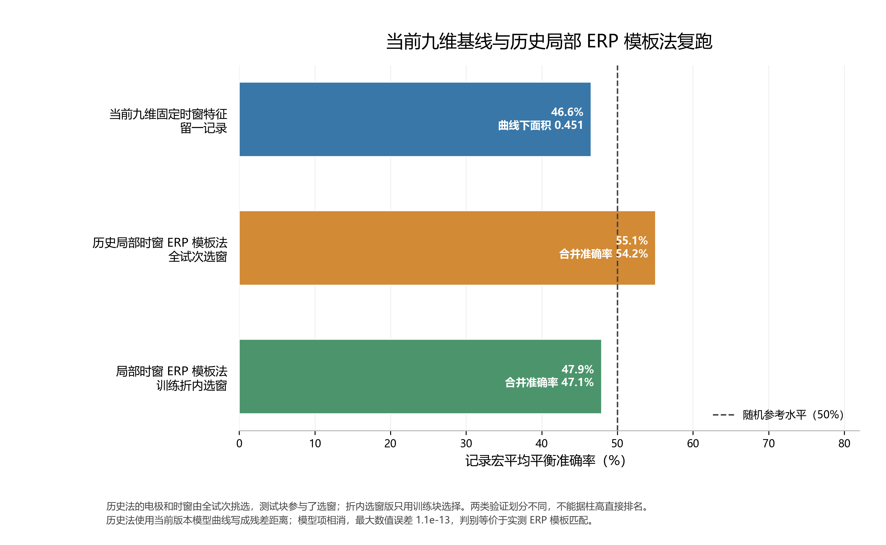

# 当前九维基线与历史约55%方法复跑

## 复跑结果

| 方法 | 留出方式 | 合并准确率 | 记录宏平均平衡准确率 | 曲线下面积 |
|---|---|---:|---:|---:|
| 当前九维固定特征 | 留一记录 | 138/297（46.5%） | 46.6% | 0.451 |
| 历史局部时窗ERP模板法 | 五折时间块 | 161/297（54.2%） | 55.1% | — |
| 局部时窗ERP模板法（折内选窗） | 五折时间块 | 140/297（47.1%） | 47.9% | — |

## 三种口径

- **当前基线**：九个预设特征为 F3、Fz、F4 在 `[100,250)`、`[250,500)`、`[500,800)` ms 的 ERP 均值；整份记录留出。重算结果为宏平均平衡准确率 **46.6%**、曲线下面积 **0.451**。
- **历史约55%方法**：沿用历史全试次挑出的逐记录电极和时间窗，用五折时间块留出试次，并在训练折拟合左右 ERP 模板。当前清洗数据上复现为 **161/297（54.2%）**，记录宏平均平衡准确率 **55.1%**。因为电极和时窗曾使用全体试次标签挑选，留出块信息参与了特征选择，这个分数是探索性结果。
- **折内选窗核验**：同一局部时窗模板思路，但每折只用训练块选择电极、时间窗和模板；复跑为 **140/297（47.1%）**，记录宏平均平衡准确率 **47.9%**。它仍是同记录的时间块验证，不等价于留一记录验证。

## 对当前框架的解释

历史法读取了当前 v3 的留出模型曲线并以残差形式计算距离。但对同一候选类别，`(试次−模型曲线)−(训练 ERP−模型曲线)` 中的模型曲线会代数相消；本次数值核查的最大残差为 `1.137e-13`。因此历史法的左右标签实际由**真实 EEG 与训练 ERP 模板的距离**决定，不是模型曲线单独完成的预测。

当前较可信的对照是：固定九维特征在留一记录验证中为 46.6%；同记录、训练折内选窗的局部模板法宏平均平衡准确率为 47.9%，仍接近随机水平。历史 55.1% 不能作为独立验证优势，主要需要考虑全试次选窗带来的乐观偏差，以及它使用了不同的留出层级。

## 分记录结果

| 方法 | 记录 | 试次数 | 正确数 | 准确率 | 平衡准确率 |
|---|---|---:|---:|---:|---:|
| 历史局部时窗ERP模板法 | A组记录1 | 54 | 33 | 61.1% | 61.3% |
| 历史局部时窗ERP模板法 | A组记录2 | 80 | 45 | 56.2% | 56.7% |
| 历史局部时窗ERP模板法 | B组记录1 | 83 | 31 | 37.3% | 37.3% |
| 历史局部时窗ERP模板法 | B组记录2 | 80 | 52 | 65.0% | 65.0% |
| 局部时窗ERP模板法（折内选窗） | A组记录1 | 54 | 27 | 50.0% | 51.0% |
| 局部时窗ERP模板法（折内选窗） | A组记录2 | 80 | 38 | 47.5% | 48.3% |
| 局部时窗ERP模板法（折内选窗） | B组记录1 | 83 | 29 | 34.9% | 35.0% |
| 局部时窗ERP模板法（折内选窗） | B组记录2 | 80 | 46 | 57.5% | 57.4% |

### 当前九维基线的留出记录

| 留出记录 | 试次数 | 平衡准确率 | 曲线下面积 |
|---|---:|---:|---:|
| A组记录1 | 54 | 34.7% | 0.309 |
| A组记录2 | 80 | 49.4% | 0.488 |
| B组记录1 | 83 | 51.7% | 0.517 |
| B组记录2 | 80 | 50.4% | 0.490 |

## 复现输入与输出

- 三种流程均读取第一问 `8riemann_denoise` 的 `*_clean.mat`，使用提示方向标签和提示前基线校正。
- 历史残差模板法使用当前 `output/revision_v3/heldout_predictions.csv` 与历史探索窗口文件；模型输出通过残差差分参与计算，并已核验其代数抵消。
- 新生成的图只有 PNG：`方法对照.png`。机器可读汇总为 `方法汇总.csv` 和 `分记录结果.csv`。
