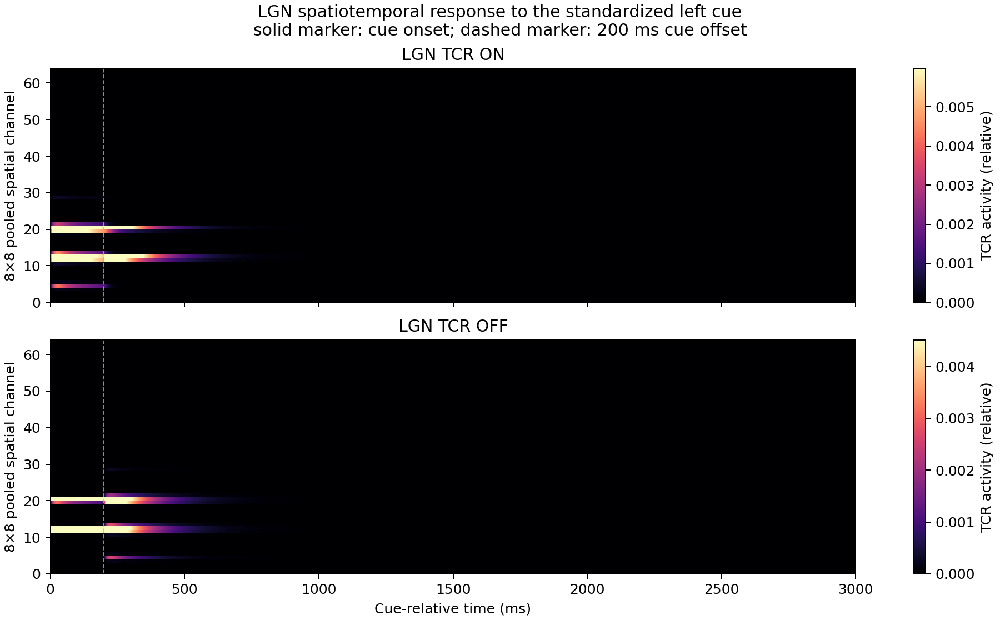
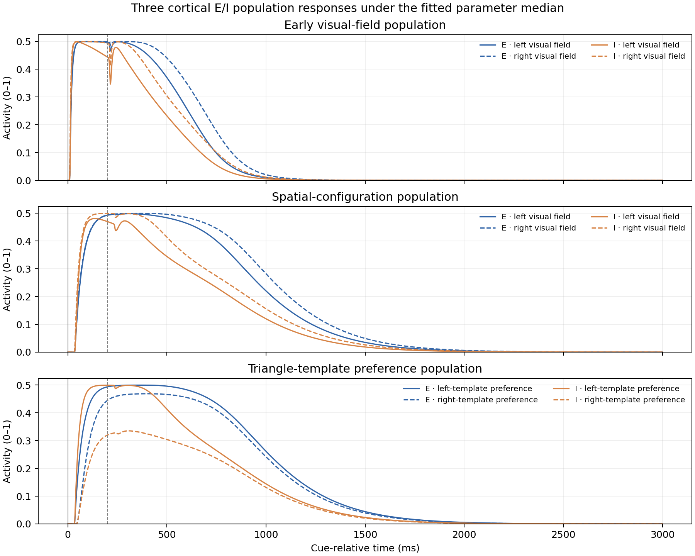
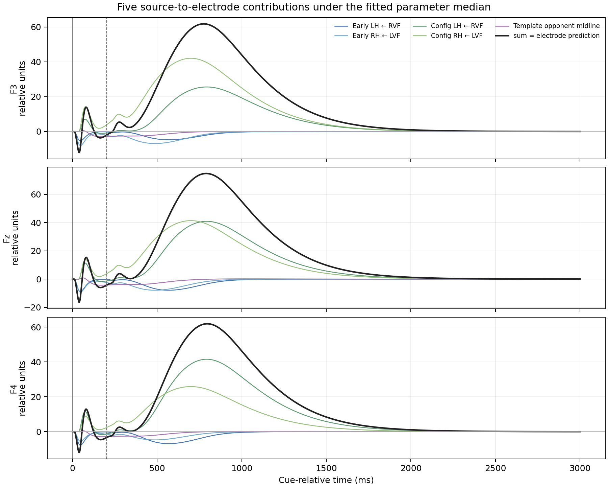

| 图 | 能说明什么 | 不能单独证明什么 |
|---|---|---|
| `lgn_spatiotemporal.png` | LGN 的 ON/OFF 输入在空间通道和时间上的分布，能看到模型送入皮层前的左右视野活动。 | 不能证明第三组模板偏好群体收到了相同的双视野汇总输入。 |
| `cortical_ei_responses.png` | 展示早期、构型、模板偏好三组 E/I 群体的活动；第三组通道按“左/右三角模板偏好”解释，而不是视野左右或脑半球。 | 曲线不同不等于前馈输入不同；第三组差异还可能来自各自的模板驱动。 |
| `source_to_electrode_contributions.png` | 展示五个源代理分别对 F3、Fz、F4 的贡献；也能检查五项贡献之和是否等于模型预测电位。 | 不能证明源的解剖位置真实，也不能证明中线差源是生理事实。它仍是明确标注的建模假设。 |

**实现层面的指导项已修改并重跑；但模型效果还没有验证通过。**

- **第三组前馈下标混用：已修正。**构型组仍按视野位置接收对应输入；三角模板偏好组的两个通道现在接收相同的左右视野汇总输入，左右权重固定为 `0.5/0.5`，模板偏好由各自的模板驱动表达。
- **中线差源的含义：已明确。**它是“左、右模板偏好响应之差”形成的双侧中线源，是降维建模假设，不代表真实解剖定位。
- **模拟、拟合和留出验证：已重新运行。**审计也确认新输出使用了当前路由版本。
- **三类诊断图：已生成，并纳入完整运行流程。**分别展示 LGN 时空响应、三组皮层 E/I 响应，以及五个源对三个电极的贡献。
- **源与电极几何：已按内外位置区分。**电极在球面外表面，源位于内部；不过这仍是典型坐标和简化导联近似，不是个体真实头模型。

需要把“代码修正完成”和“模型验证成功”分开看：新版留出拟合未收敛，平均 NRMSE 约 `1.82`，左右波形差异相关约 `−0.18`；六特征留出分类平衡准确率约 `45.3%`。因此，**指导指出的实现问题已处理并有审计证据，但修正后模型尚未能良好解释或预测留出 EEG。**

## 本次重跑的诊断图

以下图片由当前 `revision_v3` 完整运行流程生成。它们展示修正后模型的输入、群体活动及源到电极的贡献；路由实现和几何设置的直接核查证据见源映射审计结果。

### LGN 时空响应

### 三组皮层 E/I 群体响应

### 五个源对 F3、Fz、F4 的贡献

