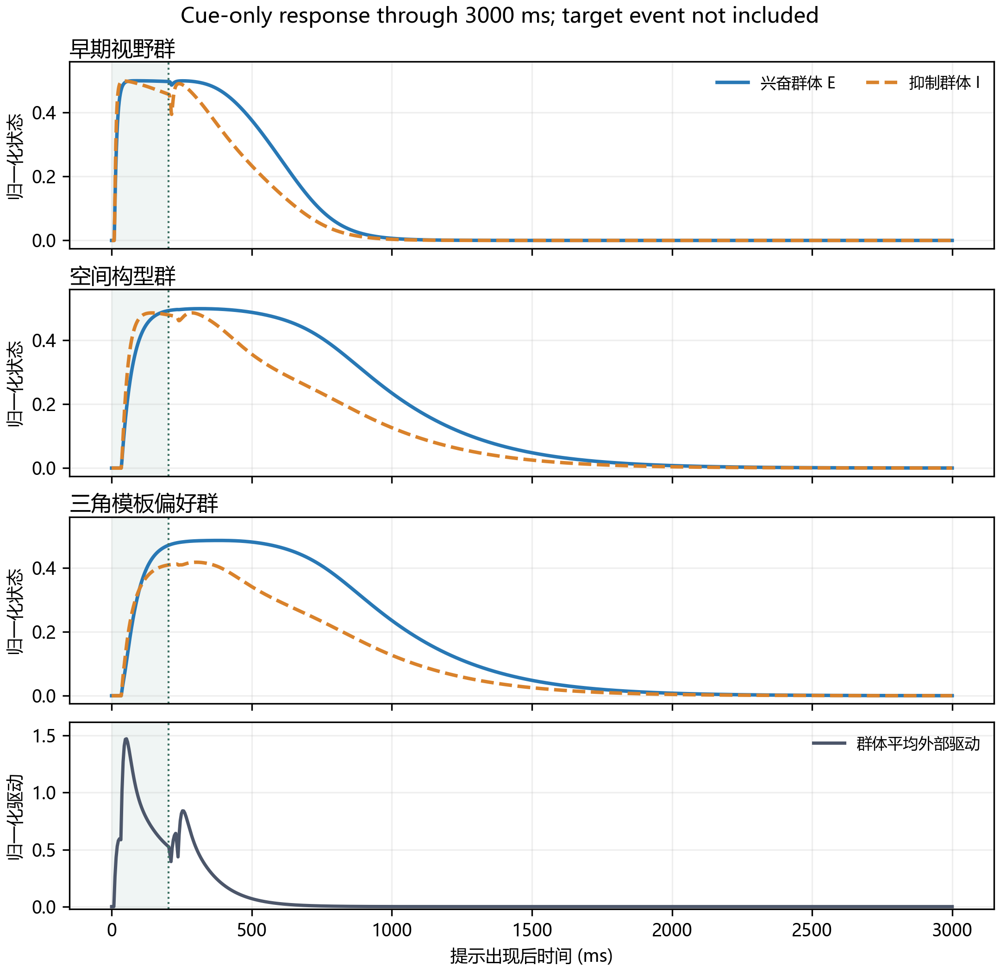
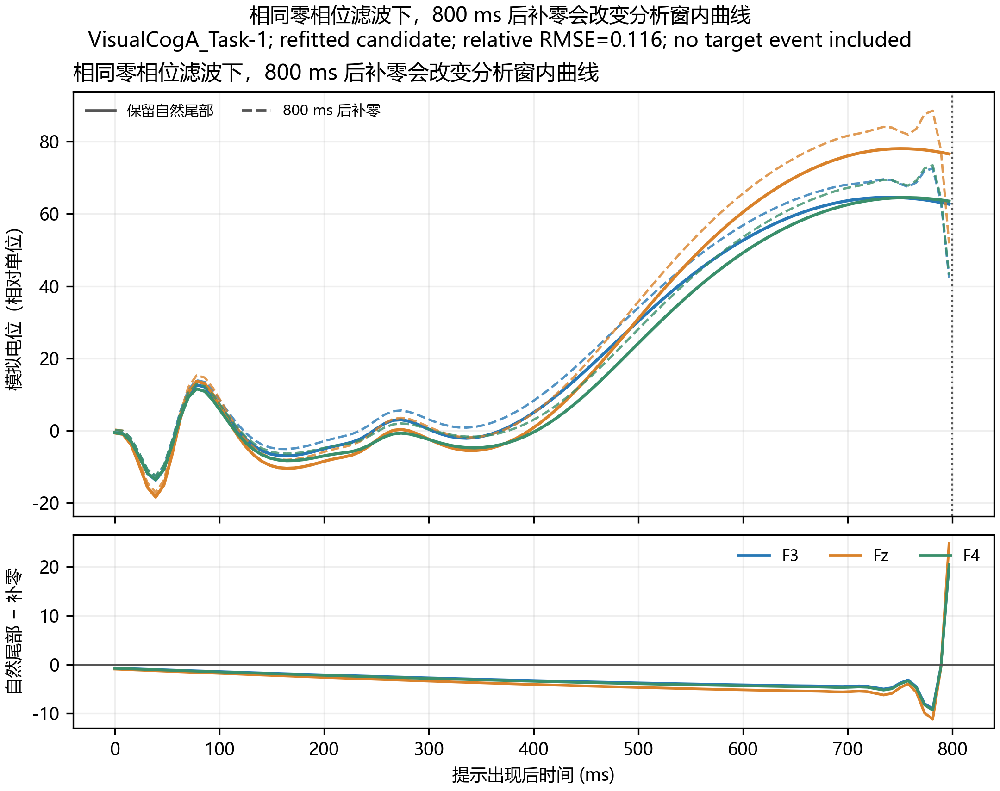
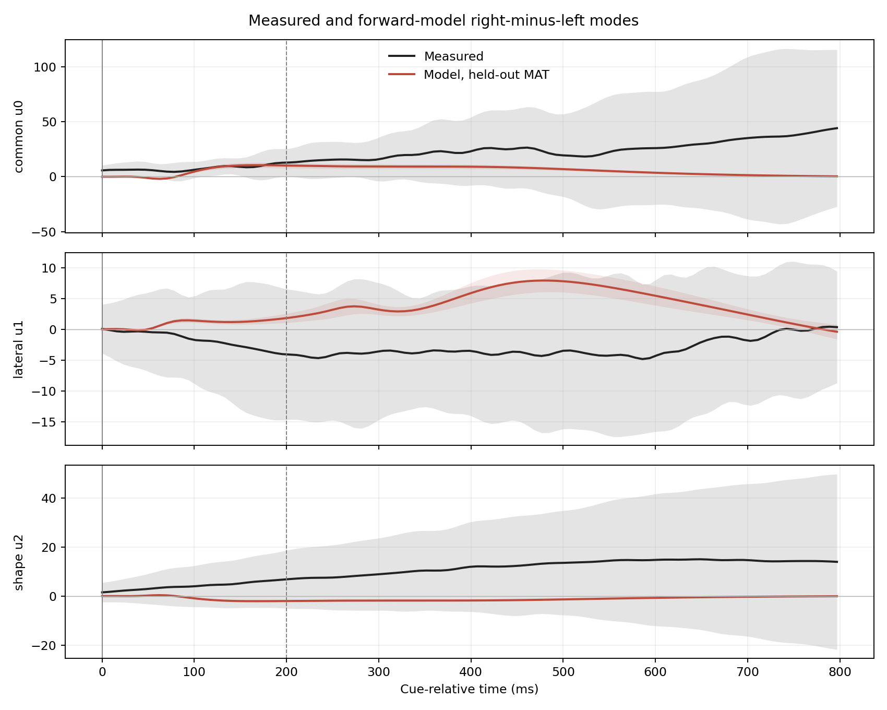
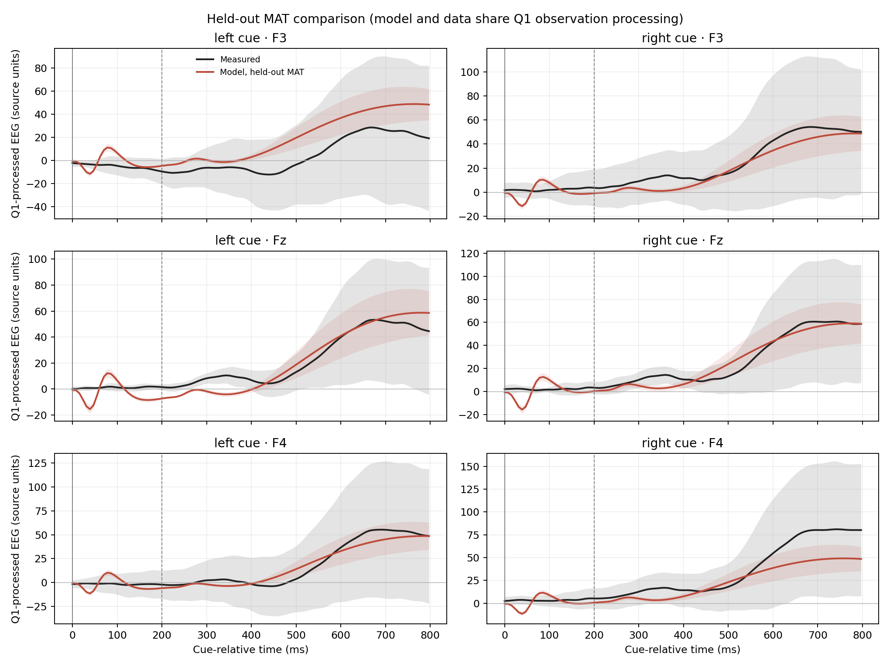

# 修改2：修复 800 ms 硬截断并重拟合

## 结论

已修正模型在 800 ms 处被强制归零的问题：cue-only 模型现在从 0 ms 自然演化至 3000 ms，再按第一问的完整试次观测流程滤波、降采样和基线校正；拟合与留出评价仍只取提示后 0–800 ms。没有把 2.2 s 目标事件加入模型。

修复后完成四折留出重拟合，但实测拟合仍不理想：平均留出 NRMSE 为 **1.810**，右减左波形相关均值为 **−0.147**，四折优化均未收敛。结论是：**800 ms 截断错误已修正并重跑，但当前正向模型仍未通过实测 ERP 拟合验证。**

## 1. 本轮实施

- `revision_v3/config.py` 的模拟轴由 0–800 ms 延长到 0–3000 ms，保留 cue 消失后的自然神经状态与源代理衰减，再进入双向滤波。
- 拟合窗没有扩大：目标函数仍在真实 ERP 的 0–800 ms 时间点计算。
- 保持刺激、群体方程、观测映射和参数边界；不猜测并加入 2.2 s 目标事件，不修改真实数据。
- 完整时间轴下原 60 次/局部优化点的预算会使四折耗时接近 17 分钟。本次使用 12 次局部评估预算，七个 `tau_a` 候选剖面及两个初值确认均保留；所以新参数是**预算受限候选值**，不是收敛估计。

## 2. 过程图与结果

图 1 展示一组留出拟合候选参数下，提示出现和约 203 ms 提示消失后的神经群状态及外部驱动。活动随后衰减，属于慢衰减暂态；归一化状态不是放电率。模拟仍是 cue-only，不含目标响应。

图 2 比较自然保留 800 ms 后尾部与在 800 ms 强制归零的输入，经同一零相位观测算子处理后的分析窗波形。代表记录相对 RMSE 为 **0.116**。对全部 8 个记录×条件重算后，中位数 **0.114**、均值 **0.160**、范围 **0.103–0.315**。先前报告的 15.4% 使用旧参数，本轮用新候选参数重算，因此以此处统计为准。

图 3 对比留出真实左右差异与模型的右减左差异。模型差异偏弱且时间形状未能复现；四份 MAT 的相关均值为负。灰带代表记录间离散程度，MAT 文件不等同于独立被试。

图 4 为各电极和左右条件的真实 ERP 与留出模型输出。跨记录波形离散较大，不能仅凭局部相似判定拟合成功。

## 3. 重拟合汇总

| 指标 | 本轮结果 | 解释 |
|---|---:|---|
| 平均留出 ERP NRMSE | 1.810 | 误差约为实测 ERP RMS 的 1.81 倍，绝对波形解释弱 |
| 右减左波形相关均值 | −0.147 | 左右差异的时间形状未稳定复现 |
| 优化器未收敛 | 4/4 折 | 当前参数仅是预算受限候选，不作生理参数解释 |
| 截断影响的相对 RMSE 中位数 | 0.114 | 800 ms 后归零会实质改变分析窗内滤波波形 |

机制对照亦已用新参数重算。去掉空间位置后，模型自身左右差异几乎消失；这说明模型生成的差异依赖空间输入路线，不证明该路线解释了真实 EEG。去掉 cue offset 后模型左右差异反而增大，提示 onset/offset 响应会叠加，晚期响应不能一概归为 cue onset。

## 4. 尚未解决的问题

1. **完整事件上下文未核实。** 2.2 s 来自实验时序设定，但清洗后数据没有独立目标视觉 onset 标记。本轮不猜测该时刻。真实目标活动仍可能通过双向滤波向前影响 cue 窗口。
2. **提示前状态未模拟。** 模型从事件前零响应开始，未构造未经证实的背景输入或残余状态。
3. **EEG 参考方式待核实。** MAT 未提供参考电极元数据；简化导联映射不能视为真实头模型导联场。
4. **拟合未收敛。** 新旧指标不能作严格因果比较，因为尾部处理改变，且本轮优化预算由 60 降至 12。

## 5. 文件

本轮代码修改：`revision_v3/config.py`（时间轴 0–3000 ms，并声明拟合窗）、`revision_v3/test_v3_contract.py`（新增尾部滤波回归检查）、`revision_v3/make_revision2_figures.py`（重绘 PNG 且不再标记未建模目标事件）。相关 20 项检查全部通过。

主要重拟合数据在 `output/revision_v3/`：`heldout_fit_summary.csv`、`heldout_metrics.csv`、`left_right_difference.csv`、`mechanism_controls.csv`。尾部量化明细在 `output/revision_v3_validation/observation_tail_audit.csv`。新增图均为 PNG。

**最终判断：**已消除 800 ms 人为硬截断；模型仍未解释好真实左右 ERP。下一步应先核实完整视觉事件时序、事件前背景与 EEG 参考，再决定是否调整动力学或增加模型复杂度。
