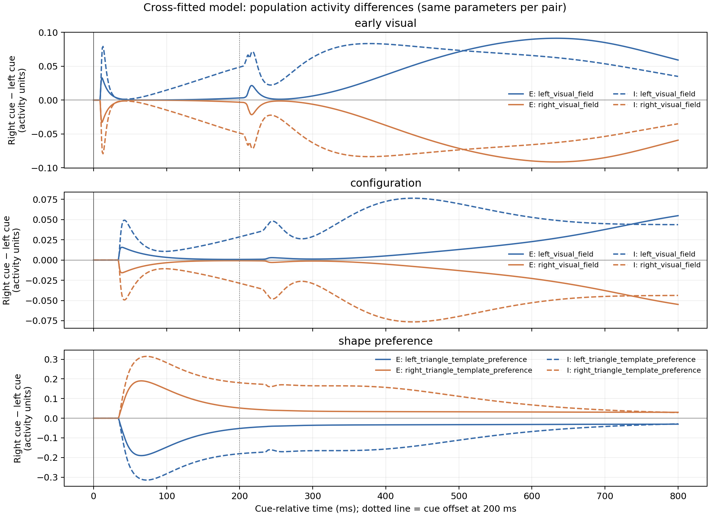
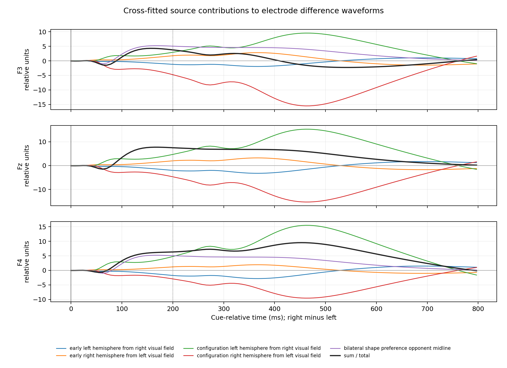
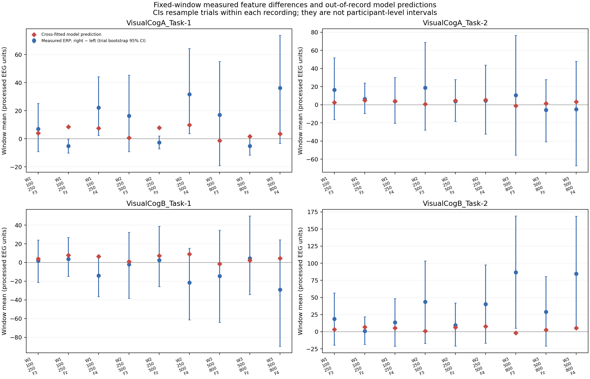
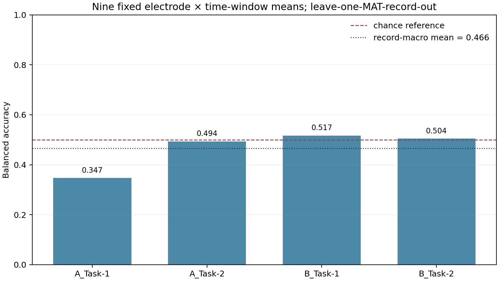

# 问题二第一小问：修正后的正向模型与左右特征证据链

## 本轮处理

- 前端和皮层动力学模拟延长至 0–3000 ms，使 0–800 ms 评价段之后的模型响应自然演化；再统一执行第一问观测算子，最后截取评价窗口。没有在 800 ms 处把活动硬截断后补零。
- 未把 2.2 s 目标加入 cue-only 模型。目标场景和真实记录参考电极信息仍未完全核实，分别作为上下文假设和导联近似的局限。
- 事件核对：四份记录的 VisCue 中位起点均为 0.000 ms；记录到的 cue 中位偏移为 203.125 ms，接近名义 200 ms。2.20 s 目标时刻来自实验流程假设，Action 通道是应答/动作标记，未被当作已确认目标触发输入。
- 每个留一 MAT 折只用其余记录拟合参数；同一折的左、右提示由完全相同的参数、输入尺度、增益和观测算子生成。
- 真实 EEG 候选特征预先固定为 F3/Fz/F4 在 `[100,250)`、`[250,500)`、`[500,800)` ms 的均值，共 9 维。窗口、通道和 LDA 收缩系数没有根据留出记录调整；特征标准化只在训练记录拟合。

## 结果概览

- 左右条件留出 ERP 平均 NRMSE：**1.810**。这是绝对波形拟合指标；数值越接近 0 越好。
- 实测与模型右减左波形相关的记录均值：**-0.147**。相关为负表示当前模型差波形的时间形状没有复现实测差波形。
- 四折中有 **4/4** 折的优化器未报告收敛；使用的是预算内最优候选，不能将其描述为已收敛或已识别的生理参数。
- 固定 9 维特征的留一 MAT 记录平衡准确率宏平均：**0.466**；宏平均 AUC：**0.451**。四个 MAT 文件是记录而非已确认的四名独立受试者。
- 留出折中，平衡准确率高于 0.5 的记录为 2/4；AUC 高于 0.5 的记录为 1/4。**当前 9 维特征没有获得留一记录验证支持：宏平均平衡准确率或 AUC 未超过 0.5。这表示固定特征在当前跨记录测试中未显示可靠区分能力。**
- 源加和检查最大相对 RMS 残差：**2.567e-06**；阈值 `1e-5`。残差来自保存电极信号时的 `float32` 舍入。

### 留出记录结果

| 留出记录 | 测试试次数 | 平衡准确率 | AUC | 训练记录 |
|---|---:|---:|---:|---|
| VisualCogA_Task-1 | 54 | 0.347 | 0.309 | VisualCogA_Task-2;VisualCogB_Task-1;VisualCogB_Task-2 |
| VisualCogA_Task-2 | 80 | 0.494 | 0.488 | VisualCogA_Task-1;VisualCogB_Task-1;VisualCogB_Task-2 |
| VisualCogB_Task-1 | 83 | 0.517 | 0.517 | VisualCogA_Task-1;VisualCogA_Task-2;VisualCogB_Task-2 |
| VisualCogB_Task-2 | 80 | 0.504 | 0.490 | VisualCogA_Task-1;VisualCogA_Task-2;VisualCogB_Task-1 |

## 800 ms 截断与滤波尾部审计

在 8 个记录×左右条件中，保留模型自然尾部与 800 ms 后强制补零两种处理所得的 0–800 ms 波形，相对 RMSE 中位数为 **0.1143**、均值为 **0.1604**，范围 **0.1026–0.3150**。这量化的是滤波边界处理对分析窗的影响；延长模拟并消除这项边界差异，不代表实测 ERP 拟合因此变好，也没有解决未知目标事件上下文。

## 左右差异的模型分解

模型差异按同一折的配对计算：`右提示输出 − 左提示输出`。因此这些差异没有混入左右条件各自重新拟合造成的参数变化。第一幅图显示三组皮层 E/I 通道的右减左活动；第二幅图显示五个内部源分别对 F3、Fz、F4 差波形的贡献。代码逐折、逐电极检查源贡献之和与观测电极输出的一致性。

### 三组皮层活动：右减左

### 五个源到三个电极的差异贡献

| 电极 | 模型源代理 | 跨折平均源差 RMS | 源 RMS / 总差 RMS |
|---|---|---:|---:|
| F3 | early_left_hemisphere_from_right_visual_field | 1.055 | 0.494 |
| F3 | early_right_hemisphere_from_left_visual_field | 1.535 | 0.719 |
| F3 | configuration_left_hemisphere_from_right_visual_field | 5.225 | 2.451 |
| F3 | configuration_right_hemisphere_from_left_visual_field | 8.486 | 3.981 |
| F3 | bilateral_shape_preference_opponent_midline | 3.383 | 1.587 |
| Fz | early_left_hemisphere_from_right_visual_field | 1.758 | 0.350 |
| Fz | early_right_hemisphere_from_left_visual_field | 1.758 | 0.350 |
| Fz | configuration_left_hemisphere_from_right_visual_field | 8.357 | 1.667 |
| Fz | configuration_right_hemisphere_from_left_visual_field | 8.357 | 1.667 |
| Fz | bilateral_shape_preference_opponent_midline | 5.017 | 1.000 |
| F4 | early_left_hemisphere_from_right_visual_field | 1.535 | 0.252 |
| F4 | early_right_hemisphere_from_left_visual_field | 1.055 | 0.174 |
| F4 | configuration_left_hemisphere_from_right_visual_field | 8.486 | 1.399 |
| F4 | configuration_right_hemisphere_from_left_visual_field | 5.225 | 0.861 |
| F4 | bilateral_shape_preference_opponent_midline | 3.383 | 0.558 |
各源带符号相加得到电极差波形；RMS 比值因源间可相消，不应解释为百分比份额。

## 真实 EEG 的固定候选特征

下图中的蓝点和区间是每份记录内实测右减左窗口均值及试次重采样区间，红菱形是没有用该记录拟合的交叉拟合模型预测。试次重采样区间只描述单份记录内的试次不确定性，不等同于被试总体置信区间。

## 留出检验

分类只检验固定的 9 维 EEG 特征在未参与训练的整份 MAT 记录上的可分性。它不证明该特征来自模型指定的神经机制；模型拟合也不替代留出分类。

## 波形和前端检查图

## 结论

本轮完成了可审计的左右差异分解与固定时域特征留出检验。模型内部差异可从空间/模板通道追踪到群体活动、五个源代理及 F3/Fz/F4；但留出 ERP 平均 NRMSE=1.810，右减左波形相关均值=-0.147，尚未显示良好的实测波形复现。
当前固定 9 维特征的留一记录宏平均平衡准确率为 0.466、宏平均 AUC 为 0.451；两者均未超过 0.5，因此本轮**没有获得稳定左右判别的留出支持**。本轮结论应限定为：**模型预测**已给出并完成源贡献核算；**实测特征**是预先限定的探索结果；**留出验证**目前不支持该固定特征具有跨记录区分能力。
因此可以报告候选机制链和候选特征，但不能将模型预测或单份记录内的差异表述成已经证实的普遍生理规律。

## 输出文件

新增 CSV：`model_population_right_minus_left.csv`、`model_source_electrode_right_minus_left.csv`、`model_candidate_feature_predictions.csv`、`measured_candidate_features_exploratory.csv`、`heldout_9d_electrode_lda_trial_scores.csv`、`heldout_9d_electrode_lda_folds.csv`、`heldout_9d_electrode_lda_summary.csv`、`model_source_contribution_summary.csv`、`source_additivity_audit.csv`。图像均为 PNG。
