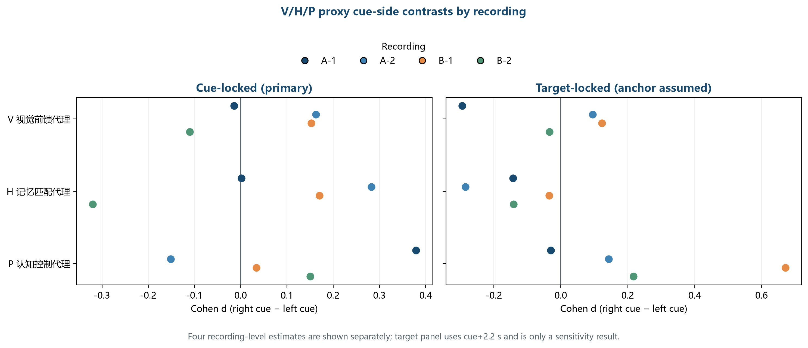

# 问题三后续分析与数据语义审计

## 1. 本轮完成范围

本轮对照官方题目附录、最新《第三.pdf》和 Q3 当前输出，补充了事件语义审计、按记录的 V/H/P 代理效应量、目标时间锚敏感性及数据/标签泄漏清单。原始 MAT 文件未修改；没有在四份记录上继续追逐更高分类百分点。

## 2. 事件语义与 DDM 门槛

官方题目附录将通道9定义为目标点击应答，负值为左、正值为右；当前 Q3 保留原始值，并将 raw -2/-1 标准化为 -2、raw +1/+2 标准化为 +2。因此，**应答方向语义有题目依据**。附录同时说明提示约呈现 0.2 s，目标在提示消失后约 2 s 出现。结合该排程可形成 cue+2.2 s 的近似锚点，但 MAT 通道中没有逐试次目标 onset marker，故目标 onset 和 RT 仍不能视为精确测量。

编码统一规则明确为 **raw -2/-1 → response_code -2（左），raw 0 → 0（无活动），raw +1/+2 → response_code +2（右）**。映射只作用于派生应答码，`response_raw` 和 MAT 原始通道均保留。下表分别统计原始通道采样点、非零起始边沿和试次表事件，避免把持续多个采样点的 marker 重复计成多次应答。

| 原始码 | 标准码 | 含义 | 原始采样点数 | 检测边沿数 | 试次表事件数 |
|---|---|---|---|---|---|
| -2 | -2 | left response | 94 | 0 | 0 |
| -1 | -2 | left response | 63983 | 196 | 196 |
| 0 | 0 | inactive/no response marker | 776724 | 0 | 0 |
| 1 | 2 | right response | 64430 | 204 | 204 |
| 2 | 2 | right response | 106 | 0 | 0 |

按 cue+2.2 s 计算，通道9事件相对目标锚点的 RT 中位数为 **0.015 s**，其中 **399/400** 小于 0.1 s。若把目标暂按 cue+2.0 s 计算，中位数变为 **0.215 s**，但这只是时间锚敏感性，不是从行为合理性反推目标时刻。项目截止时间、项目2目标真值和漏答标签仍缺失，故本轮维持 **DDM 未拟合**，也不生成正确率/漏答率结论。

## 3. V/H/P 代理状态的跨记录描述

现有状态代理定义为：V=三通道额前 ERP 均值，H=三通道 log-theta 功率均值，P=三通道 log-beta 功率均值。它们是可审计的观测特征组合，不是由自由载荷矩阵估计的潜变量，也不支持 LGN、海马或 PFC 的源定位解释。下表给出每个记录内左右提示差异的 Cohen d；四个记录单独展示，不把试次数当成独立被试来计算显著性。

| 记录 | 代理状态 | 左提示n | 右提示n | Cohen d（右−左） |
|---|---|---|---|---|
| VisualCogA_Task-1 | V 视觉前馈代理 | 54 | 46 | -0.014 |
| VisualCogA_Task-1 | H 记忆匹配代理 | 54 | 46 | 0.002 |
| VisualCogA_Task-1 | P 认知控制代理 | 54 | 46 | 0.379 |
| VisualCogA_Task-2 | V 视觉前馈代理 | 54 | 42 | 0.163 |
| VisualCogA_Task-2 | H 记忆匹配代理 | 54 | 42 | 0.283 |
| VisualCogA_Task-2 | P 认知控制代理 | 54 | 42 | -0.151 |
| VisualCogB_Task-1 | V 视觉前馈代理 | 46 | 52 | 0.153 |
| VisualCogB_Task-1 | H 记忆匹配代理 | 46 | 52 | 0.171 |
| VisualCogB_Task-1 | P 认知控制代理 | 46 | 52 | 0.034 |
| VisualCogB_Task-2 | V 视觉前馈代理 | 46 | 47 | -0.110 |
| VisualCogB_Task-2 | H 记忆匹配代理 | 46 | 47 | -0.320 |
| VisualCogB_Task-2 | P 认知控制代理 | 46 | 47 | 0.150 |

*图1　四个记录中 V/H/P 代理状态的左右提示效应量。目标锁定面板使用 cue+2.2 s 排程假设，仅作敏感性描述。*

当前既有留记录消融显示，cue 阶段完整代理加任务候选的 BA 为 0.489，V-only 为 0.494（变化 −0.005）；target 阶段对应为 0.530 与 0.497（变化 +0.033）。特征重建误差有所下降，但它说明代理特征之间存在可预测关系，不能证明三个潜在脑区状态被识别。任务后缀的正式含义也尚未由逐记录元数据确认。

## 4. 已有解码与行为结果的正确位置

raw-QC cue 左右提示方向的嵌套分类 BA 为 **0.5206**，固定 Logistic 基线为 **0.4601**，差值 **+6.05 个百分点**。在 Q1 质量匹配样本上，差值为 **-0.02 个百分点**；target 锁定差值为 **-2.15 个百分点**。因此 52.06% 仍是对样本口径敏感的探索性 cue 解码分支。

行为选择比较中，提示+文件名任务候选的 BA 为 **0.755**，加入 EEG 代理后为 **0.747**，当前没有观察到 EEG 增益。它预测的是通道9左右选择，既不表示正确率，也不能验证完整 DDM。

## 5. 后续执行顺序

1. 获取逐记录的被试/会话/项目映射、目标 onset 时间戳、截止时间和项目2目标真值；记录来源并与通道9事件逐条核对。
2. 若有可信元数据，重算 response-locked 窗口与 RT；否则保留本报告的代理状态与 cue 解码，并明确目标/应答窗口不可定量验证。
3. 仅当正确/错误/漏答、RT 与截止时间都可信时，先做 DDM 参数恢复模拟，再拟合并按独立被试或记录留出验证。缺任何一项时就把 DDM 报告为数据条件不足。

## 6. 可复现产物

- `state_proxy_effects_by_record.csv`：按记录、事件阶段和状态代理列出左右提示均值、Cohen d 与样本量。
- `response_timing_anchor_sensitivity.csv`：cue+2.0 s 与 cue+2.2 s 两种锚点下的应答时间差异；不用于挑选最佳锚点。
- `response_code_mapping.csv`：逐原始编码的标准码、含义，以及原始通道采样点数/响应边沿数/试次事件数。
- `data_profile.json`、`data_quality_report.json`、`cleaning_actions.json`、`eda_findings.json`、`leakage_report.json` 和 `processed_data_manifest.json`：本轮审计和计算来源。
