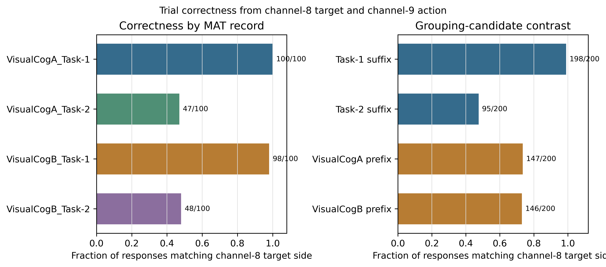

# 问题三：事件语义与反应时间锚点审计

## 审计结论

原始数据中检出 400 个 VisCue 起始边沿和 400 个通道9 非零起始边沿；400/400 个 cue 区间恰有一个通道9边沿。按参考模型定义，通道9从零到非零的边沿作为应答时刻 `t_act`；cue 非零段的中位持续时间为 0.2031 s。

`t_act` 距 cue 起始的总体中位数为 2.2148 s。根据题目附录“提示消失后等待约2秒”的文字，以实测 cue 结束时刻加约2秒构造一个**计划时刻代理**，`t_act` 相对该代理的中位差为 11.7 ms。该差值不是反应时长：逐试次真实目标呈现时刻没有单独事件标记，且“约2秒”不是精确呈现日志。

以 cue+2.2 s 作敏感性参照时，399/400 个 `t_act` 位于其后100 ms以内；以 cue+2.0 s 作另一个敏感性参照时，边沿差的中位数为 0.2148 s。两者均只展示计划时刻代理的敏感性，不改变 `t_act` 的参考模型定义。

## 证据与待定解释

1. **目标呈现时刻：未被逐试次观测。** 附录支持“cue 结束后约2秒”的粗略计划；VisCue脉冲实测约0.20秒，因此计划代理约为 cue onset +2.20秒。原始通道没有 target-onset 事件，不能据此给每次试验填入精确 onset。
2. **通道9应答时刻：按参考模型使用。** 本实现将每个 cue 区间内唯一的通道9零到非零边沿定义为绝对应答时刻 `t_act`，并用 `t_act - 100 ms` 作为应答前 EEG 截止点。该定义支持应答锁定窗口；由于没有逐试次目标 onset，`t_act - target_onset` 形式的反应时长仍未知。
3. **试次配对：当前未见错位证据。** 按每个 cue 到下一 cue 的区间检查，所有记录都是一段一个通道9边沿；故逐试次顺序错位暂不支持为主要解释。跨通道同步偏移或记录程序对通道9的写入语义，仍需要原始实验日志/软件定义才能排除。

## 逐试次正确性与分组解释

《第三.pdf》把项目1定义为位置提示、项目2定义为形状提示，但没有在文本中给四份 MAT 文件写出机器可核对的逐文件项目映射。当前 Q3 将 `Task-1/Task-2` 后缀作为候选类型；Q2 的 `revision_v3/config.py` 则把 `VisualCogA_*` 两份文件归为 Task1、`VisualCogB_*` 两份归为 Task2。两套分组给出不同的 cue-应答同侧结构：

| grouping_scheme               | group             |   n_trials |   cue_response_same_side_count |   cue_response_same_side_fraction | interpretation                                                                                                                         |
|:------------------------------|:------------------|-----------:|-------------------------------:|----------------------------------:|:---------------------------------------------------------------------------------------------------------------------------------------|
| suffix: Task-1/Task-2         | Task-1            |        200 |                            198 |                             0.990 | correctness from channel-8 target side and channel-9 DataLabel-declared code within the action bout; task grouping is descriptive only |
| suffix: Task-1/Task-2         | Task-2            |        200 |                             95 |                             0.475 | correctness from channel-8 target side and channel-9 DataLabel-declared code within the action bout; task grouping is descriptive only |
| prefix: VisualCogA/VisualCogB | VisualCogA        |        200 |                            147 |                             0.735 | correctness from channel-8 target side and channel-9 DataLabel-declared code within the action bout; task grouping is descriptive only |
| prefix: VisualCogA/VisualCogB | VisualCogB        |        200 |                            146 |                             0.730 | correctness from channel-8 target side and channel-9 DataLabel-declared code within the action bout; task grouping is descriptive only |
| record                        | VisualCogA_Task-1 |        100 |                            100 |                             1.000 | correctness from channel-8 target side and channel-9 DataLabel-declared code within the action bout; task grouping is descriptive only |
| record                        | VisualCogA_Task-2 |        100 |                             47 |                             0.470 | correctness from channel-8 target side and channel-9 DataLabel-declared code within the action bout; task grouping is descriptive only |
| record                        | VisualCogB_Task-1 |        100 |                             98 |                             0.980 | correctness from channel-8 target side and channel-9 DataLabel-declared code within the action bout; task grouping is descriptive only |
| record                        | VisualCogB_Task-2 |        100 |                             48 |                             0.480 | correctness from channel-8 target side and channel-9 DataLabel-declared code within the action bout; task grouping is descriptive only |

本题给出的通道定义已经确定逐试次目标侧，因此正确性不依赖文件名中的项目类型映射：通道8目标侧与通道9动作段中由 `DataLabel` 声明的左右码同侧即正确，不同即错误。Task-2 的首个动作边沿先出现 `±1`，随后同一连续动作段出现标签声明的 `±2`；程序用 `±2` 解码方向、用首个零到非零边沿定义 `t_act`。上表仅按文件名候选分组展示正确率；项目类型和任务效应仍需实验记录表核实，不能从分组正确率倒推。

## 标签规则

- `response_side`：按通道9的 `DataLabel` 解码动作段中的左/右代码。Task-1 `Action` 使用 ±1；Task-2 `TgtAct` 使用 ±2。Task-2 的±1起始状态和后续±2代码同属一个连续动作段，先验证整段符号一致，不把两个幅值当成两次应答。
- `t_act_s`：通道9零到非零边沿的绝对时间；应答前分析窗口在 `t_act - 100 ms` 截止。
- `reaction_time_s`：本轮保留为空，状态为 `unknown_no_independent_trial_target_onset`；目标呈现时刻缺少逐试次记录。
- `correct`：通道8的目标侧与通道9动作段中 `DataLabel` 声明的目标选择代码相同记1，不同记0；没有动作或动作方向无法由声明代码解析时记为空，不把未答混作答错。
- `is_omission`：当前定义为本次 cue 起始至下一次 cue 起始之间没有通道9动作边沿。迟答与漏答不再区分；本数据400个区间各有一条动作边沿，因此本数据集的区间漏答数为0。

## 当前可用的时间窗

- VisCue 锁定 EEG：相对已观测 cue 起始的时间窗可复现。
- `cue+2.2 s` 锁定 EEG：只作为计划时刻敏感性分支，不标成真实 target-locked ERP。
- 通道9边沿前约100 ms：按参考模型抽取为应答前 EEG 窗口，并统计 cue 至 `t_act - 100 ms` 的累计窗及末500 ms窗口。
- cue 至 marker 前100 ms 的逐时轨迹：可以按记录的事件码建立描述性轨迹；不能把轨迹中的阶段直接命名为目标出现后的记忆匹配阶段，因为 target onset 未被独立记录。

## 动态认知模型与数据处理的边界

当前 `V/H/P` 是 ERP、theta 与 beta 特征的聚合代理加描述性 OLS；它们不是经状态转移方程估计的潜变量，也不证明视觉区、海马或前额叶来源。Q2 的机制链可为 Q3 提供正向观测形式 `y(t) = G q(t) + ε(t)`：视觉输入经 LGN/皮层群体动力学形成源代理，再由导联矩阵映射到 F3/Fz/F4。Q2 保存导联矩阵维数为 3×5，数值秩为 3，因此源空间零空间维数为 2。因此 Q3 可以复用其**机制结构与前向映射思想**，但不能把五源当成从三通道 EEG 唯一反演出的真值；再增加海马/PFC源后，逆问题更欠定。

现有 Q3 特征管线使用 raw 256 Hz、ERP 0.5–30 Hz 与时频 1–80 Hz 两套滤波；Q2 对照链采用 Q1 的 0.2–24 Hz、256→128 Hz 和逐试次基线校正。新动态分析需先冻结一个共同采样率、滤波/相位处理、基线、质量排除和记录级验证合同，并保证模型预测和实测 EEG 经同一观测处理。由于零相位滤波会在事件两侧扩散波形，若用它分析亚百毫秒级阶段顺序，必须把滤波影响纳入解释限制。

## 下一步

1. 找到实验程序/原始行为日志或目标显示触发记录，核实 target onset 和共同时间基准；在此之前不拟合真实 RT 或 DDM。通道8/9已能给出本题定义下的正确性与 cue 区间无应答标签。
2. 先建立不声称解剖定位的时间域基线：按 cue 与通道9边沿索引 F3/Fz/F4 连续轨迹，做记录级留出预测/重构；预注册窗口和误差指标。
3. 再把 Q2 的 LGN→Wilson–Cowan→源→导联结构接入状态空间：用可观测的 cue 驱动视觉子模块，把未观测 target/memory match 明确记为潜输入；只有外部真值或模型可识别性检验通过后，才拟合 H/P 转移与额外源权重。
4. 每次模型或处理口径变更后，重新生成同一组审计图与留出诊断图，记录数据版本、窗口、参数、单位和未知标签数。

## 逐记录原始证据

| record            | response_channel_label   |   cue_event_count |   channel9_response_edge_count |   cue_intervals_with_exactly_one_channel9_edge |   cue_duration_median_s |   response_minus_cue_onset_median_s |   marker_minus_approx_schedule_median_s |   response_marker_run_duration_median_s |
|:------------------|:-------------------------|------------------:|-------------------------------:|-----------------------------------------------:|------------------------:|------------------------------------:|----------------------------------------:|----------------------------------------:|
| VisualCogA_Task-1 | Action:L-1/R+1           |               100 |                            100 |                                            100 |                  0.2031 |                              2.2148 |                                  0.0117 |                                  1.1426 |
| VisualCogA_Task-2 | TgtAct:L-2/R+2           |               100 |                            100 |                                            100 |                  0.2031 |                              2.2148 |                                  0.0117 |                                  1.3965 |
| VisualCogB_Task-1 | Action:L-1/R+1           |               100 |                            100 |                                            100 |                  0.2031 |                              2.2148 |                                  0.0117 |                                  1.1094 |
| VisualCogB_Task-2 | TgtAct:L-2/R+2           |               100 |                            100 |                                            100 |                  0.2031 |                              2.2188 |                                  0.0117 |                                  1.3262 |

## 图件

图中 cue+2.0 s / cue+2.2 s 仅为敏感性参照；cue-off+约2秒是由题目附录构造的计划时刻代理。任何垂直参考线都不代表已观测的真实目标起始。
