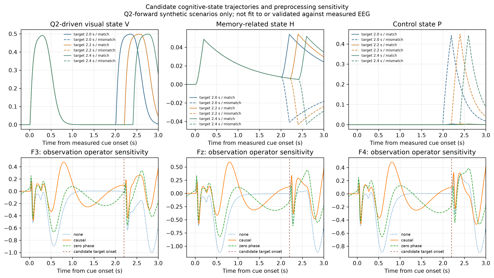

# Q3 最小动态认知模型：机制接口与数值检查

## 目的与范围

本版本实现用户确认的路线1：用 Q2 视觉生成链作为视觉过程驱动，通过宏观状态转移表示记忆保持/匹配与控制响应，再用观测方程映射至 F3/Fz/F4。当前只检验模型方程、Q2 前向接口与情景配置，不拟合实测 EEG、不估计反应时/正确率/漏答率，也不作脑区定位结论。

## Q2 机制接口

候选场景依次构造 cue 与 target 的连续图像输入。Q2 的 LGN ON/OFF、Gabor/构型前端、Wilson–Cowan E/I 群体、源代理及导联矩阵正向生成 `q_Q2(t)` 和 `y_Q2(t)=Gq_Q2(t)`。Q3 只调用前向链；不对 `G` 求逆。五个 Q2 源代理通过 `G` 产生三电极预测，源通道数多于电极数是允许的前向计算。

Q2当前保存的留出曲线仍是 cue-only 且覆盖约800 ms；本脚本重新生成**候选 cue—target 场景**，不会把旧曲线外推为完整试次。

## 宏观过程状态

取 Q2 早期视觉皮层群体的平均兴奋状态作为输入 `u_Q2(t)`，并以 `V(t)` 作有限时间常数平滑。cue 窗口把视觉状态写入记忆相关状态；候选 target 窗口按场景的 `match_evidence` 更新记忆状态。控制状态由目标时段的记忆强度和候选冲突项驱动：

$$
V_{k+1}=\rho_VV_k+(1-\rho_V)u_{Q2,k},\quad
H_{k+1}=\rho_HH_k+(1-\rho_H)(g_sV_kC_k+g_mV_kT_k r),
$$
$$
P_{k+1}=\rho_PP_k+(1-\rho_P)\left(g_{HP}|H_k|T_k+g_\delta T_k\frac{{1-r}}{{2}}\right),
\quad \rho_j=\exp(-\Delta t/\tau_j).
$$

这里 `C_k/T_k` 是由配置的 cue/target 时窗产生的门控，`r∈[-1,1]` 是纯**情景参数**（正值匹配、负值不匹配），不是观测到的正确性。`V` 来自 Q2 网络内部的视觉动态；`H/P` 是功能性宏观状态，不等同于海马/PFC源。

## 传感器观测方程

$$
\hat{{\mathbf y}}_k=(1+g_{{PV}}P_k)G\mathbf q_{{Q2,k}}
 +\boldsymbol{{\ell}}_H H_k+\boldsymbol{{\ell}}_P P_k+\boldsymbol{{\epsilon}}_k,
$$

其中 `Gq_Q2` 是问题二导联矩阵的正向传感器输出；`ell_H`、`ell_P` 暂取固定正交传感器模式作为**可替换的加载情景**，用于验证接口，不代表海马或前额叶的已知头皮拓扑。此阶段不拟合其幅度、时间常数或传感器加载，避免用三通道无约束拟合多个潜过程。

## 可配置情景与预处理

- cue侧：left/right；当前敏感性演示用 left cue。
- 候选target类型：dots, inward, outward。
- 候选target相对cue时刻（秒）：2.0, 2.2, 2.4；它们是时序敏感性分支，不是已确认目标呈现时刻。
- 本次数值演示假设 target 持续200 ms；代码接口可改持续时间或设为持续至模拟终点。MAT未提供可验证的逐试次target offset。
- `match_evidence`分别运行匹配/不匹配情景；不与真实正确/错误标签连接。
- 共同观测处理提供 `none`、单向因果滤波、双向零相位滤波三个配置；均可配置频带、阶数、目标采样率、基线窗。因果滤波保留时间因果性但有频率相关相位延迟；零相位滤波便于离线形态对照，但不能独立证明精细的阶段先后。

## 数值检查结果

- 情景数：18（3种target × 3个候选时刻 × 匹配/不匹配）。有限值通过：18/18。
- `max |y_Q2−Gq_Q2|`：5.937e-08（验证问题二前向投影接口）。
- 匹配情景平均控制峰值：0.00375605；不匹配情景平均控制峰值：0.444854。这只验证设定方程的冲突分支方向，不是行为效应证据。
- 数值检查通过的状态与传感器范围逐情景保存在 `dynamic_model_checks.csv`。

## 图片

图中曲线完全由问题二模型和透明的情景参数生成，不是实测EEG拟合或脑区来源证据。

## 后续实测拟合前必须补齐

1. 目标显示时间戳、反应标记的写入语义、行为反应截止时间及文件到任务的映射。
2. 选定统一预处理算子后，对实测EEG与模型输出应用完全相同的滤波、重采样和基线步骤。
3. 冻结上述方程和参数范围，再做整份记录留出拟合；同时比较 Q2-only、Q2+记忆状态、Q2+记忆/控制状态，并报告参数可辨识性与时间轨迹误差。

重现命令：`python src/C/q3/dynamic_cognitive_model.py`。
