> **使用边界。** 本报告复述当前代码中得到 52.06% balanced accuracy 的一条 EEG 验证分支。它预测的是 cue 阶段的 VisCue 左/右提示标签，使用提示后 0–500 ms 的 EEG 特征。它不是诊断准确率、应答正确率，也不是《第三.pdf》中完整的视觉—海马—前额叶潜在状态模型与 DDM 的总成绩。正式论文宜将其放在“实测 EEG 提示方向解码/补充验证”小节，并与 V/H/P 状态建模、应答前 100 ms 分析、行为模型结果分别报告。

# 摘要

针对第三问中“利用实测脑电验证视觉认知模型”的要求，本文整理一项可复现的提示方向解码实验。研究以四份连续记录中的 F3、Fz、F4 原始 EEG 为输入，按 VisCue 事件对齐；经零相位滤波与试次级质量控制后，cue 锁定阶段保留 387 个试次。每个试次构造 13 维特征，包括 250–500 ms 的基线校正 ERP 均值、θ/α/β 三频带在三通道上的对数功率，以及 F4−F3 α 功率对比。为了检验有限记录下的模型配置选择，设置 49 个预先限定的 Logistic、收缩 LDA、线性 SVM 与 RBF SVM 候选，并采用嵌套留一记录交叉验证；标准化参数只由相应训练折估计。

以固定的 13 维 Logistic 回归（L2 系数 1）为基线，raw-QC cue 任务的四个外层记录 balanced accuracy 等权平均由 46.01% 提高至 52.06%，变化为 +6.05 个百分点，四个外层记录的变化均为正。该结果仍接近二分类机会水平，且 49 个候选在不同外层折中选出不同模型。对 Q1 质量匹配子集重新训练后，cue 提升消失（−0.02 个百分点）；target 锁定分析也未显示提升。因此，52.06% 应视为开发阶段、对样本口径敏感的探索性结果，不支持稳定泛化或临床诊断结论。

**关键词：** 实测 EEG；视觉提示方向；balanced accuracy；嵌套交叉验证；模型选择；质量敏感性

# 1 研究范围与第三问的衔接

《第三.pdf》提出的主体路线是：从实测 EEG 提取认知特征，建立视觉前馈状态 (V_i)、海马样记忆匹配状态 (H_i) 与前额叶样控制状态 (P_i)，并在数据允许时以试次级漂移扩散模型验证行为差异；认知信号终点约为应答前 100 ms。52.06% 的结果来自另一项已完成的分类实验：它以提示方向 (y_i\in\{-1,+1\}) 为标签，使用提示出现后的 cue 锁定 EEG 特征预测左/右提示。

因此，本报告可以为完整模型提供一项**观测特征层面的解码证据**，用以回答“这组三通道 EEG 特征是否包含可泛化到未见记录的提示方向信息”。它不直接估计 (V_i,H_i,P_i)，不拟合观测矩阵 (C)，也不拟合 DDM 漂移率或反应时。它的时间窗也不是应答标记前 100 ms 的可变窗口。论文应分别报告两种时间窗与两个目标，不能把本报告的 52.06% 称为完整第三问模型的准确率。

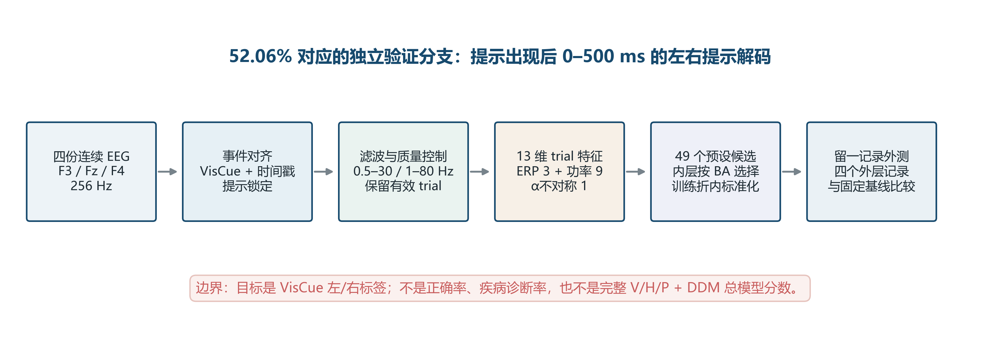

*图1　当前 52.06% 结果的处理链与解释边界。问题二的 EEG 形成机制可作为生理解释背景，但本分类代码使用实测 EEG，不调用问题二的仿真输出。*

# 2 数据、事件与试次筛选

## 2.1 数据单元与标签

分析对象为四份记录：VisualCogA_Task-1、VisualCogA_Task-2、VisualCogB_Task-1、VisualCogB_Task-2。源信号以 256 Hz 采样，分类只取 F3、Fz、F4 三个脑电通道。VisCue 事件提供提示发生时间和左右提示标签；时间戳用于将事件映射到 EEG 采样点。行为/应答通道仅作为 trial 元数据供其他分析使用，本分类的标签是 VisCue 提示侧，而不是第9通道选择侧、正确/错误或漏答标签。

总共有 400 个候选 cue 试次。raw-QC cue 分析保留 387 个；其中左提示 200 个、右提示 187 个。为检查前序 Q1 清理口径对结论的影响，另按 Q1 试次映射保留 297 个质量匹配 cue 试次。target 锁定分析因窗口边缘与数据有效性不同而保留 396 个 raw-QC 试次；Q1 target 子集同为 297 个。Q1 的 EEG 波形不进入第三问特征计算，它只提供时间映射和质量标签。

## 2.2 质量控制

事件窗口采用 raw 连续 EEG。ERP 分支与功率分支在连续信号上分别滤波后再切 epoch，以减少逐 trial 滤波带来的边缘效应。在滤波后的试次 epoch 中，任何通道出现非有限样本、绝对值达到 999.5，或通道峰峰值不超过 $10^{-8}$ 的 flatline，都会使对应特征分支的该 trial 判为无效。质量检查标记异常，不对样本插值或改写。由于只使用三路前额 EEG 且没有独立眼电参考，本流程不报告 ICA 去伪迹；仍可能有肌电、眼动与残余运动伪迹。

| 样本口径 | Cue 锁定 | Target 锁定 | 用途 |
|---|---:|---:|---|
| raw-QC | 387 | 396 | 主分类比较与事件阶段敏感性 |
| Q1 质量匹配 | 297 | 297 | 样本口径敏感性分析 |

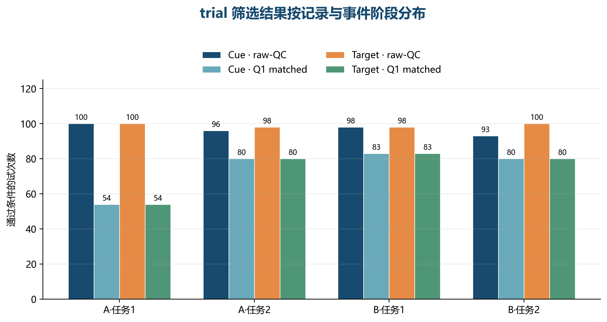

*图2　四份记录在 cue/target 阶段的有效 trial 数。target 事件时刻按 cue+2.2 s 的任务排程假设对齐，不能视为独立检测到的真实目标 marker。*

# 3 信号预处理与事件窗

原始连续 EEG 以 256 Hz 读取，信号沿通道维组织为 ([F3,Fz,F4]^T)。ERP 分支经四阶 Butterworth 0.5–30 Hz 带通，功率分支经四阶 Butterworth 1–80 Hz 带通；均以 SOS 形式作前向—反向滤波，得到零相位结果。cue 锁定 epoch 为 ([-0.10,0.50]) s，基线为 ([-0.10,0)) s；ERP 候选均值取 ([0.25,0.50)) s。频带功率仅从事件后部分计算，即 cue 的 ([0,0.50)) s。target 锁定窗口为 ([-0.10,0.80]) s，时间锚点暂取 cue+2.2 s，仅用于次要敏感性分析。

任务稿中的“应答前约 100 ms”信号另以应答标记时间 (t_{act}) 为锚，截取从 cue 到 (t_{act}-0.10) s 的可变长度片段；但这条可变长度分支没有进入 52.06% 模型。对于无应答 marker 的试次，也不能仅靠 marker 缺失断定行为漏答，除非实验时限和事件语义已验证。

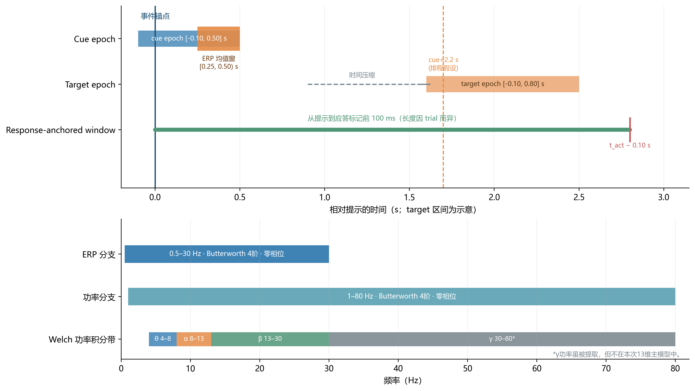

*图3　cue 分类使用的 cue 锁定窗口、ERP 与功率频段；应答终点窗口用于第三问其他分支，不是 52.06% 分类器的输入。*

# 4 特征构造

## 4.1 13 维主特征

对 trial (i)，基线校正后的通道 ERP 均值定义为

$$
E_{i,c}=\bar{x}^{ERP}_{i,c}(W_E)-\bar{x}^{ERP}_{i,c}(W_B),
$$

其中 (c\in\{F3,Fz,F4\})，(W_B=[-0.10,0)) s 为基线窗，(W_E=[0.25,0.50)) s 为事件后均值窗，共 3 个 ERP 均值特征。本文将其称为**额区 ERP 均值候选特征**，不把它单独等同于典型顶区 P300：目前只有三个额区电极，缺少完整头皮拓扑证据。

对功率分支，每个 trial 的事件后片段先减去片段均值，再用 Welch 方法估计功率谱密度。实现设置 `nperseg=片段长度`、`noverlap=0`、constant detrend 与 density scaling，并沿用默认 Hann 窗；在频带内对谱密度作梯形积分，最终取自然对数：

$$
L_{i,c,b}=\log\left(\int_{f_{min}(b)}^{f_{max}(b)}\widehat S_{i,c}(f)\,df\right).
$$

三个频带乘三个通道得到 9 个特征。由于 cue 功率窗长仅 0.5 s，离散频率间隔约为 2 Hz；θ频带的积分精度因此有限，不能过度解释窄频峰。

最后增加一个前额 α 功率对比：

$$
AI_{\alpha,i}=L_{i,F4,\alpha}-L_{i,F3,\alpha}.
$$

三类特征合计 13 维。由于 (AI_\alpha) 是 F3/F4 α 对数功率的线性组合，候选空间同时包含删去该冗余项的 12 维版本。γ功率、ERP 峰值与潜伏期、ERP 不对称指数、试次级应答窗统计量未进入该次候选模型；通道9也未进入 EEG 特征矩阵。

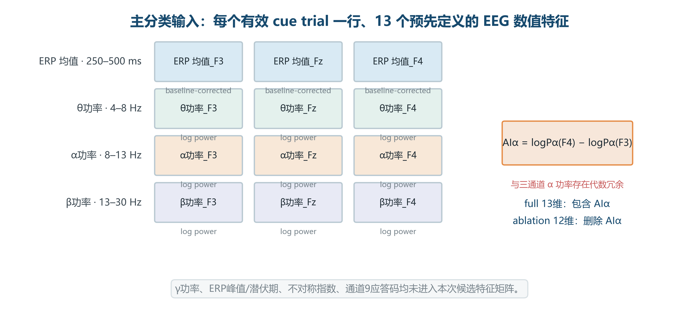

*图4　主特征的组成及 α 不对称项的冗余消融。*

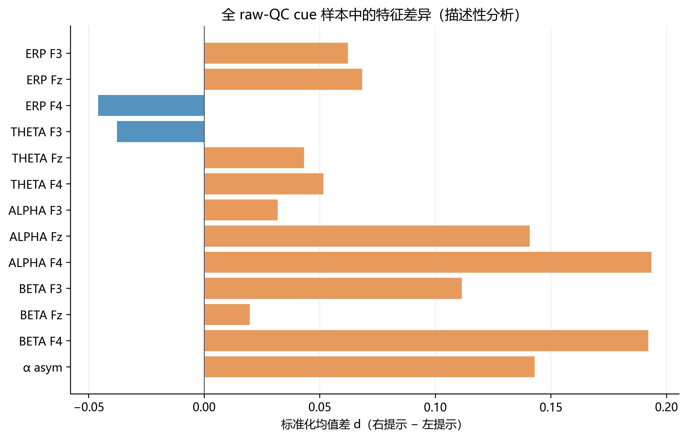

*图5　右提示与左提示的单变量标准化均值差。该图以最终 raw-QC cue 样本作事后描述，不用于筛选特征、拟合缩放参数或挑选模型。*

# 5 分类器与参数设计

## 5.1 固定基线

比较基线为固定的 13 维 Logistic 回归，标准化后取 L2 惩罚系数 $\lambda=1$，概率阈值 0.5。实现优化的目标可写为

$$
\mathcal L(\beta)=\sum_i\{\log(1+e^{\eta_i})-y_i\eta_i\}+\frac{\lambda}{2}\|\beta_{1:p}\|_2^2,
\quad \eta_i=\beta_0+x_i^T\beta_{1:p},
$$

截距 $\beta_0$ 不受 L2 惩罚。该固定模型与被冻结的初始流程一致，因此可以做同折配对比较。

## 5.2 49 个预设候选

搜索空间包含 4 个特征集：完整 13 维、删除冗余 α 对比后的 12 维、3 维 ERP-only，以及 9 维 bandpower-only。分类器候选由标准 Logistic、收缩 LDA、robust-scaled Logistic、线性 SVM 与 RBF SVM 组成。全体候选在内层验证的平均 BA 上排序；不在外层测试记录上挑选配置。

| 候选族 | 参数设置 | 设计目的 |
|---|---|---|
| 标准 Logistic | $\lambda\in\{0.1,10,100\}$，另含固定基线 $\lambda=1$ | 调整正则化强度，并比较四种特征集 |
| 收缩 LDA | `solver=lsqr`, `shrinkage=auto` | 小样本下进行协方差收缩 |
| Robust Logistic | robust scaler；$\lambda\in\{0.1,1,10\}$；完整或去冗余特征 | 检查中位数/IQR 缩放对异常值敏感性的影响 |
| 线性 SVM | 标准 scaler；$C\in\{0.01,0.1,1,10\}$；完整或去冗余特征 | 比较线性间隔与正则化强度 |
| RBF SVM | 标准 scaler；$C\in\{0.1,1,10\}$，$\gamma\in\{\text{scale},0.03,0.1\}$；完整或去冗余特征 | 检查有限的非线性边界候选 |

`standard` 缩放使用训练折均值和标准差；`robust` 缩放使用训练折中位数与四分位距。若训练折某列尺度非有限或近零，则将该列尺度设为 1。验证数据只使用训练折参数变换。概率型模型采用 0.5 阈值，SVM 决策函数采用 0 阈值；未调阈值。候选同分时按事先列出的候选顺序优先。

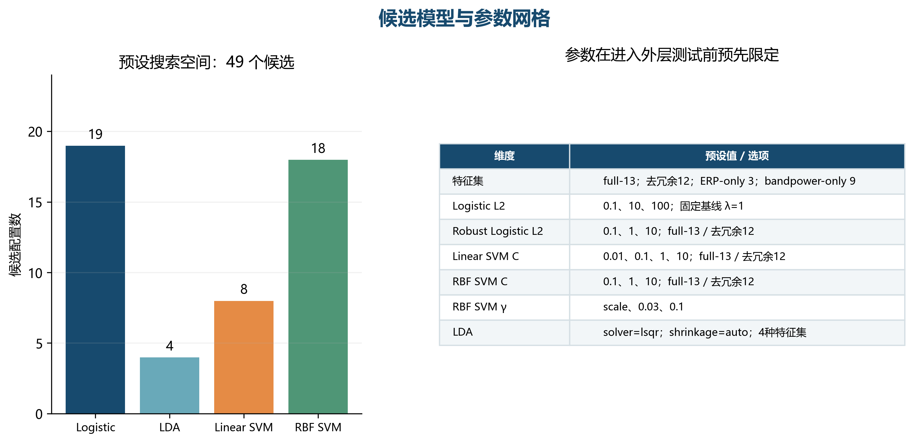

*图6　49 个候选配置的模型族数量和超参数取值。阈值、特征频段及搜索范围未通过外层测试得分反向调整。*

# 6 嵌套留一记录验证

普通随机 trial 切分会使同一文件中的记录同时进入训练和测试，难以反映对新记录的迁移。这里将完整文件作为分组单位。外层依次留出四份记录之一，其余三份作为训练数据。对每个外层训练集合，内层再依次留出其中一份记录，对 49 个候选各自评估 3 个内层 BA，并取算术平均。平均内层 BA 最高的候选配置被选中；随后用三份外层训练记录重新估计缩放参数与模型，最后只在未见的外层记录上评分一次。

主指标为记录级 balanced accuracy：

$$
BA_r=\frac{1}{2}\left(\frac{TP_{left,r}}{N_{left,r}}+\frac{TP_{right,r}}{N_{right,r}}\right),\qquad
\overline{BA}=\frac{1}{4}\sum_{r=1}^{4}BA_r.
$$

即每个外层记录先对左右两类召回率取平均，再对四份记录等权平均。这是 52.06% 的计算口径；将 387 个外层预测直接汇总再计算 pooled BA 会得到另一个数值。BA 能降低每个记录内轻微类别数差异对评分的影响，但不能弥补只有四个记录组所带来的估计不确定性。

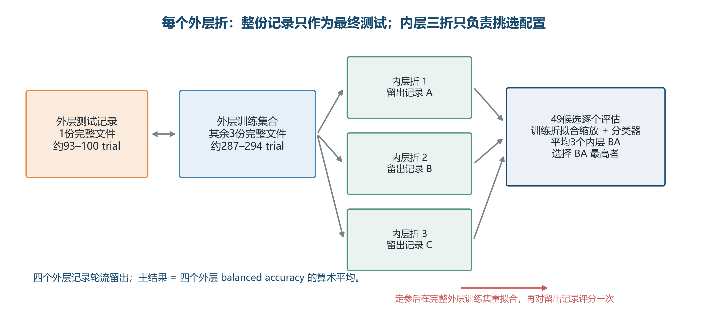

*图7　每份记录在外层只用于一次测试；超参数选择只查看剩余三份记录的内层验证结果。*

# 7 主结果与模型解释

## 7.1 52.06% 的来源

| 指标（四外层折均值） | 固定 Logistic 基线 | 嵌套选择程序 | 变化 |
|---|---:|---:|---:|
| Balanced accuracy（主指标） | 46.01% | **52.06%** | **+6.05 pp** |
| Accuracy | 46.73% | 51.63% | +4.91 pp |
| ROC AUC（逐外层折后等权平均） | 48.34% | 52.52% | +4.18 pp |
| Macro-F1 | 44.90% | 47.25% | +2.35 pp |

“+6.05 pp”表示 52.06%−46.01%=6.05 个百分点，不是相对增长 6.05%。四个外层记录的 BA 分别从 49.07%、41.67%、47.95%、45.35% 变为 54.35%、52.78%、52.22%、48.91%，折内增量均为正（+5.27、+11.11、+4.26、+3.56 pp）。分折一致性是这一轮搜索的积极迹象；但四个文件有限，仍无法提供稳定的总体泛化推断。

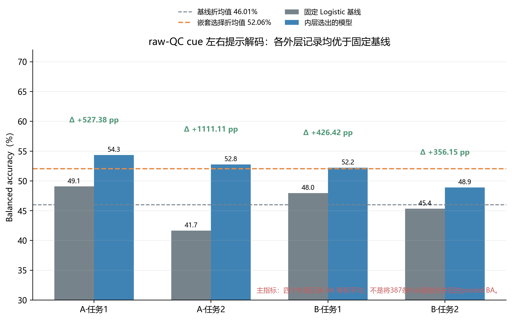

*图8　每个柱为一个外层记录 BA；虚线为四折等权均值。误差线未绘制，因为仅四折且记录并非充分随机抽样的独立大量样本。*

## 7.2 每折所选模型

| 留出记录 | 内层所选配置 | 外层 BA | 相对基线 |
|---|---|---:|---:|
| A-1 | RBF SVM；12维；$C=10,\gamma=0.03$ | 54.35% | +5.27 pp |
| A-2 | RBF SVM；13维；$C=10,\gamma=\text{scale}$ | 52.78% | +11.11 pp |
| B-1 | RBF SVM；12维；$C=1,\gamma=0.1$ | 52.22% | +4.26 pp |
| B-2 | Logistic；ERP 3维；$\lambda=100$ | 48.91% | +3.56 pp |

其中 A-1/A-2/B-1/B-2 分别表示 VisualCogA_Task-1、VisualCogA_Task-2、VisualCogB_Task-1、VisualCogB_Task-2。各外层训练集分别包含 287、291、289、294 个 trial；对应留出集分别为 100、96、98、93 个 trial。

选择结果以 RBF SVM 为主，但第四折选出强正则化的 ERP-only Logistic。因而这套流程没有得到一个稳定、唯一的分类器；若后续需要部署单一模型，应在新增训练记录上预先锁定模型与参数，然后另留独立测试记录。

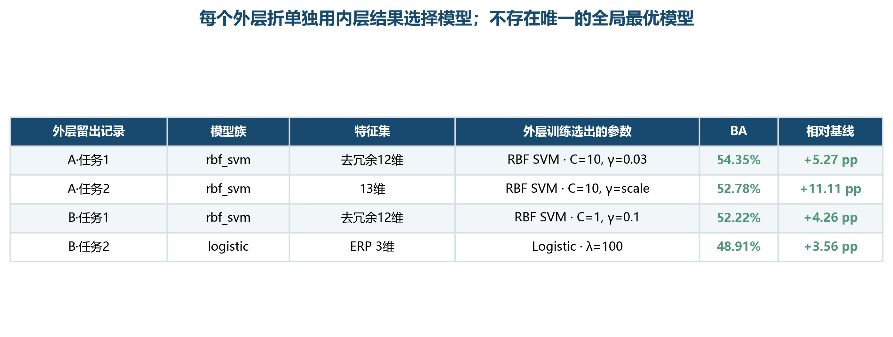

*图9　配置按外层训练折分别选择。该表不能被解释为从测试集上逐折挑选出的“最佳模型”；选择依据始终是对应的内层 BA。*

## 7.3 错误类型的辅助观察

将所有外层预测按 trial 合并得到的计数矩阵为：基线 $\begin{bmatrix}113&87\\119&68\end{bmatrix}$，嵌套选择 $\begin{bmatrix}135&65\\122&65\end{bmatrix}$；行依次为实际左/右，列为预测左/右。嵌套选择减少了左提示误判为右的计数，但右提示召回并未相应改善。应答类别的漏判模式仍不平衡；这也是 pooled 分类准确率与 BA 需要同时解释的原因。

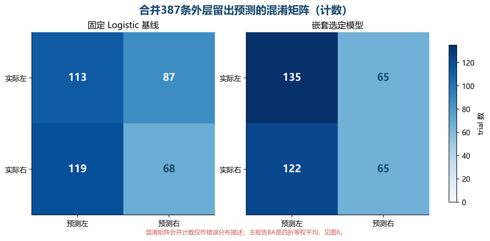

*图10　基线与嵌套选择程序的外层留出预测计数。混淆矩阵用于看错误构成；主结论仍依据四折等权的 BA。*

# 8 稳健性与样本口径敏感性

为评估提升是否依赖某一种数据定义或事件阶段，在同一模型搜索协议下比较 raw-QC 与 Q1 质量匹配样本，并比较 cue/target 锁定分析。Q1 子集上的模型重新在 Q1 训练数据中进行内层选择，不能与 raw-QC 模型在 Q1 保留试次上的子组诊断混为一谈。

| 分析口径 | 有效 trial 数 | 基线 BA | 嵌套选择 BA | 变化 |
|---|---:|---:|---:|---:|
| raw-QC cue（主结果） | 387 | 46.01% | 52.06% | +6.05 pp |
| Q1 匹配 cue | 297 | 48.68% | 48.65% | −0.02 pp |
| raw-QC target | 396 | 52.25% | 50.10% | −2.15 pp |
| Q1 匹配 target | 297 | 51.04% | 49.70% | −1.34 pp |

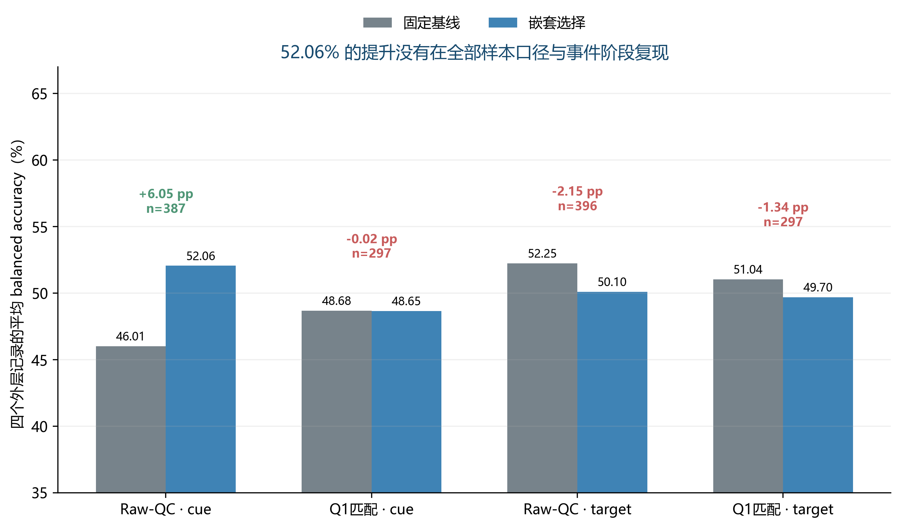

*图11　只有 raw-QC cue 口径出现正向提升；Q1 匹配 cue 的嵌套选择与基线几乎相同，target 两种口径均未改善。*

进一步将 raw-QC 训练模型在留出记录上的预测按 Q1 质量标签分组，只作诊断，不影响候选选择。cue 的 Q1 保留组（297 trial）BA 从 44.2% 增至 54.2%；Q1 未保留但通过 raw-QC 的 90 trial BA 从 52.0% 降至 47.3%。这说明主结果的改善并未一致覆盖所有 EEG 质量子组。另一方面，重新限定训练样本后 Q1 cue 提升消失，提示训练样本构成和模型选择都可能影响这个结果。

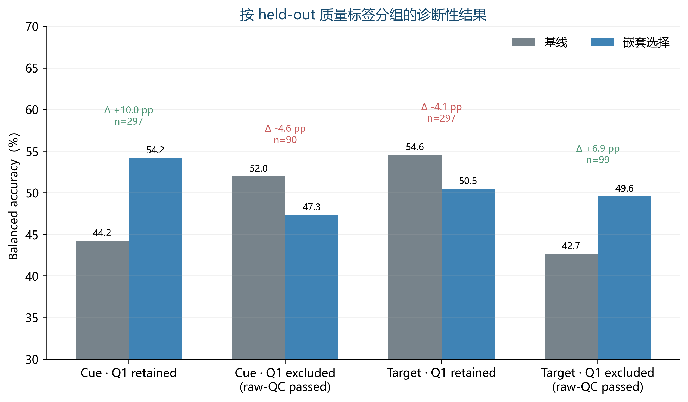

*图12　质量子组只在外层留出预测后分层；它是描述性诊断，样本量和分组差异不足以作因果解释。*

# 9 结论、论文写法与局限

## 9.1 可报告结论

在当前四份 EEG 记录和预设候选空间下，嵌套模型选择程序对 raw-QC cue 左右提示分类的外层 BA 均值为 52.06%，较固定 Logistic 基线 46.01% 增加 6.05 个百分点，且四个外层记录的单折变化均为正。这个结果支持“部分 cue 锁定额区 EEG 特征携带有限的左右提示相关信息”这一谨慎表述。由于 Q1 匹配与 target 锁定比较没有复现同等提升，结论应限定于当前 raw-QC cue 分析口径。

## 9.2 应避免的表述

不得将 52.06% 写成第三问完整 V/H/P 状态模型的识别准确率、DDM 行为预测准确率、任务正确率或精神疾病诊断率；不得称 13 维输入中的 ERP 均值已确认是标准 P300；不得声称该模型对新个体或新实验室具有稳定泛化。尤其注意，Q1 匹配 cue 的独立嵌套结果没有提升，而 raw-QC 训练模型在 Q1 排除子组上表现下降。

## 9.3 限制与下一步

1. **独立记录数仅为4。** trial 数不能替代真正独立的记录/受试者数；当前外层 BA 的估计方差未知。
2. **多轮开发比较共用同一批外层记录。** 嵌套 CV 防止了本轮 49 个候选的直接外层调参泄漏，但不能消除团队跨多轮特征/模型探索造成的总体选择偏差。
3. **样本口径敏感。** raw-QC cue 增益在重新限定到 Q1 子集后消失。
4. **标签语义有限。** 预测的是 VisCue 提示方向，不等于应答方向是否正确；应答 marker 编码、反应时和任务目标真值要单独审计。
5. **EEG 空间信息有限。** 只有 F3/Fz/F4，不能定位海马或 LGN，也无法确认 P300 的经典拓扑。
6. **频带估计受短窗影响。** cue 功率窗口约 0.5 s，低频分辨率有限；短窗 Welch 积分不宜作精细谱峰解释。
7. **目标事件锚点为排程假设。** cue+2.2 s target 结果只作为次要敏感性分析；主要 52.06% cue 结论不受该锚点影响。
8. **当前分支未检验完整认知状态与 DDM。** 后续应在独立流程中报告 (V/H/P) 估计、观测重建或消融、应答前 100 ms 特征、正确/错误/漏答分类以及行为 DDM 的拟合与预测检验。

建议最终论文将本结果写成一段补充验证，并将 52.06%、46.01% 和 +6.05 pp 同表展示；同时注明 `n=387`、4 个留出文件、Q1 cue 敏感性结果为 −0.02 pp。若要保留显著性或总体推广结论，需新增独立记录或受试者后再作推断。

# 10 可复现性与结果追溯

本报告的主结果来自冻结初始输入特征与第一轮嵌套模型搜索，不覆盖 baseline snapshot。主要文件如下：

- 冻结特征与基线：`baselines/20260925_initial/output/trial_features.csv`
- 搜索实现：`experiments/model_search.py`
- 第一轮实验输出目录：`output/experiments/20260925_model_search_v1/`
- 逐外层折结果：上述目录中的 `nested_selected_fold_metrics.csv`
- 基线与嵌套选择逐 trial 预测：上述目录中的 `baseline_oof_predictions.csv`、`nested_selected_oof_predictions.csv`
- 参数、特征集与主要汇总：上述目录中的 `summary.json`
- 本报告图形的逐图数据来源、哈希和参数：同目录 `figures/*.figure.json`

该结果的主要算式是：

$$
\overline{BA}_{nested}=\frac{0.543478+0.527778+0.522157+0.489130}{4}=0.520636.
$$

$$
\overline{BA}_{baseline}=\frac{0.490741+0.416667+0.479515+0.453515}{4}=0.460109.
$$

两者之差为 0.060526，即 +6.0526 个百分点。图和表中的百分数均由逐折文件重新读取，渲染图另保存 PNG、SVG 和 JSON 数据说明。

# 参考资料

1. 第二十三届中国研究生数学建模竞赛 C 题：《服务于脑机接口与精神性疾病诊断的脑电图计算模型》，用户提供的题目文件。
2. 用户提供的《第三.pdf》（2026年9月24日版本），用于界定完整第三问的 V/H/P 状态建模、应答前窗口及 DDM 扩展分析范围。
3. 项目计算记录：冻结基线 `20260925_initial` 与嵌套搜索 `20260925_model_search_v1`。具体文件路径见第10节，可在相应 CSV/JSON 与源代码中追溯。

---

**稿件状态：** 论文写作参考稿；仍需与第三问完整 V/H/P 模型及 DDM 的实际输出合并，并在新增独立记录上确认泛化后，方可形成最终结论。
