# 问题三：实现流程、核心模型与代码说明

## 1. 这套代码解决什么问题

代码把问题三拆成三条相互衔接、但不混用变量的计算路径：

1. **行为事件路径**：从通道8视觉提示和通道9动作标记恢复每试次的线索侧、响应侧、线索—响应方向一致性、试次区间动作标记计数、选定分析窗内的标记计数，以及动作段持续时间。
2. **静态 EEG 特征路径**：从原始 F3/Fz/F4 连续脑电提取提示锁定、候选目标锁定和应答前特征，构造可解释的 V/H/P 观测代理，并进行记录留出分类、路径回归和消融分析。
3. **Q2—Q3 动态模型路径**：把问题二的视觉/LGN/Wilson–Cowan 前向输出作为视觉驱动，递推视觉、记忆相关和控制状态，再用整份记录留出检验这些状态能否改善晚期 EEG 波形预测。

动态模型路径是问题三的主要机制模型；静态特征、行为预测和消融是独立的辅助分析。通道9在行为模型中提供响应方向标签，也可定义应答事件或应答前评分窗口；它不作为 EEG 特征、动态认知状态输入或模型自变量，避免把行为结果泄漏到 EEG 预测中。通道8/9方向相同仅称为“方向一致”，方向不同称为“方向不一致”；Task-2 的任务映射尚未核实，因此该比较不等于任务正确性，相关分类称为“一致性预测”。

**当前实现已形成可运行的端到端计算闭环**：数据读取与事件审计 → 试次构造与 QC → 模型状态/特征生成 → 训练记录拟合 → 留出记录评分 → 汇总报告与图表。闭环完成表示代码流程和可复核计算完成，不表示潜在脑区或认知机制已被数据唯一识别。

## 2. 代码总流程与数据分支

~~~text
原始 MAT（F3/Fz/F4、VisCue、TimeStamp、Action/TgtAct）
  ├─ 01_audit_events.py → event_audit.csv
  │    └─ 02_extract_trials.py → trial_table.csv
  │         ├─ 08_behavior_event_audit.py → 行为真值/时序元数据审计（可选外部表）
  │         ├─ 02b_preprocess_raw.py → cue/target EEG epoch、t_act 前 EEG 窗
  │         │    └─ 03_extract_features.py → trial_features.csv
  │         │         ├─ 04_cognitive_state.py → V/H/P 代理与描述性路径
  │         │         │    ├─ 05_behavior_model.py → 选择方向/一致性记录留出预测
  │         │         ├─ 06_validate.py → EEG 提示侧记录留出验证
  │         │         └─ 07_ablation.py → V/H/P 消融与特征重构检验
  │         └─ Q1 清洗结果仅提供试次时间映射和质量标记，不提供 Q3 EEG 特征
  └─ 09_event_time_semantics.py → 原始事件语义、时序和 Q2 导联可辨识性审计
       └─ dynamic_validation.py
            ├─ dynamic_cognitive_model.py → Q2 前向模拟 + V/H/P 动态状态
            └─ 整记录留出 EEG 观测方程、NRMSE、敏感性图表与报告
~~~

上图表示代码依赖。动态模型直接从原始 MAT 读取实测 EEG 和事件；运行前需先生成第 9 通道事件语义审计文件。

## 3. 数据、事件含义和统一约定

### 3.1 使用的数据

当前配置读取四份 VisualCog 原始 MAT，每份约 100 个提示试次，共审计 400 个试次；原始采样率为 256 Hz。允许进入 EEG 特征计算的电极只有 F3、Fz、F4。通道8的 VisCue 用于提示侧/目标侧标签，时间轴取 TimeStamp；通道9的 Action 或 TgtAct 只用于动作事件、行为结果和应答前窗口端点。

Q1 清洗输出仅通过试次编号和时间戳匹配来提供质量参照。Q3 的主要 EEG 波形和特征均由原始 MAT 重新计算，不能把 Q1 清洗 EEG 当作本流程的特征输入。

### 3.2 提示和动作事件

令离散信号为 \(x[n]\)，非零活动指示量为 \(a[n]=\mathbf 1(x[n]\ne0)\)。对提示和动作通道均取零到非零边沿：

$$
n_e=\{n:a[n]=1,\ a[n-1]=0\},\qquad t_e=\mathrm{TimeStamp}[n_e].
$$

对 VisCue，提示侧 \(s_c=\mathrm{sign}(x_8[n_e])\)，−1 表示左、+1 表示右。对通道9，首个零到非零边沿定义绝对应答时刻 \(t_{\mathrm{act}}\)。若 TgtAct 在同一个非零动作段中先出现同侧 ±1、后出现 DataLabel 声明的 ±2，程序将其视为一次动作：应答起始仍取最早边沿，选择方向按标签声明的 ±2 码解码；不能把幅值从 1 变为 2 的时刻另算成第二次应答。

### 3.3 方向一致性、区间动作标记和动作段时长

设 \(s_c\in\{-1,+1\}\) 为通道8线索方向，\(s_r\) 为通道9按 DataLabel 声明码解码的响应方向。仅当响应方向成功解码时定义方向一致性指标：

$$
\mathrm{consistency}_i=\mathbf 1(s_{r,i}=s_{c,i}),\qquad
\mathrm{inconsistency}_i=\mathbf 1(s_{r,i}\ne s_{c,i}).
$$

该指标只比较通道8线索方向与通道9解码出的响应方向。尤其在 Task-2 的“线索—目标”映射尚未核实前，同向/异向不能解释为任务答对/答错，也不能据此报告任务正确率。方向无法解码时一致性指标留空。

若 cue 起点至下一 cue 起点之间没有通道9动作边沿，记录为“该 cue 区间未观测到通道9动作标记”；有边沿则记录标记数。只有在该区间已被实验定义为完整且正式的作答期限时，标记缺失才能进一步解释为漏答。当前没有正式截止规则，故报告区间标记观测，不把它直接解释成实验漏答率。

若第 \(i\) 个 cue 和下一个 cue 的样本序号分别为 \(n_i,n_{i+1}\)，区间动作标记数及其是否缺失写为

$$
N_i=\sum_{n=n_i}^{n_{i+1}-1}\mathbf 1(x_9[n-1]=0,\ x_9[n]\ne0),\qquad
M_i=\mathbf 1(N_i=0).
$$

cue 相对窗口 \([t_c-1,\ t_c+5]\) 秒仅作为**本项目选定的动作码观测窗**。在窗内统计 DataLabel 声明的应答码样本数 \(K_i\)；Action 使用标签声明的 ±1 码，TgtAct 使用声明的 ±2 码：

$$
K_i=\sum_{n\in[t_c-1,t_c+5]}\mathbf 1(x_9[n]\in\mathcal C_{\mathrm{declared}}).
$$

\(K_i\) 只表示自定义观测窗内的通道9声明码计数，不表示及时应答。应答是否迟答必须依据真实目标呈现时刻和实验正式截止规则；这两项信息目前缺失，因此真实迟答情况尚无法判定。选定窗口之外或区间内无标记，都不能单独作为迟答或漏答结论。

首个连续非零动作段从采样点 \(n_0\) 到首个归零点 \(n_1\)，动作段持续时间为：

$$
D_{\mathrm{bout}}=\frac{n_1-n_0}{f_s}.
$$

这是通道9非零段的持续时间，不是目标出现至动作开始的传统反应时。传统反应时需要真实逐试次目标时刻 \(t_T\)，定义为 \(t_{\mathrm{act}}-t_T\)；当前数据没有独立目标 onset 标记，因此该反应时不能从代码中可靠得到。cue+2.2 秒只是由提示时长与等待时长构成的计划时刻假设，不能替代真实事件时间。

应答前 EEG 端点遵循参考模型取 \(t_{\mathrm{act}}-0.100\) 秒。特征支路提取 cue 起点至该端点的累计窗，以及其末 500 ms；动态验证中还按“记录×提示侧”分组，以组内 \(t_{\mathrm{act}}\) 中位数裁切均值波形评分。这些是应答前 EEG 窗口/评分窗，不是逐试次 RT，也不进入行为分类的预测变量。

## 4. 模块清单：目的、输入输出和作用

| 模块 | 目的与处理 | 输入 | 主要输出 | 在整体解答中的作用 |
|---|---|---|---|---|
| config.py | 集中定义路径、记录名、通道、采样率、滤波频段、时窗和目标时刻假设 | 项目路径与固定建模设置 | 供所有模块导入的常量 | 让各模块使用同一套窗口和通道约定，避免参数散落造成口径不一致 |
| common.py | 读取 MAT、解析 DataLabel、检测提示/动作边沿、Task-2 动作段解码、计算方向一致性与动作标记字段、建立 Q1 质量映射 | 原始 MAT、可选 Q1 清洗结果、统一配置 | 事件表/试次字段、动作持续时间和 QC/映射信息 | 统一事件定义；保证动作码幅值变化不会误增事件数，并将方向一致性与任务正确性区分 |
| signal_processing.py | 连续滤波、事件 epoch 截取、伪迹 QC、Welch 频带功率与 ERP/窗口特征 | F3/Fz/F4 信号、时间轴、事件时刻、滤波设置 | 处理后的信号、固定窗波形、特征字典和 QC 标记 | 把原始电压序列转成可复算、带质量标记的分析输入 |
| 01_audit_events.py | 汇总原始事件并将 Q1 保留试次按时间/试次键匹配 | 四份原始 MAT、Q1 的质量标记 | event_audit.csv、trial_mapping_audit.csv、record_audit.csv、event_audit_summary.json | 核对每份数据的提示/动作数、事件映射和任务记录基本信息 |
| 02_extract_trials.py | 生成一行一试次的主表，附加 Q1 质量标记及可选外部行为标签 | event_audit.csv、可选 input/behavior_labels.csv | trial_table.csv、q1_quality_mapping_reference.csv、trial_table_build_summary.json | 为特征、行为模型和质量敏感性分析提供同一试次主键 |
| 08_behavior_event_audit.py | 独立审计线索—响应方向一致性及动作标记；可选合并实验真值、目标时刻、截止规则和记录映射表 | trial_table.csv、原始 MAT、可选 input 下的外部核验表 | behavior_event_audit/behavior_trial_audit.csv、record_metadata_audit.csv、behavior_record_summary.csv、summary JSON | 检查通道推导结果并保留外部核验冲突；没有外部真值时不将方向一致性升级为任务正确性，也不判定真实迟答 |
| 02b_preprocess_raw.py | 以整条连续记录滤波后再按 cue 或候选 target 切段，并另存 cue 到 \(t_{\mathrm{act}}-100\) ms 的片段 | trial_table.csv、原始 EEG 和事件时间 | q3_raw_event_epochs.npz、q3_pre_response_epochs.npz、两个 epoch 索引 CSV、raw_signal_processing.json | 产生特征提取和预响应分析的原始波形输入；target 2.0–2.4 s 是敏感性网格，不是真值 |
| 03_extract_features.py | 提取 cue/target ERP、频带功率、侧化指数和应答前累计/末窗特征，逐阶段保留 QC | 02b 的 NPZ 波形、事件索引 | trial_features.csv、feature_definitions.csv、raw_feature_qc_summary.json、quality_agreement.csv 和图 | 将信号处理结果整理成有列定义的试次级特征表 |
| 04_cognitive_state.py | 构造静态 V/H/P 观测代理，计算描述性 OLS 路径和分组均值 | trial_features.csv | state_scores.csv、state_proxy_definitions.csv、cognitive_path_coefficients.csv、state_condition_effects.csv、模型说明和图 | 提供静态特征解释与后续行为/消融分析输入；不拟合潜在神经源 |
| 05_behavior_model.py | 独立预测通道9选择方向和线索—响应方向一致性；分记录留出；真实 RT 不可得时跳过 DDM | trial_table.csv、state_scores.csv | 行为预测 CSV、折间模型比较、behavior_model_status.json、按记录的行为摘要 | 检验 cue、候选任务编号及 EEG 状态对选择方向/方向一致性的跨记录预测价值；一致性预测不等同于任务正确性或诊断 |
| 06_validate.py | 从 cue/target 锁定 EEG 特征预测通道8提示侧；比较原始 QC 样本与 Q1 质量匹配样本，并检查目标时间偏移 | trial_features.csv、trial_table.csv 和配置 | eeg_heldout_record_predictions.csv、eeg_heldout_record_metrics.csv、target_timing_sensitivity.csv、validation_summary.json、图与解释报告 | 验证特征是否含有可泛化的视觉提示侧信息；这是提示侧解码，不等同于行为选择或正确率 |
| 07_ablation.py / ablation.py | 比较删去 V/H/P、加入 gamma/任务候选编号时的提示侧分类，并以训练折代理重构留出特征 | state_scores.csv 或 trial_features.csv | ablation_cv_metrics.csv、ablation_reconstruction_metrics.csv、ablation_summary.json、图和报告 | 检查状态代理各组成是否有增量预测关联；重构结果不表示潜在脑源恢复 |
| 09_event_time_semantics.py | 审计 cue 与 \(t_{\mathrm{act}}\) 的时间关系、文件分组以及三电极/五源导联可辨识性 | 原始 MAT、Q2 导联信息 | continuation_audit 下逐试次/逐记录 CSV、事件报告、图及可辨识性 JSON | 把观察到的事实与目标时间/任务映射假设分开，为动态模型提供事件解释边界 |
| dynamic_cognitive_model.py | 调用问题二视觉与 EEG 正向模拟，生成 V/H/P 状态，并提供统一滤波/重采样/基线和观测函数 | cue/target 场景、Q2 参数/驱动标定、候选状态参数 | Q2 五源代理、F3/Fz/F4 正向轨迹、cue/target 门控、V/H/P 轨迹和数值检查 | 把问题二的前向脑电机制接到问题三的认知状态构造；不反演三电极下的五源 |
| dynamic_validation.py | 对实测 EEG 与候选 Q2 场景做整记录留出比较，估计训练折观测系数并评分 | 原始 F3/Fz/F4、事件审计、动态模型候选轨迹 | dynamic_cv_metrics.csv、t_act_endpoint_cv_metrics.csv、validation_summary.json、留出预测与六张图 | 主要模型检验：评估加入记忆/控制状态后是否改善留出记录预测；不直接证明认知机制真实或模型解释力良好 |
| experiments/*.py | 运行独立的嵌套记录留出分类器搜索、时序/阈值搜索及质量子组汇总 | trial_features.csv、实验参数和单独指定的输出目录 | 每个实验目录自己的候选参数、折间指标、预测和汇总报告 | 开发阶段的探索分析；不属于主流程，也不替代 dynamic_validation 的预先定义模型比较 |

说明：08 是方向一致性、动作标记和外部元数据的审计模块。通道8/9本身可计算方向一致性及标记计数；任务正确性需要经过核实的任务映射/正确响应真值，真实迟答需要真实目标时刻与正式截止规则。cue−1 至 cue+5 秒只用于窗口内标记计数。03/04/05/06/07 构成辅助特征分析支路；dynamic_validation 才是将 Q2 前向过程与动态认知状态结合的主模型检验。

## 5. 特征构造与静态认知代理公式

### 5.1 信号预处理和质量控制

静态特征支路对每份完整连续记录的 F3/Fz/F4 分别滤波，再切事件窗，避免每个短 epoch 从零状态启动滤波。ERP 分支使用四阶零相位 Butterworth 0.5–30 Hz；时频分支使用四阶零相位 Butterworth 1–80 Hz。cue epoch 为相对事件 \([-0.10,0.50)\) 秒；候选 target epoch 为 \([-0.10,0.80)\) 秒。原始硬截幅阈值为绝对幅值 999.5（原始单位未校准），另标记非有限值和平直通道。QC 只标记并记录排除原因，不对原始值作静默修补。

动态验证是另一套统一处理：对连续实测 EEG 及 Q2 模拟 EEG 同样比较不滤波、因果 0.5–30 Hz 和零相位 0.5–30 Hz，重采样到 128 Hz，并减去 cue 前 \([-0.2,0)\) 秒基线。零相位仅用于离线敏感性比较，不代表在线 BCI 可用处理。

### 5.2 ERP 与频带功率特征

对某电极信号 \(x_c(t)\)，以事件前基线均值

$$
B_c=\mathrm{mean}_{t\in[-0.10,0)}x_c(t)
$$

做基线校正。ERP 候选均值、面积、正峰和峰潜伏期分别为

$$
\mathrm{ERPmean}_c=\mathrm{mean}_{t\in[0.25,0.50)}(x_c(t)-B_c),
$$

$$
\mathrm{ERParea}_c=\int_{0.25}^{0.50}(x_c(t)-B_c)\,dt,\quad
\mathrm{ERPpeak}_c=\max_{t\in[0.25,0.50)}(x_c(t)-B_c).
$$

峰潜伏期是上述候选窗内达到最大值的时刻。这里称 ERP/P300 候选特征；由于只有三个额区电极，不据此宣称已验证标准顶叶 P300 拓扑。

先用 Welch 方法估计功率谱密度 \(S_c(f)\)，再对指定频带积分并取自然对数：

$$
P_{b,c}=\int_{f\in b}S_c(f)\,df,\qquad
L_{b,c}=\ln(\max(P_{b,c},\epsilon)).
$$

频带为 theta 4–8 Hz、alpha 8–13 Hz、beta 13–30 Hz、gamma 30–80 Hz。gamma 只作探索。额区 ERP 侧化指数和 alpha 侧化指标为

$$
AI_{\mathrm{ERP}}=
\frac{\mathrm{ERPmean}_{F4}-\mathrm{ERPmean}_{F3}}
{|\mathrm{ERPmean}_{F4}|+|\mathrm{ERPmean}_{F3}|+\epsilon},
\qquad
AI_{\alpha}=L_{\alpha,F4}-L_{\alpha,F3}.
$$

### 5.3 静态 V/H/P 代理和路径回归

04 脚本中的静态代理直接锚定于已观测特征：

$$
V_{\mathrm{proxy}}=\frac{1}{3}\sum_{c\in\{F3,Fz,F4\}}\mathrm{ERPmean}_c,\quad
H_{\mathrm{proxy}}=\frac{1}{3}\sum_cL_{\theta,c},\quad
P_{\mathrm{proxy}}=\frac{1}{3}\sum_cL_{\beta,c}.
$$

它们分别表示视觉相关 ERP 候选、额区 theta 功率和额区 beta 功率的摘要指标。代码按阶段做描述性 z 标准化用于展示；预测验证中的标准化统计量只从训练记录估计。

04 的路径系数通过普通最小二乘估计：

$$
V_{\mathrm{proxy}}=\beta_{V0}+\beta_{Vc}s_c+\varepsilon_V,
$$
$$
H_{\mathrm{proxy}}=\beta_{H0}+\beta_{HV}V_{\mathrm{proxy}}
+\beta_{HT}T_{\mathrm{file}}+\varepsilon_H,
$$
$$
P_{\mathrm{proxy}}=\beta_{P0}+\beta_{PH}H_{\mathrm{proxy}}
+\beta_{PV}V_{\mathrm{proxy}}+\beta_{PT}T_{\mathrm{file}}+\varepsilon_P.
$$

这里 \(T_{\mathrm{file}}\) 是文件名 Task-1/Task-2 后缀居中后的候选编码，正式任务含义尚未核实。上述 OLS 是静态描述性关联，不是第 7 节的 V/H/P 动态方程，也不能解释为因果效应或脑区来源。

## 6. 行为与静态 EEG 预测公式

### 6.1 记录留出的逻辑回归

05 对通道9选择方向做 L2 正则逻辑回归，分别比较 cue+候选任务编号、V/H/P 状态、以及两类变量合并；另以通道8/9方向一致性指标为标签，比较 cue 侧、EEG 状态、cue 侧+EEG 状态的一致性预测。因 Task-2 映射未核实，该模型不预测任务正确性或任务正确率。06 用相同的记录留出框架从静态 EEG 特征预测通道8提示侧。

对训练折标准化后的特征 \(\mathbf z_i\)，模型为

$$
\Pr(y_i=1\mid\mathbf z_i)=\sigma(\beta_0+\mathbf z_i^\top\boldsymbol\beta),
\qquad \sigma(u)=\frac{1}{1+e^{-u}}.
$$

参数通过二元交叉熵加 L2 惩罚估计：

$$
\hat{\boldsymbol\beta}
=\arg\min_{\boldsymbol\beta}
\left[-\sum_i\{y_i\ln p_i+(1-y_i)\ln(1-p_i)\}
+\frac{\lambda}{2}\|\boldsymbol\beta\|_2^2\right].
$$

惩罚项只作用于特征系数，不惩罚截距。训练均值和标准差仅由训练记录估计，测试记录沿用该折参数。主要汇总平衡准确率：

$$
BA=\frac{1}{2}\left(
\frac{TP}{TP+FN}+\frac{TN}{TN+FP}
\right).
$$

平衡准确率用于避免左右类比例不同使普通准确率掩盖某一类预测失败。记录留出共有四折；四份文件是否对应四位独立受试者未确认，因此结果是跨文件/记录验证，不可改称跨受试者验证。

这里的平衡准确率评价的是模型对“方向一致/不一致”标签的留出预测能力，不是实验任务正确率或被试答题正确率。

### 6.2 消融和重构

07 的分类消融是在整记录留出下更换预测特征组，观察移除 H、P 或加入 gamma/候选任务编号是否改变提示侧预测。重构分析则对每个留出 EEG 特征先从其锚定代理中排除该目标特征，再只用训练折拟合线性 OLS：

$$
\hat y_{\mathrm{test}}=X_{\mathrm{test}}\hat\beta,\qquad
\hat\beta=\arg\min_\beta\|y_{\mathrm{train}}-X_{\mathrm{train}}\beta\|_2^2.
$$

留出 RMSE 衡量跨记录关联的可重构程度。它不等于潜变量恢复，也不证明特征来自不同神经源。AIC/BIC 仅为辅助拟合摘要，不作为显著性检验。

## 7. 问题二前向接口与动态宏观认知模型

### 7.1 Q2 视觉/脑电前向接口

每个候选场景由提示侧、候选刺激类型、候选 target onset、持续时间构成。代码按问题二机制依次计算视觉特征、LGN 前端、Wilson–Cowan 皮层状态和五个源代理 \(\mathbf q_{Q2}(t)\)，再用问题二导联矩阵 \(G\) 作正向投影：

$$
\mathbf q_{Q2}(t)\in\mathbb R^5,\qquad
\mathbf y_{Q2}(t)=G\mathbf q_{Q2}(t)\in\mathbb R^3.
$$

\(\mathbf y_{Q2}\) 对应 F3/Fz/F4。动态视觉驱动取问题二早期兴奋性群体状态的空间均值：

$$
U_{Q2,k}=\mathrm{mean}_{x,y}\,E_{\mathrm{early}}(x,y,k).
$$

代码正向校验 \(G\mathbf q_{Q2}\) 与 Q2 输出传感器轨迹逐点一致；该校验检查实现接口，不意味着由 3 个电极可唯一求回 5 个源。Q3 没有进行五源逆解。

**传入 Q3 的 Q2 参数来源。** 当前动态验证调用 `simulate_q2_scenario` 时没有传入 `q2_params`，因此使用 `ModelParams()` 的固定默认值：\(\tau_s=40\) ms、\(g_i=1.0\)、\(\tau_a=80\) ms。Q3 读取的 `drive_scales.csv` 由固定左右镜像参考提示的视觉前端输出，在 0–200 ms 窗口按等条件 RMS 标定；该步骤不读取四份真实 EEG。Q2 的观测基 `U_{OBS}` 和导联矩阵也由配置/几何模型固定给定，不从 Q3 的留出 EEG 重新估计。Q2 项目另有按记录留一拟合的参数结果，但当前 Q3 动态路径没有加载这些逐记录拟合参数。因此，当前 Q3 传入的 Q2 参数/尺度不是由四份记录的完整 EEG 拟合得到，不存在“用测试记录拟合 Q2 参数、再把同一记录称为 Q3 留出集”的这类泄漏。Q3 的电极观测回归系数则仍只用每折训练记录估计，留出记录只用于评分。

### 7.2 V/H/P 动态状态递推

设 \(C_k,T_k\in[0,1]\) 为 cue 与候选 target 门控，\(r\in[-1,1]\) 为假设的匹配证据分支（正值表示匹配，负值表示不匹配）。\(r\) 是情景输入，不是通道8/9算出的任务正确性标签。代码采用稳定指数递推，\(\rho_j=\exp(-\Delta t/\tau_j)\)：

$$
V_k=\rho_VV_{k-1}+(1-\rho_V)U_{Q2,k},
$$
$$
H_k=\rho_HH_{k-1}+(1-\rho_H)
\left(g_sV_kC_k+g_mV_kT_kr\right),
$$
$$
P_k=\rho_PP_{k-1}+(1-\rho_P)
\left(g_{HP}|H_{k-1}|T_k+
g_\delta T_k\frac{1-r}{2}\right).
$$

V 表示带时间常数的视觉驱动；H 表示 cue 写入、在候选目标时受匹配证据调制的记忆相关过程；P 表示候选目标时由记忆强度和不匹配情景驱动的控制/冲突过程。状态的方程和时间常数不同，不能理解为将三个电极分别命名为三个脑区。默认参数是机制构造初值，未由实测 EEG 反演估计：

| 参数 | 当前初值 | 代码含义 |
|---|---:|---|
| \(\tau_V\) | 0.060 s | 视觉状态时间常数 |
| \(\tau_H\) | 1.000 s | 记忆相关状态时间常数 |
| \(\tau_P\) | 0.250 s | 控制状态时间常数 |
| \(g_s\) | 0.8 | cue 写入增益 |
| \(g_m\) | 0.8 | 目标匹配更新增益 |
| \(g_{HP}\) | 0.25 | 记忆至控制耦合 |
| \(g_\delta\) | 0.8 | 不匹配/冲突驱动增益 |
| \(g_{\mathrm{top}}\) | 0.10 | 控制对 Q2 视觉观测的调制增益 |

在动态模块的机制场景函数中，传感器轨迹按下式组合，\(\ell_H,\ell_P\) 是功能性电极加载：

$$
\mathbf y_{\mathrm{scenario}}(k)=
[1+g_{\mathrm{top}}P_k]\mathbf y_{Q2}(k)
+\boldsymbol\ell_HH_k+\boldsymbol\ell_PP_k.
$$

这是模型构造的传感器空间表达，不是解剖导联或逆源定位结果。主要留出验证中的加载会另外由训练 EEG 波形估计，见下节。

### 7.3 留出 EEG 观测方程和消融比较

dynamic_validation 将数据按完整记录留出。先对通过 QC 的试次按“记录×cue 侧”求平均，模型在其余记录的这些组均值上估计电极映射，再预测被留出的记录。因而主评分单位是记录×提示侧均值波形组，不是将每个 trial 当作独立测试组。

每个电极 \(c\) 的训练设计特征为 Q2 电极轨迹 \(q_{c,k}\)、可选的 H/P 状态及控制交互项 \(q_{c,k}P_k\)。训练标准化后逐电极拟合：

$$
\hat y_{c,k}= \mu_{y,c}+\mathbf z_{c,k}^{\top}\hat{\boldsymbol\beta}_c,
\quad
\hat{\boldsymbol\beta}_c=
\arg\min_{\boldsymbol\beta}
\left\|\mathbf y_c-\mathbf Z_c\boldsymbol\beta\right\|_2^2
+\alpha\|\boldsymbol\beta\|_2^2,\quad \alpha=1.
$$

模型依次比较：Q2 visual only（只用 Q2 视觉轨迹）；Q2 plus memory（增加 H）；Q2 plus memory control（再增加 P 和 \(qP\)）。另用训练记录中相同提示侧的均值波形作简单模板基线。训练均值、尺度与系数均只在该折训练记录拟合，再原样用于留出记录。

### 7.4 留出评分

常规动态评分窗为 cue 阶段 \([0,0.8)\) 秒，以及**固定晚期窗口** \([0.8,2.8)\) 秒；后者是统一的提示锁定分析窗，不是经真实目标时刻校准的目标后窗口。候选目标周边窗为 \([t_T,t_T+0.6)\) 秒，并在 epoch 末端截断。应答前评分另作探索性分析：先用留出“记录×cue 侧”组内唯一 \(t_{\mathrm{act}}\) 的中位数，取累计窗 \([0,\mathrm{median}(t_{\mathrm{act}})-0.1)\) 和末 500 ms 窗，再对组平均波形计分。这个组级端点只裁切评分 EEG，不参与状态构造、模型拟合或参数选择；它不能替代逐试次在各自 \(t_{\mathrm{act}}-100\) ms 截断后再汇总的严格应答前分析。

$$
RMSE=\sqrt{\frac{1}{N}\sum_{n=1}^{N}(y_n-\hat y_n)^2},
\qquad
NRMSE=\frac{RMSE}{SD(y)},
\qquad
\Delta_H=NRMSE_{Q2}-NRMSE_{Q2+H}.
$$

NRMSE 越小越好；\(\Delta_H>0\) 表示在对应留出窗加入 H 后误差下降。验证按三种预处理、目标时刻候选、刺激类型、匹配分支、留出记录和提示侧保留逐条件结果。目标时刻和刺激类型是并列敏感性场景，不按测试分数挑选“真实”条件。固定晚期窗与应答前探索窗分别报告、分别解释，不能将组级应答前评分表述成逐试次的目标后加工检验。

## 8. 当前运行结果与解读

### 8.1 行为事件闭环

当前四份原始记录共 400 个 cue 试次。通道9均能按标签解码方向；通道8与通道9方向一致 293 次、方向不一致 107 次。由于 Task-2 的线索—目标映射尚未核实，这两个计数只描述线索—响应方向关系，不是答对/答错次数，也不能据此报告任务正确率。400 个 cue 至下一 cue 区间均观测到通道9动作边沿；这是区间动作标记计数，未结合正式作答期限时不解释为实验漏答率。当前选定的 cue 相对 \([-1,+5]\) 秒窗口内，400 个试次均至少观测到一次 DataLabel 声明码；该数值是窗口内标记出现的试次数，不是“及时次数”。真实迟答情况尚无法判定，因为真实目标出现时刻与实验正式截止规则均未提供。首个连续非零动作段持续时间中位数为 1.2344 秒；该值按本题约定的通道9非零区间计算，表示动作码持续区间，不等同于从真实目标出现到动作开始的传统反应时。

当前 400 个 cue 区间均有通道9动作边沿，因此本数据没有“区间无动作标记”的正例可用于拟合该事件的分类器。该标记缺失计数不能在缺少正式截止规则时直接称为实验漏答率。

### 8.2 动态模型留出结果

动态模型审计 400 个试次，原始幅值/信号质量规则保留 355 个可用 EEG epoch，覆盖四份记录。下表是**固定晚期窗口分析** \([0.8,2.8)\) 秒的记录留出 NRMSE：

| 预处理 | Q2 视觉基线 | Q2 + 记忆 H | 加入 H 后变化 |
|---|---:|---:|---:|
| 因果滤波 | 1.6479 | 1.6474 | 误差下降 0.03% |
| 不滤波 | 2.3328 | 2.3511 | 误差上升 0.78% |
| 零相位滤波 | 1.6144 | 1.6356 | 误差上升 1.31% |

在 9 个“预处理×非空目标时刻”聚合条件中，记忆 H 只在 2 个条件下降低误差；因此这批结果**没有显示记忆状态带来跨预处理、跨候选时刻的稳定增益**。表中 NRMSE 均大于 1，当前绝对预测误差仍较大。结果说明已完成候选模型的留出检验和敏感性比较，但不能据此说模型已经较好解释了脑电。控制项亦按第三个模型另行比较，不能只依据单一条件的误差改进宣称控制机制获得支持。

### 8.3 这些结果能支持什么

- 行为字段可由现有通道按明确规则计算；Task-2 的连续 ±1→±2 码在同一动作段中解码。
- 动态候选模型已接入 Q2 前向机制，并完成训练记录拟合、整记录留出预测、固定晚期窗口误差比较及事件时刻敏感性分析；这些是模型检验结果，不等同于模型具有良好的脑电解释力。
- 静态 V/H/P 有可复算的代理定义，但动态 V/H/P 是以固定机制参数构造的状态；当前拟合的是传感器观测加载，不是从数据唯一反演认知状态。
- 目前有 3 个额区电极和 5 个 Q2 源代理，欠定逆问题不唯一。现有输出不能证明 H 就是海马活动、P 就是前额叶活动，也不能用于精神疾病诊断效能结论。
- 四份记录留出不是已确认的独立受试者留出。文件名 Task 后缀也只是候选任务编号，未验证其与题目项目类别的真实映射。

### 8.4 时间窗冲突与解释边界

图 3 所示通道9首次边沿约为 cue 后 2.215 秒；按参考模型将其作为操作性应答标记时，\(t_{\mathrm{act}}-100\) ms 截止点约为 2.115 秒。若将候选目标 onset 2.2 秒或 2.4 秒当作真实目标时刻，它们分别比该端点晚约 85 ms 和 285 ms。因此，在这两个候选假设下，应答前窗口完全没有覆盖目标出现后的信号，不能用该窗口验证目标引起的线索—目标匹配、冲突或控制过程。候选 2.0 秒会在端点前留下约 115 ms，但它仍只是未核实的时间假设；不能为了消除矛盾而把目标时刻直接改成 2.0 秒。

因此，\([0.8,2.8)\) 秒结果统一称为“固定晚期窗口分析”，应答前端点分析单列为探索性结果。当前端点使用的是通道9首次零到非零边沿；该边沿是否对应实际动作开始时刻仍需结合行为记录或同步事件资料核实。现有应答前评分按“记录×cue 侧”组的中位 \(t_{\mathrm{act}}\) 截断组均值波形，不能代表逐试次应答前结果。若要严格报告逐试次应答前指标，须对每个试次分别截断于其自身的 \(t_{\mathrm{act}}-100\) ms，再按预先规定的方式汇总；组内中位数不能替代逐试次截断。

## 9. 中间结果图及判读

以下图片来自当前 Q3 输出目录，是模型处理中间阶段和留出检验的可视化。图片使用相对于本说明文件的路径；重新运行对应脚本后，图片会随结果更新。

### 9.1 事件通道与时间窗

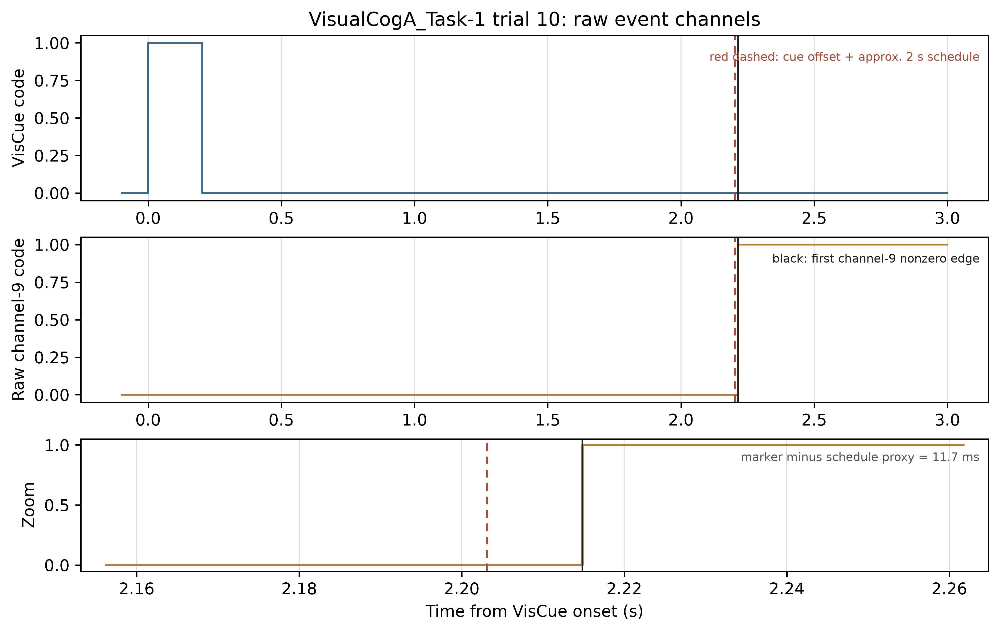

**图 1：事件边沿示例。** 上图显示一个试次的通道8提示段、通道9首次非零边沿，以及 cue+约2秒的计划时刻。黑线是参考模型定义的 \(t_{\mathrm{act}}\)；红虚线仅为计划时刻参照。它们接近不等于计划时刻就是真实 target onset。

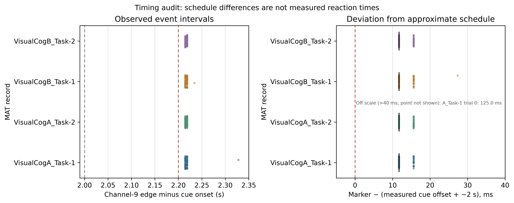

**图 2：全部试次的事件时刻审计。** 每份记录的通道9边沿大多集中在 cue 后约2.215秒，和计划时刻相差很小。这个集中现象提示应答标记与目标计划时间可能靠得很近，因此 target-to-response RT 不能仅凭计划时刻替代真实目标事件。

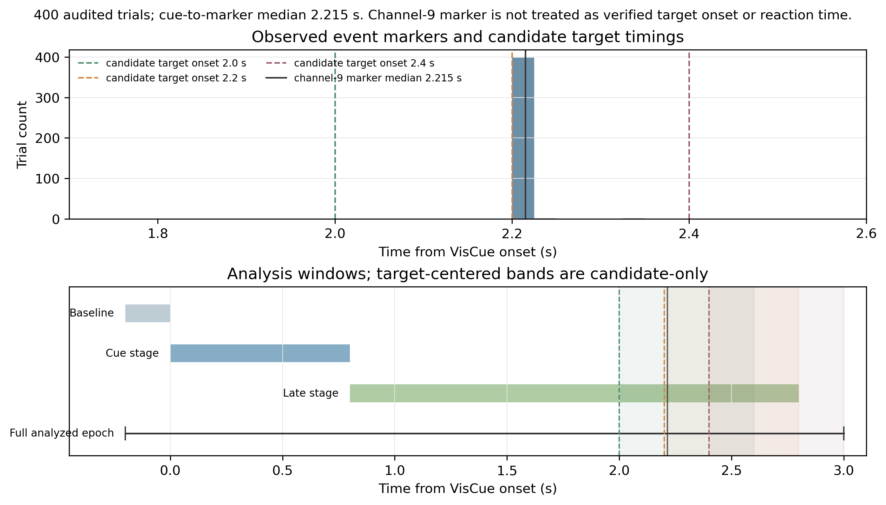

**图 3：模型分析窗口与时间窗冲突。** 标出 cue 前基线、提示阶段、固定晚期窗口、候选目标时刻，以及以通道9首次边沿 \(t_{\mathrm{act}}-100\) ms 为终点的累计/末500 ms应答前窗。按图示边沿约 2.215 秒计算，端点约为 2.115 秒；候选目标 2.2 秒和 2.4 秒分别晚于端点约 85 ms、285 ms，所以这些候选假设下应答前窗不含目标后的加工。2.0 秒候选虽在端点前约 115 ms，但真实目标时刻尚未核实。通道9首次边沿是否等于实际动作开始也待核实；应答前结果目前仅为组级探索分析，严格逐试次分析需逐试次截断。

### 9.2 实测脑电与特征

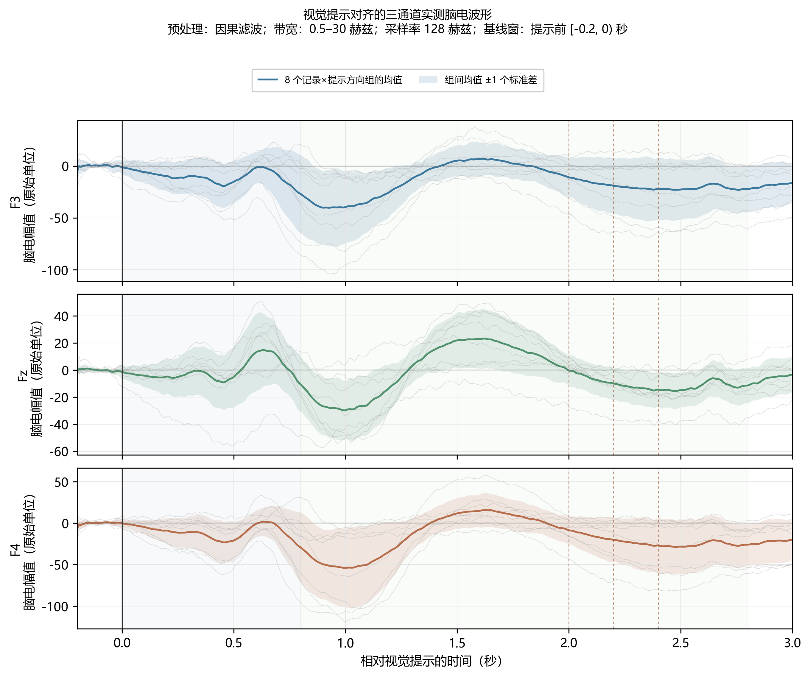

**图 4：提示锁定实测脑电。** 粗线是四份记录与左右提示组合后的组均值，阴影是八个“记录×提示侧”组均值间的一个标准差，不是受试者总体置信区间。图中幅值单位来自原始数据记录，未独立校准为微伏。

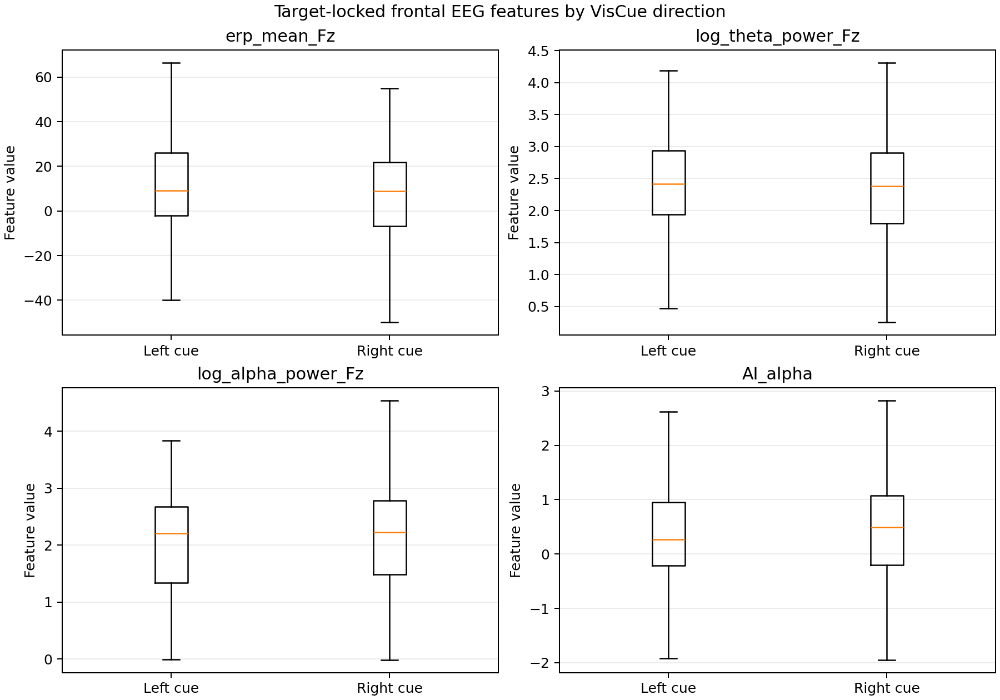

**图 5：目标锁定特征分布。** 比较左右 VisCue 条件下 Fz 的 ERP、theta/alpha 功率及 ERP 侧化指标。目标锁定时刻采用 cue+2.2秒候选值，因此该图用于查看该假设下特征分布，不验证真实目标时刻。

### 9.3 动态模型、留出误差和敏感性

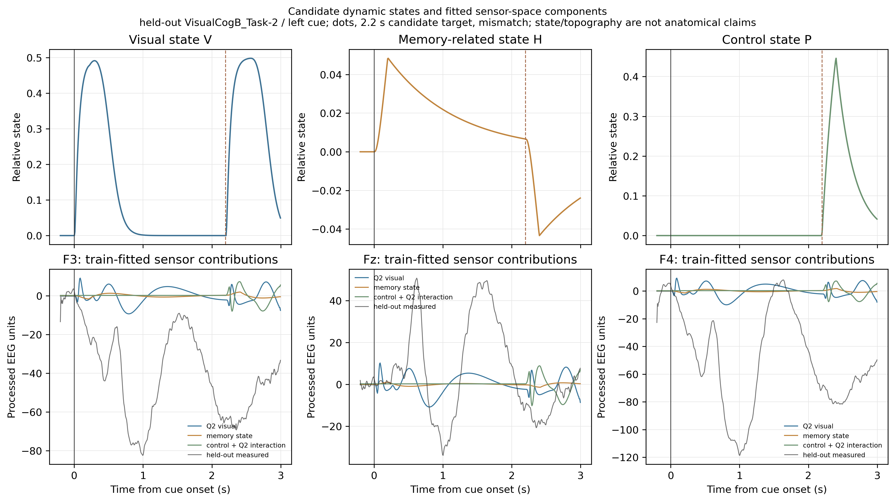

**图 6：状态轨迹和传感器贡献示例。** 上排展示一个候选情景下 V、H、P 的构造轨迹；下排展示训练折拟合出的 Q2、记忆和控制/交互贡献，并与该留出记录的实测波形对照。该例说明计算链如何形成传感器预测，不代表海马或前额叶的解剖定位。

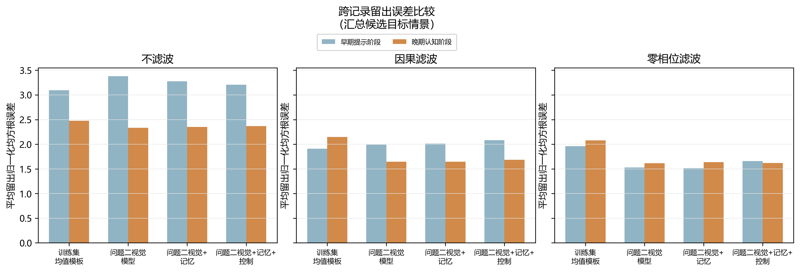

**图 7：跨记录留出模型比较。** 分别显示不滤波、因果滤波和零相位滤波下的早期/晚期 NRMSE，数值越低越好。晚期阶段加入记忆状态没有在三种预处理下都降低误差，因此现有结果不支持稳定的记忆态增益。

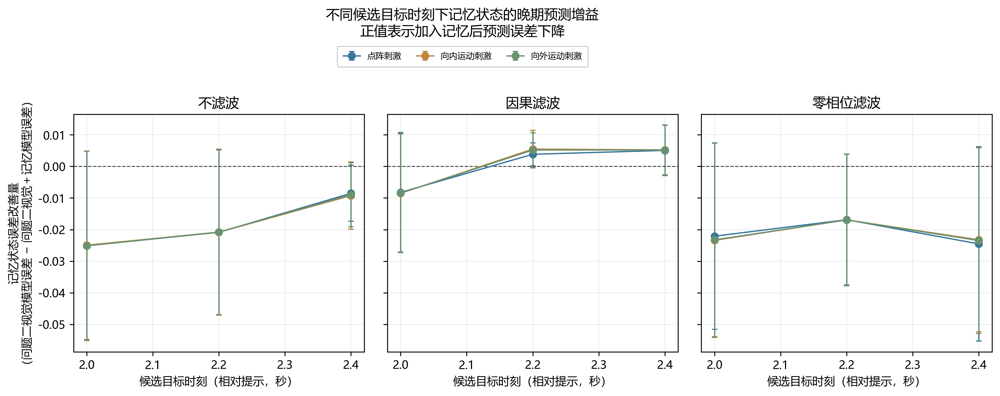

**图 8：目标时刻敏感性。** 纵轴正值表示加入 H 后晚期误差下降，负值表示误差上升；误差线表示不同留出记录间的标准差。多数预处理与候选时刻组合没有显示稳定的正向增益。

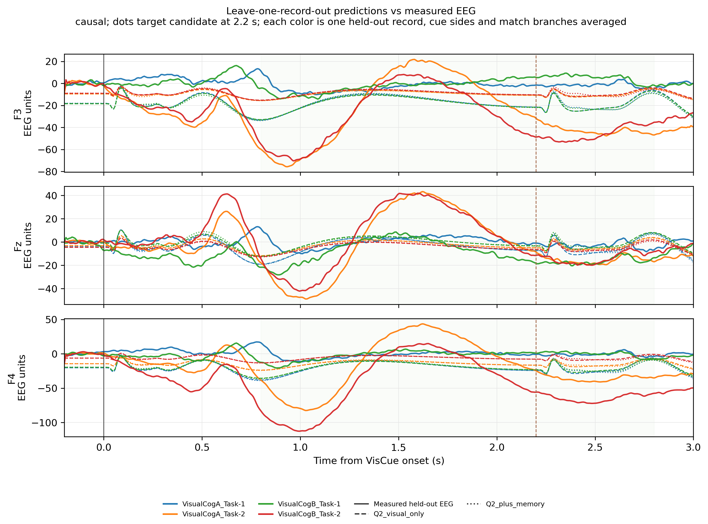

**图 9：代表性留出预测。** 显示候选点阵刺激、2.2秒目标时刻和因果滤波这一情景下，留出记录实测曲线与 Q2 视觉基线、Q2+记忆预测。它用于查看具体波形拟合形态；主结论仍以所有候选条件的留出误差表为准。

### 9.4 结构可辨识性与辅助消融

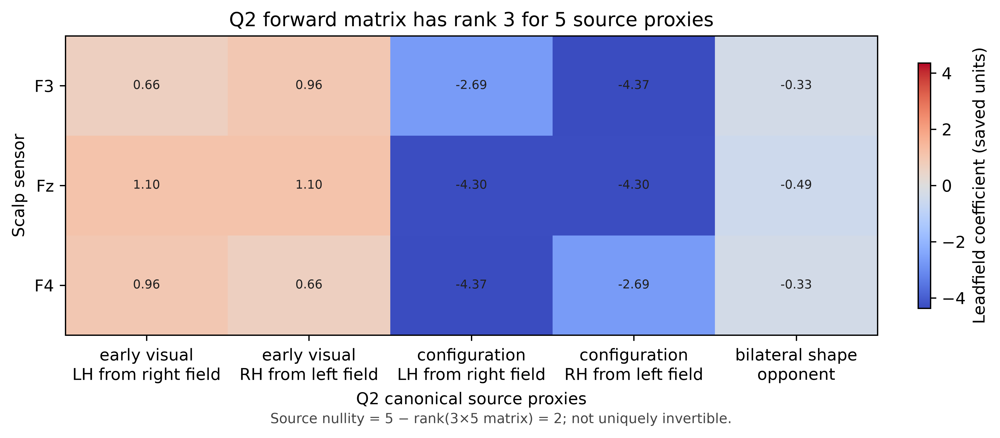

**图 10：导联矩阵可辨识性。** 当前 \(3\times5\) 前向矩阵秩为3，零空间维数为2。它可将 Q2 五源代理投影至三个电极，但不能从三个电极唯一反演五个源。

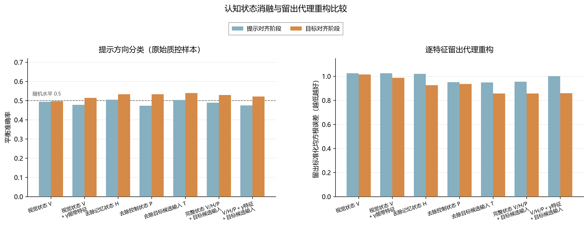

**图 11：静态特征辅助消融。** 左图比较不同特征组合对 cue 侧的平衡准确率，虚线为0.5参照；右图展示留出特征重构误差。该分析是静态特征支路的辅助检验，不替代 Q2 动态模型的 NRMSE 留出比较。

本节图片展示了事件审计、实测信号、候选状态生成、整记录留出比较及敏感性检查，可支持“模型计算与检验流程已运行并产生可复核结果”。它们不能单独支持“模型较好解释了脑电”；应结合固定晚期窗口的较大误差、记忆增益不稳定、候选目标时刻未核实等限制作结论。

## 10. 复现命令和主要产物

从项目根目录执行。第一组生成事件、行为与静态特征支路；第二组生成问题三动态模型验证：

~~~powershell
python src/C/q3/01_audit_events.py
python src/C/q3/02_extract_trials.py
python src/C/q3/08_behavior_event_audit.py
python src/C/q3/02b_preprocess_raw.py
python src/C/q3/03_extract_features.py
python src/C/q3/04_cognitive_state.py
python src/C/q3/05_behavior_model.py
python src/C/q3/06_validate.py
python src/C/q3/07_ablation.py
python src/C/q3/09_event_time_semantics.py
python src/C/q3/dynamic_validation.py
~~~

08 可读取可选的外部真值/事件表；若只按当前通道生成操作性标签，不需要这些外部表。动态验证会输出：

- output/dynamic_heldout_validation/dynamic_cv_metrics.csv：逐情景、逐留出记录、逐模型的固定阶段窗评分；
- output/dynamic_heldout_validation/t_act_endpoint_cv_metrics.csv：应答前端点累计窗和末 500 ms 评分；
- output/dynamic_heldout_validation/validation_summary.json：汇总结果和事件解释边界；
- output/dynamic_heldout_validation/figures/：状态轨迹、留出误差、敏感性和波形图；
- output/dynamic_heldout_validation/dynamic_validation_report.md：本次运行自动生成的结果报告。

候选刺激和时刻可从命令行修改，例如只运行部分时刻、刺激及预处理：

~~~powershell
python src/C/q3/dynamic_validation.py --target-onsets 2.0,2.4 --target-types dots,inward --preprocessing causal,zero_phase --target-duration 0.2
~~~

自动运行报告与本说明文件分开保存，后续重跑验证不会覆盖本文的代码架构与公式说明。
