# 绘图组件使用文档

本文档示例基于第一问清洗数据与特征数据生成。调用前建议先添加项目 `src` 路径。

```python
import sys
import pandas as pd

sys.path.insert(0, r"D:\8\Desktop\CMathc\src")

from utils.plot_utils import *
from utils.color_palettes import get_sci_height_colors, get_sci_deep_colors
```

## 廓线图

```python
df = pd.read_csv(r"D:\8\Desktop\CMathc\src\test\q1\output\q1_dataset_features.csv")
df["time"] = pd.to_datetime(df["time"])
df["time_label"] = df["time"].dt.strftime("%H:%M")
df_plot = df[(df["station"] == "a") & (df["height"] >= 100) & (df["height"] <= 1100)].copy()

plot_profile(
    df_plot,
    x="wind_speed",
    height="height",
    group="time_label",
    legend="时间",
    title="风速垂直分布图",
    xlabel="风速 (m/s)",
    ylabel="高度 (m)",
    colors=get_sci_deep_colors(df_plot["time_label"].nunique()),
    save_path=r"D:\8\Desktop\CMathc\src\utils\output\廓线图-风速垂直分布.png",
)
```

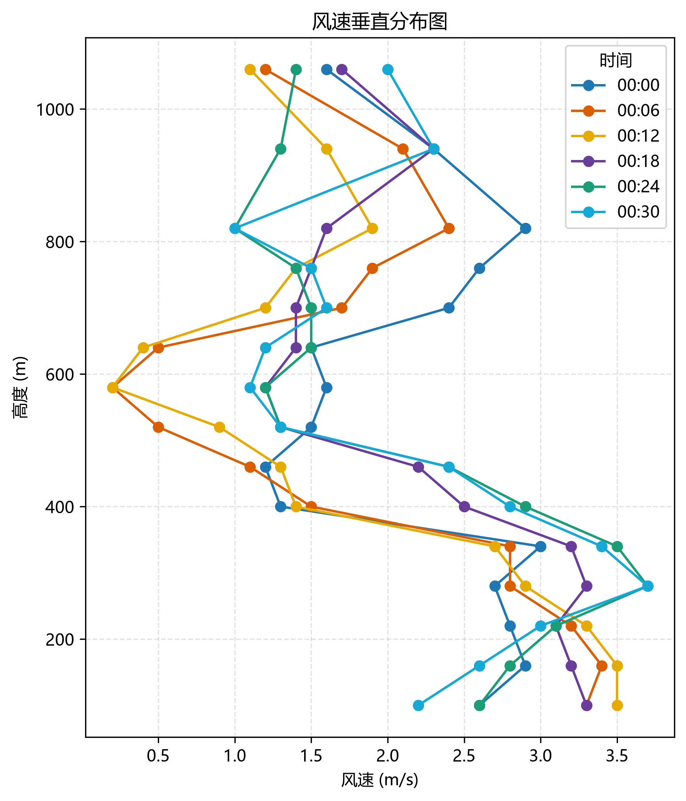

## 箱线图

```python
df = pd.read_csv(r"D:\8\Desktop\CMathc\src\test\q1\output\q1_dataset_features.csv")
df_plot = df[(df["station"] == "a") & (df["height"] >= 100) & (df["height"] <= 940)].copy()
df_plot["height_km"] = (df_plot["height"] / 1000).round(2)
heights = sorted(df_plot["height_km"].dropna().unique())

plot_box(
    df_plot,
    value="temperature",
    group="height_km",
    legend="高度 (km)",
    title="不同高度层温度分布箱线图",
    ylabel="温度 (°C)",
    labels=[f"{h:g}" for h in heights],
    colors=get_sci_height_colors(len(heights)),
    save_path=r"D:\8\Desktop\CMathc\src\utils\output\箱线图-不同高度层温度分布.png",
)
```

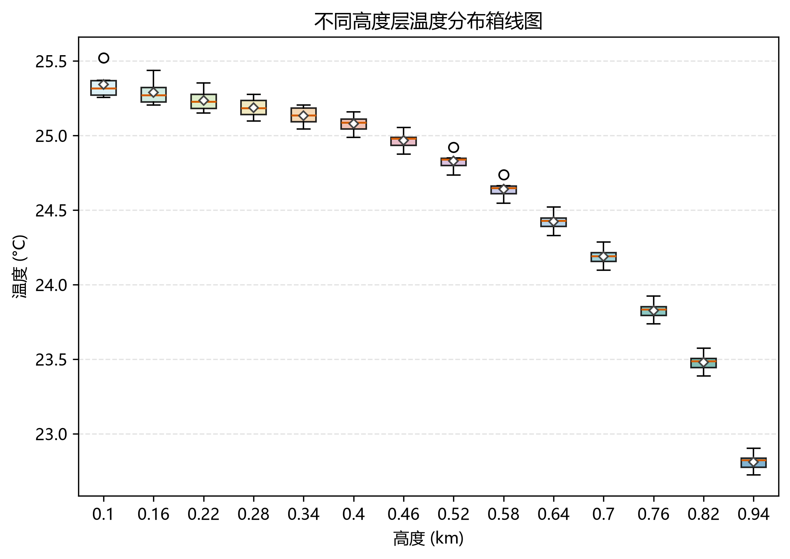

## 剖面图

```python
df = pd.read_csv(r"D:\8\Desktop\CMathc\src\test\q1\output\q1_dataset.csv")
df_plot = df[(df["station"] == "a") & (df["height"] >= 100) & (df["height"] <= 1000)].copy()

plot_section(
    df_plot,
    time="time",
    height="height",
    value="temperature",
    title="温度时间-高度剖面图",
    xlabel="时间",
    ylabel="高度 (km)",
    colorbar_label="温度 (°C)",
    cmap="Spectral_r",
    save_path=r"D:\8\Desktop\CMathc\src\utils\output\剖面图-温度时间高度分布.png",
)
```

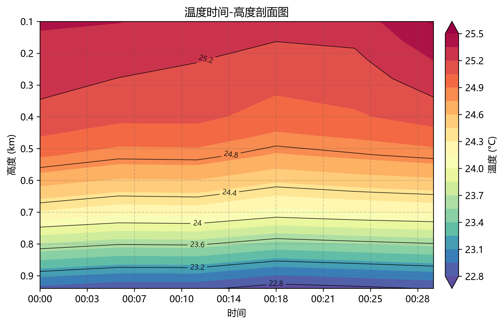

## 热力图

```python
df = pd.read_csv(r"D:\8\Desktop\CMathc\src\test\q1\output\q1_dataset_features.csv")
df["time"] = pd.to_datetime(df["time"])
df["time_label"] = df["time"].dt.strftime("%H:%M")
df_plot = df[(df["station"] == "a") & (df["height"] >= 100) & (df["height"] <= 1100)].copy()
df_plot["height_label"] = df_plot["height"].astype(int).astype(str)
df_plot["risk"] = df_plot[["cn2", "wind_shear"]].rank(pct=True).mean(axis=1).fillna(0)

plot_heatmap(
    df_plot,
    x="height_label",
    y="time_label",
    value="risk",
    title="综合湍流风险热力图",
    xlabel="高度层",
    ylabel="时间点",
    colorbar_label="风险值",
    cmap="viridis",
    vmin=0,
    vmax=1,
    save_path=r"D:\8\Desktop\CMathc\src\utils\output\热力图-综合湍流风险.png",
)
```

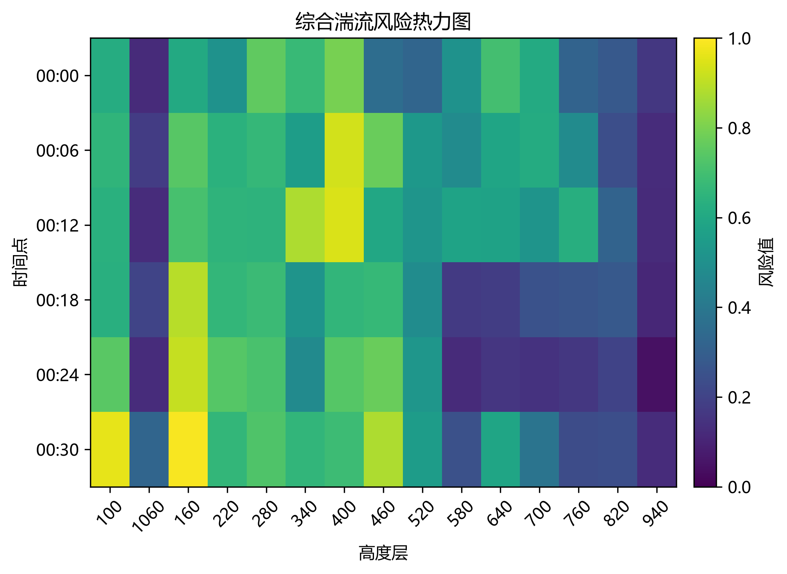

## 相关性热力图

```python
df = pd.read_csv(r"D:\8\Desktop\CMathc\src\test\q1\output\q1_dataset_features.csv")
cols = ["wind_speed", "vertical_velocity", "cn2", "temperature", "relative_humidity", "wind_shear", "n2", "ri"]
labels = ["风速", "垂直速度", "Cn2", "温度", "相对湿度", "风切变", "N²", "Ri"]

plot_corr_heatmap(
    df,
    cols=cols,
    labels=labels,
    title="气象指标相关性热力图",
    save_path=r"D:\8\Desktop\CMathc\src\utils\output\相关性热力图-气象指标相关性.png",
)
```

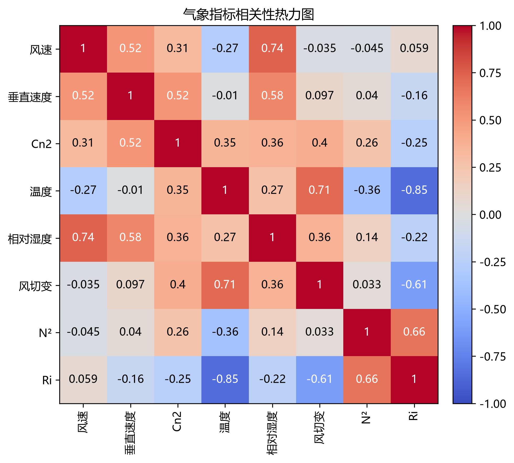

## 气泡图

```python
df = pd.read_csv(r"D:\8\Desktop\CMathc\src\test\q1\output\q1_dataset_features.csv")
df_plot = df[(df["height"] >= 100) & (df["height"] <= 1000)].copy()

plot_bubble(
    df_plot,
    x="temperature",
    y="relative_humidity",
    size="height",
    color="height",
    title="温度与湿度的关系（点大小表示高度）",
    xlabel="温度 (°C)",
    ylabel="相对湿度 (%)",
    colorbar_label="高度 (m)",
    cmap="viridis",
    save_path=r"D:\8\Desktop\CMathc\src\utils\output\气泡图-温度湿度关系.png",
)
```

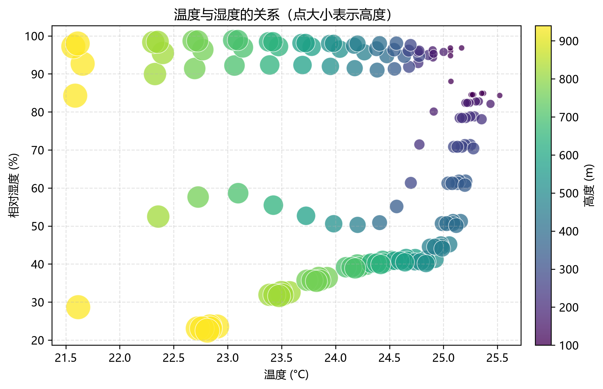

## 极坐标图

```python
df = pd.read_csv(r"D:\8\Desktop\CMathc\src\test\q1\output\q1_dataset_features.csv")

plot_wind_polar(
    df,
    direction="wind_direction",
    speed="wind_speed",
    title="风向风速分布极坐标图",
    colorbar_label="风速 (m/s)",
    cmap="plasma",
    save_path=r"D:\8\Desktop\CMathc\src\utils\output\极坐标图-风向风速分布.png",
)
```

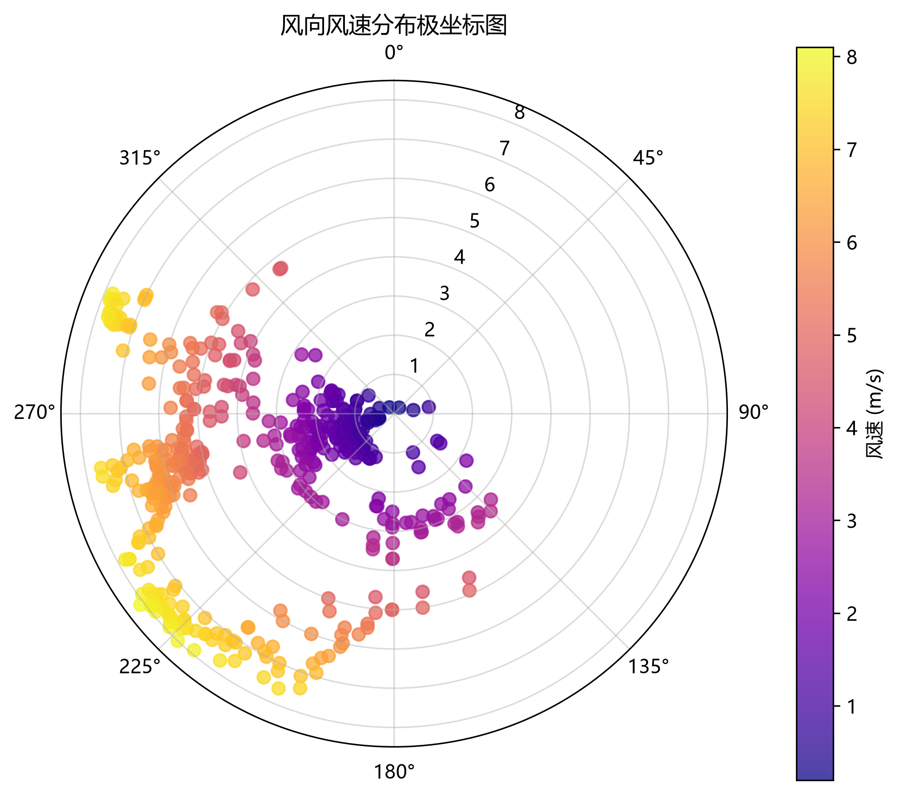

## 三维曲面图

```python
df = pd.read_csv(r"D:\8\Desktop\CMathc\src\test\q1\output\q1_dataset_features.csv")
df["time"] = pd.to_datetime(df["time"])
df_plot = df[(df["station"] == "a") & (df["height"] >= 100) & (df["height"] <= 1100)].copy()

plot_3d_surface(
    df_plot,
    x="time",
    y="height",
    value="wind_shear",
    title="三维曲面图",
    xlabel="时间 (min)",
    ylabel="采样高度 (m)",
    zlabel="风速切变",
    cmap="jet",
    save_path=r"D:\8\Desktop\CMathc\src\utils\output\三维曲面图-风速切变分布.png",
)
```

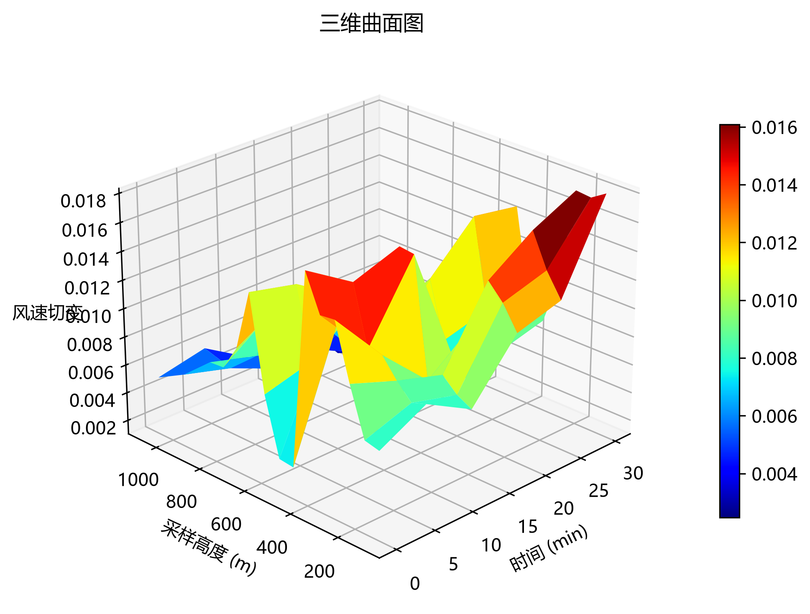

## 三维网格图

```python
df = pd.read_csv(r"D:\8\Desktop\CMathc\src\test\q1\output\q1_dataset_features.csv")
df["time"] = pd.to_datetime(df["time"])
df_plot = df[(df["station"] == "a") & (df["height"] >= 100) & (df["height"] <= 1100)].copy()

plot_3d_wireframe(
    df_plot,
    x="time",
    y="height",
    value="wind_shear",
    title="三维网格图",
    xlabel="时间 (min)",
    ylabel="采样高度 (m)",
    zlabel="风速切变",
    cmap="jet",
    save_path=r"D:\8\Desktop\CMathc\src\utils\output\三维网格图-风速切变分布.png",
)
```

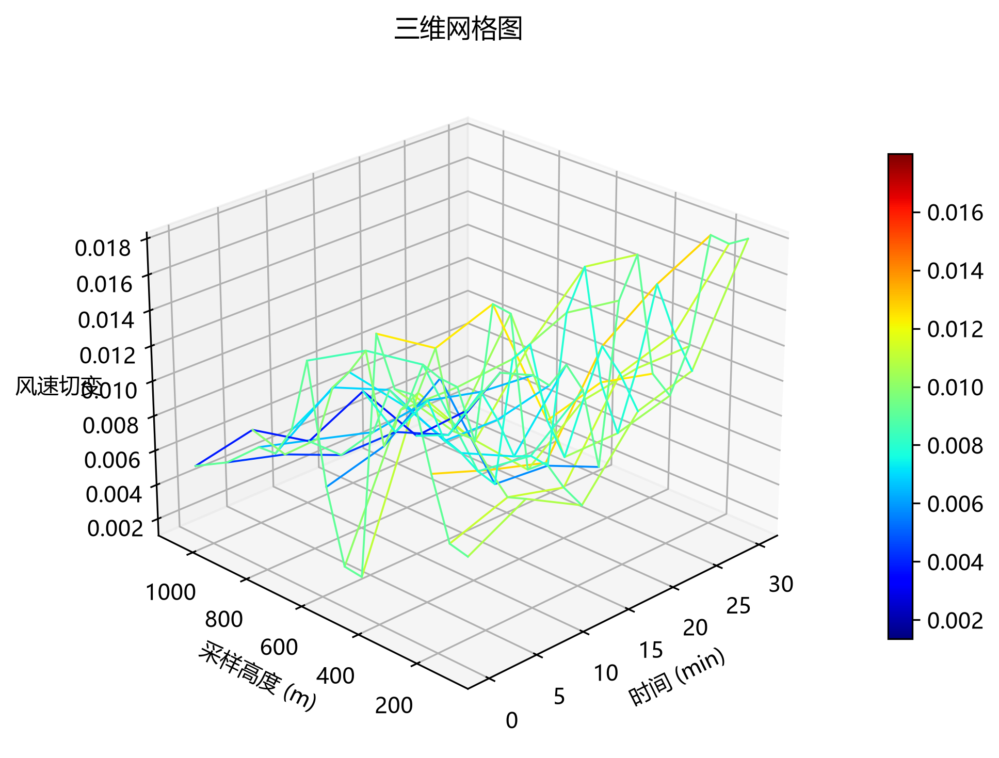

## 等高线图

```python
df = pd.read_csv(r"D:\8\Desktop\CMathc\src\test\q1\output\q1_dataset_features.csv")
df["time"] = pd.to_datetime(df["time"])
df_plot = df[(df["station"] == "a") & (df["height"] >= 100) & (df["height"] <= 1100)].copy()

plot_contour(
    df_plot,
    x="time",
    y="height",
    value="wind_shear",
    title="等高线图",
    xlabel="时间 (min)",
    ylabel="采样高度 (m)",
    cmap="jet",
    save_path=r"D:\8\Desktop\CMathc\src\utils\output\等高线图-风速切变分布.png",
)
```

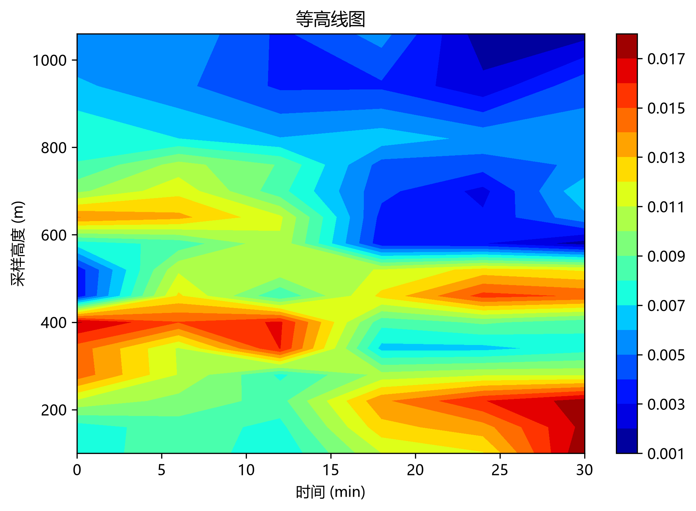

## 三维散点图

```python
df = pd.read_csv(r"D:\8\Desktop\CMathc\src\test\q1\output\q1_dataset_features.csv")
df["time"] = pd.to_datetime(df["time"])
df_plot = df[(df["station"] == "a") & (df["height"] >= 100) & (df["height"] <= 1100)].copy()

plot_3d_scatter(
    df_plot,
    x="time",
    y="height",
    value="wind_shear",
    title="三维散点图",
    xlabel="时间 (min)",
    ylabel="采样高度 (m)",
    zlabel="风速切变",
    cmap="jet",
    save_path=r"D:\8\Desktop\CMathc\src\utils\output\三维散点图-风速切变分布.png",
)
```

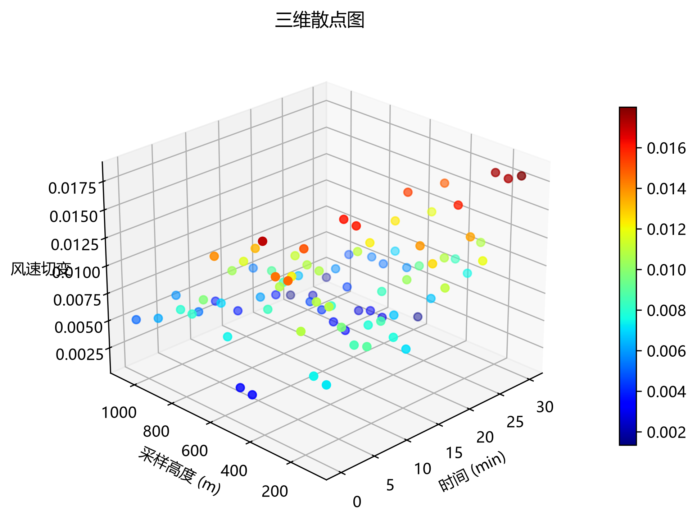
