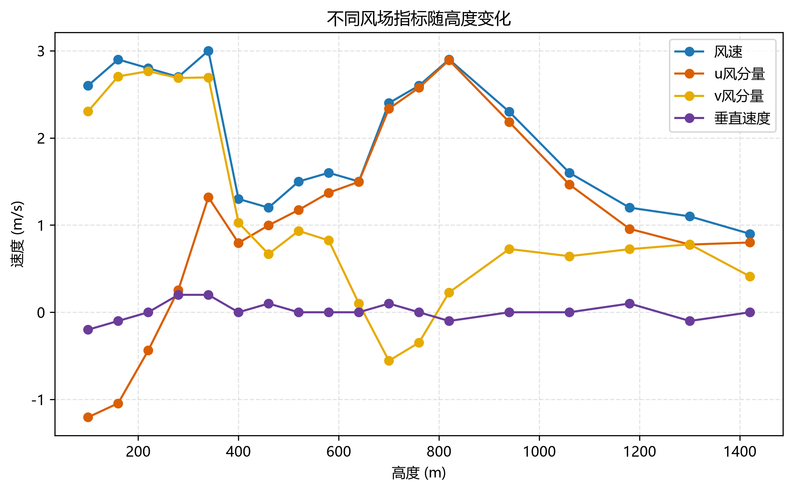
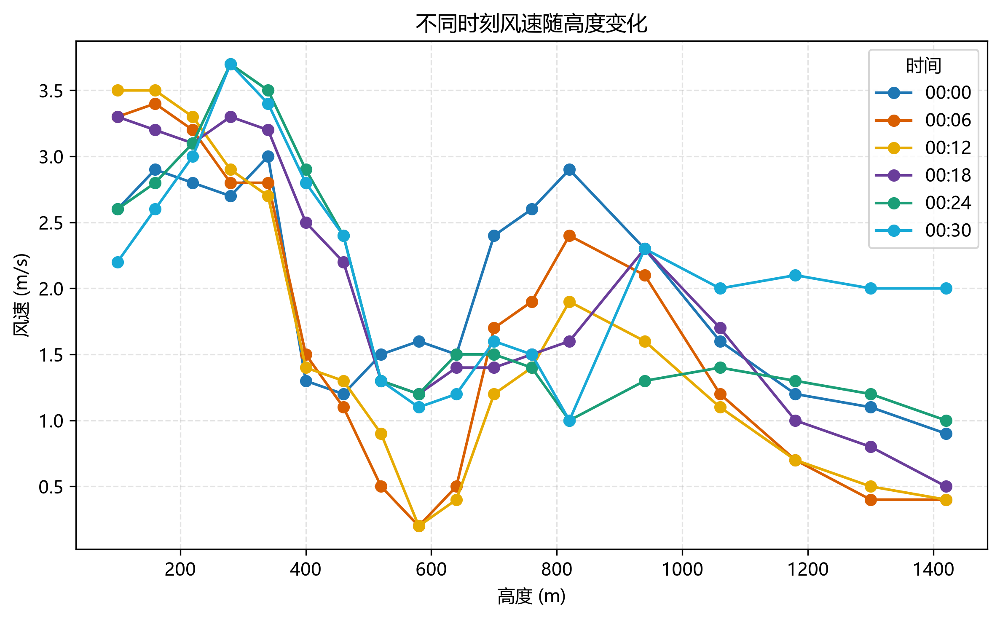
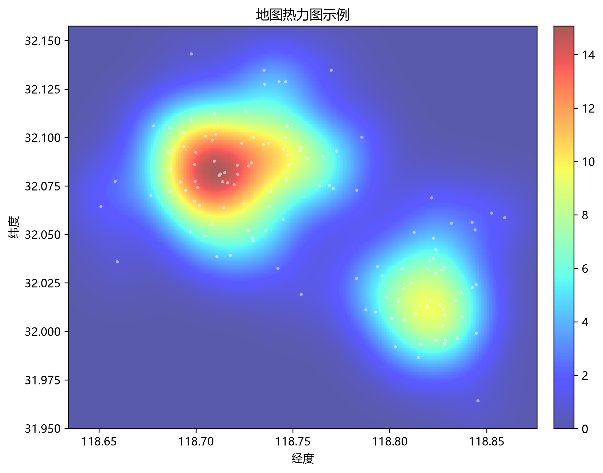

# 绘图组件使用文档

本文档示例基于第一问清洗数据与特征数据生成。调用前建议先添加项目 `src` 路径。

```python
import sys
import pandas as pd

sys.path.insert(0, r"D:\8\Desktop\CMathc\src")

from utils.plot_utils import *
from utils.color_palettes import get_sci_height_colors, get_sci_deep_colors
```

这套组件中，`plot_line` 可以覆盖普通折线类结果图，例如指标随高度变化、时间趋势、LSTM 损失、预测值与实际值对比、未来趋势预测和 PSO 收敛曲线。`plot_3d_scatter` 现在把三维坐标 `z` 和颜色变量 `color` 分开，可用于“经度-纬度-高度 + 指标颜色”的三维散点图。

## 廓线图

```python
df = pd.read_csv(r"D:\8\Desktop\CMathc\src\test\q1\output\q1_dataset_features.csv")
df["time"] = pd.to_datetime(df["time"])
df["time_label"] = df["time"].dt.strftime("%H:%M")
df_plot = df[(df["station"] == "a") & (df["height"] >= 100) & (df["height"] <= 1100)].copy()

plot_profile(
    df_plot,
    x="wind_speed",
    height="height",
    group="time_label",
    legend="时间",
    title="风速垂直分布图",
    xlabel="风速 (m/s)",
    ylabel="高度 (m)",
    colors=get_sci_deep_colors(df_plot["time_label"].nunique()),
    save_path=r"D:\8\Desktop\CMathc\src\utils\output\廓线图-风速垂直分布.png",
)
```


## 折线图

`plot_line` 可用于普通时间序列、多个指标对比、训练损失曲线、预测值与实际值对比，以及按高度或类别分组的多条曲线。

### 多指标折线图

```python
df = pd.read_csv(r"D:\8\Desktop\CMathc\src\test\q1\output\q1_dataset_features.csv")
df_plot = df[(df["station"] == "a") & (df["height"] >= 100) & (df["height"] <= 1000)].copy()

plot_line(
    df_plot,
    x="height",
    y=["wind_speed", "vertical_velocity", "spectral_width"],
    labels=["水平风速", "垂直速度", "速度谱宽"],
    title="各指标随采样高度的变化",
    xlabel="采样高度 (m)",
    ylabel="数值",
    save_path=r"D:\8\Desktop\CMathc\src\utils\output\折线图-各指标随高度变化.png",
)
```


### 分组折线图

```python
df = pd.read_csv(r"D:\8\Desktop\CMathc\src\test\q1\output\q1_dataset_features.csv")
df["time"] = pd.to_datetime(df["time"])
df["time_label"] = df["time"].dt.strftime("%H:%M")
df_plot = df[(df["station"] == "a") & (df["height"] >= 100) & (df["height"] <= 1000)].copy()

df_plot["height_group"] = (df_plot["height"] // 100).astype(int)

plot_line(
    df_plot,
    x="time_label",
    y="relative_humidity",
    group="height_group",
    legend="高度层",
    title="不同高度层相对湿度时间变化",
    xlabel="时间",
    ylabel="相对湿度 (%)",
    save_path=r"D:\8\Desktop\CMathc\src\utils\output\折线图-湿度时间变化.png",
)
```


对于 LSTM 损失、预测值与实际值对比、PSO 收敛曲线，只需要更换 `x` 和 `y`：

```python
plot_line(history, x="epoch", y="loss", xlabel="Epoch", ylabel="MSE损失")

plot_line(
    result,
    x="index",
    y=["actual", "predicted"],
    labels=["实际值", "预测值"],
    xlabel="样本索引",
    ylabel="TKE值",
)

plot_line(pso, x="iteration", y="best_cost", xlabel="迭代次数", ylabel="最优代价 J")
```

## 箱线图

```python
df = pd.read_csv(r"D:\8\Desktop\CMathc\src\test\q1\output\q1_dataset_features.csv")
df_plot = df[(df["station"] == "a") & (df["height"] >= 100) & (df["height"] <= 940)].copy()
df_plot["height_km"] = (df_plot["height"] / 1000).round(2)
heights = sorted(df_plot["height_km"].dropna().unique())

plot_box(
    df_plot,
    value="temperature",
    group="height_km",
    legend="高度 (km)",
    title="不同高度层温度分布箱线图",
    ylabel="温度 (°C)",
    labels=[f"{h:g}" for h in heights],
    colors=get_sci_height_colors(len(heights)),
    save_path=r"D:\8\Desktop\CMathc\src\utils\output\箱线图-不同高度层温度分布.png",
)
```


## 剖面图

```python
df = pd.read_csv(r"D:\8\Desktop\CMathc\src\test\q1\output\q1_dataset.csv")
df_plot = df[(df["station"] == "a") & (df["height"] >= 100) & (df["height"] <= 1000)].copy()

plot_section(
    df_plot,
    time="time",
    height="height",
    value="temperature",
    title="温度时间-高度剖面图",
    xlabel="时间",
    ylabel="高度 (km)",
    colorbar_label="温度 (°C)",
    cmap="Spectral_r",
    save_path=r"D:\8\Desktop\CMathc\src\utils\output\剖面图-温度时间高度分布.png",
)
```


## 热力图

```python
df = pd.read_csv(r"D:\8\Desktop\CMathc\src\test\q1\output\q1_dataset_features.csv")
df["time"] = pd.to_datetime(df["time"])
df["time_label"] = df["time"].dt.strftime("%H:%M")
df_plot = df[(df["station"] == "a") & (df["height"] >= 100) & (df["height"] <= 1100)].copy()
df_plot["height_label"] = df_plot["height"].astype(int).astype(str)
df_plot["risk"] = df_plot[["cn2", "wind_shear"]].rank(pct=True).mean(axis=1).fillna(0)

plot_heatmap(
    df_plot,
    x="height_label",
    y="time_label",
    value="risk",
    title="综合湍流风险热力图",
    xlabel="高度层",
    ylabel="时间点",
    colorbar_label="风险值",
    cmap="viridis",
    vmin=0,
    vmax=1,
    save_path=r"D:\8\Desktop\CMathc\src\utils\output\热力图-综合湍流风险.png",
)
```


## 相关性热力图

```python
df = pd.read_csv(r"D:\8\Desktop\CMathc\src\test\q1\output\q1_dataset_features.csv")
cols = ["wind_speed", "vertical_velocity", "cn2", "temperature", "relative_humidity", "wind_shear", "n2", "ri"]
labels = ["风速", "垂直速度", "Cn2", "温度", "相对湿度", "风切变", "N²", "Ri"]

plot_corr_heatmap(
    df,
    cols=cols,
    labels=labels,
    title="气象指标相关性热力图",
    save_path=r"D:\8\Desktop\CMathc\src\utils\output\相关性热力图-气象指标相关性.png",
)
```


## 气泡图

```python
df = pd.read_csv(r"D:\8\Desktop\CMathc\src\test\q1\output\q1_dataset_features.csv")
df_plot = df[(df["height"] >= 100) & (df["height"] <= 1000)].copy()

plot_bubble(
    df_plot,
    x="temperature",
    y="relative_humidity",
    size="height",
    color="height",
    title="温度与湿度的关系（点大小表示高度）",
    xlabel="温度 (°C)",
    ylabel="相对湿度 (%)",
    colorbar_label="高度 (m)",
    cmap="viridis",
    save_path=r"D:\8\Desktop\CMathc\src\utils\output\气泡图-温度湿度关系.png",
)
```


## 极坐标图

```python
df = pd.read_csv(r"D:\8\Desktop\CMathc\src\test\q1\output\q1_dataset_features.csv")

plot_wind_polar(
    df,
    direction="wind_direction",
    speed="wind_speed",
    title="风向风速分布极坐标图",
    colorbar_label="风速 (m/s)",
    cmap="plasma",
    save_path=r"D:\8\Desktop\CMathc\src\utils\output\极坐标图-风向风速分布.png",
)
```


## 三维曲面图

```python
df = pd.read_csv(r"D:\8\Desktop\CMathc\src\test\q1\output\q1_dataset_features.csv")
df["time"] = pd.to_datetime(df["time"])
df_plot = df[(df["station"] == "a") & (df["height"] >= 100) & (df["height"] <= 1100)].copy()

plot_3d_surface(
    df_plot,
    x="time",
    y="height",
    value="wind_shear",
    title="三维曲面图",
    xlabel="时间 (min)",
    ylabel="采样高度 (m)",
    zlabel="风速切变",
    cmap="jet",
    save_path=r"D:\8\Desktop\CMathc\src\utils\output\三维曲面图-风速切变分布.png",
)
```


## 三维网格图

```python
df = pd.read_csv(r"D:\8\Desktop\CMathc\src\test\q1\output\q1_dataset_features.csv")
df["time"] = pd.to_datetime(df["time"])
df_plot = df[(df["station"] == "a") & (df["height"] >= 100) & (df["height"] <= 1100)].copy()

plot_3d_wireframe(
    df_plot,
    x="time",
    y="height",
    value="wind_shear",
    title="三维网格图",
    xlabel="时间 (min)",
    ylabel="采样高度 (m)",
    zlabel="风速切变",
    cmap="jet",
    save_path=r"D:\8\Desktop\CMathc\src\utils\output\三维网格图-风速切变分布.png",
)
```


## 等高线图

```python
df = pd.read_csv(r"D:\8\Desktop\CMathc\src\test\q1\output\q1_dataset_features.csv")
df["time"] = pd.to_datetime(df["time"])
df_plot = df[(df["station"] == "a") & (df["height"] >= 100) & (df["height"] <= 1100)].copy()

plot_contour(
    df_plot,
    x="time",
    y="height",
    value="wind_shear",
    title="等高线图",
    xlabel="时间 (min)",
    ylabel="采样高度 (m)",
    cmap="jet",
    save_path=r"D:\8\Desktop\CMathc\src\utils\output\等高线图-风速切变分布.png",
)
```


## 三维散点图

```python
df = pd.read_csv(r"D:\8\Desktop\CMathc\src\test\q1\output\q1_dataset_features.csv")
df["time"] = pd.to_datetime(df["time"])
df_plot = df[(df["station"] == "a") & (df["height"] >= 100) & (df["height"] <= 1100)].copy()

plot_3d_scatter(
    df_plot,
    x="time",
    y="height",
    z="wind_shear",
    color="wind_shear",
    title="三维散点图",
    xlabel="时间 (min)",
    ylabel="采样高度 (m)",
    zlabel="风速切变",
    colorbar_label="风速切变",
    cmap="jet",
    save_path=r"D:\8\Desktop\CMathc\src\utils\output\三维散点图-风速切变分布.png",
)
```


若三维坐标和颜色表示不同变量，例如“经度-纬度-高度”三维散点，颜色表示湍流指标，可写为：

```python
plot_3d_scatter(
    df,
    x="lon",
    y="lat",
    z="height",
    color="turbulence_index",
    xlabel="经度",
    ylabel="纬度",
    zlabel="高度 (m)",
    colorbar_label="湍流指标",
)
```


## 地图热力图

```python
import numpy as np
import pandas as pd

# 示例数据：lon 为经度，lat 为纬度，risk 为空间风险值
# 实际比赛中可替换为雷达站点、航路采样点或网格点的经纬度和风险值
np.random.seed(1)
df_map = pd.DataFrame({
    "lon": np.r_[np.random.normal(118.72, 0.03, 80), np.random.normal(118.82, 0.02, 50)],
    "lat": np.r_[np.random.normal(32.08, 0.025, 80), np.random.normal(32.02, 0.02, 50)],
    "risk": np.r_[np.random.uniform(0.4, 1.0, 80), np.random.uniform(0.2, 0.8, 50)],
})

plot_map_heatmap(
    df_map,
    x="lon",                         # 横坐标列，通常填经度
    y="lat",                         # 纵坐标列，通常填纬度
    value="risk",                    # 热力值列，例如风险值、湍流强度、反射率等
    background=None,                  # 地图底图图片路径；没有底图时可设为 None
    extent=None,                      # 底图坐标范围：(最小经度, 最大经度, 最小纬度, 最大纬度)
    title="地图热力图示例",           # 图标题
    xlabel="经度",                   # x 轴名称
    ylabel="纬度",                   # y 轴名称
    cmap="jet",                      # 热力图颜色映射
    alpha=0.65,                       # 热力图透明度，越小越能看到底图
    radius=0.015,                     # 热力扩散半径，越大越平滑
    grid_size=300,                    # 热力图网格精度，越大越细但越慢
    save_path=r"D:\8\Desktop\CMathc\src\utils\output\地图热力图-空间风险分布.png",
)
```


